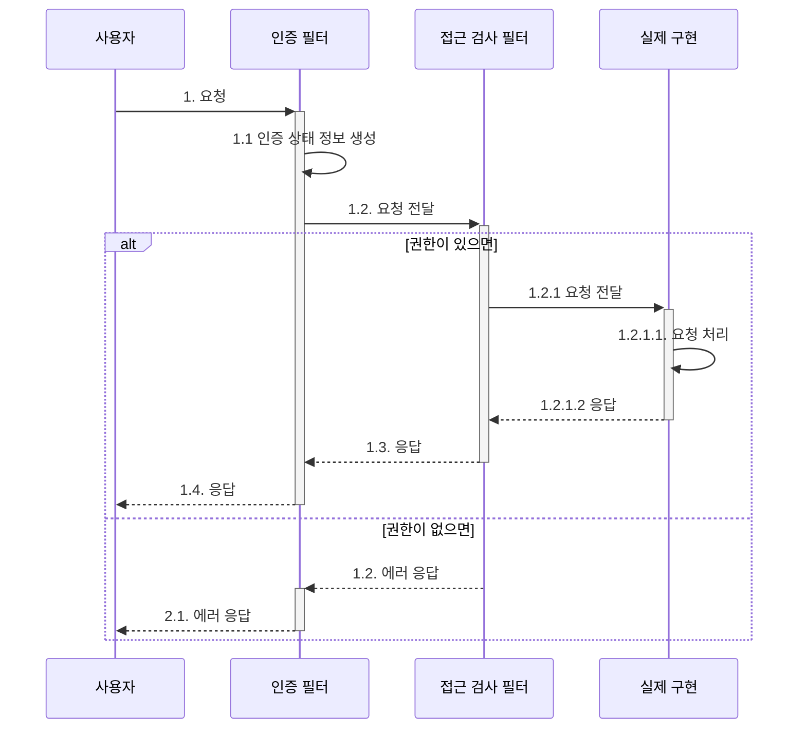

이 포스트에서는 아래 내용에 대해 알아본다.

- 응용(application) 서비스 구현
- 표현(presentation) 영역의 역할
- 값 검증과 권한 검사

> 소스는 [github](https://github.com/assu10/ddd/tree/feature/chap06)  에 있습니다.

> 매핑되는 테이블은 [DDD - ERD](https://assu10.github.io/dev/2024/04/08/ddd-table/) 을 참고하세요.

---

**목차**

<!-- TOC -->
* [1. 표현 영역과 응용 영역](#1-표현-영역과-응용-영역)
* [2. 응용 서비스의 역할](#2-응용-서비스의-역할)
  * [2.1. 도메인 로직 넣지 않기](#21-도메인-로직-넣지-않기)
* [3. 응용 서비스 구현](#3-응용-서비스-구현)
  * [3.1. 응용 서비스의 크기](#31-응용-서비스의-크기)
  * [3.2. 응용 서비스의 인터페이스와 클래스](#32-응용-서비스의-인터페이스와-클래스)
  * [3.3. 메서드 파라메터와 값 리턴](#33-메서드-파라메터와-값-리턴)
  * [3.4. 표현 영역에 의존하지 않기](#34-표현-영역에-의존하지-않기)
  * [3.5. 트랜잭션 처리](#35-트랜잭션-처리)
* [4. 표현 영역](#4-표현-영역)
* [5. 값 검증 (validation)](#5-값-검증-validation)
* [6. 권한 검사](#6-권한-검사)
  * [6.1. 표현 영역에서 권한 검사](#61-표현-영역에서-권한-검사)
  * [6.2. 응용 서비스에서 권한 검사](#62-응용-서비스에서-권한-검사)
  * [6.3. 도메인에서 권한 검사](#63-도메인에서-권한-검사)
* [7. 조회 전용 기능과 응용 서비스](#7-조회-전용-기능과-응용-서비스)
* [참고 사이트 & 함께 보면 좋은 사이트](#참고-사이트--함께-보면-좋은-사이트)
<!-- TOC -->

---

**개발 환경**

- 언어: java
- Spring Boot ver: 3.2.5
- Spring ver: 6.1.6
- IDE: intelliJ
- SDK: JDK 17
- 의존성 관리툴: Maven

---

pom.xml

```xml
<?xml version="1.0" encoding="UTF-8"?>
<project xmlns:xsi="http://www.w3.org/2001/XMLSchema-instance" xmlns="http://maven.apache.org/POM/4.0.0"
         xsi:schemaLocation="http://maven.apache.org/POM/4.0.0 https://maven.apache.org/xsd/maven-4.0.0.xsd">
  <modelVersion>4.0.0</modelVersion>
  <parent>
    <groupId>org.springframework.boot</groupId>
    <artifactId>spring-boot-starter-parent</artifactId>
    <version>3.2.5</version>
    <relativePath/> <!-- lookup parent from repository -->
  </parent>
  <groupId>com.assu</groupId>
  <artifactId>ddd_me</artifactId>
  <version>0.0.1-SNAPSHOT</version>
  <name>ddd</name>
  <description>Demo project for Spring Boot</description>
  <properties>
    <java.version>17</java.version>
  </properties>
  <dependencies>
    <dependency>
      <groupId>org.springframework.boot</groupId>
      <artifactId>spring-boot-starter-web</artifactId>
    </dependency>

    <dependency>
      <groupId>org.springframework.boot</groupId>
      <artifactId>spring-boot-starter-test</artifactId>
      <scope>test</scope>
    </dependency>
    <dependency>
      <groupId>org.projectlombok</groupId>
      <artifactId>lombok</artifactId>
      <scope>annotationProcessor</scope>
    </dependency>
    <dependency>
      <groupId>org.springframework.boot</groupId>
      <artifactId>spring-boot-starter-data-jpa</artifactId>
    </dependency>
    <!-- https://mvnrepository.com/artifact/org.hibernate/hibernate-jpamodelgen -->
    <dependency>
      <groupId>org.hibernate</groupId>
      <artifactId>hibernate-jpamodelgen</artifactId>
      <version>6.5.2.Final</version>
      <type>pom</type>
      <!--            <scope>provided</scope>-->
    </dependency>
    <!-- https://mvnrepository.com/artifact/com.mysql/mysql-connector-j -->
    <dependency>
      <groupId>com.mysql</groupId>
      <artifactId>mysql-connector-j</artifactId>
      <version>8.4.0</version>
    </dependency>
    <dependency>
      <groupId>org.springframework.boot</groupId>
      <artifactId>spring-boot-devtools</artifactId>
      <scope>runtime</scope>
    </dependency>

  </dependencies>

  <build>
    <plugins>
      <plugin>
        <groupId>org.springframework.boot</groupId>
        <artifactId>spring-boot-maven-plugin</artifactId>
      </plugin>
      <plugin>
        <groupId>org.bsc.maven</groupId>
        <artifactId>maven-processor-plugin</artifactId>
        <version>2.0.5</version>
        <executions>
          <execution>
            <id>process</id>
            <goals>
              <goal>process</goal>
            </goals>
            <phase>generate-sources</phase>
            <configuration>
              <processors>
                <processor>org.hibernate.jpamodelgen.JPAMetaModelEntityProcessor</processor>
              </processors>
            </configuration>
          </execution>
        </executions>
        <dependencies>
          <dependency>
            <groupId>org.hibernate</groupId>
            <artifactId>hibernate-jpamodelgen</artifactId>
            <version>6.5.2.Final</version>
          </dependency>
        </dependencies>
      </plugin>
    </plugins>
  </build>

</project>
```

```properties
spring.application.name=ddd
spring.datasource.url=jdbc:mysql://localhost:13306/shop?characterEncoding=utf8
spring.datasource.username=root
spring.datasource.password=
spring.datasource.driver-class-name=com.mysql.cj.jdbc.Driver
spring.datasource.hikari.maximum-pool-size=10
spring.jpa.database=mysql
spring.jpa.show-sql=true
spring.jpa.hibernate.naming.physical-strategy=org.hibernate.boot.model.naming.PhysicalNamingStrategyStandardImpl
spring.jpa.open-in-view=false
logging.level.root=INFO
logging.level.com.myshop=DEBUG
logging.level.org.springframework.security=DEBUG
```

---

# 1. 표현 영역과 응용 영역


위 그림과 같이 사용자에게 기능을 제공하려면 도메인과 사용자를 연결해 줄 표현 영역과 응용 영역이 필요하다.

표현 영역은 사용자의 요청을 해석한다.  
사용자가 요청한 요청 파라메터를 포함한 HTTP 요청을 표현 영역에 전달하면 표현 영역은 사용자가 실행하고 싶은 기능을 판별하여 응용 서비스가 요구하는 형식으로 사용자 요청을 
변환하여 그 기능을 제공하는 응용 서비스를 실행한다.

즉, 사용자가 원하는 기능을 제공하는 것은 응용 영역에 위치한 서비스이다.

사용자와의 상호 작용은 표현 영역이 처리하므로 응용 서비스는 표현 영역에 의존하지 않는다.

---

# 2. 응용 서비스의 역할

응용 서비스는 사용자의 요청을 처리하기 위해 리포지터리에서 도메인 객체를 가져와서 사용한다.

**응용 서비스의 주요 역할**은 아래와 같다.
- **도메인 객체를 사용하여 사용자 요청 처리**
  - 표현 영역 입장에서 응용 서비스는 도메인 영역과 표현 영역을 연결해주는 창구 역할
- **트랜잭션 처리**
- **접근 제어**
- **이벤트 처리**

응용 서비스는 주로 도메인 객체 간의 흐름을 제어하므로 아래와 같이 단순한 형태를 갖는다.

```java
public Result doSomeFunc(SomeReq req) {
  // 리포지터리에서 애그리거트 조회
  SomeAgg agg = SomgAggRepository.findById(req.getId());
  
  // 애그리거트의 도메인 기능 실행
  agg.doFund(req.getValue());
  
  // 결과 리턴
  return createSuccessResult(agg);
}

// 새로운 애그리거트 생성
public Result doSomeCreation(CreateSomeReq req) {
  // 데이터 중복 등 유효성 검사
  validate(req);
  
  // 애그리거트 생성
  SomeAgg newAgg = createSome(req);
  
  // 리포지터리에 애그리거트 저장
  someAggRepository.save(newAgg);
  
  // 결과 리턴
  return createSuccessResult(newAgg);
}
```

응용 서비스가 복잡할 경우 응용 서비스에 도메인 로직의 일부를 구현하고 있을 가능성이 높은데 **응용 서비스가 도메인 로직의 일부를 구현하면 코드 중복, 로직 분산 등 
코드 품질에 안 좋은 영향**을 줄 수 있다.

> 접근 제어와 이벤트 처리에 대한 상세한 내용은 추후 다룰 예정입니다. (p. 204)

---

## 2.1. 도메인 로직 넣지 않기

도메인 로직은 도메인 영역에 위치하고, 응용 서비스는 도메인 로직을 구현하지 않는다.

에를 들어 암호 변경을 위한 응용 서비스는 Member 애그리거트와 관련 리포지터리를 이용하여 도메인 객체 간 실행 흐름을 제어한다.

TmpChangePasswordService.java
```java
package com.assu.study.member.command.domain;

import lombok.RequiredArgsConstructor;
import org.springframework.stereotype.Service;

import java.util.Optional;

@RequiredArgsConstructor
@Service
public class TmpChangePasswordService {
    private final MemberRepository memberRepository;
    
    public void changePassword(MemberId memberId, String oldPw, String newPw) {
        Optional<Member> member = memberRepository.findById(memberId);
        checkMemberExists(member);  // 임시 코드
        member.get().changePassword(oldPw, newPw);
    }
}
```

MemberRepository.java
```java
package com.assu.study.member.command.domain;

import org.springframework.data.repository.Repository;

import java.util.Optional;

public interface MemberRepository extends Repository<Member, MemberId> {
    Optional<Member> findById(MemberId memberId);
}
```

Member.java
```java
package com.assu.study.member.command.domain;

import com.assu.study.common.jpa.EmailSetConverter;
import com.assu.study.common.model.EmailSet;
import jakarta.persistence.*;
import lombok.Getter;

// 회원 (애그리거트 루트), 변경 모델
@Getter
@Entity
@Table(name = "member")
public class Member {

    // ...

    public void changePassword(String currentPassword, String newPassword) {
        // 현재 암호와 일치하는지 검사
        if (!password.match(currentPassword)) {
            throw new PasswordNotMatchingException();
        }

        // 밸류 타입의 데이터를 변경할 때는 새로운 객체로 교체함
        this.password = new Password(newPassword);
    }
}
```

기존 암호가 올바르게 입력되었는지 확인하는 것은 도메인의 핵심 로직이므로 아래처럼 응용 서비스에서 그 로직을 구현하면 안된다.

응용 서비스에서 도메인 로직을 구현하는 안 좋은 예시
```java
public void changePassword(MemberId memberId, String oldPw, String newPw) {
    Optional<Member> member = memberRepository.findById(memberId);
    checkMemberExists(member);  // 임시 코드
  
    // 도메인 로직을 응용 서비스에서 구현하는 안 좋은 코드
    if (!password.match(currentPassword)) {
      throw new PasswordNotMatchingException();
    }
    
    member.get().changePassword(oldPw, newPw);
}
```

**도메인 로직을 도메인 영역과 응용 서비스에 분산해서 구현할 경우 아래와 같은 코드 품질의 문제**가 생긴다.

- **코드의 응집성 떨어짐**
  - 도메인 데이터와 그 데이터를 조작하는 도메인 로직이 한 영역이 아닌 서로 다른 영역에 위치한다는 것은 도메인 로직을 파악하기 위해 여러 영역을 분석해야 한다는 것을 의미함
- **여러 응용 서비스에서 동일한 도메인 로직을 구현할 가능성이 높아짐**

코드 중복을 막기 위해 응용 서비스 영역에 별도의 보조 클래스를 만들수는 있지만 애초에 도메인 영역에 암호 확인 기능을 구현한다면 응용 서비스는 그 기능을 사용하기만 하면 된다.

소프트웨어가 가져야 할 중요한 요소 중 하나는 변경 용이성이다.  
변경이 어렵다는 것은 그만큼 소프트웨어의 가치를 떨어뜨리는 것을 의미하며, 소프트웨어의 가치를 높이려면 도메인 로직을 도메인 영역에 모아서 코드 중복을 줄이고 응집도를 높여야 한다.

---

# 3. 응용 서비스 구현

응용 서비스는 표현 영역과 도메인 영역을 연결하는 매개체 역할을 하는데 이는 디자인 패턴에서 퍼사드 (facade) 와 같은 역할을 한다.

> **퍼사드 (facade)**
>
> 복잡한 서브 시스템을 단순하게 제공하기 위한 인터페이스 제공  
> 즉, 시스템 구현 내부 내용을 몰라도 쉽게 사용할 수 있도록 하는 패턴

---

## 3.1. 응용 서비스의 크기

응용 서비스는 보통 아래 2가지 방법 중 한 가지 방식으로 구현된다.

- **하나의 응용 서비스 클래스에 해당 도메인의 모든 기능 구현**
  - 한 도메인과 관련된 기능을 구현한 코드가 한 클래스에 위치하면 각 기능에서 동일 로직에 대한 코드 중복을 제거할 수 있다는 장점이 있음
  - 하지만 한 서비스 클래스의 크기가 커진다는 단점도 있음
  - 결과적으로 관련없는 코드가 뒤섞여 코드를 이해하는데 방해가 됨
- **구분되는 기능별로 응용 서비스 클래스를 따로 구현**
  - 한 응용 서비스 클래스에서 한개 혹은 2~3개의 기능 구현
  - 클래스 개수는 많아지지만 한 클래스에 관련 기능을 모두 구현하는 것과 비교해서 코드 품질을 일정 수준으로 유지할 수 있음
  - 다른 기능을 구현한 코드에 영향을 받지 않음
  - 동일 코드가 여러 파일에 존재할 가능성이 있는데 이 때는 별도 클래스에 로직을 구현하여 코드가 중복되는 것을 방지할 수 있음

> 프로젝트에 따라 다르겠지만 구분되는 기능을 별도의 서비스 클래스로 구현하는 방식을 추천

---

## 3.2. 응용 서비스의 인터페이스와 클래스

응용 서비스를 구현할 때 논쟁이 될 만한 것 중 하나가 인터페이스가 필요한 지 이다.

**인터페이스가 필요한 상황**은 여러 가지가 있는데 **구현 클래스가 여러 개**인 경우나 **런타임에 구현 객체를 교체**해야 할 때 인터페이스를 유용하게 사용할 수 있다.  
**하지만 응용 서비스는 런타임에 교체하는 경우가 거의 없고, 한 응용 서비스의 구현 클래스가 2개인 경우도 드물다.**

이런 이유로 **인터페이스와 클래스를 따로 구현하면 소스 파일만 많아지고 구현 클래스에 대한 간접 참조가 증가하여 전체 구조가 복잡**해진다.

따라서 인터페이스가 명확하게 필요하기 전까지는 응용 서비스에 대한 인터페이스를 작성하는 것이 좋은 선택이라고 볼 수 없다.

TDD (Test Driven Development) 방식이거나 표현 영역부터 개발을 시작하게 된다면 미리 응용 서비스를 구현할 수 없으므로 응용 서비스의 인터페이스부터 작성하게 된다.

하지만 표현 영역이 아닌 도메인 영역이나 응용 영역의 개발을 먼저 시작하면 응용 서비스 클래스가 먼저 만들어진다.  
이렇게되면 표현 영역의 단위 테스트를 위해 응용 서비스 클래스의 가짜 객체가 필요한데 이를 위해 인터페이스를 추가하기 보단 `Mockito` 같은 테스트 도구를 사용하여 
테스트용 대역 객체를 만들어 사용하면 응용 서비스에 대한 인터페이스가 없어도 표현 영역을 테스트할 수 있다.

결론적으로 **응용 서비스에 대한 인터페이스의 필요성을 약화**시킨다.

---

## 3.3. 메서드 파라메터와 값 리턴

응용 서비스가 제공하는 메서드가 전달받는 파라메터는 필요한 값을 개별 파라메터로 받을 수도 있고, 값 전달을 위해 별도 데이터 클래스를 만들어 전달받을 수도 있다.

**응용 서비스에 데이터로 전달한 요청 파라메터가 2개 이상 존재하면 데이터 전달을 위한 별도 클래스를 사용하는 것이 편리**하다.

응용 서비스의 결과를 표현 영역에서 사용해야 하면 응용 서비스 메서드의 결과로 필요한 데이터를 리턴한다.

이 때 예를 들어 주문 번호만 넘겨주면 된다고 할 때 표현 영역으로 주문 번호만 넘길 수도 있고, 주문 애그리거트 객체를 넘길 수도 있다.

아래는 주문 애그리거트 객체를 넘겼을 경우 표현 영역에서의 처리 예시이다.

```java
@Controller
public class OrderController {
    @RequestMappint(value="/order/place", method=RequestMethod.POST)
  public String order(OrderRequests orderReq, ModelMap model) {
        setOrder(orderReq);
        // 주문 애그리거트를 넘겨받
        Order order = orderService.placeOrder(orderReq);
        modelMap.setAttribute("order", order);
        return "order/success";
    }
}
```

```thymeleafexpressions
// 뷰 코드
<a th:href="@{/order/my/{orderNo}(orderNo=${order.number})}">주문 보기</a>
```

응용 서비스에서 애그리거트 자체를 넘기면 코딩은 편하겠지만 도메인의 로직 실행을 응용 서비스와 표현 영역 두 곳에서 할 수 있게 된다.  
이것은 기능 실행 로직을 응용 서비스와 표현 영역에 분산시켜 코드의 응집도를 낮추는 원인이 된다.

**응용 서비스는 표현 영역에서 필요한 데이터만 리턴하는 것이 기능 실행 로직의 응집도를 높이는 확실한 방법**이다.

---

## 3.4. 표현 영역에 의존하지 않기

**응용 서비스의 파라메터 타입을 결정할 때 주의할 점은 표현 영역과 관련된 타입을 사용하면 안된다**는 점이다.

아래는 표현 영역에 해당하는 HttpServletRequest 혹은 HttpSession 을 응용 서비스에 파라메터로 전달하는 잘못된 예시이다.
```java
@Controller
public class MemberPasswordController {
    @PostMapping
    public String submit(HttpServletRequest request) {
      // 응용 서비스로 표현 영역의 파라메터를 전달하고 있음
      // 응용 서비스가 표현 영역을 의존하게 됨
      changePasswordService.changePassword(request);
    }
}
```

**응용 서비스에서 표현 영역에 대한 의존이 발생하면 아래와 같은 문제**가 발생한다.

- 응용 서비스만 단독으로 테스트하기 어려움
- 표현 영역의 구현이 변경되면 응용 서비스의 구현도 함께 변경해야 함
- 응용 서비스가 표현 영역의 역할까지 대신하는 상황이 벌어질 수 있음

예를 들어 응용 서비스에 파라메터로 HttpServletRequest 를 전달했는데 응용 서비스에서 HttpSession 을 생성하고 세션에 인증과 관련된 정보를 담는다고 해보자.

HttpSession 이나 쿠키는 표현 영역의 상태에 해당하는데 이 상태를 응용 서비스에서 변경해버리면 표현 영역의 코드만으로 표현 영역의 상태가 어떻게 변경되는지 추적하기 어려워진다.  
즉, 표현 영역의 응집도가 깨지게 되고 이는 결과적으로 코드 유지 보수 비용을 증가시키게 된다.

이런 문제가 발생하지 않으려면 응용 서비스가 표현 영역의 기술을 사용하지 않도록 해야하는데 이를 위한 가장 쉬는 방법은 **응용 서비스 메서드의 파라메터와 리턴 타입으로 표현 영역의 구현 기술을 사용하지 않는 것**이다.

---

## 3.5. 트랜잭션 처리

스프링 프레임워크가 제공하는 `@Transactional` 을 적응 활용하여 트랜 잭션을 활용하는 것이 좋다.

---

# 4. 표현 영역

표현 영역의 책임은 크게 3가지이다.

- 사용자가 시스템을 사용할 수 있는 흐름(화면) 을 제공하고 제어함
- 사용자의 요청을 알맞은 응용 서비스에 전달하고 결과를 사용자에게 제공
- 사용자의 세션 관리

두 번째인 사용자의 요청을 알맞은 응용 서비스에 전달하고 결과를 사용자에게 제공하는 예시는 아래와 같다.

```java
@PostMapping
public String changePassword(HttpServletRequest request, Errors errors) {
  // 표현 영역은 사용자의 요청을 응용 서비스가 요구하는 형식으로 변환함
  String memerId = SecurityContext.getAuthentication().getId();
  String curPw = request.getParameter("curPw");
  // ...
  ChangePasswordRequest chPwdReq = new ChangePasswordRequest(mmeberId, curPw, newPw);
  
  try {
    // 응용 서비스 실행
    changePasswordService.changePassword(chPwdReq);
    
    // 응용 서비스를 알맞은 응답으로 변환
    return successView;
  } catch(BadPasswordException | NoMemberException ex) {
    // 응용 서비스의 처리 결과를 알맞은 응답으로 변환
    errors.reject("idPasswordNoMatch");
    return formView;
  }
}
```

> 표현 영역의 역할 중 하나인 세션 관리는 권한 검사와도 연결되는데 이는 [6. 권한 검사](#6-권한-검사) 를 참고하세요.

---

# 5. 값 검증 (validation)

원칙적으로 모든 값에 대한 검증은 응용 서비스에서 처리하지만, 표현 영역과 응용 서비스 두 곳에서 모두 수행할 수 있다.

예를 들어 회원 가입을 처리하는 응용 서비스는 파라메터로 전달받은 값이 올바른 값인지 검사해야 한다.

응용 영역에서 값 검증의 결과를 하나씩 리턴하는 안 좋은 예시
```java
public class JoinService {
    @Transactional
  public void join(JoinRequest joinReq) {
      // 값 형식 검사
      checkEmpty(joinReq.getId(), "id");
      // ...
      if (joinReq.getPassword().equals(joinReq.getConfirmPassword())) {
          throw new InvalidPropertyException("confirmPassword");
      }
      
      // 로직 검사
      // ...
    }
}
```

하지만 위처럼 하게 되었을 경우 아래와 같은 문제가 있다.

표현 영역은 잘못된 값이 존재하면 이를 사용자에게 알려주고 값을 다시 입력받아야 한다.  
스프링 MVC 는 폼에 입력한 값이 잘못된 경우 에러 메시지를 보여주기 위해 `Errors` 혹은 `BindingResult` 를 사용하는데 응용 서비스에서 값 검증을 모두 하면 
Controller 에서 아래와 같이 다소 번잡한 코드를 작성해야 한다.

표현 영역에서 유저에게 잘못된 값을 하나씩 알려주는 안 좋은 예시
```java
@Controller
public class Controller {
  @PostMapping
  public String join(JoinRequest joinReq, Errors errors) {
      try {
          joinService.join(joinReq);
          return successView;
      } catch (EmptyPropertyException ex) {
          // 표현 영역은 잘못된 값이 입력되면 이를 사용자에게 알려주기 위한 관련 기능 사용
        errors.rejectValue(ex.getPropertyName(), "empty");
        return formView;
      } catch (InvalidPropertyException ex) {
        errors.rejectValue(ex.getPropertyName(), "invalid");
        return formView;
      }
  }
}
```

이렇게 응용 서비스에서 각 값이 유효한지 검사한 후 익셉션을 날리게 되면 사용자에게 좋지 않은 경험을 제공하게 된다.  
사용자는 폼에 값을 입력한 후 어떤 값들이 잘못 되었는지 한번에 알고 싶을텐데 응용 서비스에서 값을 검사하는 시점에 첫 번째 값이 올바르지 않아 익셉션을 발생시키면 
나머지 항목에 대해서는 값을 검사하지 않게 된다.

이런 사용자 불편을 해소하기 위해 **응용 서비스에서 에러 코드들을 모아 하나의 익셉션으로 발생시키는 방법**도 있다.

아래는 잘못된 값이 존재하면 잘못된 값을 표현하는 _ValidationError_ 를 생성하여 errors 목록에 추가한다.  
값 검증이 끝난 후 errors 에 값이 존재하면 errors 목록을 갖는 _ValidationErrorException_ 을 발생시켜 입력된 파라메터 값이 유효하지 않다는 사실을 알리게 된다.

PlaceOrderService.java (응용 서비스에서 필수값 검증하는 예시)
```java
package com.assu.study.order.command.application;

import com.assu.study.catalog.command.domain.product.ProductRepository;
import com.assu.study.common.ValidationError;
import com.assu.study.common.ValidationErrorException;
import com.assu.study.order.command.domain.OrderNo;
import com.assu.study.order.command.domain.OrderRepository;
import com.assu.study.order.command.domain.OrdererService;
import lombok.RequiredArgsConstructor;
import org.springframework.stereotype.Service;
import org.springframework.transaction.annotation.Transactional;

import java.util.ArrayList;
import java.util.List;

@RequiredArgsConstructor
@Service
public class PlaceOrderService {
    private final ProductRepository productRepository;
    private final OrderRepository orderRepository;
    private final OrdererService ordererService;

    @Transactional
    public OrderNo placeOrder(OrderRequest orderRequest) {
        List<ValidationError> errors = new ArrayList<>();
        if (orderRequest == null) {
            errors.add(ValidationError.of("empty"));
        } else {
            if (orderRequest.getOrdererMemberId() == null) {
                errors.add(ValidationError.of("ordererMemberId", "empty"));
            }
            if (orderRequest.getOrderProducts() == null) {
                errors.add(ValidationError.of("orderProducts", "empty"));
            }
            if (orderRequest.getOrderProducts().isEmpty()) {
                errors.add(ValidationError.of("orderProducts", "empty"));
            }

            // 응용 서비스가 입력 오류로 하나의 익셉션으로 모아서 발생시킴
            if (!errors.isEmpty()) {
                throw new ValidationErrorException(errors);
            }
        }

        // ...

        return orderRepository.nextOrderNo();
    }
}
```

ValidationError.java
```java
package com.assu.study.common;

import lombok.Getter;
import lombok.RequiredArgsConstructor;

@Getter
@RequiredArgsConstructor
public class ValidationError {
  private final String name;
  private final String code;

  public static ValidationError of(String code) {
    return new ValidationError(null, code);
  }

  public static ValidationError of(String name, String code) {
    return new ValidationError(name, code);
  }

  public boolean hasName() {
    return name != null;
  }
}
```

ValidationErrorException.java
```java
package com.assu.study.common;

import lombok.Getter;

import java.util.List;

@Getter
public class ValidationErrorException extends RuntimeException {
    private List<ValidationError> errors;

    public ValidationErrorException(List<ValidationError> errors) {
        this.errors = errors;
    }
}
```

OrderRequest.java
```java
package com.assu.study.order.command.application;

import com.assu.study.member.command.domain.MemberId;
import com.assu.study.order.command.domain.ShippingInfo;
import lombok.Getter;
import lombok.Setter;

import java.util.List;

@Getter
@Setter
public class OrderRequest {
    private List<OrderProduct> orderProducts;
    private MemberId ordererMemberId;
    private ShippingInfo shippingInfo;
}
```

OrderProduct.java
```java
package com.assu.study.order.command.application;

import lombok.AllArgsConstructor;
import lombok.Getter;
import lombok.NoArgsConstructor;

@NoArgsConstructor
@AllArgsConstructor
@Getter
public class OrderProduct {
    private String productId;
    private int quantity;
}
```

OrderRepository.java
```java
package com.assu.study.order.command.domain;

import org.springframework.data.repository.Repository;

import java.util.Date;
import java.util.Optional;
import java.util.concurrent.ThreadLocalRandom;

public interface OrderRepository extends Repository<Order, OrderNo> {
    Optional<Order> findById(OrderNo id);

    void save(Order order);

    default OrderNo nextOrderNo() {
        int randomNo = ThreadLocalRandom.current().nextInt(900000) + 100000;
        String number = String.format("%tY%<tm%<td%<tH-%d", new Date(), randomNo);
        System.out.println("number: " + number);
        return new OrderNo(number);
    }
}
```

이제 표현 영역은 응용 서비스가 _ValidationErrorException_ 을 발생시키면 아래처럼 익셉션에서 에러 목록을 가져와서 표현 영역에서 사용할 형태로 변환한다.

OrderController.java (응용 서비스에서 필수값 검증하면 표현 영역에서 그에 맞는 에러 반환하는 예시)
```java
package com.assu.study.order.ui;

import com.assu.study.common.ValidationErrorException;
import com.assu.study.member.command.domain.MemberId;
import com.assu.study.order.command.application.OrderRequest;
import com.assu.study.order.command.application.PlaceOrderService;
import com.assu.study.order.command.domain.OrderNo;
import lombok.RequiredArgsConstructor;
import org.springframework.security.core.context.SecurityContextHolder;
import org.springframework.security.core.userdetails.User;
import org.springframework.stereotype.Controller;
import org.springframework.ui.ModelMap;
import org.springframework.validation.BindingResult;
import org.springframework.web.bind.annotation.ModelAttribute;
import org.springframework.web.bind.annotation.PostMapping;

@RequiredArgsConstructor
@Controller
public class OrderController {
  private final PlaceOrderService placeOrderService;

  @PostMapping("/orders/order")
  public String order(@ModelAttribute("orderReq") OrderRequest orderRequest,
                      BindingResult bindingResult,
                      ModelMap modelMap) {
    User user = (User) SecurityContextHolder.getContext().getAuthentication().getPrincipal();
    orderRequest.setOrdererMemberId(MemberId.of(user.getUsername()));
    try {
      OrderNo orderNo = placeOrderService.placeOrder(orderRequest);
      modelMap.addAttribute("orderNo", orderNo.getNumber());
    } catch (ValidationErrorException e) {

      // 응용 서비스가 발생시킨 검증 에러 목록을 뷰에서 사용할 형태로 변환
      e.getErrors().forEach(err -> {
        if (err.hasName()) {
          bindingResult.rejectValue(err.getName(), err.getCode());
        } else {
          bindingResult.reject(err.getCode());
        }
      });
    }
    // ...

    return "order/confirm";
  }
}
```

pom.xml
```xml
<dependency>
  <groupId>org.springframework.boot</groupId>
  <artifactId>spring-boot-starter-security</artifactId>
</dependency>
```

MemberId.java
```java
package com.assu.study.member.command.domain;

import jakarta.persistence.Column;
import jakarta.persistence.Embeddable;
import lombok.EqualsAndHashCode;
import lombok.Getter;
import lombok.Setter;

import java.io.Serializable;

// 밸류 타입
@EqualsAndHashCode
@Getter
@Setter
@Embeddable
public class MemberId implements Serializable {
    @Column(name = "member_id")
    private String id;

    protected MemberId() {
    }

    private MemberId(String id) {
        new MemberId(id);
    }

    public static MemberId of(String id) {
        return new MemberId(id);
    }
}
```

스프링과 같은 프레임워크는 값 검증을 위한 `Validation` 인터페이스를 별도로 제공하므로 해당 인터페이스를 구현한 검증기를 따로 구현하면 표현 영역에서 필수값 검증을 간결히 할 수도 있다.

**표현 영역에서 필수값과 값의 형식을 검사하면 실질적으로 응용 서비스는 ID 중복 여부와 같은 논리적 오류만 검사**하면 된다.  
즉, **표현 영역과 응용 서비스가 값 검사를 나눠서 수행**하는 것이다.

아래와 같이 나누어 검증을 수행할 수도 있다. (추천하지 않음)
- **표현 영역**
  - 필수값, 값의 형식, 범위 등을 검증
- **응용 서비스**
  - 데이터의 존재 유무와 같은 논리적 오류 검증

**응용 서비스에서 필수값까지 검사하는지 아닌지에 대해서는 의견이 갈릴 수 있는데 응용 서비스에서 필요한 값 검증을 모두 처리하면 프레임워크가 제공하는 검증 기능을 사용할 때보다 
작성할 코드의 양은 늘어나지만 응용 서비스의 완성도가 높아지는 이점**이 있다.

---

# 6. 권한 검사

권한 검사는 보통 아래 3 곳에서 수행할 수 있다.
- 표현 영역
- 응용 서비스
- 도메인

---

## 6.1. 표현 영역에서 권한 검사

표현 영역에서 할 수 있는 기본적인 검사는 인증된 사용자인지 검사 여부이다.

예를 들어 회원 정보 변경과 같은 URL 은 인증된 사용자만 접근 가능하도록 표현 영역에서 아래와 같이 제어할 수 있다.

- URL 을 처리하는 컨트롤러에 웹 요청을 전달하기 전에 인증 여부를 검사하여 인증된 사용자의 웹 요청만 컴트롤러에 전달
- 인증된 사용자가 아닐 경우 로그인 화면으로 리다이렉트

이런 접근 제어를 하기 좋은 위치가 서블릿 필터이다.



인증 뿐 아니라 권한에 대해서도 동일한 방식으로 필터를 사용하여 URL 별 권한 검사가 가능하다.

스프링 시큐리티는 비슷한 방식으로 필터를 이용하여 인증 정보를 생성하고 웹 접근을 제어한다.

> 스프링 시큐리티에 대한 좀 더 자세한 설명은 [SpringSecurity](https://assu10.github.io/tag/dev-spring-security/) 를 참고하세요.


> 위 그림의 좀 더 자세한 설명은 [Spring Security - 인증 구현(1): AuthenticationProvider](https://assu10.github.io/dev/2023/11/25/springsecurity-authrorization-1/) 을 참고하세요.

---

## 6.2. 응용 서비스에서 권한 검사

URL 만으로 접근 제어를 할 수 없는 경우 응용 서비스의 메서드 단위로 권한 검사가 이루어지는데 이는 꼭 응용 서비스의 코드에서 직접 권한 검사를 해야한다는 의미는 아니다.

예를 들어 스프링 시큐리티는 AOP 를 활용하여 `@PreAuthorize`, `@PostAuthorize` 애너테이션 등으로 서비스 메서드에 대한 권한 검사를 할 수 있도록 지원한다.

> `@PreAuthorize`, `@PostAuthorize` 애너테이션에 대한 좀 더 상세한 설명은 [Spring Security - 전역 메서드 보안: 사전/사후 권한 부여](https://assu10.github.io/dev/2024/01/28/springsecurity-global-auth/) 를 참고하세요.

BlockMemberService.java
```java
package com.assu.study.member.command.application;

import com.assu.study.member.command.domain.Member;
import com.assu.study.member.command.domain.MemberId;
import com.assu.study.member.command.domain.MemberRepository;
import lombok.RequiredArgsConstructor;
import org.springframework.security.access.prepost.PreAuthorize;
import org.springframework.stereotype.Service;
import org.springframework.transaction.annotation.Transactional;

@RequiredArgsConstructor
@Service
public class BlockMemberService {
  private MemberRepository memberRepository;

  @PreAuthorize("hasRole('ADMIN')")
  @Transactional
  public void block(String memberId) {
    Member member = memberRepository.findById(MemberId.of(memberId))
            .orElseThrow(() -> new NoMemberException());

    member.block();
  }
}
```

NoMemberException.java
```java
package com.assu.study.member.command.application;

public class NoMemberException extends RuntimeException {
}
```

Member.java
```java
package com.assu.study.member.command.domain;

import com.assu.study.common.jpa.EmailSetConverter;
import com.assu.study.common.model.EmailSet;
import jakarta.persistence.*;
import lombok.Getter;

// 회원 (애그리거트 루트), 변경 모델
@Getter
@Entity
@Table(name = "member")
public class Member {
    @EmbeddedId
    private MemberId id;

    private String name;

    @Embedded
    private Password password;

    private boolean blocked;

    // ...

    public void block() {
        this.blocked = false;
        // TODO: Event..
    }
}
```

---

## 6.3. 도메인에서 권한 검사

개별 도메인 객체 단위로 권한 검사를 해야한다면 구현이 좀 복잡해진다.

예) 게시글 삭제는 본인 또는 관리자만 가능

이 때 게시글 작성자가 본인인지 확인하려면 게시글 에그리거트를 먼저 로딩해야 한다.  
즉, 응용 서비스 메서드 수준에서 권한 검사를 할 수 없으므로 아래와 같이 직접 권한 검사 로직을 구현해야 한다.

```java
public class DeleteArticleService {
    public void delete(String userId, Long articleId) {
        Article article = articleRepository.findById(articleId);
        checkArticleExistence(article);
        
        // 사용자 id 와 게시글을 비교하여 삭제 권한을 가졌는지 검사
        permissionService.checkDeletePermission(userId, article);
        article.markDeleted();
        
        // ...
    }
}
```

스프링 시큐리티를 이용하여 개별 도메인 객체 수준의 권한 검사 기능을 구현할 수도 있다.  
도메인 객체 수준의 권한 검사 로직은 도메인별로 다르기 때문에 도메인에 맞게 보안 프레임워크를 확장하려면 프레임워크에 대한 높은 이해도가 필요하다.  
만일 이해도가 높지 않아 프레임워크 확장을 원하는 수준으로 할 수 없다면 프레임워크를 사용하는 대신 도메인에 맞는 권한 검사 기능을 직접 구현하는 것이 코드 유지 보수에 유리하다.

---

# 7. 조회 전용 기능과 응용 서비스

서비스에서 단순 조회만 한다면 아래와 같이 응용 서비스 코드가 매우 단순하다.
```java
public class OrderListService {
    public List<OrderView> getOrderList(String ordererId) {
        return orderViewDao.selectByOrderer(ordererId);
    }
}
```

서비스에서 수행하는 추가적인 로직이 없을 뿐더러 단일 쿼리만 실행하는 조회 전용 기능이므로 트랙잭션도 필요없다.  
이런 경우라면 굳이 서비스를 만들지 말고 표현 영역인 컨트롤러에서 조회 전용 기능을 사용해도 된다.

응용 서비스를 항상 만들어왔기 때문에 응용 서비스없이 컨트롤러와 같은 표현 영역에서 조회 전용 기능에 직접 접근하는 것이 이상하게 느껴질 수 있지만 
응용 서비스가 사용자 요청 기능을 실행하는데 별다른 기여를 하지 못한다면 굳이 서비스를 만들지 않아도 된다.

> 조회 전용 기능에 대한 내용은 추후 좀 더 상세히 다룰 예정입니다.

---

# 참고 사이트 & 함께 보면 좋은 사이트

*본 포스트는 최범균 저자의 **도메인 주도 개발 시작하기**을 기반으로 스터디하며 정리한 내용들입니다.*

* [도메인 주도 개발 시작하기](https://www.yes24.com/Product/Goods/108431347)
* [책 예제 git](https://github.com/madvirus/ddd-start2)