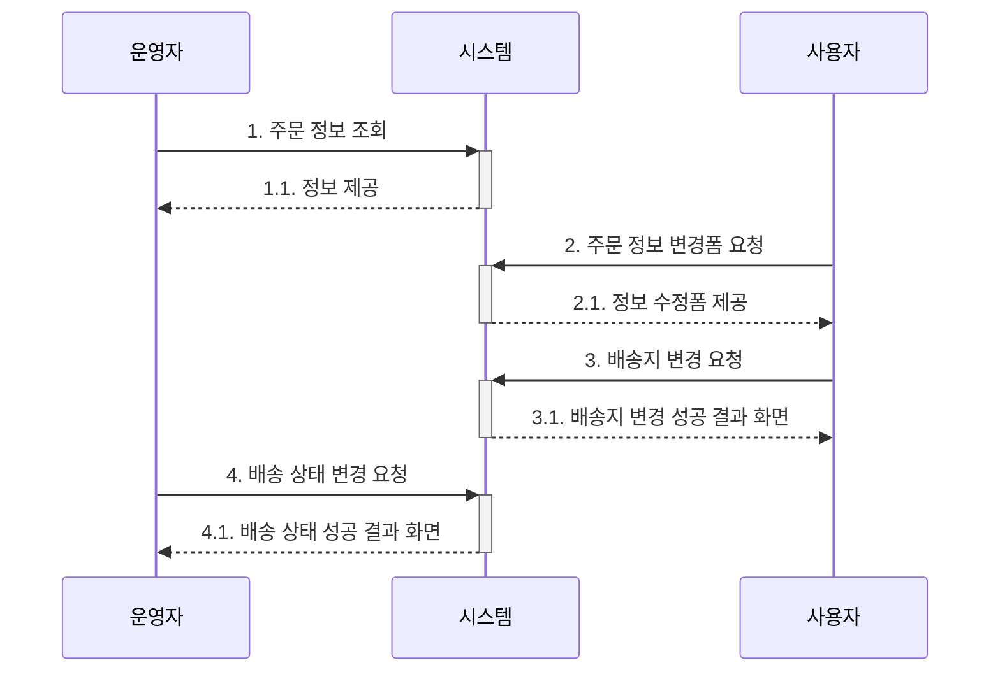
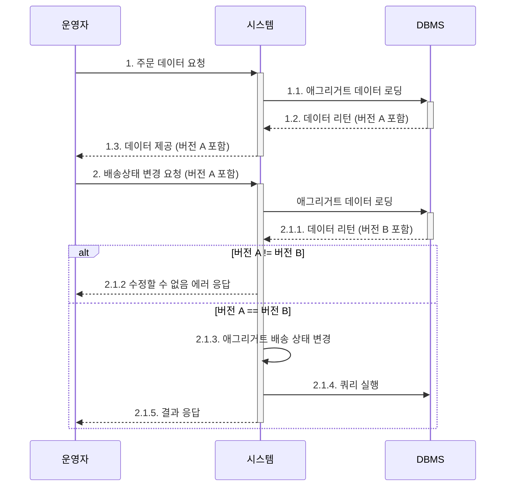
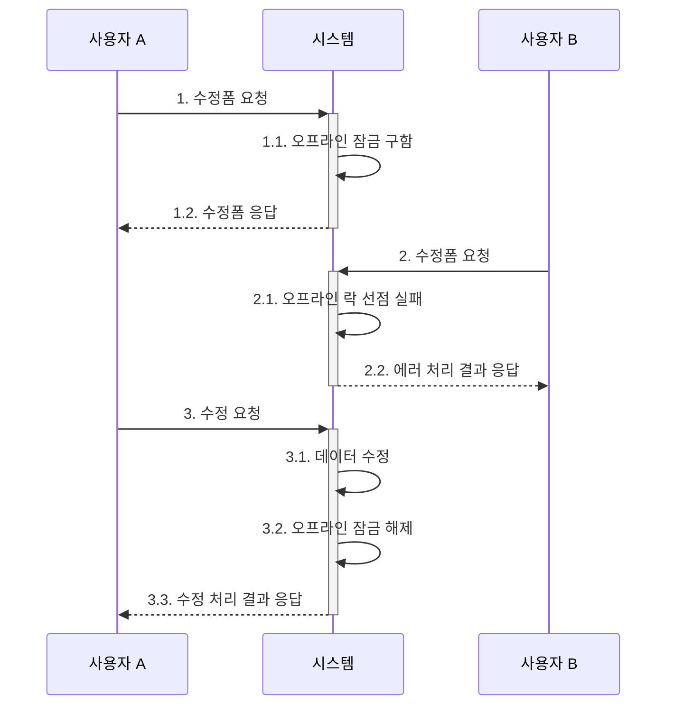

이 포스트에서는 아래 내용에 대해 알아본다.

- 애그리거트의 트랜잭션
- 애그리거트 잠금 기법

> 소스는 [github](https://github.com/assu10/ddd/tree/feature/chap08)  에 있습니다.

> 매핑되는 테이블은 [DDD - ERD](https://assu10.github.io/dev/2024/04/08/ddd-table/) 을 참고하세요.

---

**목차**

<!-- TOC -->
* [1. 애그리거트와 트랜잭션](#1-애그리거트와-트랜잭션)
* [2. 선점 잠금 (비관적 잠금, Pessimistic Lock): `LockModeType.PESSIMISTIC_WRITE`, `@Lock`](#2-선점-잠금-비관적-잠금-pessimistic-lock-lockmodetypepessimistic_write-lock)
  * [2.1. 선점 잠금과 교착 상태: `javax.persistence.lock.timeout`, `@QueryHints`](#21-선점-잠금과-교착-상태-javaxpersistencelocktimeout-queryhints)
* [3. 비선점 잠금 (낙관적 잠금, Optimistic Lock): `@Version`](#3-비선점-잠금-낙관적-잠금-optimistic-lock-version)
  * [3.1. 응용 서비스에서의 비선점 잠금](#31-응용-서비스에서의-비선점-잠금)
  * [3.2. 표현 영역에서의 비선점 잠금](#32-표현-영역에서의-비선점-잠금)
  * [3.3. 비선점 잠금을 이용한 트랜잭션 충돌 방지를 여러 트랜잭션으로 확장](#33-비선점-잠금을-이용한-트랜잭션-충돌-방지를-여러-트랜잭션으로-확장)
  * [3.4. 강제 버전 증가: `LockModeType.OPTIMISTIC_FORCE_INCREMENT`](#34-강제-버전-증가-lockmodetypeoptimistic_force_increment)
* [4. 오프라인 선점 잠금 (Offline Pessimistic Lock)](#4-오프라인-선점-잠금-offline-pessimistic-lock)
  * [4.1. 오프라인 선점 잠금을 위한 _LockManager_ 인터페이스와 관련 클래스](#41-오프라인-선점-잠금을-위한-_lockmanager_-인터페이스와-관련-클래스)
  * [4.2. DB 를 이용한 _LockManager_ 구현](#42-db-를-이용한-_lockmanager_-구현)
* [참고 사이트 & 함께 보면 좋은 사이트](#참고-사이트--함께-보면-좋은-사이트)
<!-- TOC -->

---

**개발 환경**

- 언어: java
- Spring Boot ver: 3.2.5
- Spring ver: 6.1.6
- IDE: intelliJ
- SDK: JDK 17
- 의존성 관리툴: Maven

---

pom.xml
```xml
<?xml version="1.0" encoding="UTF-8"?>
<project xmlns:xsi="http://www.w3.org/2001/XMLSchema-instance" xmlns="http://maven.apache.org/POM/4.0.0"
         xsi:schemaLocation="http://maven.apache.org/POM/4.0.0 https://maven.apache.org/xsd/maven-4.0.0.xsd">
  <modelVersion>4.0.0</modelVersion>
  <parent>
    <groupId>org.springframework.boot</groupId>
    <artifactId>spring-boot-starter-parent</artifactId>
    <version>3.2.5</version>
    <relativePath/> <!-- lookup parent from repository -->
  </parent>
  <groupId>com.assu</groupId>
  <artifactId>ddd_me</artifactId>
  <version>0.0.1-SNAPSHOT</version>
  <name>ddd</name>
  <description>Demo project for Spring Boot</description>
  <properties>
    <java.version>17</java.version>
  </properties>
  <dependencies>
    <dependency>
      <groupId>org.springframework.boot</groupId>
      <artifactId>spring-boot-starter-web</artifactId>
    </dependency>

    <dependency>
      <groupId>org.springframework.boot</groupId>
      <artifactId>spring-boot-starter-test</artifactId>
      <scope>test</scope>
    </dependency>
    <dependency>
      <groupId>org.projectlombok</groupId>
      <artifactId>lombok</artifactId>
      <scope>annotationProcessor</scope>
    </dependency>
    <dependency>
      <groupId>org.springframework.boot</groupId>
      <artifactId>spring-boot-starter-data-jpa</artifactId>
    </dependency>
    <!-- https://mvnrepository.com/artifact/org.hibernate/hibernate-jpamodelgen -->
    <dependency>
      <groupId>org.hibernate</groupId>
      <artifactId>hibernate-jpamodelgen</artifactId>
      <version>6.5.2.Final</version>
      <type>pom</type>
      <!--            <scope>provided</scope>-->
    </dependency>
    <!-- https://mvnrepository.com/artifact/com.mysql/mysql-connector-j -->
    <dependency>
      <groupId>com.mysql</groupId>
      <artifactId>mysql-connector-j</artifactId>
      <version>8.4.0</version>
    </dependency>
    <dependency>
      <groupId>org.springframework.boot</groupId>
      <artifactId>spring-boot-devtools</artifactId>
      <scope>runtime</scope>
    </dependency>

  </dependencies>

  <build>
    <plugins>
      <plugin>
        <groupId>org.springframework.boot</groupId>
        <artifactId>spring-boot-maven-plugin</artifactId>
      </plugin>
      <plugin>
        <groupId>org.bsc.maven</groupId>
        <artifactId>maven-processor-plugin</artifactId>
        <version>2.0.5</version>
        <executions>
          <execution>
            <id>process</id>
            <goals>
              <goal>process</goal>
            </goals>
            <phase>generate-sources</phase>
            <configuration>
              <processors>
                <processor>org.hibernate.jpamodelgen.JPAMetaModelEntityProcessor</processor>
              </processors>
            </configuration>
          </execution>
        </executions>
        <dependencies>
          <dependency>
            <groupId>org.hibernate</groupId>
            <artifactId>hibernate-jpamodelgen</artifactId>
            <version>6.5.2.Final</version>
          </dependency>
        </dependencies>
      </plugin>
    </plugins>
  </build>

</project>
```

```properties
spring.application.name=ddd
spring.datasource.url=jdbc:mysql://localhost:13306/shop?characterEncoding=utf8
spring.datasource.username=root
spring.datasource.password=
spring.datasource.driver-class-name=com.mysql.cj.jdbc.Driver
spring.datasource.hikari.maximum-pool-size=10
spring.jpa.database=mysql
spring.jpa.show-sql=true
spring.jpa.hibernate.naming.physical-strategy=org.hibernate.boot.model.naming.PhysicalNamingStrategyStandardImpl
spring.jpa.open-in-view=false
logging.level.root=INFO
logging.level.com.myshop=DEBUG
logging.level.org.springframework.security=DEBUG
```

---

# 1. 애그리거트와 트랜잭션

아래는 하나의 주문 애그리거트에 대해 운영자가 배송 상태로 변경할 때 동시에 사용자가 배송지 주소를 변경할 때의 트랜잭션 흐름이다.


트랜잭션마다 리포지터리는 새로운 애그리거트 객체를 생성하므로 운영자 스레드와 고객 스레드는 같은 주문 애그리거트를 나타내는 다른 객체를 구하게 된다.

운영자 스레드와 고객 스레드는 개념적으로 동일한 애그리거트이지만 물리적으로는 서로 다른 애그리거트 객체를 사용한다.

위 순서의 문제점은 운영자는 기존 배송지 정보를 이용하여 배송 상태로 변경했는데 그 사이에 고객이 배송지 정보를 변경하여 **애그리거트의 일관성이 깨진다**는 것이다.

일관성이 깨지는 문제가 발생하지 않도록 하려면 아래 중 하나를 선택해야 한다.
- 운영자가 배송지 정보를 조회하고 상태를 변경하는 동안 고객이 애그리거트를 수정하지 못하게 막음
- 운영자가 배송지 정보를 조회한 이후에 고객이 정보를 변경하면, 운영자가 애그리거트를 다시 조회하여 수정하도록 함

이 두 가지 방법은 애그리거트 자체의 트랜잭션과 관련이 있다.

**DBMS 가 지원하는 트랜잭션과 함께 애그리거트를 위한 추가 트랜잭션 처리 기법**이 필요하다.

**애그리거트에 대해 사용할 수 있는 대표적인 트랜잭션 처리 방식**은 2 가지가 있다.
- **선점 잠금 (비관적 잠금, Pessimistic Lock)**
- **비선점 잠근 (낙관점 잠금, Optimistic Lock)**

---

애그리거트의 상태는 자신의 비즈니스 로직에 의해서만 수정 가능하므로 애그리거트가 트랜잭션 경계의 역할을 한다.  
모든 애그리거트의 상태 변경은 원자적인 단일 오퍼레이션으로 트랜잭션 처리가 되어야 한다.

애그리거트의 상태 변경은 DB 트랜잭션 하나 당 한 개의 애그리거트로, 개별적으로만 커밋되어야 한다.  
여러 애그리거트에서 변경을 커밋해야 한다면 이것은 잘못된 트랜잭션 경계의 신호이고, 잘못된 애그리거트의 경계이다.

---

# 2. 선점 잠금 (비관적 잠금, Pessimistic Lock): `LockModeType.PESSIMISTIC_WRITE`, `@Lock`

**선점 잠금은 먼저 애그리거트를 구한 스레드가 애그리거트 사용이 끝날 때까지 다른 스레드가 해당 애그리거트를 수정하지 못하게 막는 방식**이다.


스레드 1 이 선점 잠금 방식으로 애그리거트를 구한 뒤 이어서 스레드 2 가 같은 애그리거트를 구하고 있다.  
이 때 스레드 2 는 스레드 1 이 애그리거트에 대한 잠금을 해제할 때까지 blocking 된다.  
스레드 1 이 애그리거트를 수정하고 트랜잭션을 커밋하면 잠금을 해제하는데 이 때 대기하고 있던 스레드 2 가 애그리거트에 접근하게 된다.

**한 스레드가 애그리거트를 구하고 수정하는 동안 다른 스레드가 수정할 수 없으므로 동시에 애그리거트를 수정할 때 발생하는 데이터 충돌 문제를 해소**할 수 잇다.

[1. 애그리거트와 트랜잭션](#1-애그리거트와-트랜잭션) 에서 나온 배송지 정보 수정과 배송 상태 변경을 동시에 하는 상황에 선점 잠금을 적용하면 아래와 같다.


위 그림에서 운영자 스레드가 배송 상태로 변경한 뒤 트랜잭션을 커밋하면 잠금을 해제하고 잠금이 해제된 시점에 고객 스레드가 구하는 주문 애그리거트는 운영자 스레드가 
수정한 배송 상태의 주문 애그리거트이다.  
이미 배송 상태이므로 주문 애그리거트는 배송지 변경 시 에러를 발생하고 트랜잭션을 실패한다.  
고객은 아마 '이미 배송이 시작되어 배송지 변경이 불가합니다.' 와 같은 문구를 보게 될 것이다.

**선점 잠금은 보통 DBMS 가 제공하는 행단위 잠금을 사용하여 구현**한다.

오라클을 비롯한 다수의 DBMS 가 `for update` 와 같은 쿼리를 사용하여 특정 레코드에 한 커넥션만 접근할 수 있는 잠금 장치를 제공한다.

JPA EntityManager 는 `LockModeType` 를 인자로 받는 `find()` 메서드를 제공하는데 `LockModeType.PESIMMISTIC_WRITE` 를 값으로 전달하면 
해당 엔티티와 매핑된 테이블을 이용해서 선점 잠금 방식을 적용할 수 있다.

```java
Order order = entityManager.find(Order.class, orderNo, LockModeType.PESSIMISTIC_WRITE);
```

**JPA 프로바이더와 DBMS 에 따라 잠금 모두 구현이 다른데 하이버네이트의 경우 PESSIMISTIC_WRITE 를 잠금 모드로 사용하면 `for update` 쿼리를 이용하여 선점 잠금을 구현**한다.

**스프링 데이터 JPA 는 `@Lock` 애너테이션을 사용하여 잠금 모드를 지정**한다.

MemberRepository.java
```java
package com.assu.study.member.command.domain;

import jakarta.persistence.LockModeType;
import org.springframework.data.jpa.repository.Lock;
import org.springframework.data.jpa.repository.Query;
import org.springframework.data.repository.Repository;
import org.springframework.data.repository.query.Param;

import java.util.Optional;

public interface MemberRepository extends Repository<Member, MemberId> {
    Optional<Member> findById(MemberId memberId);

    // 선점 잠금 방식 이용
    @Lock(LockModeType.PESSIMISTIC_WRITE)
    @Query("select m from Member m where m.id = :id")
    Optional<Member> findByIdForUpdate(@Param("id") MemberId memberId);
}
```

---

## 2.1. 선점 잠금과 교착 상태: `javax.persistence.lock.timeout`, `@QueryHints`

선점 잠금 기능을 사용할 때는 잠금 순서에 따른 교착 상태가 발생하지 않도록 주의해야 한다.

예를 들어 아래와 같은 경우를 보자.

- 스레드 1: A 애그리거트에 대한 선점 잠금 구함
- 스레드 2: B 애그리거트에 대한 선점 잠금 구함
- 스레드 1: B 애그리거트에 대한 선점 잠금 시도
- 스레드 2: A 애그리거트에 대한 선점 잠금 시도

이 경우 스레드 1은 영원히 B 애그리거트에 대한 선점 잠금을 구할 수 없고, 스레드 2는 영원히 A 애그리거트에 대한 선점 잠금을 구할 수 없다.  
즉, 스레드 1 과 스레드 2 는 교착 상태에 빠진다.

선점 잠금에 따른 교착 상태는 사용자 수가 많을 때 발생할 가능성이 높고, 사용자 수가 많아지면 교착 상태에 빠지는 스레드 수가 더 빠르게 증가하면서 결국 시스템은 
아무것도 할 수 없는 상태가 된다.

이런 문제가 발생하지 않게 하려면 **잠금을 구할 때 최대 대기 시간을 지정**해야 한다.

JPA 에서 선점 잠금을 시도할 때 최대 대기 시간을 지정하는 방법은 아래와 같다.

```java
Map<String, Object> hints = new HashMap<>();

// 최대 대기 시간 2초
hints.put("javax.persistence.lock.timeout", 2000);
Order order = entityManager.find(Order.class, orderNo, LockModeType.PESSIMISTIC_WRITE, hints);
```

**JPA 의 `javax.persistence.lock.timeout` 힌트는 잠금을 구하는 대기 시간을 ms 단위로 지정**한다.  
**지정한 시간 내에 잠금을 구하지 못하면 예외를 발생**시킨다.

**`javax.persistence.lock.timeout` 힌트를 사용할 때 주의할 점은 DBMS 에 따라 힌트가 적용되지 않을수도 있으므로 이 힌트를 사용할 때는 사용중인 DBMS 가 
관련 기능을 지원하는지 꼭 확인**해야 한다.

**DBMS 에 따라 교착 상태에 빠진 커넥션을 처리하는 방식이 다르다.**    
쿼리별로 대기 시간을 지정할 수 있는 DBMS 도 있고, 커넥션 단위로만 대기 시간을 지정할 수 있는 DBMS 도 있다.  
따라서 **선점 잠금을 사용하려면 사용하는 DBMS 에 대해 JPA 가 어떤 방식으로 대기 시간을 처리하는지 반드시 확인**해야 한다.

스프링 데이터 JPA 는 `@QueryHints` 애너테이션을 사용하여 쿼리 힌트를 지정한다.

MemberRepository.java
```java
package com.assu.study.member.command.domain;

import jakarta.persistence.LockModeType;
import jakarta.persistence.QueryHint;
import org.springframework.data.jpa.repository.Lock;
import org.springframework.data.jpa.repository.Query;
import org.springframework.data.jpa.repository.QueryHints;
import org.springframework.data.repository.Repository;
import org.springframework.data.repository.query.Param;

import java.util.Optional;

public interface MemberRepository extends Repository<Member, MemberId> {
    Optional<Member> findById(MemberId memberId);

    // 선점 잠금 방식 이용
    @Lock(LockModeType.PESSIMISTIC_WRITE)
    // 잠금을 구하는 대기 시간을 2초로 지정
    @QueryHints({
            @QueryHint(name = "javax.persistenct.lock.timeout", value = "2000")
    })
    @Query("select m from Member m where m.id = :id")
    Optional<Member> findByIdForUpdate(@Param("id") MemberId memberId);
}
```

---

# 3. 비선점 잠금 (낙관적 잠금, Optimistic Lock): `@Version`

선점 잠금으로 모든 트랜잭션 충돌 문제가 해결되는 것은 아니다.

아래는 선점 잠금으로 해결할 수 없는 상황의 예시이다.


1. 운영자는 배송을 위해 주문 정보 조회 요청, 시스템은 정보 제공
2. 고객이 배송지 변경을 위해 변경 폼 요청, 시스템은 변경 폼 제공
3. 고객에 새로운 배송지를 입력 후 폼을 전송하여 배송지 변경
4. 운영자가 1번에서 조회한 주문 정보를 기준으로 배송지를 정하고, 배송 상태 변경 요청

위 상황의 문제는 운영자가 배송지 정보를 조회하고 배송 상태로 변경하는 사이에 고객이 배송지를 변경한다는 점이다.  
즉, 배송 상태 변경 전에 배송지를 한번 더 확인하지 않으면 다른 배송지로 물건을 발송하게 된다.

이 문제는 선점 잠금 방식으로는 해결할 수 없다.

> 의문점...  
> 운영자가 1. 주문 정보 조회할 때 선점 잠금이 되서 사용자가 2. 주문 정보 변경폼 요청 시 잠금으로 대기 상태가 되지 않나..?

이 때 필요한 것이 비선점 잠금이다.

**비선점 잠금은 동시에 접근하는 것을 막는 대신 변경한 데이터를 실제 DBMS 에 반영하는 시점에 변경 가능 여부를 확인하는 방식**이다.

**비선점 잠금을 구현하려면 애그리거트에 버전으로 사용할 숫자 타입 프로퍼티를 추가**해야 한다.  
애그리거트를 수정할 때마다 버전으로 사용할 프로퍼티값이 1씩 증가하는데 사용법은 아래와 같다.

비선점 잠금 사용 쿼리
```sql
UPDATE a_table 
   SET version = version + 1,
       col1 = ?
 WHERE id = ?
   AND version = 현재 버전
```

**위 쿼리는 수정할 애그리거트와 매핑되는 테이블의 버전값이 현재 애그리거트의 버전과 동일한 경우에만 데이터를 수정**한다.  
**수정에 성공하면 버전값을 1 증가**시키고, **다른 트랜잭션이 먼저 데이터를 수정해서 버전값이 바뀌면 데이터 수정에 실패**한다.

이를 그림으로 표현하면 아래와 같다.


스레드 1과 스레드 2는 같은 버전을 갖는 애그리거트를 읽어와서 수정한다.  
스레드 1이 트랜잭션을 커밋한 후에 스레드 2가 커밋을 시도하면 이미 애그리거트 버전이 6이므로 스레드 2는 데이터 수정에 실패한다.

**JPA 는 버전을 이용한 비선점 잠금 기능을 지원하는데 아래처럼 `@Version` 애너테이션을 붙이고 매핑되는 테이블에 버전을 저장할 컬럼을 추가**하면 된다.

Order.java
```java
package com.assu.study.order.command.domain;

// 주문 (애그리거트 루트)
@Entity
@Table(name = "purchase_order")
@Access(AccessType.FIELD)
public class Order {
    // ...

    // 비선점 잠금 방식을 이용하기 위한 필드
    @Version
    private long version;
            
    // ...
}
```

**JPA 는 엔티티가 변경되어 UPDATE 쿼리를 실행할 때 `@Version` 에 명시한 필드를 이용하여 비선점 잠금 쿼리를 실행**한다.

```sql
UPDATE purcahse_order
   SET col1 = ?
     , version = version = 1
 WHERE id = ?
   AND version = 5l
```

---

## 3.1. 응용 서비스에서의 비선점 잠금

**응용 서비스는 버전에 대해 알 필요가 없다.**

리포지터리에서 필요한 애그리거트를 구한 후 알맞은 기능만 실행하면 기능 실행 과정에서 애그리거트 데이터가 변경되면 JPA 는 트랜잭션 종료 시점에 비선점 잠금을 위한 쿼리를 실행한다.

ChangeShippingService.java
```java
package com.assu.study.order.command.application;

import com.assu.study.order.NoOrderException;
import com.assu.study.order.command.domain.Order;
import com.assu.study.order.command.domain.OrderNo;
import com.assu.study.order.command.domain.OrderRepository;
import org.springframework.stereotype.Service;
import org.springframework.transaction.annotation.Transactional;

import java.util.Optional;

@Service
public class ChangeShippingService {
    private OrderRepository orderRepository;

    @Transactional
    public void changeShipping(ChangeShippingRequest changeReq) {
        Optional<Order> oOrder = orderRepository.findById(new OrderNo(changeReq.getNumber()));
        Order order = oOrder.orElseThrow(() -> new NoOrderException());
        order.changeShippingInfo(changeReq.getShippingInfo());
    }
}
```

ChangeShippingRequest.java
```java
package com.assu.study.order.command.application;

import com.assu.study.order.command.domain.ShippingInfo;
import lombok.AllArgsConstructor;
import lombok.Getter;

@AllArgsConstructor
@Getter
public class ChangeShippingRequest {
    private String number;
    private ShippingInfo shippingInfo;
}
```

비선점 잠금에서 쿼리 실행 시 쿼리 실행 결과로 수정된 행의 개수가 0 이면 이미 누군가 앞서 데이터를 수정한 것이고 이는 트랜잭션이 충돌했음을 의미하므로 
트랜잭션 종료 시점에 예외가 발생한다.

위에선 _changeShipping()_ 메서드가 리턴될 때 트랜잭션이 종료되고, 이 시점에 트랜잭션 충돌이 발생하면 `OptimisticLockingFailureException` 이 발생한다.

---

## 3.2. 표현 영역에서의 비선점 잠금

표현 영역에서는 예외가 발생했는지에 따라 트랜잭션 충돌이 일어났는지 확인 가능하다.

```java
@Controller
public class OrderController {
    private ChangeShippingService changeShippingService;
    
    @PostMapping("/changeShipping")
    public String changeShippingInfo(ChangeShippingRequest changeReq) {
        try {
            changeShippingService.changeShipping(changeReq);
            return "success";
        } catch (OptimisticLockingFailureException e) {
            // 누군가 먼저 같은 주문 애그리거트를 수정하여 트랜잭션이 충돌했다는 메시지 노출
            return "changeShippingConflict";
        }
    }
}
```

---

## 3.3. 비선점 잠금을 이용한 트랜잭션 충돌 방지를 여러 트랜잭션으로 확장

이제 [3. 비선점 잠금 (낙관적 잠금, Optimistic Lock): `@Version`](#3-비선점-잠금-낙관적-잠금-optimistic-lock-version) 처음에 나온 
선점 잠금으로 해결할 수 없는 상황을 아래처럼 비선점 잠금으로 해결할 수 있다.

비선점 자금을 이용한 트랜잭션 충돌 방지를 여러 트랜잭션으로 확장한 예시


시스템은 사용자에게 수정 폼을 제공할 때 애그리거트 버전을 함께 제공하고, 폼을 서버에 전송할 때 이 버전을 함께 전송한다.  
사용자가 전송한 버전과 애그리거트 버전이 동일한 경우에만 애그리거트 수정 기능을 수행하도록 함으로써 충돌 문제를 해소할 수 있다.

위와 같이 비선점 잠금 방식을 여러 트랜잭션으로 확장하려면 애그리거트 정보를 뷰로 보여줄 때 버전 정보도 함께 사용자 화면에 전달해야 한다.

```thymeleafexpressions
<form th:action="@{/startShipping}" method="post">
    <input type="hidden" name="version" th:value="{dorderDto.version}" />
</form>
```

응용 서비스에 전달할 때 요청 데이터는 사용자가 전송한 버전값을 포함하여 전달한다.  
예를 들어 배송 상태 변경을 처리하는 응용 서비스가 전달받는 데이터는 아래처럼 조회한 시점의 버전값을 포함한다.

StartShippingRequest.java
```java
package com.assu.study.order.command.application;

import lombok.AllArgsConstructor;
import lombok.Getter;
import lombok.NoArgsConstructor;

@NoArgsConstructor
@AllArgsConstructor
@Getter
public class StartShippingRequest {
  private String orderNumber;
  private long version;
}
```

응용 서비스는 전달받은 버전값을 이용하여 애그리거트 버전과 일치하는지 확인 후 일치하는 경우에만 기능을 수행한다.

StartShippingService.java
```java
package com.assu.study.order.command.application;

import com.assu.study.common.VersionConflictException;
import com.assu.study.order.NoOrderException;
import com.assu.study.order.command.domain.Order;
import com.assu.study.order.command.domain.OrderNo;
import com.assu.study.order.command.domain.OrderRepository;
import lombok.RequiredArgsConstructor;
import org.springframework.security.access.prepost.PreAuthorize;
import org.springframework.stereotype.Service;
import org.springframework.transaction.annotation.Transactional;

import java.util.Optional;

@RequiredArgsConstructor
@Service
public class StartShippingService {
  private final OrderRepository orderRepository;

  @PreAuthorize("hasRole('ADMIN')")
  @Transactional
  public void startShipping(StartShippingRequest req) {
    Optional<Order> oOrder = orderRepository.findById(new OrderNo(req.getOrderNumber()));
    Order order = oOrder.orElseThrow(() -> new NoOrderException());

    // 애그리거트 조회 시점의 버전과 수정 시점의 버전이 일치하지 않으면
    // 누군가 먼저 주문 애그리거트를 수정한 것이므로 예외 발생
    if (!order.matchVersion(req.getVersion())) {
      throw new VersionConflictException();
    }
    order.startShipping();
  }
}
```

Order.java
```java
package com.assu.study.order.command.domain;

import com.assu.study.common.jpa.MoneyConverter;
import com.assu.study.common.model.Money;
import jakarta.persistence.*;

import java.time.LocalDateTime;
import java.util.List;

// 주문 (애그리거트 루트)
@Entity
@Table(name = "purchase_order")
@Access(AccessType.FIELD)
public class Order {
    // 비선점 잠금 방식을 이용하기 위한 필드
    @Version
    private long version;

    // ...

    // 출고 전 상태인지 검사
    private void verifyNotYetShipped() {
      if (!isNotYetShipped()) {
        throw new AlreadyShippedException();
      }
    }
  
    // 아직 결제 전이거나 상품 준비중이면 아직 출고되지 않은 상태임
    public boolean isNotYetShipped() {
      return state == OrderState.PAYMENT_WAITING || state == OrderState.PREPARING;
    }
  
    // 비선점 잠금 방식으로 정보 수정 시 애그리거트 버전 정보가 일치하는지 확인
    public boolean matchVersion(long version) {
        return this.version == version;
    }

    // 배송 출발로 상태 변경
    public void startShipping() {
      verifyNotYetShipped();
      verifyNotCanceled();
    }
  
    private void verifyNotCanceled() {
      if (state == OrderState.CANCELED) {
        throw new OrderAlreadyCanceledException();
      }
    }
}
```

VersionConflictException.java
```java
package com.assu.study.common;

public class VersionConflictException extends RuntimeException {
}
```

AlreadyShippedException.java
```java
package com.assu.study.order.command.domain;

public class AlreadyShippedException extends RuntimeException {
}
```

OrderAlreadyCanceledException.java
```java
package com.assu.study.order.command.domain;

public class OrderAlreadyCanceledException extends RuntimeException {
}
```

표현 계층은 버전 충돌 예외가 발생하면 사용자에게 이를 알린다.

AdminOrderController.java
```java
package com.assu.study.admin.ui;

import com.assu.study.common.VersionConflictException;
import com.assu.study.order.command.application.StartShippingRequest;
import com.assu.study.order.command.application.StartShippingService;
import lombok.RequiredArgsConstructor;
import org.springframework.dao.OptimisticLockingFailureException;
import org.springframework.stereotype.Controller;
import org.springframework.web.bind.annotation.PathVariable;
import org.springframework.web.bind.annotation.PostMapping;
import org.springframework.web.bind.annotation.RequestParam;

@RequiredArgsConstructor
@Controller
public class AdminOrderController {
  private final StartShippingService startShippingService;

  // 배송 시작으로 상태 변경 시
  @PostMapping("/admin/orders/{orderNo}/shipping")
  public String startShippingOrder(@PathVariable("orderNo") String orderNo,
                                   @RequestParam("version") long version) {
    try {
      startShippingService.startShipping(new StartShippingRequest(orderNo, version));
      return "admin/adminOrderShipped";
    } catch (OptimisticLockingFailureException | VersionConflictException e) {
      // OptimisticLockingFailureException: 누군가 거의 동시에 애그리거트를 수정함 (프레임워크에서 제공하는 예외)
      // VersionConflictException: 이미 누군가 애그리거트를 수정함 (커스텀 예외)
      return "admin/adminOrderLockFail";
    }
  }
}
```

위처럼 2개의 익셉션은 트랜잭션 충돌이 발생한 시점을 명확하게 구분해준다.  
만일 버전 충돌 상황에 대한 구분이 명시적으로 필요없다면 응용 서비스에서 프레임워크용 예외를 발생시켜도 된다.

StartShippingService.java
```java
@RequiredArgsConstructor
@Service
public class StartShippingService {
  private OrderRepository orderRepository;

  @PreAuthorize("hasRole('ADMIN')")
  @Transactional
  public void startShipping(StartShippingRequest req) {
    Optional<Order> oOrder = orderRepository.findById(new OrderNo(req.getOrderNumber()));
    Order order = oOrder.orElseThrow(() -> new NoOrderException());

    // 애그리거트 조회 시점의 버전과 수정 시점의 버전이 일치하지 않으면
    // 누군가 먼저 주문 애그리거트를 수정한 것이므로 예외 발생
    if (!order.matchVersion(req.getVersion())) {
      throw new OptimisticLockingFailureException("version conflict");
    }
    order.startShipping();
  }
}
```

---

## 3.4. 강제 버전 증가: `LockModeType.OPTIMISTIC_FORCE_INCREMENT`

애그리거트에는 애그리거트 루트 외 다른 엔티티가 존재하는데 기능 실행 도중 루트가 아닌 다른 엔티티의 값만 변경되는 상황이 있다.  
이 때 **JPA 는 연관된 엔티티의 값이 변경된다고 해도 루트 엔티티 자체의 값은 바뀌는 것이 없으므로 루트 엔티티의 버전값을 증가시키지 않는다.**

하지만 **이런 JPA 특징은 애그리거트 관점에서 보면 문제**가 생긴다.

루트 엔티티의 값이 바뀌지 않았더라도 애그리거트 구성 요소 중 일부 값이 바뀌면 논리적으로 그 애그리거트는 바뀐 것이기 때문이다.    
따라서 애그리거트 내의 어떤 구성 요소의 상태가 바뀌면 루트 애그리거트의 버전값이 증가해서 비선점 잠금이 올바르게 동작한다.

JPA 는 이를 해소할 수 있도록 EntityManager#find() 메서드로 엔티티를 구할 때 강제로 버전값을 증가시키는 잠금 모드를 지원한다.

아래는 비선점 강제 버전 증가 잠금 모드를 사용하여 엔티티를 구하는 예시이다.
```java
@Repository
public class JpaOrderRepository implements OrderRepository {
    @PersistenceContext
    private EntityManager entityManager;
    
    @Override 
    public Order findByOptimisticLockMode(OrderNo id) {
        return entityManager.find(Order.class, id, LockModeType.OPTIMISTIC_FORCE_INCREMENT);
    }
}
```

`LockModeType.OPTIMISTIC_FORCE_INCREMENT` 는 해당 엔티티의 상태가 변경되었는지 상관없이 트랜잭션 종료 시점에 버전값 증가 처리를 하므로 
애그리거트 루트 엔티티가 아닌 다른 엔티티나 밸류가 변경되더라도 버전값을 증가시켜 비선점 잠금 기능을 안전하게 적용할 수 있다.

스프링 데이터 JPA 를 사용하면 `@Lock` 애너테이션을 이용하여 지정하면 된다.

---

# 4. 오프라인 선점 잠금 (Offline Pessimistic Lock)

컨플루언스를 이용하다보면 만일 누군가 해당 페이지를 수정하고 있으면 다른 누군가 해당 페이지를 수정하고 있다는 안내 문구를 보여준다.  
사전에 충돌 여부를 알려는 주지만 동시에 수정하는 것을 막지는 않는다.

만일 더 엄격하게 데이터 충돌을 막고 싶다면 **누군가 수정 화면을 보고있을 때 수정 화면 자체를 실행하지 못하게 하면 된다.**

**한 트랜잭션 범위에서만 적용되는 선점 잠금 방식이나 나중에 버전 충돌을 확인하는 비선점 방식으로는 이를 구현할 수 없다.**  
이 때는 오프라인 선점 잠금 방식으로 해결할 수 있다.

**단일 트랜잭션에서 동시 변경을 막는 선점 잠금 방식과 달리 오프라인 선점 잠금은 여러 트랜잭션에 걸쳐서 동시 변경을 막는다.**

**첫 번째 트랜잭션을 시작할 때 오프라인 잠금을 선점하고, 마지막 트랜잭션에서 잠금을 해제**한다.  
잠금을 해제하기 전까지는 다른 사용자는 잠금을 구할 수 없다.

예를 들어 수정 기능의 경우 보통 수정 기능을 2 개의 트랜잭션으로 수정된다.  
첫 번째 트랜잭션은 폼을 보여주고, 두 번째 트랜잭션은 데이터를 수정한다.


오프라인 잠금 선점 예시


근데 만일 위 그림에서 사용자 A 가 과정 3 (수정 요청) 을 종료하게 되면 잠금을 해제하지 않으므로 다른 사용자는 영원히 잠금을 구할 수 없게 된다.

이런 상황을 방지하기 위해 오프라인 선점 방식은 **잠금 유효 시간**을 가져야 한다.  
유효 시간이 지나면 자동으로 잠금이 해제되어 다른 사용자가 잠금을 일정 시간 후에 다시 구할 수 있도록 해야 한다.

만일 사용자 A 가 잠금 유효 시간이 지난 후 과정 3 (수정 요청) 을 수행하면 잠금이 해제되었으므로 사용자 A 는 수정에 실패하게 된다.  
이런 상황을 방지하려면 **일정 주기로 유효 시간을 증가시키는 방식이 필요**하다.  
예) 수정폼에서 1분 단위로 ajax 호출을 통해 잠금 유효 시간을 1분씩 증가

---

## 4.1. 오프라인 선점 잠금을 위한 _LockManager_ 인터페이스와 관련 클래스

오프라인 선섬 잠금은 크게 4 가지의 기능이 필요하다.
- 잠금 선점 시도
- 잠금 확인
- 잠금 해제
- 잠금 유효시간 연장

이 기능을 위한 _LockManager_ 인터페이스는 아래와 같다.

LockManager.java
```java
package com.assu.study.lock;

// 오프라인 선점 잠금을 위한 인터페이스
public interface LockManager {
  LockId tryLock(String type, String id) throws LockException;

  void checkLock(LockId lockId) throws LockException;

  void releaseLock(LockId lockId) throws LockException;

  void extendLockExpiration(LockId lockId, long inc) throws LockException;
}
```

_tryLock()_ 은 잠금 대상 타입과 식별자를 값으로 전달하는 방식이다.  
예) 식별자가 10인 Article 에 대한 잠금을 구하고 싶다면 _tryLock("domain.Article", "10")_

LockId.java
```java
package com.assu.study.lock;

import lombok.AllArgsConstructor;
import lombok.Getter;

@AllArgsConstructor
@Getter
public class LockId {
    private String value;
}
```

LockException.java
```java
package com.assu.study.lock;

import lombok.NoArgsConstructor;

@NoArgsConstructor
public class LockException extends RuntimeException {
    public LockException(String message) {
        super(message);
    }

    public LockException(Throwable cause) {
        super(cause);
    }
}
```

오프라인 선점 잠금이 필요한 코드는 _LockManager#tryLock()_ 을 이용하여 잠금을 시도한다. 

아래는 컨트롤러가 오프라인 선점 잠금 기능을 이용하여 데이터 수정폼에 동시에 접근하는 것을 제어하는 코드 예시이다.  
수정폼에서 데이터를 전송할 때 _LockId_ 를 전송할 수 있도록 해야 한다.

오프라인 선점 잠금 시도를 하는 응용 서비스 예시
```java
// 서비스는 잠금 ID 를 리턴함
public DataAndLockId getDataWithLock(Long id) {
  // 오프라인 선점 잠금 시도
  LockId lockId = lockManager.tryLock("data", id);
  
  // 기능 실행
  Data data = someDao.select(id);
  return new DataAndLockId(data, lockId);
}
```

오프라인 선점 잠금 시도를 하는 표현 영역(컨트롤러) 예시
```java
@GetMapping("/some/edit/{id}")
public String editForm(@PathVariable("id") Long id, ModelMap map) {
    DataAndLockId dl = dataService.getDataWithLock(id);
    model.addAttribute("data", dl.getData());
    
    // 잠금 해제에 사용할 LockId 를 모델에 추가
    model.addAttribute("lockId", dl.getLockId());
    
    return "editForm";
}
```

잠금을 선점하는데 실패하면 _LockException_ 이 발생하고, 이 때는 다른 사용자가 수정 중이라는 안내 문구를 보여주면 된다.

아래는 잠금 해제를 하는 예시이다.

잠금 해제를 하는 뷰 예시
```thymeleafexpressions
<form th:action="@{/some/edit/{id}(id=${data.id})}" method="post">
    <input type="hidden" name="lockId" th:value="${lockId.value}" />
</form>
```

잠금 해제를 하는 응용 서비스 예시
```java
// 서비스는 잠금을 해제한다.
public void edit(EditRequest editReq, LockId lockId) {
  // 잠금 선점 확인
  lockManager.checkLock(lockId);
  
  // 기능 실행
  // ...
  
  // 잠금 해제
  lockManager.releaseLock(lockId);
}
```

위의 _checkLock()_ 은 잠금 선점 이후에 실행하는 기능은 아래와 같은 상황을 고려하여 **반드시 해당 LockId 를 갖는 잠금이 유효한지 확인**해야 한다.
- 잠금 유효 시간이 지났으면 이미 다른 사용자가 잠금을 선점함
- 잠금을 선점하지 않은 사용자가 기능을 실행한다면 기능 실행을 막아야 함

잠금 해제를 하는 표현 영역(컨트롤러) 예시
```java
// 서비스 호출 시 잠금 ID 함께 전달
@PostMapping("/some/edit/{id}")
public String edit(@PathVariable("id") Long id,
                   @ModelAttribute("editReq") EditRequest editReq,
                   @RequestParam("lockId") String lockId) {
    editReq.setId(id);
    
    // lockId 전달
    someEditService.edit(editReq, new LockId(lockId));
    model.addAttribute("data", data);
    return "success";
}
```

---

## 4.2. DB 를 이용한 _LockManager_ 구현

이제 DB 를 이용하여 _LockManager_ 를 구현해본다.

잠금 정보를 저장할 테이블과 인덱스는 아래와 같다.

```sql
CREATE TABLE `locks` (
  `type` varchar(255) NOT NULL,
  `id` varchar(255) NOT NULL,
  `lockid` varchar(255) DEFAULT NULL,
  `expiration_time` datetime DEFAULT NULL,
  PRIMARY KEY (`type`,`id`),
  UNIQUE KEY `locks_idx` (`lockid`)
) ENGINE=InnoDB DEFAULT CHARSET=utf8mb4 COLLATE=utf8mb4_0900_ai_ci
```

만일 Order 타입의 1번 식별자를 갖는 애그리거트에 대한 잠금을 구하고 싶다면 아래처럼 insert 쿼리를 이용하여 데이터를 삽입하면 된다.
```sql
insert into locks values ('Order', '1', '생성한 lockId', '2024-01-01 10:00:00')
```

type, id 를 PK 로 설정하여 동시에 두 사용자가 특정 타입 데이터에 대한 잠금을 구하는 것을 방지한다.  
각 잠금마다 새로운 lockId 를 사용하므로 lockid 는 Unique index 로 설정한다.  
잠금 유효 시간을 보관하기 위해 expiration_time 컬럼을 사용한다.

locks 테이블의 데이터를 담을 LockData 클래스는 아래와 같다.

LockData.java
```java
package com.assu.study.lock;

import lombok.AllArgsConstructor;
import lombok.Getter;

// locks 테이블의 데이터를 담는 클래스
@AllArgsConstructor
@Getter
public class LockData {
    private String type;
    private String id;
    private String lockId;
    private long timestamp;

    // 잠금 유효시간이 지났는지 판단
    public boolean isExpired() {
        return timestamp < System.currentTimeMillis();
    }
}
```

아래는 _LockManager_ 인터페이스를 구현하는 코드이다.  
DB 연동은 스프링이 제공하는 JdbcTemplate 를 이용하여 처리하였다.

SpringLockManager.java
```java
package com.assu.study.lock;

import lombok.RequiredArgsConstructor;
import org.springframework.dao.DuplicateKeyException;
import org.springframework.jdbc.core.JdbcTemplate;
import org.springframework.jdbc.core.RowMapper;
import org.springframework.stereotype.Component;
import org.springframework.transaction.annotation.Propagation;
import org.springframework.transaction.annotation.Transactional;

import java.sql.Timestamp;
import java.util.List;
import java.util.Optional;
import java.util.UUID;

@RequiredArgsConstructor
@Component
public class SpringLockManager implements LockManager {
    private final JdbcTemplate jdbcTemplate;
    // 잠금 유효 시간은 5분
    private int LOCK_TIMEOUT = 5 * 60 * 1000;

    // locks 테이블에서 조회한 데이터를 LockData 로 매핑하기 위한 RowMapper
    private RowMapper<LockData> lockDataRowMapper = (rs, rowNum) ->
            new LockData(rs.getString(1), rs.getString(2),
                    rs.getString(3), rs.getTimestamp(4).getTime());

    // type, id 에 대한 잠금 시도
    @Transactional(propagation = Propagation.REQUIRES_NEW)
    @Override
    public LockId tryLock(String type, String id) throws LockException {
        // 해당 type, id 에 대한 잠금이 존재하는지 확인
        checkAlreadyLocked(type, id);

        // 새로운 lockId 생성
        // 매번 새로운 lockId 를 생성해야 하므로 UUID 이용
        LockId lockId = new LockId(UUID.randomUUID().toString());

        // 잠금 생성
        locking(type, id, lockId);

        // lockId 리턴
        return lockId;
    }

    // 해당 type, id 에 대한 잠금이 존재하는지 확인
    private void checkAlreadyLocked(String type, String id) {
        List<LockData> locks = jdbcTemplate.query(
                "select * from locks where type = ? and id = ?",
                lockDataRowMapper, type, id);

        // 유효 시간이 지난 데이터 처리
        Optional<LockData> oLockData = handelExpiration(locks);

        // 유효 시간이 지나지 않은 LockData 가 존재하면 예외 발생
        if (oLockData.isPresent()) {
            throw new AlreadyLockedException();
        }
    }

    // 잠금 유효 시간이 지나면 해당 데이터를 삭제 후 빈 Optional 리턴
    // 유효 시간이 지나지 않았으면 해당 LockData 를 가진 Optional 리턴
    private Optional<LockData> handelExpiration(List<LockData> locks) {
        if (locks.isEmpty()) {
            return Optional.empty();
        }

        LockData lockData = locks.get(0);

        if (lockData.isExpired()) {
            jdbcTemplate.update(
                    "delete from locks where type = ? and id = ?",
                    lockData.getType(), lockData.getId());
            return Optional.empty();
        } else {
            return Optional.of(lockData);
        }
    }

    // 잠금을 위해 locks 테이블에 데이터 삽입
    // 삽입된 데이터가 없으면 예외 발생
    // 동일한 PK 나 lockId 를 가진 데이터가 이미 존재하여 DuplicateKeyException 이 발생하면 예외 발생
    private void locking(String type, String id, LockId lockId) {
        try {
            int updatedCount = jdbcTemplate.update(
                    "insert into locks value (?, ?, ?, ?)",
                    type, id, lockId.getValue(), new Timestamp(getExpirationTime()));
            if (updatedCount == 0) {
                throw new LockingFailException();
            }
        } catch (DuplicateKeyException e) {
            throw new LockingFailException(e);
        }
    }

    // 현재 시간 기준으로 잠금 유효 시간(5분) 이후 시간을 유효 시간으로 생성
    private long getExpirationTime() {
        return System.currentTimeMillis() + LOCK_TIMEOUT;
    }

    // 잠금이 유효한지 확인한 후 유효하지 않으면 예외 발생
    @Transactional(propagation = Propagation.REQUIRES_NEW)
    @Override
    public void checkLock(LockId lockId) throws LockException {
        Optional<LockData> lockData = getLockData(lockId);
        if (!lockData.isPresent()) {
            throw new NoLockException();
        }
    }

    // lockId 에 해당하는 LockData 를 구한 후 유효 시간이 지난 LockData 처리
    private Optional<LockData> getLockData(LockId lockId) {
        List<LockData> locks = jdbcTemplate.query(
                "select * from locks where lockid = ?",
                lockDataRowMapper, lockId.getValue());
        return handelExpiration(locks);
    }

    // lockId 에 해당하는 잠금 유효 시간은 inc 만큼 증가시킴
    @Transactional(propagation = Propagation.REQUIRES_NEW)
    @Override
    public void extendLockExpiration(LockId lockId, long inc) throws LockException {
        Optional<LockData> oLockData = getLockData(lockId);
        LockData lockData = oLockData.orElseThrow(() -> new NoLockException());
        jdbcTemplate.update(
                "update locks set expiration_time = ? where type = ? and id = ?",
                new Timestamp(lockData.getTimestamp() + inc),
                lockData.getType(), lockData.getId());
    }

    // lockId 에 해당하는 잠금 데이터 삭제
    @Transactional(propagation = Propagation.REQUIRES_NEW)
    @Override
    public void releaseLock(LockId lockId) throws LockException {
        jdbcTemplate.update("delete from locks where lockid = ?", lockId.getValue());
    }
}
```

AlreadyLockedException.java
```java
package com.assu.study.lock;

public class AlreadyLockedException extends LockException {
}
```

LockingFailException.java
```java
package com.assu.study.lock;

import lombok.NoArgsConstructor;

@NoArgsConstructor
public class LockingFailException extends LockException {
    public LockingFailException(Exception cause) {
        super(cause);
    }
}
```

NoLockException.java
```java
package com.assu.study.lock;

public class NoLockException extends RuntimeException {
}
```

> `Propagation.REQUIRES_NEW` 에 대한 설명은 [2. `@Transactional` 의 `propagation` 속성](https://assu10.github.io/dev/2023/09/10/springboot-database-4/#2-transactional-%EC%9D%98-propagation-%EC%86%8D%EC%84%B1) 을 참고하세요.

---

# 참고 사이트 & 함께 보면 좋은 사이트

*본 포스트는 최범균 저자의 **도메인 주도 개발 시작하기**을 기반으로 스터디하며 정리한 내용들입니다.*

* [도메인 주도 개발 시작하기](https://www.yes24.com/Product/Goods/108431347)
* [책 예제 git](https://github.com/madvirus/ddd-start2)