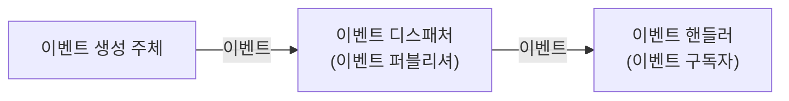
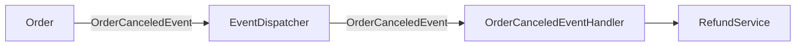
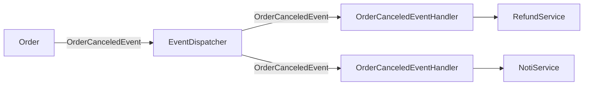
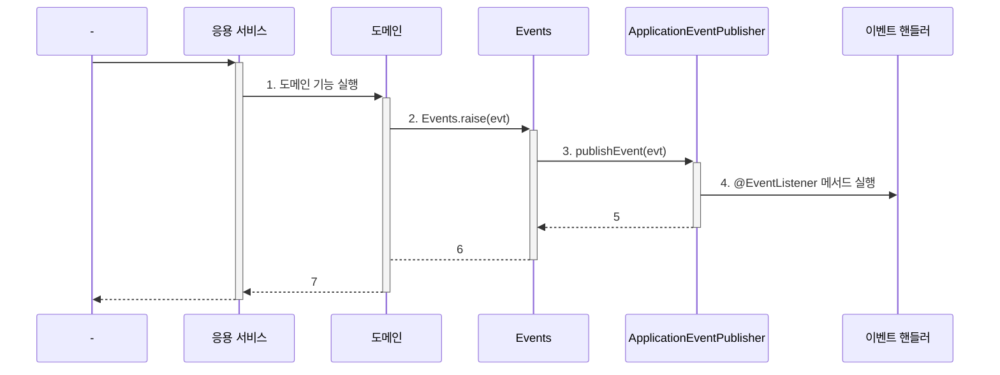

이 포스트에서는 아래 내용에 대해 알아본다.

- 이벤트의 용도와 장점
- 핸들러 디스패처와 핸들러 구현

> 소스는 [github](https://github.com/assu10/ddd/tree/feature/chap10)  에 있습니다.

> 매핑되는 테이블은 [DDD - ERD](https://assu10.github.io/dev/2024/04/08/ddd-table/) 을 참고하세요.

---

**목차**

<!-- TOC -->
* [1. 시스템 간 강결합 (High coupling) 문제](#1-시스템-간-강결합-high-coupling-문제)
* [2. 이벤트](#2-이벤트)
  * [2.1. 이벤트 관련 구성 요소](#21-이벤트-관련-구성-요소)
  * [2.2. 이벤트 구성: _Events.raise()_](#22-이벤트-구성-_eventsraise_)
  * [2.3. 이벤트 용도](#23-이벤트-용도)
    * [2.3.1. 트리거 역할](#231-트리거-역할)
    * [2.3.2. 서로 다른 시스템 간의 데이터 동기화 역할](#232-서로-다른-시스템-간의-데이터-동기화-역할)
  * [2.4. 이벤트 장점](#24-이벤트-장점)
    * [2.4.1. 서로 다른 도메인 로직이 섞이는 것을 방지](#241-서로-다른-도메인-로직이-섞이는-것을-방지)
    * [2.4.2. 기능 확장 용이](#242-기능-확장-용이)
* [3. 이벤트, 핸들러, 디스패처 구현](#3-이벤트-핸들러-디스패처-구현)
  * [3.1. 이벤트 클래스](#31-이벤트-클래스)
  * [3.2. _Events_ 클래스와 `ApplicationEventPublisher`](#32-_events_-클래스와-applicationeventpublisher)
  * [3.3. 이벤트 발생과 이벤트 핸들러: `@EventListener`](#33-이벤트-발생과-이벤트-핸들러-eventlistener)
  * [3.4. 흐름 정리](#34-흐름-정리)
* [참고 사이트 & 함께 보면 좋은 사이트](#참고-사이트--함께-보면-좋은-사이트)
<!-- TOC -->

---

**개발 환경**

- 언어: java
- Spring Boot ver: 3.2.5
- Spring ver: 6.1.6
- IDE: intelliJ
- SDK: JDK 17
- 의존성 관리툴: Maven

---

pom.xml

```xml
<?xml version="1.0" encoding="UTF-8"?>
<project xmlns:xsi="http://www.w3.org/2001/XMLSchema-instance" xmlns="http://maven.apache.org/POM/4.0.0"
         xsi:schemaLocation="http://maven.apache.org/POM/4.0.0 https://maven.apache.org/xsd/maven-4.0.0.xsd">
  <modelVersion>4.0.0</modelVersion>
  <parent>
    <groupId>org.springframework.boot</groupId>
    <artifactId>spring-boot-starter-parent</artifactId>
    <version>3.2.5</version>
    <relativePath/> <!-- lookup parent from repository -->
  </parent>
  <groupId>com.assu</groupId>
  <artifactId>ddd_me</artifactId>
  <version>0.0.1-SNAPSHOT</version>
  <name>ddd</name>
  <description>Demo project for Spring Boot</description>
  <properties>
    <java.version>17</java.version>
  </properties>
  <dependencies>
    <dependency>
      <groupId>org.springframework.boot</groupId>
      <artifactId>spring-boot-starter-web</artifactId>
    </dependency>

    <dependency>
      <groupId>org.springframework.boot</groupId>
      <artifactId>spring-boot-starter-test</artifactId>
      <scope>test</scope>
    </dependency>
    <dependency>
      <groupId>org.projectlombok</groupId>
      <artifactId>lombok</artifactId>
      <scope>annotationProcessor</scope>
    </dependency>
    <dependency>
      <groupId>org.springframework.boot</groupId>
      <artifactId>spring-boot-starter-data-jpa</artifactId>
    </dependency>
    <!-- https://mvnrepository.com/artifact/org.hibernate/hibernate-jpamodelgen -->
    <dependency>
      <groupId>org.hibernate</groupId>
      <artifactId>hibernate-jpamodelgen</artifactId>
      <version>6.5.2.Final</version>
      <type>pom</type>
      <!--            <scope>provided</scope>-->
    </dependency>
    <!-- https://mvnrepository.com/artifact/com.mysql/mysql-connector-j -->
    <dependency>
      <groupId>com.mysql</groupId>
      <artifactId>mysql-connector-j</artifactId>
      <version>8.4.0</version>
    </dependency>
    <dependency>
      <groupId>org.springframework.boot</groupId>
      <artifactId>spring-boot-devtools</artifactId>
      <scope>runtime</scope>
    </dependency>

  </dependencies>

  <build>
    <plugins>
      <plugin>
        <groupId>org.springframework.boot</groupId>
        <artifactId>spring-boot-maven-plugin</artifactId>
      </plugin>
      <plugin>
        <groupId>org.bsc.maven</groupId>
        <artifactId>maven-processor-plugin</artifactId>
        <version>2.0.5</version>
        <executions>
          <execution>
            <id>process</id>
            <goals>
              <goal>process</goal>
            </goals>
            <phase>generate-sources</phase>
            <configuration>
              <processors>
                <processor>org.hibernate.jpamodelgen.JPAMetaModelEntityProcessor</processor>
              </processors>
            </configuration>
          </execution>
        </executions>
        <dependencies>
          <dependency>
            <groupId>org.hibernate</groupId>
            <artifactId>hibernate-jpamodelgen</artifactId>
            <version>6.5.2.Final</version>
          </dependency>
        </dependencies>
      </plugin>
    </plugins>
  </build>

</project>
```

```properties
spring.application.name=ddd
spring.datasource.url=jdbc:mysql://localhost:13306/shop?characterEncoding=utf8
spring.datasource.username=root
spring.datasource.password=
spring.datasource.driver-class-name=com.mysql.cj.jdbc.Driver
spring.datasource.hikari.maximum-pool-size=10
spring.jpa.database=mysql
spring.jpa.show-sql=true
spring.jpa.hibernate.naming.physical-strategy=org.hibernate.boot.model.naming.PhysicalNamingStrategyStandardImpl
spring.jpa.open-in-view=false
logging.level.root=INFO
logging.level.com.myshop=DEBUG
logging.level.org.springframework.security=DEBUG
```

---

# 1. 시스템 간 강결합 (High coupling) 문제

온라인 쇼핑몰에서 구매 취소 시 환불 처리를 해야 한다.

이 때 환불 기능을 실행하는 주체는 주문 도메인 엔티티가 될 수 있다.

도메인 객체에서 환불 기능을 실행하려면 아래처럼 환불 기능을 제공하는 도메인 서비스(_RefundService_)를 파라메터로 전달받고 취소 도메인 기능에서 해당 도메인 서비스를 실행하게 된다.

도메인 객체에서 환불 기능을 실행하기 위해 도메인 서비스를 파라메터로 받은 후 취소 도메인 기능(_cancel()_) 에서 도메인 서비스를 실행하는 예시 (안 좋은 예시)
```java
// 도메인 객체
public class Order {
  // 취소 도메인 기능
  // 외부 서비스를 실행하기 위해 도메인 서비스를 파라메터로 전달받음
  public void cancel(RefundService refundService) {
      verifyNotYetShipping();
      this.state = OrderState.CNACELED;
      
      this.refundStatus = State.REFUND_STARTED;
      
      try {
          refundService.refund(getPaymentID()); // 외부 서비스 성능에 직접적인 영향을 받음
          this.refundStatus = State.REFUND_COMPLETED;
      } catch (Exception e) {
          // ???
          // 외부 환불 시스템에서 오류가 난 경우 어떻게 할 것인가?
      }
  }
}
```

아니면 응용 서비스에서 환불 기능을 실행할 수도 있다.

응용 서비스에서 도메인 서비스를 주입받아 도메인 서비스를 실행하는 예시 (안 좋은 예시)
```java
@RequiredArgsConstructor
public class CancelOrderService {
    private RefundService refundService;
    
    @Transactional
    public void cancel(OrderNo orderNo) {
        Order order = findOrder(orderNo);
        order.cancel();

        order.refundStarted();
        
        try {
            refundService.refund(order.getPaymentId()); // 외부 서비스 성능에 직접적인 영향을 받음
            order.refundCompleted();
        } catch (Exception e) {
            // ??? 
            // 외부 환불 시스템에서 오류가 난 경우 어떻게 할 것인가?
        }
    }
}
```

결제 시스템은 보통 외부에 존재하기 때문에 _RefundService_ 도메인 서비스는 외부에 있는 결제 시스템의 환불 서비스를 호출한다.

이 때 2가지 문제가 발생할 수 있다.

- **외부 서비스가 정상이 아닌 경우 트랜잭션 처리**
  - 환불 기능 실행하는 과정에서 예외 발생 시 트랜잭션을 롤백할 것인지, 커밋할 것인지?
  - 환불에 실패했으므로 주문 취소 트랜잭션을 롤백해도 되지만 반드시 트랜잭션을 롤백해야 하는 것은 아님
  - 주문은 취소 상태로 변경하고 환불만 나중에 다시 시도하는 방식으로 처리할 수도 있음
- **성능 이슈**
  - 환불을 처리하는 외부 시스템의 응답 시간이 길어지면 그만큼 대기 시간도 길어짐
  - 즉, 외부 서비스 성능에 직접적인 영향을 받게됨
- **도메인 객체에 서비스 전달 시 설계상 문제 발생**
- **도메인 객체에 서비스 전달 시 서비스에 기능 추가할 때 문제 발생** 

**도메인 객체에 서비스를 전달하면 설계상 문제**가 나타날 수 있다.

처음에 보았던 예시를 보자.

도메인 객체에서 환불 기능을 실행하기 위해 도메인 서비스를 파라메터로 받은 후 취소 도메인 기능(_cancel()_) 에서 도메인 서비스를 실행하는 예시 (안 좋은 예시)  
(주문 도메인 객체에 주문 로직과 결제 로직이 섞여 있음)
```java
// 도메인 객체
public class Order {
  public void cancel(RefundService refundService) {
      // 주문 로직
      verifyNotYetShipping();
      this.state = OrderState.CNACELED;
      
      // 결제 로직
      this.refundStatus = State.REFUND_STARTED;
      try {
          refundService.refund(getPaymentID()); // 외부 서비스 성능에 직접적인 영향을 받음
          this.refundStatus = State.REFUND_COMPLETED;
      } catch (Exception e) {
      }
  }
}
```

위 코드는 주문 로직과 결제 로직이 섞여 있다.  
_Order_ 는 주문을 표현하는 도메인 객체인데 결제 도메인의 환불 로직이 섞여 있다.  
이것은 **환불 기능이 변경되면 _Order_ 도 영향을 받게 된다는 것을 의미**한다.

**도메인 객체에 서비스 전달 시 서비스에 기능을 추가할 때도 문제**가 발생한다.

예를 들어 주문 취소 시 환불 후 취소 메일 통지 기능을 추가해야 할 때 환불 도메인 서비스와 동일하게 통지 서비스를 파라메터로 받도록 구현한다면 **로직이 섞이고 트랜잭션 처리가 더 복잡**해진다.  
또한 **영향을 주는 외부 서비스가 2개로 증가**한다.

도메인 객체에서 환불 기능을 실행하기 위해 도메인 서비스를 파라메터로 받은 후 취소 도메인 기능(_cancel()_) 에서 도메인 서비스를 실행하는 예시 (안 좋은 예시)  
(도메인 서비스에 기능 추가 시 마다 도메인 객체도 영향을 받음)
```java
public class Order {
    // 기능을 추가할 때마다 파라메터가 추가되면 다른 로직이 더 많이 섞이고 트랜잭션 처리가 복잡해짐
  public void cancel(RefundService refundService, NotiService notiService) {
      verifyNotYetShipping();
      this.state = OrderState.CNACELED;
   
      // 주문 + 결제 + 통지 로직이 섞임
      // refundService 는 성공하고 notiService 는 실패했을 경우 어떻게 처리할 것인지?
      // refundService 와 notiService 중 어떤 것을 먼저 처리할지?
  }
}
```

**위와 같은 문제들이 발생하는 이유는 주문 바운디드 컨텍스트와 결제 바운디드 컨텍스트 간의 강결합 때문**이다.

주문과 결제가 강하게 결합되어 있어서 주문 바운디드 컨텍스트가 결제 바운디드 컨텍스트에 영향을 받는 것이다.

**이벤트를 사용하면 이런 강결합을 없앨 수 있다.**  
특시 비동기 이벤트를 사용하면 두 시스템 간의 결합을 크게 낮출 수 있다.

---

# 2. 이벤트

여기에서의 **이벤트는 과거에 벌어진 어떤 일을 의미**한다.  
에를 들어 주문을 취소했다면 '주문을 취소했음 이벤트' 가 발생했다고 할 수 있다.

**이벤트가 발생한다는 것은 상태가 변경됐다는 것을 의미**한다.  
예를 들어 '주문 취소됨 이벤트' 가 발생한 이유는 주문을 취소했기 때문이다.

**이벤트는 발생하는 것에서 끝나지 않고 그 이벤트에 반응하여 원하는 동작을 수행하는 기능을 구현**한다.

**도메인 모델에서 도메인의 상태 변경을 이벤트로 표현**할 수 있다.

**보통 '~할 때', '~가 발생하면', '만일 ~하면' 과 같은 요구사항은 도메인의 상태 변경과 관련된 경우가 많고 이런 요구사항들은 이벤트를 이용해서 구현**할 수 있다.  
예를 들어 '주문을 취호할 때 이메일을 보낸다' 라는 요구사항에서 '주문을 취소할 때'는 주문이 취소 상태로 바뀌는 것을 의미하므로 '주문 취소됨 이벤트' 를 활용하여 구현할 수 있다.

---

## 2.1. 이벤트 관련 구성 요소

도메인 모델에 이벤트 도입 시 총 4개의 구성 요소가 필요하다.



- **이벤트**
- **이벤트 생성 주체**
  - 엔티티, 밸류, 도메인 서비스와 같은 도메인 객체
  - 도메인 객체는 도메인 로직을 실행하여 상태가 바뀌면 관련 이벤트를 발생시킴
- **이벤트 디스패처 (publisher)**
  - 이벤트 생성 주체와 이벤트 핸들러 연결
  - 이벤트 생성 주체는 이벤트를 생성하여 이벤트 디스패처에 전달
  - 이벤트를 전달받은 이벤트 디스패처는 해당 이벤트를 처리할 수 있는 핸들러에게 이벤트 전파
  - 이벤트 디스패처 구현 방식에 따라 이벤트 생성과 처리를 동기 혹은 비동기로 실행 가능
- **이벤트 핸들러 (subscription)**
  - 이벤트 생성 주체가 발생한 이벤트를 전달받아 이벤트에 담긴 데이터를 이용하여 원하는 기능 실행
  - 예) '주문 취소됨 이벤트' 를 전달받은 이벤트 핸들러는 주문자에게 SMS 통지

---

## 2.2. 이벤트 구성: _Events.raise()_

이벤트는 발생한 이벤트에 대한 아래와 같은 정보를 포함한다.
- **이벤트 종류**
  - 클래스 이름으로 이벤트 종류 표현
- **이벤트 발생 시각**
- **추가 데이터**
  - 주문번호 등 이벤트와 관련된 정보

배송지 변경 시 발생하는 이벤트를 위한 클래스는 아래와 같다.
 
ShippingInfoChangedEvent.java (배송지 변경 시 발생하는 이벤트 클래스)
```java
package com.assu.study.order.command.domain;

import lombok.Getter;

// 배송지 변경 시 발생하는 이벤트
@Getter
public class ShippingInfoChangedEvent {
  private final OrderNo number;
  private final ShippingInfo newShippingInfo;
  private long timestamp;

  public ShippingInfoChangedEvent(OrderNo number, ShippingInfo newShippingInfo) {
    super();
    this.number = number;
    this.newShippingInfo = newShippingInfo;
    this.timestamp = System.currentTimeMillis();
  }
}
```

클래스명을 보면 'Changed' 라는 과거 시제를 사용했는데 **이벤트는 현재 기준으로 과거에 벌어진 것을 표현하기 위해 이벤트 이름에는 과거 시제를 사용**한다.

위 이벤트를 발생하는 주체는 _Order_ 애그리거트이다.  
_Order_ 애그리거트의 배송지 변경 기능을 구현한 메서드는 아래처럼 배송지 정보를 변경한 후 이 이벤트를 발생시킨다.

> 아래 코드에서 _Events.raise()_ 는 디스패처를 통해 이벤트를 전파하는 기능을 제공함  
> 이에 대한 상세한 내용은 추후 다룰 예정입니다.

Order.java
```java
public class Order {
    // ...
    public void changeShippingInfo(ShippingInfo newShippingInfo) {
      // 배송지 변경 가능 여부 확인
      verifyNotYetShipped();
      setShippingInfo(newShippingInfo);
      Events.raise(new ShippingInfoChangedEvent(number, newShippingInfo));
    }
}
```

_ShippingInfoChangedEvent_ 이벤트를 처리하는 핸들러는 디스패처로부터 이벤트를 전달받아 필요한 작업을 수행한다.

변경된 배송지 정보를 물류 서비스에 전송하는 핸들러 예시
```java
public class ShippingInfoChangedHandler {
  @EventListener(ShippingInfoChangedEvent.class)
  public void handle(ShippingInfoChangedEvent evt) {
        shippingInfoSynchronizer.sync(
                evt.getNumber(),
                evt.getNewShippingInfo()
        );
    }
}
```

이벤트는 이벤트 핸들러가 작업을 수행하는데 필요한 데이터를 담아야 하는데 만일 이 데이터가 부족하면 핸들러는 필요한 데이터를 읽기 위해 관련 API 를 호출하거나 DB 에서 데이터를 직접 읽어와야 한다.

_ShippingInfoChangedEvent_ 이벤트에 바뀐 배송지 정보가 없을 경우 이벤트 핸들어가 DB 에서 배송지 정보를 조회하는 예시
```java
public class ShippingInfoChangedHandler {
  @EventListener(ShippingInfoChangedEvent.class)
  public void handle(ShippingInfoChangedEvent evt) {
       // 필요한 데이터가 없을 경우 직접 조회 
        Order order = orderRepository.findById(evt.getNumber());
      
        shippingInfoSynchronizer.sync(
                evt.getNumber(),
                order.getShippingInfo()
        );
    }
}
```

이벤트는 데이터를 담아야하지만 그렇다고 이벤트 자체와 관련없는 데이터를 포함할 필요는 없다.  
예) 배송지 정보를 변경해서 발생시킨 _ShippingInfoChangedEvent_ 가 이벤트 발생과 직접 관련된 배송지 정보를 포함하는 것은 맞지만, 배송지 정보 변경과 관련없는 상품 개수를 담을 필요는 없음

---

## 2.3. 이벤트 용도

이벤트는 크게 2 가지 용도로 사용된다.

- 트리거 역할
- 서로 다른 시스템 간의 데이터 동기화

---

### 2.3.1. 트리거 역할

도메인의 상태가 바뀔 때 후처리가 필요하면 이 후처리를 실행하기 위한 트리거로 이벤트를 사용할 수 있다.  
예) 주문 취소 시 환불을 처리할 때 환불 처리를 위한 트리거로 주문 취소 이벤트를 트리거로 사용



---

### 2.3.2. 서로 다른 시스템 간의 데이터 동기화 역할

배송지 변경 시 외부 배송 서비스에 바뀐 배송지 정보를 전송해야 한다면 주문 도메인은 배송지 변경 이벤트를 발생시키고 이벤트 핸들러는 외부 배송 서비스와 배송지 정보를 동기화할 수 있다.

---

## 2.4. 이벤트 장점

이벤트 사용 시 아래와 같은 장점이 있다.

- 서로 다른 도메인 로직이 섞이는 것 방지
- 기능 확장 용이

---

### 2.4.1. 서로 다른 도메인 로직이 섞이는 것을 방지

[1. 시스템 간 강결합 (High coupling) 문제](#1-시스템-간-강결합-high-coupling-문제) 에서 본 아래 예시를 보자.


도메인 객체에서 환불 기능을 실행하기 위해 도메인 서비스를 파라메터로 받은 후 취소 도메인 기능(_cancel()_) 에서 도메인 서비스를 실행하는 예시 (안 좋은 예시)  
(주문 도메인 객체에 주문 로직과 결제 로직이 섞여 있음)
```java
// 도메인 객체
public class Order {
  public void cancel(RefundService refundService) {
      // 주문 로직
      verifyNotYetShipping();
      this.state = OrderState.CNACELED;
      
      // 결제 로직 (구매 취소 로직)
      this.refundStatus = State.REFUND_STARTED;
      try {
          refundService.refund(getPaymentID()); // 외부 서비스 성능에 직접적인 영향을 받음
          this.refundStatus = State.REFUND_COMPLETED;
      } catch (Exception e) {
      }
  }
}
```

여기에 이벤트를 도입하면 아래처럼 서로 다른 도메인 로직이 섞이는 것을 방지할 수 있다.

Order.java
```java
public class Order {
  public void cancel() {
    verifyNotYetShipped();
    this.state = OrderState.CANCELED;
    
    Events.raise(new OrderCanceledEvent(number.getNumber()));
  }
}
```

구매 취소 로직에 이벤트를 적용함으로써 환불 로직이 없어졌다.  
_cancel()_ 에서 환불 서비스를 실행하기 위해 사용한 파라메터로 사라졌다.  
**환불 실행 로직을 주문 취소 이벤트를 받는 이벤트 핸들러로 이동시킴으로써 이벤트를 사용하여 주문 도메인에서 환불(결제) 도메인으로의 의존을 제거**하였다.

OrderCanceledEvent.java
```java
package com.assu.study.order.command.domain;

import com.assu.study.common.event.Event;
import lombok.Getter;

@Getter
public class OrderCanceledEvent extends Event {
    // 이벤트는 핸들러에서 이벤트를 처리하는데 필요한 데이터를 포함함
    private String orderNumber;

    public OrderCanceledEvent(String orderNumber) {
        super();
        this.orderNumber = orderNumber;
    }
}
```

> 아래 _Event.java_ 에 대한 내용은 [3.1. 이벤트 클래스](#31-이벤트-클래스) 을 참고하세요.

Event.java
```java
package com.assu.study.common.event;

import lombok.Getter;

@Getter
public abstract class Event {
    private long timestamp;

    public Event() {
        this.timestamp = System.currentTimeMillis();
    }
}
```

---

### 2.4.2. 기능 확장 용이

이벤트 핸들러를 사용하면 기능 확장이 용이하다.

구매 취소 시 환불과 함께 취소 메일을 보내야한다면 이메일 발송을 처리하는 핸들러를 구현하면 된다.

**기능을 확장해도 구매 취소 로직은 수정할 필요가 없다.**



---

# 3. 이벤트, 핸들러, 디스패처 구현

이제 이벤트와 관련된 내용을 직접 구현해본다.

- **이벤트 클래스**
  - 이벤트 표현
- **디스패처**
  - 스프링이 제공하는 `ApplicationEventPublisher` 이용
- **_Events_ 클래스**
  - 이벤트 발행
  - 이벤트 발행을 위해 `ApplicationEventPublisher` 이용
- **이벤트 핸들러**
  - 이벤트를 수신하여 처리

---

## 3.1. 이벤트 클래스

**이벤트 자체를 위한 상위 타입은 존재하지 않기 때문에 원하는 클래스를 이벤트로 사용**하면 된다.

**이벤트는 과거에 벌어진 상태 변화를 의미하므로 이벤트 클래스의 이름을 결정할 때 과거 시제를 사용**해야 한다는 점을 꼭 기억하도록 하자.

이벤트 클래스는 이벤트를 처리하는데 필요한 최소한의 데이터를 포함해야 한다.  
예) 주문 취소 이벤트 클래스는 주문 번호를 꼭 포함해야 함

모든 이벤트가 공통으로 갖는 프로퍼티가 존재한다면 관련 상위 클래스를 만들어 사용하면 된다.

Event.java
```java
package com.assu.study.common.event;

import lombok.Getter;

// 모든 이벤트가 공통으로 갖는 프로퍼티를 갖는 공통 추상 클래스
@Getter
public abstract class Event {
    private long timestamp;

    public Event() {
        this.timestamp = System.currentTimeMillis();
    }
}
```

이제 발생 시간이 필요한 이벤트 클래스는 _Event_ 클래스를 상속받아 구현하면 된다.

OrderCanceledEvent.java
```java
package com.assu.study.order.command.domain;

import com.assu.study.common.event.Event;
import lombok.Getter;

// 발생 시간이 필요한 이벤트 클래스는 Event 클래스를 상속받아 구현함
@Getter
public class OrderCanceledEvent extends Event {
    // 이벤트는 핸들러에서 이벤트를 처리하는데 필요한 데이터를 포함함
    private String orderNumber;

    public OrderCanceledEvent(String orderNumber) {
        super();
        this.orderNumber = orderNumber;
    }
}
```

---

## 3.2. _Events_ 클래스와 `ApplicationEventPublisher`

이벤트 발생과 출판을 위해 스프링이 제공하는 `ApplicationEventPublisher` 를 사용한다.

_Events_ 클래스는 `ApplicationEventPublisher` 를 사용하여 이벤트를 발생시키도록 구현할 것이다.

Events.java
```java
package com.assu.study.common.event;

import org.springframework.context.ApplicationEventPublisher;

public class Events {
    private static ApplicationEventPublisher publisher;

    // Events 클래스가 사용할 ApplicationEventPublisher 객체는 setPublisher() 를 통해 전달받음
    static void setPublisher(ApplicationEventPublisher publisher) {
        Events.publisher = publisher;
    }

    // ApplicationEventPublisher 가 제공하는 publishEvent() 메서드를 이용하여 이벤트 발생
    public static void raise(Object event) {
        if (publisher != null) {
            publisher.publishEvent(event);
        }
    }
}
```

이제 _Events#setPublisher()_ 메서드에 이벤트 퍼블리셔를 전달하기 위해 스프링 설정 클래스를 작성한다.

EventsConfig.java
```java
package com.assu.study.common.event;

import lombok.RequiredArgsConstructor;
import org.springframework.beans.factory.InitializingBean;
import org.springframework.context.ApplicationContext;
import org.springframework.context.annotation.Bean;
import org.springframework.context.annotation.Configuration;

@RequiredArgsConstructor
@Configuration
public class EventsConfig {
  private final ApplicationContext applicationContext;

  // InitializingBean 타입 객체를 빈으로 설정
  // 이 타입은 스프링 빈 객체를 초기화할 때 사용하는 인터페이스로 
  // 이 기능을 사용해서 Events 클래스를 초기화함
  @Bean
  public InitializingBean eventInitializer() {
    // ApplicationContext 는 ApplicationEventPublisher 를 상속하고 있으므로 
    // Events 클래스 초기화 시 ApplicationContext 전달
    return () -> Events.setPublisher(applicationContext);
  }
}
```

---

## 3.3. 이벤트 발생과 이벤트 핸들러: `@EventListener`

이제 이벤트를 발생시킬 코드에 _Events.raise()_ 메서드를 사용한다.

Order.java
```java
public class Order {
  // 주문 취소
  public void cancel() {
    verifyNotYetShipped();
    this.state = OrderState.CANCELED;

    Events.raise(new OrderCanceledEvent(number.getNumber()));
  }
}
```

이벤트를 처리할 핸들러는 스프링이 제공하는 `@EventListener` 애너테이션을 사용하여 구현한다.

OrderCanceledEventHandler.java
```java
package com.assu.study.order.infra;

import com.assu.study.order.command.application.RefundService;
import com.assu.study.order.command.domain.OrderCanceledEvent;
import lombok.RequiredArgsConstructor;
import org.springframework.context.event.EventListener;
import org.springframework.stereotype.Service;

// OrderCanceledEvent 처리하는 핸들러
@RequiredArgsConstructor
@Service
public class OrderCanceledEventHandler {
    private final RefundService refundService;

    @EventListener(OrderCanceledEvent.class)
    public void handle(OrderCanceledEvent event) {
        refundService.refund(event.getOrderNumber());
    }
}
```

`ApplicationEventPublisher#publishEvent()` 메서드 실행 시 _OrderCanceledEvent_ 타입 객체를 전달하면 OrderCanceledEvent.class 값을 갖는 
`@EventListener` 애너테이션을 붙인 메서드를 찾아 실행한다.

RefundService.java
```java
package com.assu.study.order.command.application;

public interface RefundService {
    void refund(String orderNumber);
}
```

ExternalRefundService.java
```java
package com.assu.study.order.infra.paygate;

import com.assu.study.order.command.application.RefundService;
import lombok.extern.slf4j.Slf4j;
import org.springframework.stereotype.Component;

@Slf4j
@Component
public class ExternalRefundService implements RefundService {
    @Override
    public void refund(String orderNumber) {
        log.info("refund order: {}", orderNumber);
    }
}
```

---

## 3.4. 흐름 정리

이벤트 처리 흐름을 정리하면 아래와 같다.



1. 도메인 기능 실행
2. 도메인 기능은 _Events.raise()_ 를 이용하여 이벤트를 발생시킴
3. _Events.raise()_ 는 스프링이 제공하는 `ApplicationEventPublisher#publishEvent()` 를 이용하여 이벤트 출판
4. `ApplicationEventPublisher` 는 `@EventListener` 애너테이션이 붙은 메서드를 찾아 실행함

위 흐름을 보면 응용 서비스와 동일한 트랜잭션 범위에서 이벤트 핸들러를 실행하고 있다.  
즉, **도메인 상태 변경과 이벤트 핸들러는 같은 트랜잭션 범위에서 실행**된다.

---

# 참고 사이트 & 함께 보면 좋은 사이트

*본 포스트는 최범균 저자의 **도메인 주도 개발 시작하기**을 기반으로 스터디하며 정리한 내용들입니다.*

* [도메인 주도 개발 시작하기](https://www.yes24.com/Product/Goods/108431347)
* [책 예제 git](https://github.com/madvirus/ddd-start2)