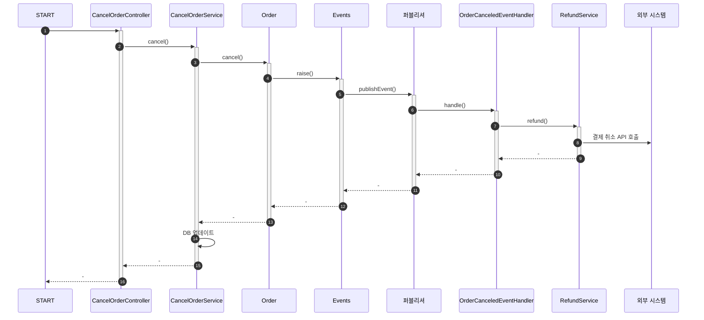
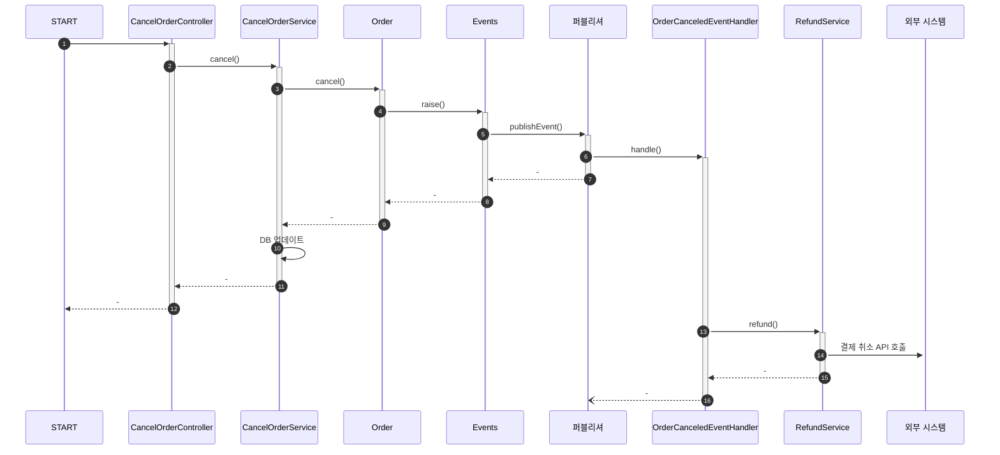

이 포스트에서는 아래 내용에 대해 알아본다.

- 비동기 이벤트 처리

> 소스는 [github](https://github.com/assu10/ddd/tree/feature/chap10)  에 있습니다.

> 매핑되는 테이블은 [DDD - ERD](https://assu10.github.io/dev/2024/04/08/ddd-table/) 을 참고하세요.

---

**목차**

<!-- TOC -->
* [1. 동기 이벤트 처리 문제](#1-동기-이벤트-처리-문제)
* [2. 비동기 이벤트 처리](#2-비동기-이벤트-처리)
  * [2.1. 로컬 핸들러 비동기 실행: `@Async`, `@EnableAsync`](#21-로컬-핸들러-비동기-실행-async-enableasync)
  * [2.2. 메시징 시스템을 이용한 비동기 구현: Kafka, RabbitMQ, 글로벌 트랜잭션](#22-메시징-시스템을-이용한-비동기-구현-kafka-rabbitmq-글로벌-트랜잭션)
  * [2.3. 이벤트 저장소를 이용한 비동기 처리](#23-이벤트-저장소를-이용한-비동기-처리)
    * [2.3.1. 이벤트 저장소 구현](#231-이벤트-저장소-구현)
    * [2.3.2. 이벤트 저장을 위한 이벤트 핸들러 구현](#232-이벤트-저장을-위한-이벤트-핸들러-구현)
    * [2.3.3. REST API 구현](#233-rest-api-구현)
    * [2.3.4. 포워더 구현: `@Scheduled`](#234-포워더-구현-scheduled)
* [3. 이벤트 적용 시 추가 고려 사항](#3-이벤트-적용-시-추가-고려-사항)
  * [3.1. 이벤트 처리와 DB 트랜잭션 고려: `@TransactionalEventListener`](#31-이벤트-처리와-db-트랜잭션-고려-transactionaleventlistener)
* [4. autoincrement 컬럼 사용 시 주의사항](#4-autoincrement-컬럼-사용-시-주의사항)
* [참고 사이트 & 함께 보면 좋은 사이트](#참고-사이트--함께-보면-좋은-사이트)
<!-- TOC -->

---

**개발 환경**

- 언어: java
- Spring Boot ver: 3.2.5
- Spring ver: 6.1.6
- IDE: intelliJ
- SDK: JDK 17
- 의존성 관리툴: Maven

---

pom.xml
```xml
<?xml version="1.0" encoding="UTF-8"?>
<project xmlns:xsi="http://www.w3.org/2001/XMLSchema-instance" xmlns="http://maven.apache.org/POM/4.0.0"
         xsi:schemaLocation="http://maven.apache.org/POM/4.0.0 https://maven.apache.org/xsd/maven-4.0.0.xsd">
  <modelVersion>4.0.0</modelVersion>
  <parent>
    <groupId>org.springframework.boot</groupId>
    <artifactId>spring-boot-starter-parent</artifactId>
    <version>3.2.5</version>
    <relativePath/> <!-- lookup parent from repository -->
  </parent>
  <groupId>com.assu</groupId>
  <artifactId>ddd_me</artifactId>
  <version>0.0.1-SNAPSHOT</version>
  <name>ddd</name>
  <description>Demo project for Spring Boot</description>
  <properties>
    <java.version>17</java.version>
  </properties>
  <dependencies>
    <dependency>
      <groupId>org.springframework.boot</groupId>
      <artifactId>spring-boot-starter-web</artifactId>
    </dependency>

    <dependency>
      <groupId>org.springframework.boot</groupId>
      <artifactId>spring-boot-starter-test</artifactId>
      <scope>test</scope>
    </dependency>
    <dependency>
      <groupId>org.projectlombok</groupId>
      <artifactId>lombok</artifactId>
      <scope>annotationProcessor</scope>
    </dependency>
    <dependency>
      <groupId>org.springframework.boot</groupId>
      <artifactId>spring-boot-starter-data-jpa</artifactId>
    </dependency>
    <!-- https://mvnrepository.com/artifact/org.hibernate/hibernate-jpamodelgen -->
    <dependency>
      <groupId>org.hibernate</groupId>
      <artifactId>hibernate-jpamodelgen</artifactId>
      <version>6.5.2.Final</version>
      <type>pom</type>
      <!--            <scope>provided</scope>-->
    </dependency>
    <!-- https://mvnrepository.com/artifact/com.mysql/mysql-connector-j -->
    <dependency>
      <groupId>com.mysql</groupId>
      <artifactId>mysql-connector-j</artifactId>
      <version>8.4.0</version>
    </dependency>
    <dependency>
      <groupId>org.springframework.boot</groupId>
      <artifactId>spring-boot-devtools</artifactId>
      <scope>runtime</scope>
    </dependency>

  </dependencies>

  <build>
    <plugins>
      <plugin>
        <groupId>org.springframework.boot</groupId>
        <artifactId>spring-boot-maven-plugin</artifactId>
      </plugin>
      <plugin>
        <groupId>org.bsc.maven</groupId>
        <artifactId>maven-processor-plugin</artifactId>
        <version>2.0.5</version>
        <executions>
          <execution>
            <id>process</id>
            <goals>
              <goal>process</goal>
            </goals>
            <phase>generate-sources</phase>
            <configuration>
              <processors>
                <processor>org.hibernate.jpamodelgen.JPAMetaModelEntityProcessor</processor>
              </processors>
            </configuration>
          </execution>
        </executions>
        <dependencies>
          <dependency>
            <groupId>org.hibernate</groupId>
            <artifactId>hibernate-jpamodelgen</artifactId>
            <version>6.5.2.Final</version>
          </dependency>
        </dependencies>
      </plugin>
    </plugins>
  </build>

</project>
```

```properties
spring.application.name=ddd
spring.datasource.url=jdbc:mysql://localhost:13306/shop?characterEncoding=utf8
spring.datasource.username=root
spring.datasource.password=
spring.datasource.driver-class-name=com.mysql.cj.jdbc.Driver
spring.datasource.hikari.maximum-pool-size=10
spring.jpa.database=mysql
spring.jpa.show-sql=true
spring.jpa.hibernate.naming.physical-strategy=org.hibernate.boot.model.naming.PhysicalNamingStrategyStandardImpl
spring.jpa.open-in-view=false
logging.level.root=INFO
logging.level.com.myshop=DEBUG
logging.level.org.springframework.security=DEBUG
```

---

# 1. 동기 이벤트 처리 문제

[DDD - 이벤트(1): 이벤트, 핸들러, 디스패처](https://assu10.github.io/dev/2024/04/28/ddd-event-1/) 에서 이벤트를 사용하여 강결합 문제를 해결하였다.

하지만 외부 서비스에 영향을 받는다는 문제는 아직 그대로 남아있다.

응용 서비스 코드
```java
package com.assu.study.order.command.application;

import com.assu.study.order.NoOrderException;
import com.assu.study.order.command.domain.*;
import lombok.RequiredArgsConstructor;
import org.springframework.stereotype.Service;
import org.springframework.transaction.annotation.Transactional;

@RequiredArgsConstructor
@Service
public class CancelOrderService {
  private final OrderRepository orderRepository;
  private final CancelPolicy cancelPolicy;

  @Transactional
  public void cancel(OrderNo orderNo, Canceller canceller) {
    Order order = orderRepository.findById(orderNo)
            .orElseThrow(() -> new NoOrderException());
    if (!cancelPolicy.hasCancellationPermission(order, canceller)) {
      throw new NoCancellablePermission();
    }

    // order.cancel() 에서 OrderCanceledEvent 발생
    // 만일 외부 연동 과정에서 예외 발생 시 트랜잭션 처리를 어떻게 할 것인지?
    order.cancel(); 
  }
}
```

이벤트를 처리하는 코드
```java
package com.assu.study.order.infra;

import com.assu.study.order.command.application.RefundService;
import com.assu.study.order.command.domain.OrderCanceledEvent;
import lombok.RequiredArgsConstructor;
import org.springframework.context.event.EventListener;
import org.springframework.stereotype.Service;

// OrderCanceledEvent 처리하는 핸들러
@RequiredArgsConstructor
@Service
public class OrderCanceledEventHandler {
    private final RefundService refundService;

    @EventListener(OrderCanceledEvent.class)
    public void handle(OrderCanceledEvent event) {
        
        // refundService.refund() 가 느려지거나 예외가 발생하면 어떻게 처리할지?
        refundService.refund(event.getOrderNumber());
    }
}
```

_refundService.refund()_ 가 외부 환불 서비스와 연동된다고 했을 때 만일 외부 환불 서비스가 느려지면 _order.cancel()_ 도 함께 느려진다.  
이것은 **외부 서비스의 성능 저하가 내 시스템의 성능 저하로 연결된다는 것을 의미**한다.

**성능 저하 뿐 아니라 트랜잭션도 문제**가 된다.

_refundService.refund()_ 에서 예외가 발생했을 때 _order.cancel()_ 메서드의 트랜잭션을 롤백할 것인가?  
트랜잭션을 롤백하면 구매 취소 기능을 롤백하는 것이므로 구매 취소가 실패하는 것과 같다.

외부 환불 서비스 실행에 실패했다고 해서 트랜잭션을 롤백하는 것이 아니라 일단 구매 취소 자체는 처리하고 환불만 재처리하거나 수동으로 처리할 수도 있다.

이렇게 **외부 시스템과의 연동을 동기로 처리할 때 발생하는 성능과 트랜잭션 범위 문제를 해소하는 방법은 2가지**가 있다.

- **이벤트를 비동기로 처리**
- **이벤트와 트랜잭션을 연계**

---

# 2. 비동기 이벤트 처리

회원 가입 신청을 하면 검증을 위해 이메일을 보내는 경우가 있다.  
회원 가입 신청을 하자마자 바로 검증 이메일이 도착할 필요는 없다. 10~20초 뒤에 도착해도 된다.

비슷하게 주문을 취소하자마자 바로 결제 취소를 하지 않아도 된다.  
수십초 혹은 며칠 뒤에 결제 취소가 되어도 된다.

구현해야 하는 기능 중 _'A 하면 이어서 B 를 해야 함'_ 의 요구사항은 실제로는 _'A 하면 최대 언제까지 B 를 해야 함'_ 인 경우가 많다.  
즉, 일정 시간 안에만 후속 조치를 하면 되는 경우가 적지 않다.  
또한 B 를 실패하면 일정 간격으로 재시도를 하거나 수동 처리를 해도 괜찮은 경우가 있다.

_'A 하면 일정 시간안에 B 를 해야 함'_ 를 _'회원 가입 신청 시 인증 이메일을 보내라'_ 에 대입하여 생각해볼 때 아래와 같이 볼 수 있다.
- _'A 하면'_ = _'회원 가입 신청을 하면'_ = _'회원 가입 신청함 이벤트'_
- _'B 를 해야 함'_ = _'인증 이메일을 보내야 함'_ = _'회원 가입 신청함 이벤트를 처리하는 핸들러'_

**_'A 하면 최대 언제까지 B 를 해야 함'_ 의 요구사항은 이벤트를 비동기로 처리하는 방식으로 구현**할 수 있다.

즉, **A 이벤트가 발생하면 별도 스레드로 B 를 수행하는 핸들러를 실행하는 방식으로 요구사항을 구현**할 수 있다.

<**이벤트를 비동기로 구현하는 방법**>  
- 로컬 핸들러를 비동기로 실행
- 메시지 큐 사용
- 이벤트 저장소와 이벤트 포워더 사용
- 이벤트 저장소와 이벤트 제공 API 사용

각각 구현 방식과 장단점이 있는데 이제 하나씩 살펴보자.

---

## 2.1. 로컬 핸들러 비동기 실행: `@Async`, `@EnableAsync`

이벤트 핸들러를 비동기로 실행하는 방법은 이벤트 핸들러를 별도 스레드로 실행하는 것이다.

- `@EnableAsync` 애너테이션을 사용하여 비동기 기능 활성화
- 이벤트 핸들러 메서드에 `@Async` 애너테이션 적용

`@EnableAsync` 애너테이션은 스프링의 비동기 실행 기능을 활성화한다.

> `@Async`, `@EnableAsync` 애너테이션 사용 시 주의할 점은 [4. `@Async` 애너테이션을 사용한 비동기 이벤트 처리: `@Async`, `@EnableAsync`](https://assu10.github.io/dev/2023/10/15/springboot-event/#4-async-%EC%95%A0%EB%84%88%ED%85%8C%EC%9D%B4%EC%85%98%EC%9D%84-%EC%82%AC%EC%9A%A9%ED%95%9C-%EB%B9%84%EB%8F%99%EA%B8%B0-%EC%9D%B4%EB%B2%A4%ED%8A%B8-%EC%B2%98%EB%A6%AC-async-enableasync) 을 참고하세요.

```java
import org.springframework.context.annotation.Bean;
import org.springframework.context.annotation.Configuration;
import org.springframework.scheduling.annotation.AsyncConfigurer;
import org.springframework.scheduling.annotation.EnableAsync;
import org.springframework.scheduling.concurrent.ThreadPoolTaskExecutor;

import java.util.concurrent.Executor;

@EnableAsync    // 비동기 기능 활성화
@Configuration
public class SampleAsyncExecutionConfig implements AsyncConfigurer {
  // 프레임워크가 스레드 풀을 설정할 때 사용하는 콜백 메서드
  @Override
  public Executor getAsyncExecutor() {
    return getExecutor();
  }

  private Executor getExecutor() {
    ThreadPoolTaskExecutor threadPoolTaskExecutor = new ThreadPoolTaskExecutor();
    // 기본 개수는 10개
    threadPoolTaskExecutor.setCorePoolSize(10);
    // 최대 10개까지 늘어남
    threadPoolTaskExecutor.setMaxPoolSize(10);
    threadPoolTaskExecutor.setThreadNamePrefix("asyncExecutor-");
    // 컨테이너가 모든 속성값을 적용한 후 initialize() 호출
    threadPoolTaskExecutor.afterPropertiesSet();
    return threadPoolTaskExecutor;
  }

  @Bean("asyncExecutor")
  public Executor asyncExecutor() {
    return getExecutor();
  }
}
```

이제 비동기로 실행할 이벤트 핸들러 메서드에 `@Async` 애너테이션만 붙이면 된다.

OrderCanceledEventHandler.java
```java
package com.assu.study.order.infra;

import com.assu.study.order.command.application.RefundService;
import com.assu.study.order.command.domain.OrderCanceledEvent;
import lombok.RequiredArgsConstructor;
import org.springframework.context.event.EventListener;
import org.springframework.scheduling.annotation.Async;
import org.springframework.stereotype.Service;

// OrderCanceledEvent 처리하는 핸들러
@RequiredArgsConstructor
@Service
public class OrderCanceledEventHandler {
    private final RefundService refundService;

    @Async
    @EventListener(OrderCanceledEvent.class)
    public void handle(OrderCanceledEvent event) {
        refundService.refund(event.getOrderNumber());
    }
}
```

스프링은 _OrderCanceledEvent_ 가 발생하면 _handle()_ 메서드를 별도 스레드를 이용하여 비동기로 실행한다.

---

## 2.2. 메시징 시스템을 이용한 비동기 구현: Kafka, RabbitMQ, 글로벌 트랜잭션

Kafka 나 RabbitMQ 와 같은 메시징 시스템을 사용하여 이벤트를 비동기로 처리할 수 있다.


이벤트가 발생하면 이벤트 디스패처는 이벤트를 메시지 큐에 보낸다.  
메시지 큐는 이벤트를 메시지 리스너에 전달하고, 메시지 리스터는 알맞은 이벤트 핸들러를 이용하여 이벤트를 처리한다.  
이 때 **'이벤트를 메시지 큐에 저장하는 과정'과 '메시지 큐에서 이벤트를 읽어와 처리하는 과정'은 별도 스레드나 프로세스로 처리**된다.

---

필요하다면 이벤트를 발생시키는 도메인 기능과 메시지 큐에 이벤트를 저장하는 절차를 한 트랜잭션으로 묶어야 한다.  
**도메인 기능을 실행한 결과를 DB 에 반영하고 이 과정에서 발생한 이벤트를 메시지 큐에 저장하는 것을 같은 트랜잭션 범위에서 실행하려면 글로벌 트랜잭션이 필요**하다.

글로벌 트랜잭션을 사용하면 안전하게 이벤트를 메시지 큐에 전달할 수 있는 장점이 있는 반면 글로벌 트랜잭션으로 인해 전체 성능이 떨어지는 단점도 있다.  
글로벌 트랜잭션을 지원하지 않는 메시징 시스템도 있다.

- **RabbitMQ**
  - 글로벌 트랜잭션 지원
  - 클러스터와 고가용성을 지원하기 때문에 안정적으로 메시지 전달 가능
- **Kafka**
  - 글로벌 트랜잭션 지원하지 않음
  - 다른 메시징 시스템에 비해 높은 성능을 보여줌

---

**메시지 큐를 사용하면 보통 '이벤트를 발생시키는 주체'와 '이벤트 핸들러'가 별도 프로세스에서 동작**한다.  
이것은 이벤트 발생 JVM 과 이벤트 처리 JVM 이 다르다는 것을 의미한다.  

물론 하나의 JVM 에서 이벤트 발생 주체와 이벤트 핸들러가 메시지 큐를 이용하여 이벤트를 주고 받을 수 있지만 동일한 JVM 에서 비동기 처리를 위해 메시지 큐를 사용하는 것은 
시스템을 복잡하게 만들 뿐이다.

---

## 2.3. 이벤트 저장소를 이용한 비동기 처리

이벤트를 비동기로 처리하는 또 다른 방법은 이벤트를 일단 DB 에 저장한 뒤 별도 프로그램 (포워더 혹은 REST API) 을 이용하여 이벤트 핸들러에 전달하는 것이다.

**이벤트 저장소와 포워더를 사용하는 비동기 처리 흐름**은 아래와 같다.


이벤트가 발생하면 핸들러는 저장소에 이벤트를 저장한다.  
포워더는 주기적으로 이벤트 저장소에서 이벤트를 가져와 이벤트 핸들러를 실행한다.  
포워더는 별도 스레드를 이용하기 때문에 이벤트 발행과 처리가 비동기로 처리된다.

**이 방식은 도메인의 상태와 이벤트 저장소로 동일한 DB 를 사용**한다.  
**즉, 도메인의 상태 변화와 이벤트 저장이 로컬 트랜잭션으로 처리**된다.

**이벤트를 물리적인 저장소에 보관하기 때문에 이벤트 핸들러가 이벤트 처리에 실패할 경우 포워더는 다시 이벤트 저장소에서 이벤트를 읽어와 핸들러를 실행**하면 된다.

---

**이벤트 저장소를 이용한 다른 방법은 이벤트를 외부에 제공하는 API 를 사용**하는 것이다.


**API 방식과 포워더 방식은 이벤트를 전달하는 방식에서 차이**가 있다.

- **포워더 방식**
  - 포워더를 이용하여 이벤트를 외부에 전달
  - 이벤트를 어디까지 처리했는지 추적하는 역할을 포워더가 함
- **API 방식**
  - 외부 핸들러가 API 서버를 통해 이벤트 목록을 가져감
  - 이벤트를 어디까지 처리했는지 추적하는 역할을 외부 핸들러가 함


---

### 2.3.1. 이벤트 저장소 구현

포워더 방식과 API 방식 모두 이벤트 저장소를 사용한다.

이벤트 저장소를 구현한 코드 구조는 아래와 같다.


- _EventEntry_
  - 이벤트 저장소에 보관할 데이터
  - id: 이벤트 식별
  - type: 이벤트 타입
  - contentType: 직려롸한 데이터 형식
  - payload: 이벤트 데이터 자체
  - timestamp: 이벤트 시간
- _EventStore_
  - 이벤트를 저장하고 조회하는 인터페이스
- _JdbcEventStore_
  - JDBC 를 이용한 _EventStore_ 구현 클래스
- _EventApi_
  - REST API 를 이용하여 이벤트 목록을 제공하는 컨트롤러

EventEntry.java
```java
package com.assu.study.eventstore.api;

import lombok.Getter;


// 이벤트 저장소에 보관할 데이터
@Getter
public class EventEntry {
  private Long id;    // 이벤트 식별자
  private String type;    // 이벤트 타입
  private String contentType; // 직렬화한 데이터 형식
  private String payload; // 이벤트 데이터 자체
  private long timestamp; // 이벤트 시간

  public EventEntry(String type, String contentType, String payload) {
    this.type = type;
    this.contentType = contentType;
    this.payload = payload;
    this.timestamp = System.currentTimeMillis();
  }

  public EventEntry(Long id, String type, String contentType, String payload) {
    this.id = id;
    this.type = type;
    this.contentType = contentType;
    this.payload = payload;
    this.timestamp = System.currentTimeMillis();
  }
}
```

_EventStore_ 는 이벤트 객체를 직렬화하여 _payload_ 에 저장한다.

이벤트는 과거에 벌어진 사건이므로 데이터가 변경되지 않는다.  
따라서 _EventStore_ 인터페이스는 새로운 이벤트를 추가하는 기능과 조회하는 기능만 제공하고, 기존 이벤트 데이터를 수정하는 기능을 제공하지 않는다.

EventStore.java
```java
package com.assu.study.eventstore.api;

import java.util.List;

// 이벤트 객체를 직렬화하여 EventEntry 의 payload 에 저장하는 인터페이스
// 이벤트를 저장하고 조회하는 인터페이스 제공
public interface EventStore {
    void save(Object event);

    List<EventEntry> get(long offset, long limit);
}
```

JdbcEventStore.java
```java
package com.assu.study.eventstore.infra;

import com.assu.study.eventstore.api.EventEntry;
import com.assu.study.eventstore.api.EventStore;
import com.assu.study.eventstore.api.PayloadConvertException;
import com.fasterxml.jackson.core.JsonProcessingException;
import com.fasterxml.jackson.databind.ObjectMapper;
import lombok.RequiredArgsConstructor;
import org.springframework.http.MediaType;
import org.springframework.jdbc.core.JdbcTemplate;
import org.springframework.stereotype.Component;

import java.sql.Timestamp;
import java.util.List;


// JDBC 를 이용한 EventStore 구현 클래스
@RequiredArgsConstructor
@Component
public class JdbcEventStore implements EventStore {

  private final ObjectMapper objectMapper;
  private final JdbcTemplate jdbcTemplate;

  @Override
  public void save(Object event) {
    // EventEntry 객체 생성
    // event 객체를 JSON 문자열로 변환하여 payload 에 전달
    EventEntry entry = new EventEntry(event.getClass().getName(), MediaType.APPLICATION_JSON_VALUE, toJson(event));

    jdbcTemplate.update(
            "INSERT INTO evententry (type, content_type, payload, timestamp) " +
                    "VALUES (?, ?, ?, ?)",
            ps -> {
              ps.setString(1, entry.getType());
              ps.setString(2, entry.getContentType());
              ps.setString(3, entry.getPayload());
              ps.setTimestamp(4, new Timestamp(entry.getTimestamp()));
            }
    );
  }

  private String toJson(Object event) {
    try {
      return objectMapper.writeValueAsString(event);
    } catch (JsonProcessingException e) {
      throw new PayloadConvertException(e);
    }
  }

  @Override
  public List<EventEntry> get(long offset, long limit) {
    return jdbcTemplate.query(
            "SELECT * FROM evententry ORDER BY id ASC LIMIT ?, ?",
            ps -> {
              ps.setLong(1, offset);
              ps.setLong(2, limit);
            },
            (rs, rowNum) -> new EventEntry(
                    rs.getLong("id"),
                    rs.getString("type"),
                    rs.getString("content_type"),
                    rs.getString("payload"),
                    rs.getTimestamp("timestamp").getTime()
            )
    );
  }
}
```

PayloadConvertException.java
```java
package com.assu.study.eventstore.api;

public class PayloadConvertException extends RuntimeException {
    public PayloadConvertException(Exception e) {
        super(e);
    }
}
```

---

### 2.3.2. 이벤트 저장을 위한 이벤트 핸들러 구현

EventStoreHandler.java
```java
package com.assu.study.common.event;

import com.assu.study.eventstore.api.EventStore;
import lombok.RequiredArgsConstructor;
import org.springframework.context.event.EventListener;
import org.springframework.stereotype.Component;

@RequiredArgsConstructor
@Component
public class EventStoreHandler {
    private final EventStore eventStore;

    // 모든 이벤트가 공통으로 갖는 프로퍼티를 갖는 공통 추상 클래스인 Event 타입을 상속받은
    // 이벤트 타입만 이벤트 저장소에 보관하기 위해 @EventListener 애너테이션에 값으로 Event.class 설정
    @EventListener(Event.class)
    public void handle(Event event) {
        eventStore.save(event);
    }
}
```

---

### 2.3.3. REST API 구현

REST API 는 _offset_, _limit_ 이 웹 요청 파라메터를 이용하여 _EventStore#get()_ 에 실어보내고, 그 결과를 JSON 으로 리턴하면 된다.

**클라이언트 API 를 이용해서 언제든지 원하는 이벤트를 가져올 수 있기 때문에 이벤트 처리에 실패하면 다시 실패한 이벤트로부터 읽어와서 이벤트를 재처리**할 수 있다.  
**API 서버에 장애가 발생한 경우에도 주기적으로 재시도를 해서 API 서버가 살아나면 이벤트를 처리**할 수 있다.

EventApi.java
```shell
package com.assu.study.eventstore.ui;

import com.assu.study.eventstore.api.EventEntry;
import com.assu.study.eventstore.api.EventStore;
import lombok.RequiredArgsConstructor;
import org.springframework.web.bind.annotation.GetMapping;
import org.springframework.web.bind.annotation.RequestParam;
import org.springframework.web.bind.annotation.RestController;

import java.util.List;

@RequiredArgsConstructor
@RestController
public class EventApi {
    private final EventStore eventStore;

    @GetMapping("/api/events")
    public List<EventEntry> list(
            @RequestParam("offset") Long offset,
            @RequestParam("limit") Long limit
    ) {
        return eventStore.get(offset, limit);
    }
}
```

```shell
$ curl -X GET --location -u user:86c5dc43-1246-4242-b4e7-c9704cacf894 "http://localhost:8080/api/events?offset=0&limit=10" | jq

[
  {
    "id": 1,
    "type": "com.myshop.eventstore.infra.SampleEvent",
    "contentType": "application/json",
    "payload": "{\"name\": \"name1\", \"value\": 11}",
    "timestamp": 1720913941000
  },
  {
    "id": 2,
    "type": "com.myshop.eventstore.infra.SampleEvent",
    "contentType": "application/json",
    "payload": "{\"name\": \"name2\", \"value\": 12}",
    "timestamp": 1720913941000
  },
  {
    "id": 3,
    "type": "com.myshop.eventstore.infra.SampleEvent",
    "contentType": "application/json",
    "payload": "{\"name\": \"name3\", \"value\": 13}",
    "timestamp": 1720913941000
  },
  {
    "id": 4,
    "type": "com.myshop.eventstore.infra.SampleEvent",
    "contentType": "application/json",
    "payload": "{\"name\": \"name4\", \"value\": 14}",
    "timestamp": 1720913941000
  }
]
```

API 를 사용하는 클라이언트는 일정 간격으로 아래 과정을 실행한다.

- 가장 마지막에 처리한 데이터의 offset 인 lastOffset 을 구함, 저장한 lastOffset 이 없으면 0 을 사용
- 마지막에 처리한 lastOffset 을 offset 으로 사용하여 API 실행
- API 결과로 받은 데이터 처리
- offset + 데이터 갯수를 lastOffset 으로 저장

---

### 2.3.4. 포워더 구현: `@Scheduled`

포워더도 위의 API 방식의 클라이언트 구현과 유사하다.

**포워더는 일정 주기로 _EventStore_ (이벤트를 저장하고 조회하는 인터페이스) 에서 이벤트를 읽어와 이벤트 핸들러에 전달**하면 된다.

API 방식의 클라이언트와 마찬가지로 **마지막으로 전달한 이벤트의 offset 을 기억해두었다가 다음 조회 시점에 마지막으로 처리한 offset 부터 이벤트를 가져오면 된다.**

EventForwarder.java
```java
package com.assu.study.integration;

import com.assu.study.eventstore.api.EventEntry;
import com.assu.study.eventstore.api.EventStore;
import lombok.RequiredArgsConstructor;
import org.springframework.scheduling.annotation.Scheduled;
import org.springframework.stereotype.Component;

import java.util.List;

@RequiredArgsConstructor
@Component
public class EventForwarder {
    private static final int DEFAULT_LIMIT_SIZE = 100;
    private final EventStore eventStore;    // 이벤트를 저장하고 조회하는 인터페이스
    private final OffsetStore offsetStore;
    private final EventSender eventSender;
    private int limitSize = DEFAULT_LIMIT_SIZE;

    @Scheduled(initialDelay = 1000L, fixedDelay = 1000L)
    public void getAndSend() {
        // 읽어올 이벤트의 다음 offset 조회
        long nextOffset = getNextOffset();

        // 이벤트 저장소에서 offset 부터 limitSize 만큼 이벤트 구함
        List<EventEntry> events = eventStore.get(nextOffset, limitSize);
        
        // 구한 이벤트가 존재하는지 검사
        if (!events.isEmpty()) {
            // 이벤트 전송
            int processedCount = sendEvent(events);

            // 처리한 이벤트 개수가 0보다 크면 ㅁ다음에 읽어올 offset 저장
            if (processedCount > 0) {
                saveNextOffset(nextOffset + processedCount);
            }
        }
    }

    private long getNextOffset() {
        return offsetStore.get();
    }

    private int sendEvent(List<EventEntry> events) {
        int processedCount = 0;

        // 이벤트를 차례대로 발송함
        // 예외가 발생하면 이벤트 전송을 멈추고 전송에 성공한 이벤트의 개수 리턴
        // 따라서 다음번 getAndSend() 메서드를 실행하면 
        // 마지막으로 전송에 성공한 이벤트의 다음 이벤트부터 읽어와서 전송 시도
        try {
            for (EventEntry entry : events) {
                eventSender.send(entry);
                processedCount++;
            }
        } catch (Exception e) {
            // 로깅 처리
        }
        return processedCount;
    }

    private void saveNextOffset(long nextOffset) {
        offsetStore.update(nextOffset);
    }
}
```

OffsetStore.java
```java
package com.assu.study.integration;

// OffsetStore 를 구현하는 클래스는 offset 값을 DB 에 저장하거나 로컬 파일에 보관하여 
// 마지막 offset 값을 물리적 저장소에 보관해야 함
public interface OffsetStore {
    long get();

    void update(long nextOffset);
}
```

MemoryOffsetStore.java
```java
package com.assu.study.integration.infra;

import com.assu.study.integration.OffsetStore;
import org.springframework.stereotype.Component;

@Component
public class MemoryOffsetStore implements OffsetStore {
    private long nextOffset = 0;

    @Override
    public long get() {
        return nextOffset;
    }

    @Override
    public void update(long nextOffset) {
        this.nextOffset = nextOffset;
    }
}
```

EventSender.java
```java
package com.assu.study.integration;

import com.assu.study.eventstore.api.EventEntry;

// 이 인페이스를 구현하는 클래스는 send() 메서드에서 외부 메시징 시스템에 이벤트를 전송하거나
// 원하는 핸들러에 이벤트를 전달하면 됨

// 이벤트 처리 중 예외가 발생하면 그대로 전파하여 다으 주기에 getAndSend() 메서드를 실행할 때 재처리할 수 있도록 해야 함
public interface EventSender {
    void send(EventEntry event);
}
```

SysoutEventSender.java
```java
package com.assu.study.integration.infra;

import com.assu.study.eventstore.api.EventEntry;
import com.assu.study.integration.EventSender;
import lombok.extern.slf4j.Slf4j;
import org.springframework.stereotype.Component;

@Slf4j
@Component
public class SysoutEventSender implements EventSender {
    @Override
    public void send(EventEntry event) {
        log.info("EventSender send event: {}", event);
    }
}
```

---

# 3. 이벤트 적용 시 추가 고려 사항

이벤트 구현 시 추가로 고려할 점들이 잇다.

- **이벤트 소스를 _EventEntry_ 추가할 지 여부**
  - 위에서 구현한 _EventEntry_ 는 이벤트 발생 주체에 대한 정보를 갖고 있지 않음
  - 따라서 'Order' 가 발생시킨 이벤트만 조회' 와 같은 특정 주체가 발생시킨 이벤트만 조회하는 기능은 구현 ㅂㄹ가함
  - 이 기능을 구현하려면 이벤트에 발생 주체 정보를 추가해야 함
- **포워더에서 전송 실패를 얼마나 허용할 것인지**
  - 포워더는 이벤트 전송에 실패하면 실패한 이벤트부터 다시 읽어와 전송을 시도하는데 특정 이벤트에서 계속 전송에 실패한다면?
  - 포워더를 구현할 때는 실패한 이벤트의 재전송 횟수 제한을 두어야 함
  - 예를 들어 전송 3회 실패 시 해당 이벤트는 생략하고 다음 이벤트로 넘어가는 등의 방식으로...
  - 처리에 실패한 이벤트를 생략하지 않고 별도 실패용 DB 나 메시지 큐에 저장하는 등 처리에 실패한 이벤트를 물리적 저장소에 남겨두면 이후 원인 분석과 후처리에 도움이 됨
- **이벤트 손실**
  - 이벤트 저장소를 사용하는 방식은 이벤트 발생과 이벤트 저장을 한 트랜잭션으로 처리하므로 트랜잭션에 성공하면 이벤트가 저장소에 보관된다는 것을 보장할 수 있음
  - 반면 로컬 핸들러를 이용하여 이벤트를 비동기로 처리할 경우 이벤트 처리에 실패하면 이벤트를 유실하게 됨
- **이벤트 순서**
  - 이벤트 저장소는 저장소에 이벤트를 발생 순서대로 저장하고 그 순서대로 이벤트 목록을 제공하므로 이벤트 발생 순서대로 외부 시스템에 전달해야 한다면 이벤트 저장소를 사용하는 것이 좋음
  - 반면 메시징 시스템은 사용 기술에 따라 이벤트 발생 순서와 메시지 전달 순서가 다를 수 있음
- **이벤트 재처리**
  - 동일한 이벤트를 재처리해야할 때 이벤트를 어떻게 할지에 대한 결정이 필요함
  - 예를 들어 회원 가입 신청 이메일 발송 시 동일한 순번의 이벤트가 다시 들어오면 이메일을 발송하지 않는 방식으로 구현
  - 이 외에 이벤트를 멱등적으로 처리하는 방식도 있음

> **멱등성**  
> 
> 연산을 여러 번 적용해도 결과가 달라지지 않는 성질을 말함
> 
> 예를 들어 배송지 정보 변경 이벤트를 받아서 주소를 변경하는 핸들러는 그 이벤트를 한 번 처리하나 여러 번 처리하나 결과적으로 동일한 주소값을 가짐  
> 같은 이벤트를 여러 번 적용해도 결과가 같으므로 이 이벤트 핸들러는 멱등성을 가짐
> 
> **이벤트 핸들러가 멱등성을 가지면 시스템 장애로 인해 같은 이벤트가 중복해서 발생해도 결과적으로 동일 상태가 되므로 유지 보수가 쉬움**

---

## 3.1. 이벤트 처리와 DB 트랜잭션 고려: `@TransactionalEventListener`

이벤트를 처리할 때는 DB 트랜잭션을 함께 고려해야 한다.

예를 들어 주문 취소와 환불 기능을 보자.

- 주문 취소 기능은 주문 취소 이벤트를 발생시킴
- 주문 취소 이벤트 핸들러는 환불 서비스에 환불 처리를 요청함
- 환불 서비스는 외부 API 를 호출하여 결제를 취소함

**이벤트 발생과 처리를 모두 동기로 처리하면 흐름**은 아래와 같다.


만일 위에서 13 의 과정까지 다 성공하고 **14 과정에서 DB 를 업데이트하는 데 실패한다면 나머지는 다 성공해서 결제는 취소되었는데 DB 에는 주문이 취소되지 
않은 상태**로 남게 된다.

---

**이벤트를 비동기로 처리할 때도 DB 트랜잭션을 고려**해야 한다.

이벤트를 비동기로 처리할 때의 실행 흐름


위 그림은 주문 취소 이벤트를 비동기로 처리할 때의 실행 흐름이다.

이벤트 핸들러를 호출하는 6번 _handle()_ 과정은 비동기로 실행한다.  
DB 업데이트와 트랜잭션을 다 커밋한 뒤에 환불 로직인 13~15 과정을 실행한다고 하자.  
만일 14번 과정에서 **외부 API 호출에 실패하면 DB 는 주문이 취소된 상태로 데이터가 변경되었지만 결제는 취소되지 않은 상태**로 남게 된다.

---

**이벤트 처리를 동기로 하든 비동기로 하든 이벤트 처리 실패와 트랜잭션 실패를 모두 고려**해야 한다.

트랜잭션 실패와 이벤트 처리 실패를 모두 고려하면 복잡해지므로 경우의 수를 줄이면 되는데 경우의 수를 줄이는 방법은 **트랜잭션이 성공할 때만 이벤트 핸들러를 실행하는 것**이다.

스프링은 `@TransactionalEventListener` 애너테이션을 지원한다.

`@TransactionalEventListener` 애너테이션은 스프링 트랜잭션 상태에 따라 이벤트 핸들러를 실행할 수 있게 한다.

OrderCanceledEventHandler.java
```java
package com.assu.study.order.infra;

import com.assu.study.order.command.application.RefundService;
import com.assu.study.order.command.domain.OrderCanceledEvent;
import lombok.RequiredArgsConstructor;
import org.springframework.scheduling.annotation.Async;
import org.springframework.stereotype.Service;
import org.springframework.transaction.event.TransactionPhase;
import org.springframework.transaction.event.TransactionalEventListener;

// OrderCanceledEvent 처리하는 핸들러
@RequiredArgsConstructor
@Service
public class OrderCanceledEventHandler {
    private final RefundService refundService;

    @Async
    //@EventListener(OrderCanceledEvent.class)
    @TransactionalEventListener(
            classes = OrderCanceledEvent.class,
            phase = TransactionPhase.AFTER_COMMIT   // 트랜잭션 커밋이 성공한 뒤 핸들러 메서드 실행
    )
    public void handle(OrderCanceledEvent event) {
        refundService.refund(event.getOrderNumber());
    }
}
```

**phase 속성으로 `TransactionPhase.AFTER_COMMIT` 을 지정하면 스프링은 트랜잭션 커밋이 성공한 뒤에 핸들러 메서드를 실행**한다.

중간에 에러가 발생해서 트랜잭션이 롤백되면 핸들러 메서드는 실행되지 않는다.  
**이 기능을 사용하면 이벤트 핸들러를 실행했는데 트랜잭션이 롤백되는 상황은 발생하지 않는다.**

이벤트 저장소로 DB 를 사용해도 동일한 효과가 있다.  
이벤트 발생 코드와 이벤트 저장 처리를 한 트랜잭션으로 처리하면 된다.  
그러면 트랜잭션이 성공할 때만 이벤트가 DB 에 저장되므로 트랜잭션은 실패했는데 이벤트 핸들러가 실행되는 상황은 발생하지 않는다.

트랜잭션이 성공할 때만 이벤트 핸들러를 실행하게 되면 트랜잭션 실패에 대한 경우의 수가 줄어들어 이벤트 처리 실패에 대한 고민만 하면 된다.  
**이벤트 처리 실패 시엔 이벤트 특성에 따라 재처리 방식을 결정**하면 된다.


---

# 4. autoincrement 컬럼 사용 시 주의사항

PK 로 자동 증가 컬럼 사용 시 자동 증가 컬럼은 insert 쿼리를 실행하는 시점에 값이 증가하지만 실제 데이터는 트랜잭션을 커밋하는 시점에 DB 에 반영된다.

즉, insert 쿼리를 실행해서 자동 증가 컬럼이 증가했더라도 트랜잭션을 커밋하기 전에 조회하면 증가값 값을 가진 레코드는 조회되지 않는다.

예를 들어 마지막 증가값이 10 인 상태에서 A 트랜잭션이 insert 쿼리를 실행한 뒤에 B 트랜잭션이 insert 쿼리를 실행하면 A 는 11, B 는 12 를 자동 증가 컬럼값을 사용하게 된다.  
이 때 B 트랜잭션이 먼저 커밋되고 그 다음에 A 트랜잭션이 커밋되면 12 가 먼저 DB 에 반영되고 그 다음에 11 이 반영된다.

만일 B 트랜잭션 커밋과 A 트랜잭션 커밋 사이에 데이터를 조회한다면 11 은 조회되지 않고 12 만 조회되는 상황이 발생한다.

이런 문제를 방지하려면 ID 를 기준으로 데이터를 지연 조회하는 방식을 사용해야 한다.

> 이에 대한 좀 더 자세한 설명은 [MySQL 자동 증가 칼럼의 최신 데이터 조회시 주의 사항](https://javacan.tistory.com/entry/MySQL-auto-inc-col-gotcha) 을 참고하세요. 

---

# 참고 사이트 & 함께 보면 좋은 사이트

*본 포스트는 최범균 저자의 **도메인 주도 개발 시작하기**을 기반으로 스터디하며 정리한 내용들입니다.*

* [도메인 주도 개발 시작하기](https://www.yes24.com/Product/Goods/108431347)
* [책 예제 git](https://github.com/madvirus/ddd-start2)
* [MySQL 자동 증가 칼럼의 최신 데이터 조회시 주의 사항](https://javacan.tistory.com/entry/MySQL-auto-inc-col-gotcha)