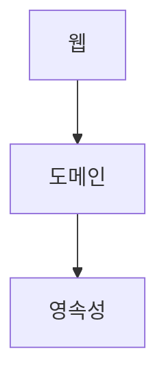

**목차**

<!-- TOC -->
* [1. 계층형 아키텍처](#1-계층형-아키텍처)
* [2. 계층형 아키텍처의 문제점](#2-계층형-아키텍처의-문제점)
  * [2.1. 데이터베이스 주도 설계를 유도](#21-데이터베이스-주도-설계를-유도)
  * [2.2. 하위 계층의 거대해짐 (깨진 창문 이론)](#22-하위-계층의-거대해짐-깨진-창문-이론)
  * [2.3. 테스트가 어려움](#23-테스트가-어려움)
  * [2.4. 유스케이스를 숨김](#24-유스케이스를-숨김)
  * [2.5. 동시 작업이 어려움](#25-동시-작업이-어려움)
  * [2.6. 유지보수 가능한 소프트웨어](#26-유지보수-가능한-소프트웨어)
* [참고 사이트 & 함께 보면 좋은 사이트](#참고-사이트--함께-보면-좋은-사이트)
<!-- TOC -->

---

육각형 아키텍처에서 애플리케이션은 비즈니스 관심사를 다루는 내부와 기술적 관심사를 다루는 외부로 분해된다.  
**외부에 포함된 기술적인 컴포넌트를 어댑터(adapter)** 라고 부르고, **어댑터가 내부와 상호 작용하는 접점을 포트 (port)** 라고 한다.  
이게 바로 **육각형 아키텍처 패턴을 포트와 어댑터 패턴**이라고도 부르는 이유이다.

도메인 로직이 프로그램상의 다른 관심사와 섞여있다면 도메인 주도 설계를 달성하기 수월하지 않기 때문에 도메인 주도 설계의 전제 조건은 도메인 구현을 격리하는 것이다.  
이 말은 내부와 외부의 분리를 강조한다.

도메인을 기반으로 애플리케이션을 구축하기 위해서는 육각형 아키텍처처럼 경계와 의존성을 강제할 수 있는 아키텍처를 채택하는 것이 중요하다.

# 1. 계층형 아키텍처

아래는 웹 계층, 도메인 계층, 영속성 계층으로 구성된 전통적인 웹 애플리케이션 구조이다.

**웹** 계층에서는 요청을 받아 **도메인** 혹은 비즈니스 계층에 있는 서비스로 요청을 보낸다.  
서비스에서는 필요한 비즈니스 로직을 수행하고 도메인 엔티티의 현재 상태를 조회하거나 변경하기 위해 **영속성** 계층의 컴포넌트를 호출한다.

---

# 2. 계층형 아키텍처의 문제점

## 2.1. 데이터베이스 주도 설계를 유도

웹 계층은 도메인 계층에 의존하고, 도메인 계층은 영속성 계층에 의존하기 때문에 자연스럽게 데이터베이스에 의존하게 된다.

모든 것이 영속성 계층을 토대로 만들어진다.

그 동안 만들어왔던 애플리케이션의 유스케이스를 보면 아마 데이터베이스의 구조를 먼저 생각한 후 이를 토대로 도메인 로직을 구현했을 것이다.

이것은 의존성의 방향에 따라 자연스럽게 구현한 것이므로 전통적인 계층형 아키텍처에서는 합리적인 방법이다.  
하지만 비즈니스 관점에서는 전혀 맞지 않는 방법이다.  
도메인 로직을 가장 먼저 만들어야 한다.  
도메인 로직이 맞나는 것을 확인한 후에 이를 기반으로 영속성 계층과 웹 계층을 만들어야 한다.

데이터베이스가 중심적인 아키텍처가 만들어지는 가장 큰 원인은 ORM 프레임워크를 사용하기 때문이다.  
ORM 프레임워크를 계층형 아키텍처와 결합하면 비즈니스 규칙을 영속성 계층과 섞을 가능성이 높다.

위 그림처럼 ORM 에 의해 관리되는 엔티티들은 일반적으로 영속성 계층에 둔다.  
도메인 계층에서는 엔티티에 접근 가능하므로 분명 사용되기 마련이다.

하지만 그렇게되면 영속성 계층과 도메인 계층 사이에 강한 결합이 생긴다.

서비스는 영속성 모델을 비즈니스 모델처럼 사용하게 되고 이로 인해 도메인 로직 뿐 아니라 즉시 로딩, 트랜잭션, 캐시 플러시 등 영속성 계층과 관련된 작업들을 해야한다.

---

## 2.2. 하위 계층의 거대해짐 (깨진 창문 이론)

계층형 아키텍처에서 특정한 계층에서는 같은 계층에 있는 컴포넌트나 아래에 있는 계층에만 접근 가능하다.

만일 상위 계층에 위치한 컴포넌트에 접근해야 한다면 컴포넌트를 계층 아래로 내리면 된다.  
딱 한번 그러는 것은 괜찮지만 과거에도 그런 케이스가 있었다면 다시 그렇게 하는 것에 대한 심리적 부담감은 훨씬 낮아진다.  
이를 **깨진 창문 이론**이라고 한다.

> 깨진 창문 이론에 대해서는 추후 좀 더 상세히 다룰 예정입니다. (p. 5)

영속성 계층은 모든 계층에서 접근 가능하므로 시간이 지날수록 점점 커지게 될 확률이 높다.  
위 그림에서 보는 것처럼 어떤 계층에도 속하지 않는 것처럼 보이는 헬퍼 컴포넌트나 유틸리티 컴포넌트들이 아래 계층으로 내려질 가능성이 크다.

위처럼 되는 상황을 방지하려면 적어도 추가적인 아키텍처 규칙을 강제하지 않는 한 계층 구분이 최선의 선택은 아니다.  
여기서 강제는 해당 규칙이 깨졌을 때 빌드가 실패하도록 만드는 것을 말한다.

---

## 2.3. 테스트가 어려움

계층형 아키텍처를 사용할 때 일반적으로 나타나는 변화는 계층을 건너뛰는 것이다.

**이렇게 계층을 건너뛰게 되면 두 가지 문제점**이 발생한다.

- **단 하나의 필드를 조작하는 것만으로도 도메인 로직을 웹 계층에 구현하게 됨**
  - 시간이 지날수록 더 많은 도메인 로직이 웹 계층에 추가되어 애플리케이션 전반에 걸쳐 책임이 섞이고 핵심 도메인 로직들이 퍼져나갈 확률이 높음
- **웹 계층 테스트에서 도메인 계층 뿐 아니라 영속성 계층도 mocking 해야 됨**
  - 이렇게 되면 단위 테스트의 복잡도가 올라감
  - 테스트 설정이 복잡해지는 것은 테스트를 전혀 작성하지 않는 방향으로 갈 확률이 높음

---

## 2.4. 유스케이스를 숨김

유지보수를 하다면 기능을 추가하거나 변경할 적절한 위치를 찾는 일이 빈번하기 때문에 아키텍처를 코드를 빠르게 탐색하는데 도움이 되어야 한다.

계층형 아키텍처에서는 도메인 로직이 여러 계층에 걸쳐 흩어지기 쉽다.  
즉, 유스케이스가 '간단'해서 도메인 계층을 생략한다면 웹 계층에 존재할 수도 있고, 도메인 계층과 영속성 계층 모두에서 접근할 수 있도록 특정 컴포넌트를 아래로 내렸다면 
영속성 계층에 존재할 수도 있다.

**이런 경우 새로운 기능을 추가할 적당한 위치를 찾는 일이 어려워진다.**

또한 계층형 아키텍처는 도메인 서비스의 '너비' 에 관한 규칙을 강제하지 않는다.  
따라서 아래 그림처럼 **여러 개의 유스케이스를 담당하는 아주 넓은 서비스**가 만들어지기도 한다.

**넓은 서비스는 영속성 계층에 많은 의존성을 갖게 하고, 다시 웹 계층의 많은 컴포넌트가 이 서비스에 의존**하게 된다.

고도로 특화된 좁은 도메인 서비스가 유스케이스 하나씩만 담당하게 된다면 이런 작업들이 매우 수월해질 것이다.  
예) _UserService_ 에서 사용자 등록 유스케이스를 찾는 대신 _RegisterUserService_ 에서 작업

---

## 2.5. 동시 작업이 어려움

모든 상황에서 10명 정도 되는 규모의 개발팀이 10명 정도 되는 규모의 개발팀보다 5배 빠를 거라고 기대할 수는 없지만 적절한 규모에서는 프로젝트에 인원이 더 투입될 경우 
더 빨라진다고 기대할 수 있다.

이런 기대를 충족시키려면 **아키텍처가 동시 작업을 지원해야 하는데 계층형 아키텍처는 동시 작업이 어려운 구조**이다.

예를 들어 애플리케이션에 새로운 유스케이스를 추가할 때 3명이 있을 경우 한 명은 웹 계층, 한 명은 도메인 계층, 한 명은 영속성 계층에 기능을 추가할 수 있다.  
하지만 계층형 아키텍처에서는 이렇게 작업할 수 없다.

**모든 것이 영속성 계층 위에 만들어지기 때문에 영속성 계층을 먼저 개발해야 하고, 그 다음에 도메인 계층, 마지막에 웹 계층**을 만들어야 한다.

**이렇기 때문에 특정 기능은 동시에 한 명의 개발자만 작업**할 수 있다.

개발자들이 인터페이스를 먼저 같이 정의하고 각 개발자들이 실제 구현을 기다릴 필요없이 이 인터페이스들로 작업할 수도 있지만 이 또한 데이터베이스 주도 설계를 하지 않는 경우에만 가능하다.

**코드에 넓은 서비스가 있다면 서로 다른 기능을 동시에 작업하기가 더욱 어렵다.**

서로 다른 유스케이스에 대한 작업을 하게 되면 같은 서비스를 동시에 편집하기 때문에 merge conflict 와 잠재적으로 이전 코드로 되돌려야 하는 문제를 야기하기 때문이다.

---

# 참고 사이트 & 함께 보면 좋은 사이트

*본 포스트는 톰 홈버그 저자의 **만들면서 배우는 클린 아키텍처**을 기반으로 스터디하며 정리한 내용들입니다.*

* [만들면서 배우는 클린 아키텍처](https://wikibook.co.kr/clean-architecture/)
* [책 예제 git](https://github.com/wikibook/clean-architecture)