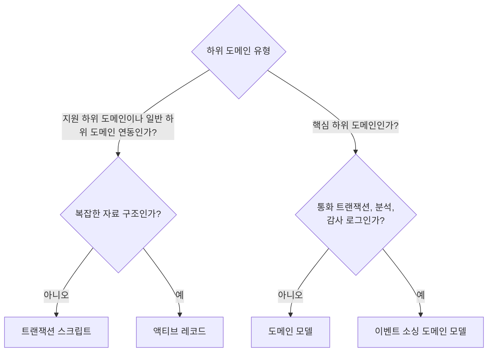
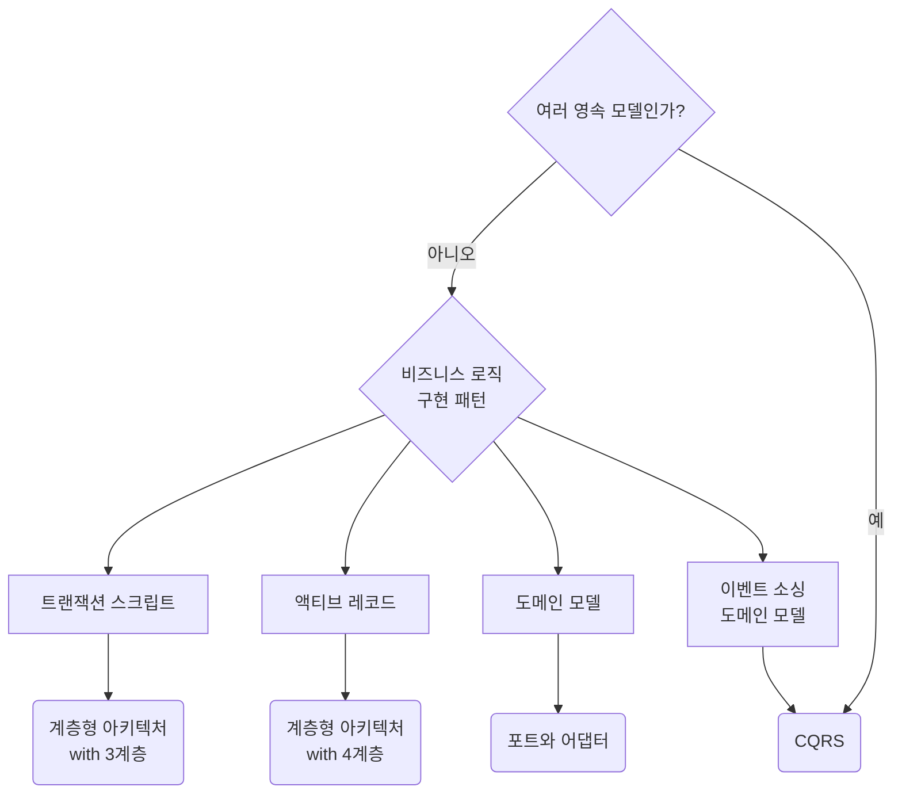
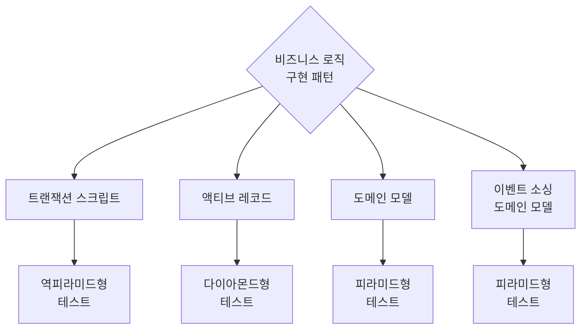

이 포스트에서는 전략적 및 전술적 설계를 경험에 기반한 단순한 규칙과 병합해서 설계 의사 결정을 내리는 과정을 간소화하는 법에 대해 알아본다.  
그리고 비즈니스 도메인의 복잡성과 요구 사항에 적합한 패턴을 빠르게 식별하는 법에 대해 알아본다.

---

**목차**

<!-- TOC -->
* [1. 휴리스틱](#1-휴리스틱)
* [2. 바운디드 컨텍스트](#2-바운디드-컨텍스트)
* [3. 비즈니스 로직 구현 패턴](#3-비즈니스-로직-구현-패턴)
* [4. 아키텍처 패턴](#4-아키텍처-패턴)
* [5. 테스트 전략](#5-테스트-전략)
  * [5.1. 피라미드형 테스트](#51-피라미드형-테스트)
  * [5.2. 다이아몬드형 테스트](#52-다이아몬드형-테스트)
  * [5.3. 역전된 피라미드형 테스트](#53-역전된-피라미드형-테스트)
* [6. 전술적 설계 의사결정 트리](#6-전술적-설계-의사결정-트리)
* [정리하며..](#정리하며)
* [참고 사이트 & 함께 보면 좋은 사이트](#참고-사이트--함께-보면-좋은-사이트)
<!-- TOC -->

---

# 1. 휴리스틱

휴리스틱은 문제를 해결하거나 결정을 내리는 과정에서 완벽한 최적의 해답을 구하는 것보다는, 제한된 시간과 자원 내에서 실용적인 해결책을 찾기 위한 경험적 방법을 말한다.

<**휴리스틱 특징**>
- **근사적인 해결책 제공**
  - 항상 최적의 답을 찾는 것은 아니지만 실용적으로 충분히 좋은 해결책을 제공할 수 있음
- **경험적 접근법**
  - 과거 경험과 직관을 바탕으로 문제 해결에 적용됨
- **불완전성**
  - 반드시 정확한 답을 보장하지 않지만 당면한 목적에 충분할 만큼의 경험에 기반한 규칙임

---

# 2. 바운디드 컨텍스트

바운디드 컨텍스트의 최적의 크기는 무엇일까?  
작은 바운디드 컨텍스트로 만들려고 기능을 원하는 크기에 최적화하여 모델링하기 보다는 모델이 포함하는 기능의 크기대로 바운디드 컨텍스트를 다루는 것이 더 효과적이다.

여러 바운디드 컨텍스트에 영향을 미치는 변경은 수많은 조율이 필요하며, 하나의 변경이 단일 바운디드 컨텍스트 범위 안에 있지 않다면 이는 컨텍스트 경계의 설계가 
효과적이지 않다는 신호이다.

바운디드 컨텍스트의 경계를 무효화하는 변경은 일반적으로 비즈니스 요구사항이 빈번하게 바뀔 때 발생한다.  
변동성과 불확실성이 핵심 하위 도메인의 특성이며, 특히 구현 초기에 더 그렇다. 따라서 바운디드 컨텍스트의 경계를 설정할 때 이런 특성을 휴리스틱으로 사용할 수 있다.  
즉, 변동성이 높은 도메인은 변경을 염두에 둔 유연한 경계를 설정하는 것이 필요하다.  
또한 초기에는 너무 단단한 경계를 설정하지 않고, 작은 단위로 분리한 후 변화에 따라 조정하는 것이 효과적이다. (= 빠른 프로토타이핑 후 검증)

일반 하위 도메인과 지원 하위 도메인은 모두 정형화되어 있고 변동성이 훨씬 적으므로 이 같은 휴리스틱은 주로 핵심 하위 도메인을 포함하는 바운디드 컨텍스트에 적용된다.

---

# 3. 비즈니스 로직 구현 패턴

비즈니스 로직을 다루면서 [트랜잭션 스크립트 패턴](https://assu10.github.io/dev/2024/08/25/ddd-transactionscript-activerecord/#1-%ED%8A%B8%EB%9E%9C%EC%9E%AD%EC%85%98-%EC%8A%A4%ED%81%AC%EB%A6%BD%ED%8A%B8-%ED%8C%A8%ED%84%B4), 
[액티브 레코드 패턴](https://assu10.github.io/dev/2024/08/25/ddd-transactionscript-activerecord/#2-%EC%95%A1%ED%8B%B0%EB%B8%8C-%EB%A0%88%EC%BD%94%EB%93%9C), 
[도메인 모델 패턴](https://assu10.github.io/dev/2024/08/31/ddd-domain-model-pattern/), 
[이벤트 소싱 도메인 모델 패턴](https://assu10.github.io/dev/2024/09/08/ddd-event-sourcing-domain-model/) 을 보았다.

트랜잭션 스크립트 패턴과 액티브 레코드 패턴은 간단한 비즈니스 로직을 포함하는 하위 도메인에 적합하다.  
예) 지원 하위 도메인이나 일반 하위 도메인을 위해 외부 솔루션 연동

두 패턴의 차이점은 자료 구조의 복잡성에 있는데 트랜잭션 스크립트 패턴은 단순한 자료 구조에 사용되고, 액티브 레코드 패턴은 복잡한 자료 구조를 하부 DB 에 매핑하는 것을 
한 곳으로 묶는데 도움을 준다.

도메인 모델과 그 변형인 이벤트 소싱 도메인 모델은 복잡한 비즈니스 로직을 포함하는 핵심 하위 도메인에 적합하다.  
예) 통화 트랜잭션, 감사 로그 제공

비즈니스 로직의 적절한 구현 패턴을 선택하기 위한 휴리스틱은 아래와 같은 질문을 해보는 것이다.
- 하위 도메인이 통화 트랜잭션을 추적하거나, 감사 로그를 제공하는가? 그렇다면 이벤트 소싱 도메인 모델을 적용한다. 그렇지 않다면
- 하위 도메인의 비즈니스 로직이 복잡한가? 그렇다면 도메인 모델을 구현한다. 그렇지 않다면
- 하위 도메인이 복잡한 자료 구조를 포함하는가? 그렇다면 액티브 레코드 패턴을 사용한다. 그렇지 않다면
- 트랜잭션 스크립트를 구현한다.

위를 비즈니스 로직의 구현 패턴을 위한 (도메인 주도)의사결정 트리로 나타내면 아래와 같다.

비즈니스 로직과 그 자료 구조의 복잡성에 따라 비즈니스 로직의 구현 패턴을 결정하는 것은 하위 도메인의 유형에 대한 가정을 검증하는 방법이다.  
예) 처음에는 핵심 하위 도메인이라고 생각했지만 결국 액티브 레코드가 맞는 경우

---

# 4. 아키텍처 패턴

[DDD - 아키텍처 패턴(계층형 / 포트와 어댑터 / CQRS)](https://assu10.github.io/dev/2024/09/29/ddd-architecture-pattern/) 에서 계층형 아키텍처, 
포트와 어댑터, CQRS 총 3개의 아키텍처 패턴에 대해 알아보았다.

아키텍처 패턴 선정을 위한 휴리스틱은 아래와 같다.
- 이벤트 소싱 도메인 모델은 **CQRS** 가 필요하다.
  - 그렇지 않으면 데이터 질의 옵션이 매우 제한되어 자신의 ID 만으로 단일 인스턴스를 가져와야 함
- 도메인 모델은 **포트와 어댑터 패턴**이 필요하다.
- 액티브 레코드 패턴은 **서비스 계층을 추가한 계층형 아키텍처**와 잘 어울린다.
  - 서비스 계층은 액티브 레코드를 제어하는 로직을 위한 것임
- 트랜잭션 스크립트는 3개의 계층(프레젠테이션/비즈니스 로직/데이터 계층)만으로 이루어진 **최소한의 계층형 아키텍처**와 잘 어울린다.

위의 휴리스틱에서 CQRS 패턴은 예외적으로 이벤트 소싱 도메인 모델뿐 아니라 하위 도메인이 여러 영속 모델에 있는 데이터를 표현할 필요가 있는 경우에도 도움이 된다.

위의 휴리스틱을 기반으로 아키텍처 패턴을 선택하는 의사결정 트리는 아래와 같다.

---

# 5. 테스트 전략

비즈니스 구현 패턴과 아키텍터 패턴의 모든 지식은 코드베이스의 테스트 전략을 선택할 때 휴리스틱으로써 활용할 수 있다.

- **피라미드형 테스트**
  - 애그리거트와 밸류 오브젝트 도메인 모델 모두 잘 어울림
  - 애그리거트와 밸류 오브젝트 도메인 모델, 두 모델 패턴은 비즈니스 로직을 테스트하는 완벽한 단위임
- **다이아몬드형 테스트**
  - 액티브 레코드 패턴은 비즈니스 로직이 서비스 계층과 비즈니스 로직 계층에 흩어지게 되므로 두 계층의 연동에 중점을 둔다면 다이아몬드형 테스트가 좋음
- **역피라미드형 테스트**
  - 역피라미드형 테스트는 엔드-투-엔드, 즉 처음부터 끝까지 애플리케이션의 워크플로를 검증하는 것임
  - 이 경우 트랜잭션 스크립트 패턴을 구현한 코드베이스가 잘 어울림

테스트 전략을 결정하는 의사결정 트리는 아래와 같다.

---

# 6. 전술적 설계 의사결정 트리

비즈니스 로직 패턴, 아키텍처 패턴, 테스트 전략에 관한 휴리스틱은 아래와 같이 하나의 전술적 설계 의사결정 트리로 나타낼 수 있다.

---

# 참고 사이트 & 함께 보면 좋은 사이트

*본 포스트는 블라드 코노노프 저자의 **도메인 주도 설계 첫걸음**을 기반으로 스터디하며 정리한 내용들입니다.*

* [도메인 주도 설계 첫걸음](https://www.yes24.com/Product/Goods/109708596)
* [책 예제 git](https://github.com/vladikk/learning-ddd)