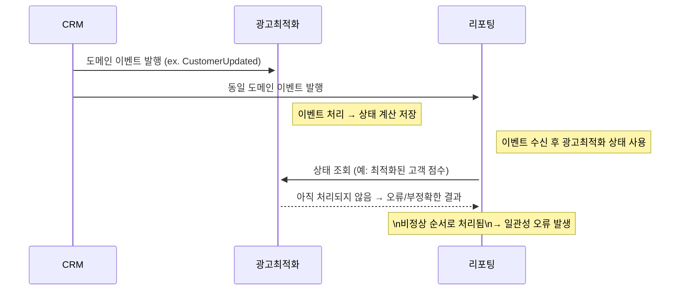
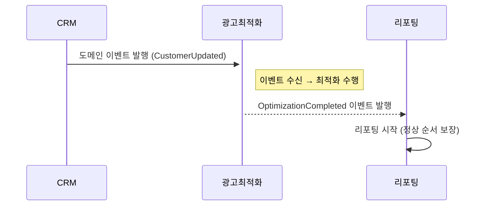
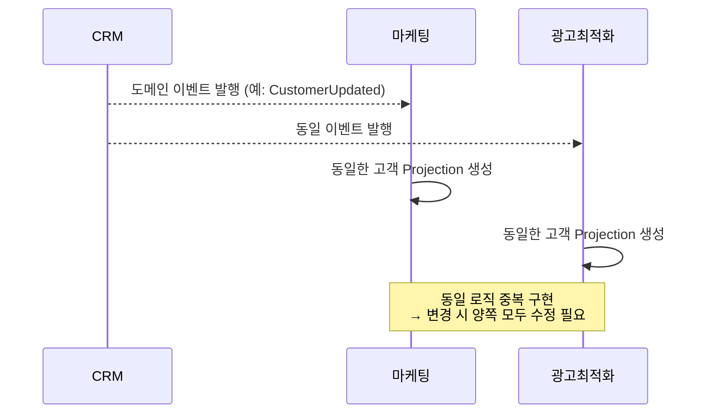
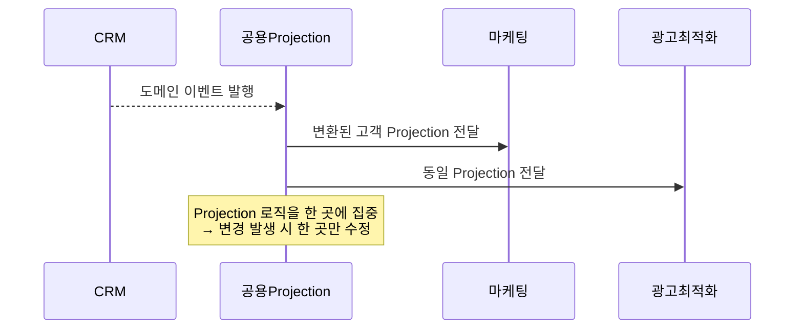
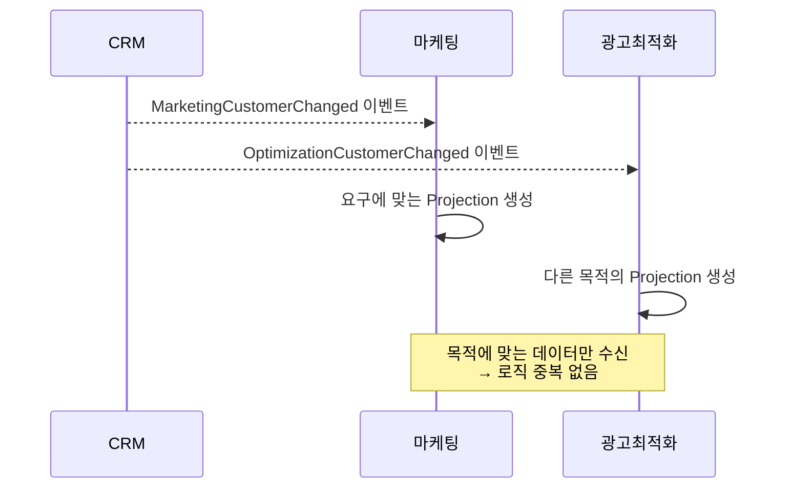
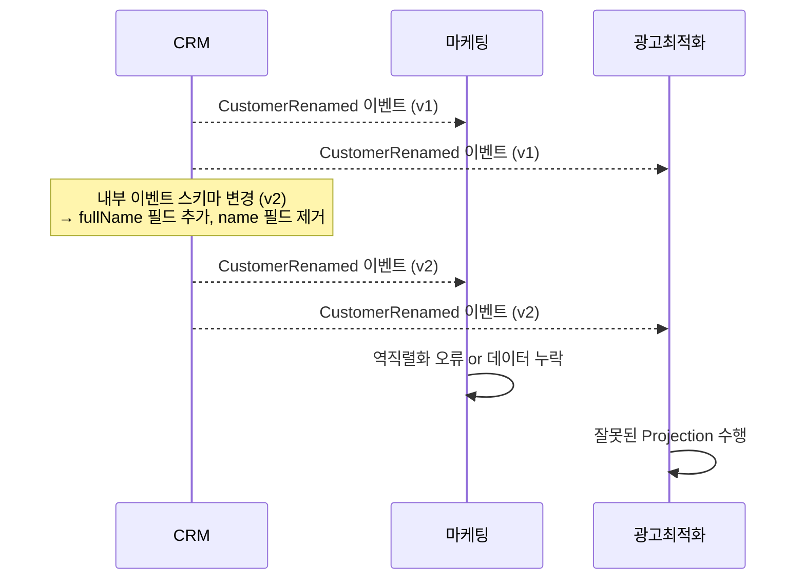
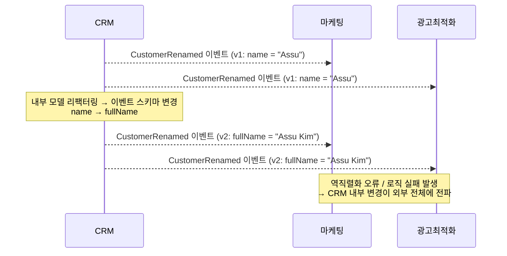
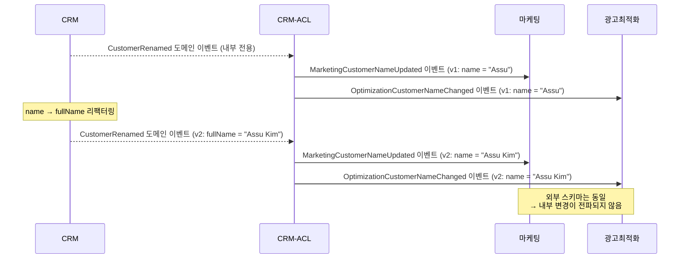

**목차**

<!-- TOC -->
* [1. 이벤트 주도 아키텍처(EDA, Event-Driven Architecture)와 이벤트 소싱의 구분](#1-이벤트-주도-아키텍처eda-event-driven-architecture와-이벤트-소싱의-구분)
* [2. 이벤트](#2-이벤트)
  * [2.1. 메시지 ≠ 이벤트: 커맨드와 이벤트의 구분](#21-메시지--이벤트-커맨드와-이벤트의-구분)
  * [2.2. 이벤트의 구조: 메타데이터와 페이로드](#22-이벤트의-구조-메타데이터와-페이로드)
  * [2.3. 이벤트 유형](#23-이벤트-유형)
    * [2.3.1. 이벤트 알림(Event Notification)](#231-이벤트-알림event-notification)
    * [2.3.2. 이벤트를 통한 상태 전송(ECST: Event-Carried State Transfer)](#232-이벤트를-통한-상태-전송ecst-event-carried-state-transfer)
    * [2.3.3. 도메인 이벤트(Domain Event)](#233-도메인-이벤트domain-event)
      * [2.3.4.1. 도메인 이벤트와 이벤트 알림의 관계](#2341-도메인-이벤트와-이벤트-알림의-관계)
      * [2.3.4.2. 도메인 이벤트와 이벤트를 통한 상태 전송(ECST)의 관계](#2342-도메인-이벤트와-이벤트를-통한-상태-전송ecst의-관계)
      * [2.3.4.3. 도메인 이벤트, 이벤트 알림, ECST 예시 및 비교](#2343-도메인-이벤트-이벤트-알림-ecst-예시-및-비교)
* [3. 이벤트 주도 연동 설계](#3-이벤트-주도-연동-설계)
  * [3.1. 분산된 커다란 진흙 덩어리](#31-분산된-커다란-진흙-덩어리)
  * [3.2. 시간 결합](#32-시간-결합)
  * [3.3. 기능 결합: 중복된 로직, 하나의 변경 이유](#33-기능-결합-중복된-로직-하나의-변경-이유)
  * [3.4. 구현 결합: 도메인 이벤트가 계약(Contract)이 되어버릴 때](#34-구현-결합-도메인-이벤트가-계약contract이-되어버릴-때)
  * [3.5. 이벤트 주도 연동의 리팩터링](#35-이벤트-주도-연동의-리팩터링)
  * [3.6. 이벤트 주도 설계 휴리스틱](#36-이벤트-주도-설계-휴리스틱)
* [참고 사이트 & 함께 보면 좋은 사이트](#참고-사이트--함께-보면-좋은-사이트)
<!-- TOC -->

---

이벤트 주도 아키텍처는 확장성과 성능, 회복력있는 분산 시스템을 설계하는 인기있는 방법론이다.

이 포스트에서는 아래 내용에 대해 알아본다.
- 이벤트 주도 아키텍처의 컨텍스트에서 도메인 주도 설계 패턴과 도구
- 이벤트 주도 아키텍처의 원칙과 효과적인 비동기 커뮤니케이션을 설계하는데 DDD 를 활용하는 방법

느슨하게 결합되고, 확장 가능하며, 내결함성을 가진 분산 시스템을 설계할 때 이벤트 주도 커뮤니케이션을 핵심 통합 메커니즘으로 채택하는 것이 효과적이다.

> **내결함성(Fault Tolerance)**
> 
> 시스템에 일부 장애가 발생하더라도 전체 시스템이 중단되지 않고 계속 동작할 수 있는 능력
> 
> 예) MSA 에서 주문 서비스가 장애를 일으켜도, 사용자 조회 서비스는 계속 작동한다면 내결함성이 있는 아키텍처
> 
> **내결함성을 갖추기 위함 전략**
> - 중복 구성
>   - 동일한 기능을 수행하는 컴포넌트를 여러 개 두고, 하나가 실패하면 다른 컴포넌트가 이어받음
> - 타임아웃 및 재시도
>   - 통신 실패 시 재요청하거나 우회 경로 사용
> - Circuit breaker
>   - 특정 서비스가 계속 실패하면 더 이상 호출하지 않게 차단하여 연쇄 실패 방지
> - Failover
>   - 장애 발생 시 자동으로 백업 시스템으로 전환
> - 비동기 메시징(EDA)
>   - 시스템 간 직접 호출 대신 메시지를 통해 연결함으로써 장애 전파 최소화

여기서는 EDA 와 DDD 사이의 상호 작용을 탐구하고,
- 이벤트 주도 아키텍처의 필수 구성 요소
- 실패한 EDA 프로젝트의 일반적인 원인
- 그리고 DDD 도구들을 활용하여 비동기 연동 시스템을 효과적으로 설계하는 방법

에 대해 알아본다.

---

# 1. 이벤트 주도 아키텍처(EDA, Event-Driven Architecture)와 이벤트 소싱의 구분

이벤트 주도 아키텍처는 **시스템들의 컴포넌트들이 이벤트 메시지를 교환하면서 비동기적으로 상호 작용하는 아키텍처 스타일**이다.  
이러한 이벤트 기반 실행 흐름의 대표적인 예는 [사가 패턴](https://assu10.github.io/dev/2024/10/05/ddd-communication-pattern/#22-%EC%82%AC%EA%B0%80saga-%EC%97%AC%EB%9F%AC-%ED%8A%B8%EB%9E%9C%EC%9E%AD%EC%85%98%EC%97%90-%EA%B1%B8%EC%B9%9C-%EB%B9%84%EC%A6%88%EB%8B%88%EC%8A%A4-%EB%A1%9C%EC%A7%81)이다.

한편, [**이벤트 소싱**](https://assu10.github.io/dev/2024/09/08/ddd-event-sourcing-domain-model/)은 상태 변경을 DB 에 바로 저장하는 대신, **도메인 이벤트의 시퀀스로 캡처하여 상태를 복원**하는 방식이다.

두 개념 모두 "이벤트"를 중심으로 설계되지만, 역할과 범위는 완전히 다르다.

|   구분   | 이벤트 주도 아키텍처          | 이벤트 소싱               |
|:------:|:---------------------|:---------------------|
|   목적   | 서비스 간 통신             | 상태 변호의 추적 및 저장       |
|   위치   | 서비스 외부(연동 및 메시징)     | 서비스 내부(도메인 모델 구현)    |
| 이벤트 용도 | 다른 컴포넌트에 변화를 알림      | 애그리거트의 상태 전환 저장      |
| 연관 패턴  | 사가, 이벤트 브로커, pub/sub | CQRS, 애그리거트, 도메인 이벤트 |

**이벤트 소싱**에서 사용하는 이벤트는 해당 도메인의 **애그리거트 상태를 표현하는 도메인 이벤트**이며, 이는 **외부 시스템과의 통신 목적이 아닌 도메인 모델의 불변성과 복잡성을 표현**하기 위해 존재한다.  
반면, **이벤트 주도 아키텍처**는 **서비스 간 경계를 넘어서는 커뮤니케이션 채널로서 이벤트를 사용**한다.

---

# 2. 이벤트

---

## 2.1. 메시지 ≠ 이벤트: 커맨드와 이벤트의 구분

이벤트는 메시지의 한 종류이지만, **모든 메시지가 이벤트인 것은 아니다.**  
메시지는 크게 2가지 유형으로 나뉜다.
- **이벤트(Event): 이미 발생한 변화**를 기술하는 메시지
- **커맨드(Command): 수행되어야 할 작업**을 지시하는 메시지

이벤트와 커맨드는 모두 **비동기 메시지 기반** 통신에 활용될 수 있지만, **역할과 처리 방식에서 분명한 차이점**이 존재한다.

|   구분    | 커맨드                                        | 이벤트                                        |
|:-------:|:-------------------------------------------|:-------------------------------------------|
|   의미    | 수행해야 할 작업 요청                               | 이미 발생한 사건 설명                               |
|   시제    | 현재 또는 미래형<br />예) CancelOrder, ShopProduct | 과거형<br />예) OrderCancelled, ProductShipped |
| 수신자의 역할 | **요청을 수락하거나 거부** 가능                        | **단순 수신** (거부 불가)                          |
| 실패 시 대응 | 유효성 검사 실패, 비즈니스 제약으로 거부                    | 보상 트랜잭션(Saga) 을 통한 복구 가능                   |
|   발신자   | 주로 사용자 인터페이스나 외부 시스템                       | 주로 도메인 모델 내부엣 생성                           |

예를 들어 아래와 같은 흐름을 생각해보자.
- CancelOrder **커맨드**가 서비스가 전달되었을 때
  - 주문이 이미 배송되었거나, 취소 조건을 만족하지 않으면 **명령이 거부**될 수 있음
- 반면, OrderCancelled **이벤트**는 이미 발생한 사실이며, 이를 **되돌릴 수는 없다.**
  - 만약 취소가 잘못된 결정이었다면, 보상 트랜잭션으로 ReorderProduct 같은 **새로운 커맨드**를 보내야 함

따라서 이벤트는 되돌릴 수 없는 과거의 사실을 나타내며, 이벤트 이름은 항상 과거 시제로 작성하는 것이 바람직하다.

---

## 2.2. 이벤트의 구조: 메타데이터와 페이로드

**이벤트는 선택한 메시징 플랫폼(Kafka, RabbitMQ, SNS 등)을 통해 직렬화되어 전송되는 데이터 레코드**이다.  
이벤트는 단순한 문자열이 아니라 **의미있는 데이터 구조**를 가진다.

가장 일반적인 이벤트 스키마는 아래 2가지 주요 구성 요소로 나뉜다.
- **메타데이터**
  - 이벤트 식별자(event-id)
  - 발생 시간(timestamp)
  - 발신자 정보(source/producer)
  - 트레이싱 정보(trade-id, correlation-id 등)
  - 이벤트 법전
- **페이로드**
  - 이벤트가 **전달하려는 정보**
  - 동시에 **이벤트의 도메인 유형**을 정의함 (OrderCreated, UserSignedUp 등)

페이로드는 **도메인의 의미를 반영하는 구조화된 정보**이다. 즉, **페이로드를 통해 이벤트 소비자는 어떤 일이 발생했는지 파악**할 수 있고, 이를 바탕으로 **적절한 비즈니스 로직을 
실행**하게 된다.

```json
{
  "event-id": "d28a7c4b-4ff6-43d6-b1b2-28acdf5c7a2a",
  "event-type": "OrderCreated",
  "occurred-at": "2025-05-01T12:34:56Z",
  "source": "order-service",
  "payload": {
    "order-id": 12345,
    "user-id": 67890,
    "total-amount": 15900,
    "items": [
      { "product-id": 101, "quantity": 2 },
      { "product-id": 202, "quantity": 1 }
    ]
  }
}
```

---

## 2.3. 이벤트 유형

이벤트 유형은 이벤트 알림, 이벤트를 통한 상태 전송, 도메인 이벤트 의 세 가지 유형 중 하나로 분류할 수 있다.

### 2.3.1. 이벤트 알림(Event Notification)

이벤트 알림은 비즈니스 도메인에서 발생한 변경 사항을 **다른 컴포넌트에게 알리는 메시지**이다.  
예로 PaycheckGenerated, CampaignPublished 와 와 같은 이벤트가 있다.

이벤트 알림의 주 목적은 **'무엇이 일어났는지'를 알리는 것**이며, 수신자가 행동을 취할 수 있도록 유도하되, **필요 이상의 상세 정보를 포함해서는 안된다.**

예시  
- PaycheckGenerated
  - 급여가 생성되었음을 외부 시스템에 알리지만, 세부 급여 내역을 포함하지 않는다.
  - 수신자는 급여 id 와 같은 참조값을 바탕으로 API 를 통해 상세 정보를 조회해야 한다.
- 재난 문자 시스템
  - 짧은 메시지로 긴급 상황만을 알림
  - 보다 구체적인 내용은 별도 채널(웹 사이트 등)을 통해 확인하도록 유도

<**이벤트 알림이 간결해야 하는 이유**>
- **보안**
  - 메시지게 민감한 정보를 직접 포함하지 않음으로써, **메시징 인프라에서 불필요한 정보 노출을 방지**할 수 있음
  - 수신자는 추가 권한을 가진 별도 API 호출을 통해 정보를 획득해야 하므로 **접근 제어**가 보다 명확히 됨
- **동시성**
  - 이벤트 기반 시스템은 본질적으로 **비동기적**임
  - 따라서 **이벤트 수신 시점에 데이터의 상태가 이미 변경되어 있을 수 있음**
  - 이럴 때, 수신자가 정보를 직접 질의함으로써 **가장 최신의 상태**를 확보할 수 있음
  - 예) 재고 부족 상태를 알리는 이벤트를 받았을 때 구독자가 먼저 확인하고, [비관적 잠금(pessimistic locking)](https://assu10.github.io/dev/2024/04/21/ddd-aggregate-transaction/#2-%EC%84%A0%EC%A0%90-%EC%9E%A0%EA%B8%88-%EB%B9%84%EA%B4%80%EC%A0%81-%EC%9E%A0%EA%B8%88-pessimistic-lock-lockmodetypepessimistic_write-lock)을 통해 다른 구독자의 접근을 제어함

즉, 이벤트 알림은 "상태 변화가 있었음을 알리는 간결하게 알리는 역할"에 집중해야 하며, **상세한 정보 전달보다는 트리거의 역할**로 사용되는 것이 바람직하다.

---

### 2.3.2. 이벤트를 통한 상태 전송(ECST: Event-Carried State Transfer)

이벤트를 통한 상태 전송은 이벤트 메시지를 통해 **제공자의 내부 상태 변화 또는 일부를 구독자에게 직접 전달**하는 방식이다.  
이벤트 알림과는 다르게 단순히 '무엇이 일어났는가'만 알리는 것이 아니라 **'무엇이 어떻게 바뀌었는지'에 대한 상태 정보를 함께 제공**한다.

<**ECST 메시지의 2가지 형태**>
- **완전한 상태 스냅숏**
  - 수정된 엔티티 전체의 현재 상태를 포함
- **부분 업데이트**
  - 실제로 변경된 필드만 포함
  - 구조가 크거나 빈번한 변경이 발생하는 경우 유리

<**ECST 장점**>
- **로컬 캐시 구성 가능**
  - 구독자는 ECST 이벤트 스트림을 통해 자체적인 로컬 상태 저장소를 유지할 수 있음
  - 이를 통해 **제공자 서비스가 일시적으로 가용하지 않더라도 지속적인 동작이 가능**함 → **내결함성(Fault Tolerance) 확보**에 유리
- **데이터 접근 성능 향상**
  - 구독 컴포넌트가 매번 제공자에게 질의를 하지 않고, **이벤트를 통해 최신 상태를 수신하고 캐시하여 처리**함으로써 **성능을 크게 개선**

ECST 는 개념적으로 **비동기 데이터 복제 메커니즘**에 가깝다.  
따라서 여러 서비스가 동일한 상태를 공유해야 하거나, 서비스 장애 시에도 구독자가 동작을 이어가야 하는 상황에서 매우 유용하다.  
예) 
- 주문 서비스가 상품 재고 정보를 ECST 방식으로 이벤트로 전송
- 결제 서비스는 이를 구독하여 자체 캐시에 상품 상태를 유지
- 재고 서비스가 일시적으로 내려가도 결제 서비스는 캐시된 정보를 기반으로 계속 처리 가능

---

### 2.3.3. 도메인 이벤트(Domain Event)

[도메인 이벤트](https://assu10.github.io/dev/2024/04/06/ddd-aggregate/#231-%ED%95%9C-%ED%8A%B8%EB%9E%9C%EC%9E%AD%EC%85%98%EC%97%90%EC%84%9C-%EC%97%AC%EB%9F%AC-%EC%95%A0%EA%B7%B8%EB%A6%AC%EA%B1%B0%ED%8A%B8-%EC%88%98%EC%A0%95-%EB%8F%84%EB%A9%94%EC%9D%B8-%EC%9D%B4%EB%B2%A4%ED%8A%B8)는 
**이벤트 알림과 이벤트를 통한 상태 전송(ECST) 사이의 성격을 가지면서도, 개념적으로 완전히 다른 의도과 역할**을 갖고 있다.

**도메인 이벤트는 의미 있는 비즈니스 사건을 모델링하는 도구**이며, **외부 연동이나 상태 복제를 목적으로 설계된 것이 아니다.**

이벤트 알림이나 ECST 는 외부 시스템과의 통신이나 성능 개선을 위한 수단이며, **의도와 용도에 따라 서로 다른 이벤트 설계**가 필요하다.

---

#### 2.3.4.1. 도메인 이벤트와 이벤트 알림의 관계

|   항목   | 도메인 이벤트                        | 이벤트 알림                    |
|:------:|:-------------------------------|:--------------------------|
|   목적   | 도메인 모델 내 비즈니스 이벤트 표현           | 다른 컴포넌트에 상태 변화 알림         |
| 포함 정보  | 이벤트를 설명하는 **충분한 정보** 포함        | 간결함 중심, 자세한 정보는 외부 질의 필요  |
| 사용 의도  | 도메인 내 의미 있는 상태 전환 모델링          | 외부 시스템 연동 트리거             |
| 외부 관심도 | 외부 사용자가 **반드시 관심을 가질 필요 없음**   | 외부 구독자 **반응 전제**          |
|   예시   | UserDeactivated, PaymentFailed | UserCreated, OrderShipped |

**도메인 이벤트는 내부 도메인 로직과 비즈니스 개념을 명확히 표현하기 위한 수단이며, 외부 시스템과의 통신을 주목적으로 설계된 것이 아니다.**

이벤트 소싱 기반 시스템에서는 **모든 의미 있는 상태 변화를 도메인 이벤트로 표현**하며, 외부 소비자가 이 모든 이벤트를 구독하는 것은 바람직하지 않다.

---

#### 2.3.4.2. 도메인 이벤트와 이벤트를 통한 상태 전송(ECST)의 관계

도메인 이벤트와 ECST 는 **모델링 관점과 데이터 포함 수준**에서 아래와 같은 차이를 가진다.

|   항목   | 도메인 이벤트                          | 이벤트를 통한 상태 전송                 |
|:------:|:---------------------------------|:------------------------------|
|   목적   | **비즈니스 이벤트 표현**                  | **엔티티 상태 동기화 및 복제**           |
| 포함 데이터 | 비즈니스 의미를 갖는 필드만 선택적으로 포함         | 로컬 캐시에 필요한 **상태 전체 또는 일부 포함** |
| 캐시 용도  | 캐시 용도로는 부적합 (데이터 불충분)            | 캐시 용도로 적합                     |
| 모델링 의도 | **애그리거트의 상태 전이가 아닌 수명 주기 상 이벤트 모델링** | 현재 상태를 그대로 반영                 |

예를 들어 ProductDiscontinued 도메인 이벤트는 상품이 더 이상 판매되지 않음을 표현하지만, 이 이벤트만으로는 productNae, price 등을 갖춘 완전한 상품 
정보 캐시를 구성할 수 없다.

도메인 이벤트에 포함된 데이터는 ECST 메시지의 스키마와 개념적으로 다르다.
ECST 메시지는 제공자 데이터를 로컬 캐시로 보유하기에 충분한 정보를 제공하지만 도메인 이벤트는 이런 풍부한 모델을 노출해서는 안된다. 
게다가 사용자가 구독하지 않은 다른 도메인 이벤트가 동일한 필드에 영향을 줄 수 있으므로 특정 도메인 이벤트에 포함된 데이터조차도 애그리거트의 상태를 캐싱하기에 충분하지 않다.

그리고 두 유형의 메시지에 대한 모델링 의도도 다르다. 도메인 이벤트에 포함된 데이터는 애그리거트의 상태를 설명하기 위한 것이 아니라 수명 주기 동안 발생한 비즈니스 이벤트를 설명한다.

---

#### 2.3.4.3. 도메인 이벤트, 이벤트 알림, ECST 예시 및 비교

```json
{
  "eventNotification": {
    "eventType": "MarriageNotification",
    "occurredAt": "2025-05-01T10:30:00Z",
    "aggregateId": "person-12345",
    "payload": {
      "personId": "12345",
      "event": "married",
      "details": "/link/marriage-data"
    }
  },

  "ecst": {
    "eventType": "PersonStateUpdated",
    "occurredAt": "2025-05-01T10:30:00Z",
    "aggregateId": "person-12345",
    "payload": {
      "personId": "12345",
      "new-name": "Assu"
    }
  },
  
  "domainEvent": {
    "eventType": "MarriageRegistered",
    "occurredAt": "2025-05-01T10:30:00Z",
    "aggregateId": "person-12345",
    "payload": {
      "personId": "12345",
      "assumed-partner-last-name": true
    }
  }
}
```

_MarriageNotification_ 는 이벤트 알림 메시지이다.  
지정된 아이디를 가진 사람이 결혼했다는 사실 외에 어떠한 정보도 포함되어 있지 않다. 이벤트에 대한 최소한의 정보만 포함되어 있으며, 더 자세한 정보를 원하면 세부 정보 
필드의 링크를 따라가야 한다.

_PersonStateUpdated_ 는 이벤트를 통한 상태 전송 메시지이다.  
그 사람의 개인 정보 변경사항, 즉 이름이 변경되었음을 알려준다. 바뀐 필드만 전달함으로써 로컬 캐시 갱신이 가능하다. 메시지는 변경된 이유는 설명하지 않는다. 

_MarriageRegistered_ 는 도메인 이벤트이다.  
이것은 도메인 이벤트의 특성에 최대한 가깝게 모델링되었다. 결혼이라는 도메인 내 의미있는 사건을 모델링하였다.  
그 사람의 id 와 배우자의 이름을 따르는지를 나타내는 플래그, 즉 도메인 로직과 직접 연결된 정보(성 변경 여부)만 표현한다.

|    항목    | 이벤트 알림           | 이벤트를 통한 상태 전송    | 도메인 이벤트                         |
|:--------:|:-----------------|:-----------------|:--------------------------------|
|    목적    | 알림/트리거           | 상태 복제            | 도메인 모델링                         |
|   정보량    | 최소               | 변경 필드            | 의미 있는 도메인 정보                    |
| 외부 질의 필요 | 필요 (details 링크)  | 불필요 (정보 포함됨)     | 일반적으로 사용 안 함                    |
|  예시 필드   | event: "married" | new-name: "Assu" | assumed-partner-last-name: true |
|  사용 대상   | 외부 연동 시스템        | 캐시/조회 전용 모델      | 도메인 내부 또는 이벤트 소싱                |

---

# 3. 이벤트 주도 연동 설계

[DDD(1) - 도메인 복잡성 관리: 바운디드 컨텍스트](https://assu10.github.io/dev/2024/07/27/ddd-bounded-context/) 에서 본 것처럼 
**소프트웨어 설계의 본질은 '경계(Boundary)' 를 정의하고 관리하는 일**이다.

- 도메인 간, 팀 간, 서비스 간 경계는 어떤 정보가 어디에서 유효하고, 어느 지점까지 책임지는지를 결정함
- 이러한 경계는 단순한 기술적 모듈 구분이 아니라 **의미있는 책임과 의도를 기준**으로 나눔

EDA(Event-Driven Architecture) 기반 시스템에서는 **이벤트**가 바로 이 경계를 넘는 **주요 통신 수단이자 계약(Contract)** 이다.  
즉, **이벤트는 단순한 메시지가 아니라 바운디드 컨텍스트 간 연동을 가능하게 하는 설계상의 핵심 요소**이다.

<**이벤트가 경계에 미치는 2가지 영향**>
- **연동 방식에 대한 영향**
  - 이벤트는 컴포넌트 간 직접 호출을 제거하고 **비동기 메시지 기반 연동**을 가능하게 함
  - 이를 통해 컴포넌트는 더 느슨하게 결합되고, 서로의 구현 세부사항에 덜 의존하게 됨
- **경계 자체에 대한 영향**
  - 어떤 이벤트를 외부에 공개(publish) 하고, 어떤 이벤트는 내부에만 은닉(Encapsulate) 할 것인지를 결정하는 것은 곧 **그 컴포넌트의 경계가 어디까지인지를 정의**하는 일임
  - 이벤트의 의미와 범위는 바운디드 컨텍스트의 모델링 의도에 따라 달라짐

경계는 기본적으로 컴포넌트가 서로 연동되는 방식을 정의한다. 
EDA 기반 시스템에서 이벤트는 컴포넌트가 연동하는 방식과 컴포넌트의 경계 자체에 모두 영향을 주는 가장 중요한 설계 요소이다.

여기서는 다양한 이벤트 유형을 적용하기 위한 휴리스틱에 대해 알아본다.

---

## 3.1. 분산된 커다란 진흙 덩어리

CRM 바운디드 컨텍스트는 이벤트 소싱 도메인 모델을 적용하여 구현된다.  
CRM 시스템이 마케팅 바운디드 컨텍스트와 연동할 경우 마케팅 바운디드 컨텍스트의 사용자가 CRM 의 도메인 이벤트를 구독하게 한 후 요구사항에 맞는 모델을 프로젝션한다.  
광고최적화 바운디드 컨텍스트가 도입되면서 CRM 바운디드 컨텍스트에서 생성된 정보로 처리한다. 다시 한번 팀은 광고최적화가 CRM 에서 생성된 모든 도메인 이벤트를 구독하여 
광고최적화의 요구사항에 맞는 모델을 프로젝션한다.

마케팅과 광고최적화 바운디드 컨텍스트는 모두 동일한 형식으로 고객의 정보를 제시해야 했기 때문에 결국 CRM 의 도메인 이벤트에서 동일한 모델을 프로젝션하게 되었다.

리포팅 바운디드 컨텍스트는 CRM 에서 발행한 도메인 이벤트의 일부만 구독했고, 광고최적화 컨텍스트에서 수행한 계산도 가져오기 위해 이벤트 알림 메시지를 사용한다.  
그러나 광고최적화와 리포팅 바운디드 컨텍스트도 동일한 이벤트를 사용하여 계산을 시작하므로 리포팅 모델이 업데이트되는 것을 보장하기 위해 리포팅 모델에서 구독을 지연시킨다. 

이 설계는 매우 끔찍하다.


---

## 3.2. 시간 결합

이벤트 기반 시스템은 종종 느슨한 결합을 추구하는 설계로 여겨지지만, 시간적 결합이 발생하면 오히려 더욱 취약한 구조가 된다.

위 그림은 광고최적화 → 리포팅 순서에 의존하는 흐름이다.
- 광고최적화 바운디드 컨텍스트는 CRM 도메인 이벤트를 기반으로 고객 데이터를 처리하고,
- 리포팅 컨텍스트는 동일한 이벤트를 기반으로 보고용 모델을 갱신함

하지만 이 두 컴포넌트 사이에는 **명시적 의존 관계는 없고**, 오직 **암묵적으로 '광고최적화가 먼저 처리돼야 한다'는 전제**만 존재한다.

개발팀은 순서 보장을 위해 리포팅 시스템의 구독 시간을 **5분 지연**시켰지만, 이는 **근본적인 해결책이 아닌 타이밍 운에 의존한 임시방편**이다.

- 순서 역전이 발생할 수 있는 시나리오
  - 광고최적화 서비스 과부하
    - 지정된 5분 안에 처리를 완료하지 못함 → 리포팅은 처리 전 데이터를 기반으로 잘못된 데이터 생성
  - 네트워크 지연
    - 광고최적화에 이벤트가 늦게 도달 → 리포팅은 처리 전 데이터를 기반으로 잘못된 데이터 생성
  - 광고최적화 컴포넌트 장애
    - 메시지를 수신하지 못하고, 처리가 중단됨 → 리포팅은 처리 전 데이터를 기반으로 잘못된 데이터 생성

이처럼 시간 결합은 시스템 간 호출을 제거했음에도 **이벤트 순서라는 보이지 않는 의존성**으로 인해 전체 흐름을 불안정하게 만든다.  
**비동기 이벤트 기반 시스템에서도 순서에 대한 의존이 존재하면, 그것은 결합**이다.

<**해결을 위한 대안**>
- **이벤트에 처리 상태 포함**
  - 광고최적화가 완료되면 _OptimizationCompleted_ 이벤트 발행 → 리포팅은 이 이벤트를 트리거로 시작
- **명시적 워크플로 오케스트레이션**
  - 리포팅이 시작되기 전 광고최적화 상태를 API 로 확인하거나 오케스트레이터가 순서를 제어
- **단일 프로젝션 공유**
  - 광고최적화와 리포팅이 동일한 프로젝션을 참조하도록 설계하여 순서 의존 제거
- **[Saga](https://assu10.github.io/dev/2024/10/05/ddd-communication-pattern/#221-%EC%82%AC%EA%B0%80-%ED%8C%A8%ED%84%B4%EC%9D%98-%EC%9D%BC%EA%B4%80%EC%84%B1) or [Process Manager](https://assu10.github.io/dev/2024/10/05/ddd-communication-pattern/#23-%ED%94%84%EB%A1%9C%EC%84%B8%EC%8A%A4-%EA%B4%80%EB%A6%AC%EC%9E%90)**
  - 두 작업 간의 흐름을 명시적으로 관리하고 실패/재시도 로직 포함

잘못된 상황 (시간 결합)


개선 방향(처리 완료 이벤트 사용)


---

## 3.3. 기능 결합: 중복된 로직, 하나의 변경 이유

마케팅과 광고최적화 바운디드 컨텍스트는 모두 CRM 이 발생한 **도메인 이벤트를 구독**하고, 그 이벤트를 바탕으로 고객 데이터를 프로젝션한다.  
**문제는 두 컨텍스트 모두 같은 목적(고객 정보 표시)를 위해 거의 동일한 형태의 프로젝션 모델과 상태 변환 로직을 별도로 구현했다는 점**이다.

이 구조의 핵심 문제는 **변경 이유가 하나인데, 수정 위치가 여러 개** 라는 점이다.  
예를 들어 CRM 의 도메인 이벤트 스키마가 변경되면 마케팅과 광고최적화 **모두 동일한 변경을 적용**해야 한다.

만일 수정이 누락되면 이것은 리스크가 된다.

<**기능 결합의 징후**>
- **동일한 이벤트를 구독**
- **동일한 프로젝션 생성**
  - 거의 같은 구조의 모델을 만듦
- **동일한 로직 중복 구현**
  - 필드 매핑, 상태 변환 방식이 유사
- **동일한 변경 이유**
  - 하나의 요구 변경에 모두 반응

<**해결을 위한 대안**>
- **공용 프로젝션 서비스 분리**
  - 공통 프로젝션 로직을 별도의 서비스/라이브러리로 추출하여 공유
- **전용 이벤트 생성**
  - 각 컨텍스트가 필요로 하는 형식으로 CRM 이 전용 이벤트를 발행
- **조회 전용 API 사용**
  - 이벤트 기반이 아닌, 필요한 데이터를 API 로 질의해서 사용
- [**ACL (Anti-Corruption Layer)**](https://assu10.github.io/dev/2024/04/27/ddd-bounded-context/#51-공개-호스트-서비스-open-host-service-anti-corruption-layer)
  - 프로젝션 로직을 각 컨텍스트의 ACL 로 격리 → 내부 도메인과 분리 유지

**같은 기능을 다른 컴포넌트도 수행하고 있다면 기능 결합을 의심하고 공통 책임을 외부로 분리**하자.  
**이벤트 기반 아키텍처에서 느슨한 결합을 유지하고 싶다면, 중복된 로직을 자동화하거나 공유 가능한 방식으로 설계**하는 것이 중요하다.

잘못된 상황 (기능 결합)


개선 방향(공용 프로젝션 서비스 도입)


개선 방향(각 컨텍스트에 맞는 전용 이벤트 발행)


---

## 3.4. 구현 결합: 도메인 이벤트가 계약(Contract)이 되어버릴 때

마케팅과 광고최적화 바운디드 컨텍스트는 CRM 에서 발행되는 **모든 도메인 이벤트를 구독**한다.  
**이벤트는 이벤트 소싱 모델의 내부 구현 결과물**이며, **CRM 의 내부 도메인을 표현**하기 위해 만들어졌다.  
하지만 **외부 컨텍스트들이 이 이벤트에 직접 의존하기 시작하면서 이벤트가 사실상 공개 API 처럼 취급**되고 있다.

<**문제점**>
- **CRM에서 새로운 도메인 이벤트 추가**
  - 구독하는 컨텍스트 모두 이벤트를 수신함 → 무시하지 않으면 **의도하지 않은 처리 발생**
- **기존 이벤트 스키마 변경**
  - 마케팅/광고최적화에서 이벤트 역직렬화 에러 발생 또는 로직 오동작
- **이벤트 순서/타이밍 조정**
  - 외부 컨텍스트에서 예기치 않은 재처리/중복 처리/미처리 발생

**이벤트가 도메인의 내부 구현이었어야 했는데 실제로는 외부 서비스와의 계약처럼 되어버린 것**이다.

문제 상황(구현 결합)


위 구조가 가진 핵심 문제는 아래와 같다.
- **내부 이벤트 모델이 외부 계약 역할까지 떠맡고 있음**
- 도메인의 변화가 그대로 외부로 노출되어, **진정한 바운디드 컨텍스트의 캡슐화가 깨짐**
- 외부 컨텍스트는 CRM 의 이벤트에 맞춰 끊임없이 대응해야 하는 **강한 구현 의존성에 빠짐**

<**해결을 위한 대안**>
- 공개용 이벤트 모델 분리
  - 내부 도메인 이벤트와 별도로 외부 통합을 위한 전용 이벤트 설계
- [**ACL (Anti-Corruption Layer)**](https://assu10.github.io/dev/2024/04/27/ddd-bounded-context/#51-공개-호스트-서비스-open-host-service-anti-corruption-layer)
  - 내부 도메인 이벤트는 ACL 이 받아서 외부에 맞는 형식으로 다시 변환
- [Schema Registry](https://assu10.github.io/dev/2024/06/22/kafka-producer-2/#13-%EC%B9%B4%ED%94%84%EC%B9%B4%EC%97%90%EC%84%9C-%EC%97%90%EC%9D%B4%EB%B8%8C%EB%A1%9C-%EB%A0%88%EC%BD%94%EB%93%9C-%EC%82%AC%EC%9A%A9-schema-registry-kafkaavroserializer) 활용 + 버전 관리
  - 이벤트 스키마를 안정적으로 관리하고, 하위 호환성있는 변경만 허용
- 의도 중심 이벤트 재설계
  - _CustomerRenamed_ → _MarketingCustomerNameUpdated_ 처럼 의도를 반영한 명시적 이벤트로 분리

**도메인 이벤트는 비즈니스 모델을 표현하기 위한 내부 구현의 산물**이다.  
도메인 이벤트를 외부 계약으로 사용하는 순간, **모든 변경은 시스템 전반**에 퍼지게 된다.

진정한 바운디드 컨텍스트 분리를 원한다면, **도메인 이벤트와 연동 이벤트를 명확히 구분하고 중간 계층에서 해석하도록 설계**해야 한다.

문제 상황(내부 도메인 이벤트에 외부 컨텍스트가 직접 의존)


위 상황은 CRM 의 내부 구현이 외부 컨텍스트(마케팅, 광고최적화) 에 직접적인 영향을 줌으로써 구현 발생이 발생한다.

개선 방향(ACL 또는 공개용 이벤트 모델 도입)


위처럼 개선할 경우
- CRM 의 이벤트 모델은 외부와 격리
- 외부 컨텍스트는 안정적인 공개 이벤트만 구독
- CRM 의 리팩터링은 ACL 가 흡수하여 다른 컨텍스트에는 영향을 주지 않음

---

## 3.5. 이벤트 주도 연동의 리팩터링

위에서 본 것처럼 이벤트를 맹목적으로 사용하는 것만으로는 느슨한 결합이나 회복력을 보장하지 않는다는 사실을 보여준다.  
이제 이벤트의 의미와 책임을 조정하여, 시스템 간 결합을 줄이고 안정성을 높이는 방향으로 리팩터링해보자.

<**문제 요약**>
- 구현 결합: CRM 의 모든 도메인 이벤트를 노출 → 구독자는 내부 구조에 의존
- 기능 결합: 동일한 프로젝션 로직을 여러 컨텍스트에서 중복 구현
- 시간 결합: 광고최적화 결과가 준비되기 전 리포팅이 동작하면 오류 발생

<**리팩터링 전략**>
- **제한된 이벤트 집합만 노출(Public Event)**
  - CRM 은 더 이상 내부 도메인 이벤트 전체를 노출하지 않음
  - **외부 연동에 필요한 프로젝션 모델을 이벤트를 통한 상태 전송(ECST) 으로 발행**
  - 구독자는 CRM 의 구조나 이벤트 설계 변경을 몰라도 됨
- **프로젝션 책임을 CRM 내부로 이동**
  - 각 컨텍스트가 필요한 모델을 CRM 이 대신 프로젝션하여 발생
  - → **구현 모델과 연동 모델 분리**
  - → **기능 결합 해소, 중복 로직 제거**
- **사용자 주도 컨트랙트 적용**
  - 외부 사용자가 요구하는 데이터 구조를 CRM 이 선언적으로 제공
  - 이를 공표된 언어로 명시
  - → **계약 기반의 안정적인 연동**
- **시간 결합 해소: 이벤트 알림 트리거 사용**
  - 광고최적화가 완료되면 _OptimizationCompleted_ 이벤트를 발행
  - 리포팅은 이 알림을 구독한 후 **상태 조회 방식으로 데이터 획득**
  - → **처리 순서 보장 + 강한 동기 호출 제거**


- [OHS(Open Host Service)](https://assu10.github.io/dev/2024/11/16/ddd-msa/#41-%EC%98%A4%ED%94%88-%ED%98%B8%EC%8A%A4%ED%8A%B8-%EC%84%9C%EB%B9%84%EC%8A%A4ohs-open-host-service): 
사용자 요구 기반 프로젝션 모델을 외부에 노출
- CRM 은 이벤트를 통한 상태 전송(ECST) 방식으로 프로젝션을 발행하고, 구현 디테일을 감춤
- 광고최적화는 이벤트 알림을 통해 리포팅의 흐름을 트리거함 → 시간 결합 해소

이렇게 리팩터링한 결과 내부 도메인 모델 보호, 중복 로직 제거, 비동기 흐름의 안정성을 확보할 수 있다.

---

## 3.6. 이벤트 주도 설계 휴리스틱

이벤트는 단지 메시지를 비동기적으로 전달하는 것이 아니라 **실패, 순서, 결합, 일관성까지 포함한 설계 대상**이다.  
이벤트 기반 시스템을 안정적으로 유연하게 유지하려면 **현실의 불완전함을 설계 수준에서 흡수하고, 명확한 의도를 가진 메시지 유형을 조합하는 휴리스틱**이 필요하다.

이벤트 기반 시스템을 설계할 때는 단순히 '비동기 처리'만 바라보면 위험하다.  
**현실적인 장애 상황**과 **컴포넌트 간 경계 설계의 원칙**을 고려하여 EDA 의 **취약점을 보완하고 견고한 설계로 이끌기 위한 휴리스틱**을 아래와 같이 정리한다.

---

**최악의 상황을 가정하라**

이벤트 주도 시스템은 기본적으로 아래와 같은 불확실성을 내포한다.
- 네트워크는 언제든 느려지거나 끊길 수 있음
- 장애는 항상 중요한 순간에 발생함
- 이벤트는 순서대로 도착하지 않을 수 있음
- 이벤트는 중복되어 전달될 수 있음

<**해결 전략**>
- **메시지 유실 방지**
  - [아웃박스 패턴](https://assu10.github.io/dev/2024/08/18/kafka-exactly-once/#2321-%EC%95%84%EC%9B%83%EB%B0%95%EC%8A%A4-%ED%8C%A8%ED%84%B4outbox-pattern)을 사용하여 트랜잭션 + 메시지 발송을 분리
- **순서/중복 문제**
  - 구독자가 이벤트의 eventId, version, timestamp 등을 이용해 중복 제거 및 재정렬 처리
- **보상 트랜잭션**
  - [사가 패턴](https://assu10.github.io/dev/2024/10/05/ddd-communication-pattern/#22-%EC%82%AC%EA%B0%80saga-%EC%97%AC%EB%9F%AC-%ED%8A%B8%EB%9E%9C%EC%9E%AD%EC%85%98%EC%97%90-%EA%B1%B8%EC%B9%9C-%EB%B9%84%EC%A6%88%EB%8B%88%EC%8A%A4-%EB%A1%9C%EC%A7%81) 또는 [프로세스 관리자](https://assu10.github.io/dev/2024/10/05/ddd-communication-pattern/#23-%ED%94%84%EB%A1%9C%EC%84%B8%EC%8A%A4-%EA%B4%80%EB%A6%AC%EC%9E%90)를 사용하여 장애 발생 시 조율 로직을 명시적으로 설계

---

**퍼블릭 이벤트와 프라이빗 이벤트를 구분하라**

**이벤트는 내부 모델과 외부 계약을 구분해서 설계**해야 한다.

도메인 이벤트를 그대로 외부에 노출하면 **구현 세부사항까지 외부에 노출**이 된다.  
퍼블릭 이벤트는 바운디드 컨텍스트의 공표된 언어의 일부가 되어야 한다.

<**구현 전략**>
- [**OHS(Open Host Service)**](https://assu10.github.io/dev/2024/08/24/ddd-bounded-context-linkage/#23-%EC%98%A4%ED%94%88-%ED%98%B8%EC%8A%A4%ED%8A%B8-%EC%84%9C%EB%B9%84%EC%8A%A4ohs-open-host-service-%ED%8C%A8%ED%84%B4)
  - 컨텍스트가 외부에 노출할 프로젝션/이벤트를 의도적으로 설계
- **퍼블릭 이벤트 → ECST 기반**
  - ECST 를 활용하여 사용자에게 필요한 데이터만 간결하게 전달
- **이벤트 알림으로 인터페이스 최소화**
  - 상세 정보를 외부에 노출하지 않고, 알림 메시지와 후속 질의로 분리
- **프라이빗 도메인 이벤트는 캡슐화**
  - 이벤트 소싱 내부에서만 사용하는 도메인 이벤트는 외부와 분리하려 관리

---

**일관성 요구사항을 평가하라**

모든 시스템이 반드시 동기적 일관성을 가질 필요는 없다.  
**데이터 일관성의 수준에 따라 이벤트 메시지 유형이 달라져야 한다.**

<**판단 기준 및 메시지 전략**>

| 상황                | 권장 메시지 유형       | 설명                                 |
|:------------------|:---------------|:-----------------------------------|
| 궁극적 일관성으로 충분한 경우  | ECST           | 최신 상태가 곧 반영될 수 있으므로 상태 전체를 이벤트로 전달 |
| 정확한 최신 상태가 필요한 경우 | 이벤트 알림 + 후속 질의 | 알림 메시지로 트리거 → 최신 상태를 직접 조회         |

예시
- 실시간 대시보드 등은 ECST 로 캐시 기반 처리 가능
- 재고 수량 확인처럼 정밀성이 중요한 케이스는 최신 상태를 직접 질의

---

# 참고 사이트 & 함께 보면 좋은 사이트

*본 포스트는 블라드 코노노프 저자의 **도메인 주도 설계 첫걸음**을 기반으로 스터디하며 정리한 내용들입니다.*

* [도메인 주도 설계 첫걸음](https://www.yes24.com/Product/Goods/109708596)
* [책 예제 git](https://github.com/vladikk/learning-ddd)