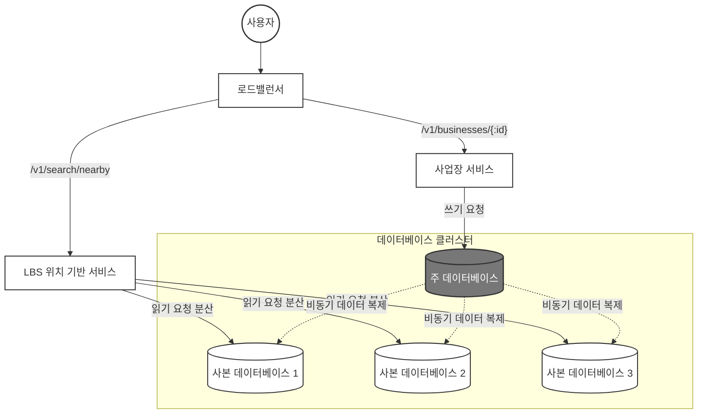
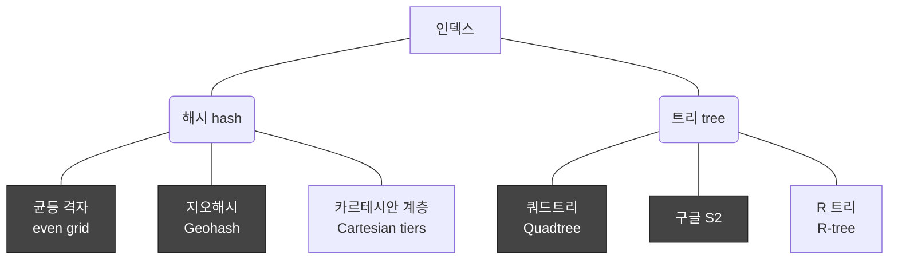

**목차**

<!-- TOC -->
* [1. 요구사항 및 규모 추정](#1-요구사항-및-규모-추정)
  * [1.1. 기능 요구사항](#11-기능-요구사항)
  * [1.2. 비기능 요구사항](#12-비기능-요구사항)
  * [1.3. 개략적 규모 추정(Back-of-the-envelope calculation)](#13-개략적-규모-추정back-of-the-envelope-calculation)
* [2. 개략적 아키텍처와 지리 정보 인덱싱 알고리즘](#2-개략적-아키텍처와-지리-정보-인덱싱-알고리즘)
  * [2.1. 개략적 설계안 및 핵심 컴포넌트](#21-개략적-설계안-및-핵심-컴포넌트)
    * [2.1.1. 엔드포인트 및 API 설계](#211-엔드포인트-및-api-설계)
    * [2.1.2. 데이터 모델링 및 MySQL 채택 이유](#212-데이터-모델링-및-mysql-채택-이유)
      * [2.1.2.1. 데이터 스키마](#2121-데이터-스키마)
    * [2.1.3. 시스템 개략적 설계안](#213-시스템-개략적-설계안)
    * [2.1.4. 핵심 서비스 및 규모 확장성 전략](#214-핵심-서비스-및-규모-확장성-전략)
  * [2.2. 주변 사업장 검색 알고리즘](#22-주변-사업장-검색-알고리즘)
    * [2.2.1. 2차원 검색의 한계](#221-2차원-검색의-한계)
    * [2.2.2. 균등 격자(Even grid) 방식의 단점](#222-균등-격자even-grid-방식의-단점)
    * [2.2.3. 지오해시(Geohash) 원리와 가장자리 이슈](#223-지오해시geohash-원리와-가장자리-이슈)
      * [2.2.3.1. 격자 가장자리(Edge) 이슈](#2231-격자-가장자리edge-이슈)
      * [2.2.3.2. 표시할 사업장이 충분하지 않은 경우](#2232-표시할-사업장이-충분하지-않은-경우)
    * [2.2.4. 쿼드트리(Quadtree)](#224-쿼드트리quadtree-)
      * [2.2.4.1. 쿼드트리를 저장하는데 필요한 메모리는?](#2241-쿼드트리를-저장하는데-필요한-메모리는)
      * [2.2.4.2. 쿼드트리 구축에 소요되는 시간은?](#2242-쿼드트리-구축에-소요되는-시간은)
      * [2.2.4.3. 쿼드트리로 주변 사업장을 검색하려면?](#2243-쿼드트리로-주변-사업장을-검색하려면)
      * [2.2.4.4. 쿼드트리 운영 시 고려사항](#2244-쿼드트리-운영-시-고려사항)
      * [2.2.4.5. 실제 사용되는 쿼드트리 사례](#2245-실제-사용되는-쿼드트리-사례)
    * [2.2.5. 구글 S2](#225-구글-s2)
  * [2.5. 지오해시 vs 쿼드트리](#25-지오해시-vs-쿼드트리)
    * [2.5.1. 지오해시](#251-지오해시)
    * [2.5.2. 쿼드트리](#252-쿼드트리)
* [3. 상세 설계](#3-상세-설계)
  * [3.1. 데이터베이스 규모 확장성](#31-데이터베이스-규모-확장성)
    * [3.1.1. 지리 정보 색인의 규모 확장](#311-지리-정보-색인의-규모-확장)
  * [3.2. 캐시](#32-캐시)
    * [3.2.1. 캐시 키](#321-캐시-키)
  * [3.3. region 및 가용성 구역](#33-region-및-가용성-구역)
  * [3.4. 시간대 또는 사업장 유형에 따른 검색](#34-시간대-또는-사업장-유형에-따른-검색)
  * [3.5. 최종 아키텍처 다이어그램](#35-최종-아키텍처-다이어그램)
* [4. 마무리](#4-마무리)
* [참고 사이트 & 함께 보면 좋은 사이트](#참고-사이트--함께-보면-좋은-사이트)
<!-- TOC -->

---

# 1. 요구사항 및 규모 추정

근접성 서비스(Proximity Service)는 사용자의 현재 지리적 위치(위도와 경도)를 기반으로 특정 반경 내에 있는 음식점, 주유소 등의 사업장 목록을 검색하고, 
정보를 제공하는 위치 기반 서비스(LBS, Location-Based Service)이다.
대표적으로 주변 식당을 찾는 '옐프(Yelp)'나 가까운 주유소를 검색하는 '구글 맵'이 이에 해당한다.

대규모 아키텍처를 설계할 때 가장 먼저 해야 할 일은 시스템의 한계와 범위를 명확히 하는 것이다.  
기획 및 기술적 제약 조건을 바탕으로 도출된 핵심 요구사항은 아래와 같다고 가정한다.

---

## 1.1. 기능 요구사항

- 위치 기반 검색
  - 사용자의 GPS 좌표(위도/경도)와 선택한 반경에 매칭되는 사업장 목록을 정확하게 반환해야 한다.
- 동적 반경 변경
  - 사용자는 UI에서 검색 반경을 **0.5km, 1km, 2km, 5km, 20km** 로 자유롭게 변경할 수 있어야 하며, 최대 허용 반경은 **20km**로 제한한다.
- 사업장 데이터 관리
  - 사업장 소유주는 자신의 사업장 정보를 시스템에 추가/삭제/갱신할 수 있다.
- 비실시간 반영 허용
  - 소유주가 수정한 정보가 검색 결과에 실시간으로 반영될 필요는 없으며, **다음 날까지만 반영**되어도 무방하다.
- 상세 정보 조회
  - 고객은 검색된 사업장의 상세 페이지를 조회할 수 있어야 한다.
- 화면 자동 갱신 비활성화
  - 사용자가 이동 중이더라도 이동 속도가 아주 빠르지 않으므로, 현재 위치 기준으로 화면을 상시 자동 갱신할 필요는 없다.

---

## 1.2. 비기능 요구사항

- 낮은 응답 지연(Low Latency)
  - 사용자가 주변 검색을 할 때 답답함을 느끼지 않도록 매우 신속하게 결과를 반환해야 한다.
- 고가용성 및 규모 확장성
  - 인구 밀집 지역(예: 강남역)에서 특정 시간대(점심/퇴근 시간)에 트래픽이 급증해도 시스템이 동작해야 한다.
- 데이터 보호 및 사생활 보장
  - 사용자 위치 정보는 민감한 개인정보이므로, 이를 안전하게 보호하고 관련 법령을 준수해야 한다.

> **GDPR(General Data Protection Regulation)**
> 
> GDPR(유럽 일반 개인정보보호법)은 유럽연합(EU)이 제정한 세계에서 가장 강력한 개인정보 보호 법령이다.  
> 사용자의 위치 데이터와 같은 민감 정보는 GDPR의 핵심 규제 대상이다.
> 
> - 핵심 원칙: 기업은 사용자의 위치 정보를 수집할 때 **명시적 동의**를 받아야 하며, 목적 달성 후에는 지체 없이 **파기 또는 익명화**해야 한다.
> - 잊힐 권리(Right to Forgotten): 사용자가 요청하면 시스템 내에 저장된 사용자의 위치 이력 등 모든 개인 데이터를 완전히 삭제할 수 있는 구조를 아키텍처 설계 단계부터 반영해야 한다.

---

## 1.3. 개략적 규모 추정(Back-of-the-envelope calculation)

시스템 인프라의 규모를 결정하기 위해 대략적인 트래픽과 처리량(QPS)를 산정해본다.

- **기본 가정 수치**
  - 일일 능동 사용자 수(DAU, Daily Active User): 1억명($$10^8$$)
  - 총 등록 사업장 수: 2억 개($$2 * 10^8$$)
  - 사용자당 일평균 검색 횟수: 5회
- **QPS(Query Per Second) 계산**
  - 하루 시간인 86,400초를 계산 편의상 $$10^5$$초로 올림하여 계산한다.
  - 하루 총 검색 수 = $$10^8$$명 * 5회 = 5 * $$10^8$$회
  - 평균 QPS = $$\frac{5 * 10^8회}{10^5초} = 5,000$$

최종적으로 시스템은 **평균 5,000 QPS**를 처리할 수 있어야 하며, 트래픽 피크 타임을 고려하면 이보다 2~3배 높은 대역폭을 감당할 수 있는 확장성이 필요하다.

---

이 시스템은 전형적인 **읽기 중심(Read-heavy)** 시스템으로, 초당 5,000번 이상의 읽기 요청을 지연 없이 처리하는 것이 핵심이다.  
위치 정보는 **GDPR/CCPA 규정**을 철저히 준수하도록 설계 단계부터 보안 및 익명화 전략을 수립해야 한다.  
데이터의 실시간 동기화 요구사항이 낮으므로(익일 반영), DB 쓰기 부하보다는 **조회 성능 최적화**와 **캐싱 전략**에 집중해야 한다.

---

# 2. 개략적 아키텍처와 지리 정보 인덱싱 알고리즘

**<위치 기반 서비스(LBS)와 공간 인덱싱의 필요성>**  
대규모 근접성 서비스를 안정적으로 구축하기 위해서는 수억 개의 지리적 좌표 데이터 속에서 사용자의 현재 위치와 인접한 사업장을 ms 단위로 찾아내는 **공간 인덱싱(Spatial Indexing)** 기술이 
필수적이다.  
Stateless 아키텍처 구조의 서버 설계와 더불어, 2차원의 위도/경도 데이터를 1차원 선형 인덱스로 변환하는 고성능 알고리즘의 trade-off를 이해해야 최적의 시스템을 설계할 수 있다.

---

## 2.1. 개략적 설계안 및 핵심 컴포넌트

### 2.1.1. 엔드포인트 및 API 설계

근접성 서비스의 핵심인 주변 검색 API는 대량의 트래픽과 데이터 반환을 안전하게 제어할 수 있도록 [**페이징**](https://developer.atlassian.com/server/confluence/pagination-in-the-rest-api/) 처리를 필수로 포함한다.

- **주변 사업장 검색 API**
  - Endpoint: GET /v1/search/nearby
  - Request Parameters:
    - latitude(검색할 위도, Decimal, 필수)
    - longitude(검색할 경도, Decimal, 필수)
    - radius(검색 반경, Int, 선택 항목이며 기본값은 5km)
    - Response Body:
```json
{
  "total": 10,
  "businesses": [
    { "business_id": 123, "name": "맛있는 식당", "address": "..." }
  ]
}
```

- **사업장 관리용 CRUD API**
  - 상세 정보 조회: GET /v1/businesses/:id
  - 사업장 추가: POST /v1/businesses
  - 사업장 수정: PUT /v1/businesses/:id
  - 사업장 삭제: DELETE /v1/businesses/:id

> **Tip!**
> 
> 실제 프로덕션 환경을 구축할 때는 구글 장소(Places)나 옐프(Yelp) 사업장 검색 API의 파라미터 구조를 벤치마킹하는 것이 큰 도움이 됩니다.
> 
> - 구글 장소 API: https://developers.google.com/maps/documentation/places/web-service/legacy/search?hl=ko
> - 옐프 사업장 API: https://docs.developer.yelp.com/reference/v3_business_search

---

### 2.1.2. 데이터 모델링 및 MySQL 채택 이유

주변 검색과 상세 조회가 시스템 연산의 대부분을 차지하는 **압도적인 읽기 중심(Read-heavy)** 시스템이다.  
반면, 소유주가 장소 정보를 편집하는 쓰기 연산의 비율은 극히 낮다.

<**읽기 중심에서 MySQL이 바람직한 이유와 타 DB와의 비교**>  
- **왜 모든 데이터를 MongoDB나 Redis에 넣지 않는가?**
  - **정형 데이터의 안정성**
    - 사업장 이름, 주소 등의 스키마가 매우 명확한 정형 데이터이다. RDBMS인 MySQL은 이러한 고정 스키마 데이터를 가장 안정적으로 관리한다.
  - **Redis의 한계**
    - Redis는 모든 데이터를 메모리에 상주시키는 **In-memory DB**이다.
    - 2억 개의 사업장 상세 데이터를 전부 Redis에 상시 보관하면 **메모리 유지 비용이 천문학적으로 발생**한다.
    - 따라서 Redis는 뒤에 나올 지오해시 인덱스나 캐싱 용도로만 사용하고, 마스터 데이터는 디스크 기반의 RDBMS에 두는 것이 비용 효율적이다.
  - **MongoDB의 한계**
    - NoSQL인 MongoDB 역시 뛰어난 읽기 성능과 지리 색인을 지원하지만, 정형 데이터의 엄격한 일관성과 다중 사본(Read Replica) 확장 신뢰성 측면에서 오랜 기간 검증된 MySQL이 구조적 안정감을 준다.
- **Oracle, MSSQL에 비해 MySQL이 추천되는 대규모 아키텍처적 이유**
  - 수만~수십만 QPS의 읽기 요청을 분산하려면 수십 대의 Replica를 Scale-out해야 한다.
  - 코어 단위나 서버 대수 단위로 **라이선스 비용이 청구되는 Oracle, MSSQL은 인프라 확장 시 비용 폭탄**으로 이어진다.
  - 반면 오픈소스인 MySQL은 비용 부담없이 무제한으로 Replica를 증설할 수 있다.

---

#### 2.1.2.1. 데이터 스키마

- **business 테이블**
  - business_id를 PK로 하며, 이름/주소 등 사업장 상세 정보를 담는다.
- **지리적 위치 색인 테이블**
  - 위치 기반 공간 연산 속도를 끌어올리기 위한 인덱스 전용 테이블이다.

---

### 2.1.3. 시스템 개략적 설계안

이 시스템은 위치 기반 서비스(LBS)와 사업장 관련 서비스, 두 부분으로 구성된다.




---

### 2.1.4. 핵심 서비스 및 규모 확장성 전략

**1) 위치 기반 서비스(LBS)**  
- 특정 반경 내 사업장을 조회하는 컴포넌트이며, 오직 **읽기 요청만 수없이 발생**한다.
- **Stateless 서비스**이므로 인구 밀집 지역의 트래픽 폭증 시 즉각적인 Scale-out이 가능하다.

**2) 사업장 서비스**  
- 소유주의 정보 관리(쓰기) 및 고객의 상세 조회(읽기)를 담당한다.
- 쓰기 QPS는 상대적으로 낮아 시스템 부하가 적다.

**3) 아키텍처 확장성 포인트**  
- **복제 지연(Replication Lag) 허용**
  - Master DB와 Replica 간의 비동기 복제로 인한 미세한 데이터 불일치가 발생할 수 있다.
  - 그러나 비기능 요구사항에서 검토했듯 사업장 정보는 실시간 반영이 불필요하므로 이러한 구조가 가용성 면에서 완벽히 유리하다.
- **오토스케일링**
  - 사업장 서비스와 LBS 모두 Stateless이므로 피크 타임(예: 점심 시간)에 맞추어 유연하게 서버 대수를 자동으로 조절할 수 있다.


---

## 2.2. 주변 사업장 검색 알고리즘

대규모 시스템에서 공간 정보를 다루는 대표적인 알고리즘 5가지의 핵심 원리와 한계에 대해 알아본다.

> 실제로 많은 회사가 [레디스 지오해시(Geohash in Redis)](https://redis.io/docs/latest/commands/GEOHASH/)나 PostGIS 확장을 설치한 Postgres DB를 활용한다.

---

### 2.2.1. 2차원 검색의 한계

가장 단순하게 위도와 경도 범위를 지정하여 SQL 상에서 격자 구역을 쿼리하는 방식이다.

```sql
SELECT business_id, latitude, longitude
  FROM business
 WHERE (longitude BETWEEN {:my_lat} - radius AND {:my_lat} + radius)
   AND (latitude BETWEEN {:my_long} - radius AND {:my_long} + radius)
```

이 쿼리는 데이터가 많아질수록 인덱스를 타더라도 테이블 전체를 풀스캔하듯 비효율적으로 작동한다.  
위도와 경도에 인덱스를 만들어도 데이터가 2차원적이므로 컬럼별로 가져온 결과도 여전히 엄청난 양이다.
위도 컬럼의 데이터 집합 1과 경도 컬럼의 데이터 집합 2는 빠르게 추출 가능하지만, 주어진 반경 내 사업장을 얻으려면 두 집합의 교집합을 구해야 하는데,
이 연산은 각 집합에 속한 데이터의 양 때문에 효율적일 수 없다.

이렇게 인덱스를 하는 것의 문제는 오직 한 차원의 검색 속도만 개선할 수 있다는 것이다.

> **위도와 경도를 복합키로 만들어도 해결되지 않는다.**
> 
> DB의 복합 인덱스는 기본적으로 **1차원 선형 구조(B-Tree 계열)**이다.  
> 인덱스를 (latitude, longitude) 순서로 묶어 생성하게 되면, DB는 첫 번째 조건인 latitude 범위에 해당하는 데이터를 먼저 일렬로 찾은 뒤,  
> 그 추출된 방대한 데이터 그룹 안에서 일일이 longitude 범위를 필터링해야 한다.
> 
> 즉, 두 차원의 데이터가 독립적으로 사각형 범위를 지니기 때문에 하나의 차원 인덱스 속도만 개선될 뿐,  
> 나머지 한 축은 인덱스의 혜택을 온전히 받지 못하고 거대한 교집합 연산 비용을 치러야 한다.
> 
> 따라서 2차원 데이터를 1차원 선형 데이터로 변환해 주는 특수 인덱싱이 필요하다.


그럼 자연스럽게 2차원 데이터를 1차원에 대응시킬 방법이 있을까? 를 알아보기 전에 인덱스를 만드는 방법들부터 알아보자.

지리적 정보에 인덱스를 만드는 방법을 두 종류이다.



각 색인법은 구현 방법은 다르지만 지도를 작은 영역으로 분할하고, 고속 검색이 가능하도록 색인을 만든다는 아이디어는 같다.

---

### 2.2.2. 균등 격자(Even grid)

지도를 단순하게 일정한 크기의 바둑판 격자로 나누는 직관적인 접근법이다.

균등 격자의 문제점은 아래와 같다.

- **불균등한 분포**
  - 강남역에는 수만 개의 상점이 모여있지만, 사막 한 가운데 격자에는 상점이 단 하나도 없다.
  - 전 세계를 동일 크기로 나누면 격자별 데이터 편차가 너무 심해진다.
- **인접 격자 탐색 분리**
  - 격자 ID 할당 체계에 계층이나 연관성이 없어 내 격자 바로 옆 격자의 식별자를 계산해 내기가 매우 까다롭다.

---

### 2.2.3. 지오해시(Geohash)

2차원의 위도/경도 좌표 데이터를 격자 기반의 재귀적 분할을 통해 **1차원 문자열**로 인코딩하는 방식이다.

본초 자오선(Prime Meridian)은 영국 그리니치 천문대를 통과하는 경도 $$0^\circ$$의 기준선이다.  
지구를 동반구(경도 $$0^\circ \sim 180^\circ$$)와 서반구(경도 $$-180^\circ \sim 0^\circ$$)로 가르는 수직 기준선이 된다.  
지오해시는 바로 이 본초 자오선과 적도(위도 $$0^\circ$$)를 기준으로 전 세계를 4개의 사분면으로 조각내며 비트 매핑을 시작한다.  
즉, 2차원의 위도,경도 데이터를 1차원의 문자열로 반환하고, 비트를 하나씩 늘려가면서 재귀적으로 세계를 더 작은 격자로 분할해나가는 방식이다.

먼저 전 세계를 본초 자오선과 적도 기준 사분면으로 나눈다.

- 위도 범위 [-90, 0]은 0에 대응
- 위도 범위 [0, 90]은 1에 대응
- 경도 범위 [-180, 0]은 0에 대응
- 경도 범위 [0, 180]은 1에 대응

그 격자를 또 다시 사분면으로 나누고, 이 때 각 격자는 경도와 위도 비트를 위처럼 순서대로 반복한다.
이 절차를 원하는 정밀도(precision)를 얻을 때까지 반복한다.


[지오해시](https://www.movable-type.co.uk/scripts/geohash.html)는 이진 분할을 반복하며 얻은 비트들을 모아 **Base32** 형태의 문자열로 나타낸다. 문자의 길이가 길어질수록 격자는 좁아지고 정밀도는 정교해진다.

예) 구글 본사 지오해시 (길이 = 6)
1001 10110 01001 10000 11011 11010 (base32 이진 표기) → 9q9hvu (base32)

지오해시는 12단계의 정밀도를 갖는데, 이 정밀도가 격자 크기를 결정한다.

[지오해시 길이와 격자 크기]

| 지오해시 길이 | 격자 너비 × 높이 |
| --- | --- |
| 1 | 5,009.4km × 4,992.6km (지구 전체) |
| 2 | 1,252.3km × 624.1km |
| 3 | 156.5km × 156km |
| 4 | 39.1km × 19.5km |
| 5 | 4.9km × 4.9km |
| 6 | 1.2km × 609.4m |
| 7 | 152.9m × 152.4m |
| 8 | 38.2m × 19m |
| 9 | 4.8m × 4.8m |
| 10 | 1.2m × 59.5cm |
| 11 | 14.9cm × 14.9cm |
| 12 | 3.7cm × 1.9cm |

그럼 최적 정밀도는 어떻게 정할까?
사용자가 지정한 반경으로 그린 원을 덮는 최소 크기 격자로 만드는 지오해시 길이를 구해야 한다.

[검색 반경과 지오해시 길이]

| 반지름 (킬로미터) | 지오해시 길이 |
| --- | --- |
| 0.5km (0.31마일) | 6 |
| 1km (0.62마일) | 5 |
| 2km (1.24마일) | 5 |
| 5km (3.1마일) | 4 |
| 20km (12.42마일) | 4 |

---

#### 2.2.3.1. 격자 가장자리(Edge) 이슈

지오해시는 공통 접두어(prefix)가 길수록 두 지점이 물리적으로 가깝다는 특성을 가지지만, **그 역은 성립하지 않을 수 있다.**


```sql
-- 대단히 위험한 쿼리 예시
SELECT * FROM geohash_index WHERE geohash LIKE 'u17e0%';
```

두 사업장이 단 30km 거리를 두고 마주보고 있더라도, 한 사업장은 적도 위(u000), 한 사업장은 적도 아래(ezzz) 격자에 걸치게 되면 두 지오해시 문자열은 
**공통 접두어가 단 한 글자도 존재하지 않게 된다.**

이에 대한 해결책은 내 위치가 속한 격자 하나만 검색하면 안되며, 내 격자를 에워싸고 있는 **인접 격자 8개(총 9개 격자)의 사업장을 상시 함께 조회**하여 취합해야 한다.  
인접 격자를 구하는 연산은 상수 시간($$O(1)$$) 내에 매우 빠르게 처리된다.


격자 가장자리의 또 다른 문제는 두 지점이 공통 prefix 길이는 길지만 서로 다른 격자에 놓이는 경우이다.


---

#### 2.2.3.2. 표시할 사업장이 충분하지 않은 경우

현재 격자와 주변 격자를 다 보아도 표시할 사업장이 충분하지 않으면 어떻게 해야할까?

- 주어진 반경 내 사업장만 반환한다.
  - 구현하지 쉽지만 사용자의 욕구를 만족하기 충분한 수의 사업장 정보를 반환하지 못함
- 검색 반경을 키운다.
  - 지오해시의 마지막 비트를 삭제하여 얻은 새 지오해시 값을 사용하여 주변 사업장을 검색한다. 
  - 그래도 사업장 수가 충분하지 않으면 또 한 비트를 지워서 범위를 다시 확장한다.

---

### 2.2.4. 쿼드트리(Quadtree)

쿼드트리는 자식 노드를 정확히 4개씩(2 * 2) 가질 수 있는 메모리 기반 트리 자료 구조이다.  
"하나의 격자 내부 사업장 수가 100개를 초과하면 공간을 사분면으로 쪼갠다"는 조건 기반으로 공간을 분할한다.

쿼드트리를 사용한다는 것은 결국 질의에 답하는 데 사용될 트리 구조를 메모리 안에서 만드는 것이다.
쿼드트리는 메모리 안에 놓이는 자료 구조일 뿐 DB가 아니라는 것에 유의하자.

이 자료구조는 각각의 LBS 서버에 존재해야 하며, 서버가 시작되는 시점에 구축된다.

전 세계에 백만개의 사업장이 있다고 해보자.


그 과정을 좀 더 자세히 시각화하면 아래와 같다.


트리의 루트 노드는 세계 전체 지도이고, 이 루트 노드를 사분면 각각을 나타내는 하위 노드로, 어떤 노드도 사업장 100개를 너지 않을때까지 재귀적으로 분할한다.

```kotlin
// 쿼드트리 구축 핵심 메커니즘 예시
fun buildQuadtree(node: TreeNode) {
  if (countNumberOfBusinessesInCurrentGrid(node) > 100) {
    node.subdivide() // 공간을 4개의 자식 노드로 분할
    for (child in node.children) {
      buildQuadtree(child) // 재귀 호출
    }
  }

```

---

#### 2.2.4.1. 쿼드트리를 저장하는데 필요한 메모리는?

이 질문에 답하려면 어떤 데이터가 쿼드트리에 보관되는지 먼저 알아야 한다.

- **Leaf Node에 저장되는 데이터**
  - 격자를 식별하는데 사용할 좌상단과 우하단 꼭짓점 좌표: 32 byte(8byte * 4)
    - 2차원 평면의 격자 범위를 특정하려면 **2개 점**의 좌표가 필요하다. 즉, '좌상단 꼭짓점'과 '우하단 꼭짓점'이다.
    - 그런데 점 하나는 내부적으로 **(위도,경도)**라는 2개의 실수형(double, 8 byte) 데이터 쌍으로 이루어져 있다.
    - 따라서 $$\text{점 2개} \times \text{좌표 2개(위도, 경도)} = \text{총 4개의 실수 데이터}$$가 필요하기 때문에 물리적으로 `8byte * 4 = 32byte`가 노드에 할당되는 것이다.
  - 격자 내부 사업장 ID 목록: ID당 8byte * 100 (한 격자에 허용되는 사업장 수의 최댓값)
    - 대개 ID(식별자)는 미래의 대규모 데이터 확장성을 고려하여 64bit 정수형(= 8byte)을 사용하기 때문에 하나의 사업장 ID는 8 byte(Java의 Long, DB의 BIGINT)
  - 총 832 byte
- **Internal Node에 저장되는 데이터**
  - 격자를 식별하는데 사용할 좌상단과 우하단 꼭짓점 좌표: 32 byte(8 byte * 4)
  - 하위 노드 4개를 가리킬 포인터: 32 byte(8 byte * 4)
    - 메모리 주소를 가리키는 포인터 크기는 OS와 CPU의 아키텍처 기반에 결정된다.
    - **포인터 1개의 크기 = 8byte**
      - 우리가 사용하는 대부분의 서버용 OS와 CPU는 64비트 아키텍처이다.
      - 64비트 시스템에서 메모리의 특정 주소를 가리키는 포인터 변수 1개의 크기는 예외없이 정확히 64비트, 즉 **8byte**가 된다.
    - **하위 노드가 4개인 이유**
      - 쿼드트리는 이름 그대로 공간을 늘 4개(사분면)로 분할하는 트리구조이다.
      - 하나의 부모(Internal node)는 쪼개진 4개의 자식 노드 주소를 모두 알고 있어야 한다.
      - 따라서 부모 노드가 자식 노드 4개의 메모리 주소를 저장하기 위해 필요한 공간은 아래와 같이 계산된다.
      - `포인터 크기(8byte) * 자식 노드 개수(4개) = 32byte`
  - 총 64 byte

한 격자에 허용되는 사업장 수의 최대값에 좌우되기는 하지만 그 값은 트리안에 저장하지 않아도 된다.    
메모리에 생성된 쿼드트리 구조 자체가 이미 조건(최대 100개)에 맞춰 하위 노드로 쪼개져 분할을 끝마친 상태이기 때문이다.  
즉, 노드 인스턴스 하나하나마다 `max_limit = 100` 이라는 상숫값 정보를 변수로 중복해서 저장하여 아까운 메모리 공간을 낭비할 필요가 없다는 뜻이다.  
인프라 설계 측면에서 순수 데이터만 적재하려는 극단적인 공간 최적화 관점이다.

이제 각 노드가 어떤 데이터를 저장하는지 알았으니 메모리를 계산해보자.
전 세계에는 이백만개의 사업장이 있다고 가정한다.

- 격자 안에는 최대 100개의 사업장이 있을 수 있음
- Leaf node의 수 =~ $$\frac{200m}{100}$$ =~ 2백만(2m)
- Internal node의 수 = 2m * $$\frac{1}{3}$$ =~ 0.67m
  - Internal node의 수가 왜 Leaf node 수의 $$\frac{1}{3}$$ 인지는 [쿼드트리에는 얼마나 많은 Leaf node가 있는가](https://stackoverflow.com/questions/35976444/how-many-leaves-has-a-quadtree) 를 참고하면 된다.
- 총 메모리 요구량 = 2m * 832byte + 0.67m * 64byte =~ 1.71GB
  트리를 구축하는데 드는 부가적인 메모리를 감안하더라도 총 메모리 요구량은 꽤 작다.

<**Internal node의 수가 왜 Leaf node 수의 $$\frac{1}{3}$$ 인 이유**>  
단 1개의 노드에서 시작해 트리가 확장되는 과정을 따라가보면 이해가 된다.  
- **단계 0(최초 상태)**
- **단계 1(1번 분할)**
- **단계 2(2번 분할)**

쿼드트리 인덱스가 메모리를 적게 사용하지만 읽기 연산 양이 많아지면 서버 한 대의 CPU나 네트워크 대역폭으로는 감당하기 어려워지므로 읽기 연산을 여러 대 쿼드트리 서버로 분리하는 것이 좋다.

---

#### 2.2.4.2. 쿼드트리 구축에 소요되는 시간은?

각 Leaf node에는 대략 100개의 사업장 ID가 저장된다.
전체 사업장 수를 n이라 하면 트리를 구축하는 시간 복잡도는 $\frac{n}{100}\log\frac{n}{100}$ 이다.

200m개의 사업장 정보를 인덱싱하는 쿼드트리 구축에는 몇 분 정도가 소요될 수 있다.

(궁금증) 왜 시간 복잡도는  $\frac{n}{100}\log\frac{n}{100}$ 인거지?

---

#### 2.2.4.3. 쿼드트리로 주변 사업장을 검색하려면?

- 메모리에 쿼드트리 인덱스를 구축한다.
- 검색 시작점이 포함된 Leaf node를 만날 때까지, 트리의 루트 노드부터 탐색한다.
  해당 노드에 100개의 사업장이 있는 경우에는 해당 노드만 반환한다.
  그렇지 않은 경우에는 충분한 사업장 수가 확보될 때까지 인접 노드도 추가한다.

---

#### 2.2.4.4. 쿼드트리 운영 시 고려사항

1. 서버를 시작할 때 트리를 구축하면서 서버 시작 시간이 길어질 수 있다.

쿼드트리를 만들고 있는 동안 서버는 트래픽을 처리할 수 없기 때문에 blue/green 배포 방식을 택해야 한다.
단, 배포 시 각 서버에 200m개의 사업장 정보를 DB에서 동시에 읽게 되어 시스템에 큰 부하가 갈 수 있다는 점을 유의해야 한다.

1. 사업장이 추가/삭제되었을 때 쿼드트리를 갱신하는 문제가 생긴다.

가장 쉬운 방법은 점진적으로 갱신하는 것이다.
클러스터 내의 모든 서버를 한 번에 갱신하는 대신 점진적으로 몇 개씩만 갱신하는 것이다.
짧은 시간 동안 낡은 데이터가 반환될 수 있지만 요구사항이 엄격하지 않다면 일반적으로 용인할 수 있으며, 새로 추가한 사업장의 정보가 다음날 반영되어도 된다면 문제가 되지 않는다.
밤 시간에 캐시를 일괄 갱신하면 되기 때문이다.
이 접근법의 한가지 문제는 수많은 key가 한 번에 무효화되어 캐시 서버에 큰 부하가 가해질 수 있다는 것이다.

쿼드트리를 실시간으로 갱신하는 것도 가능하지만 그러면 설계가 복잡해진다.
여러 스레드가 쿼드트리 자료 구조를 동시 접근하는 경우엔 더욱 그렇다.
그런 상황을 처리하려면 lock 메커니즘을 사용해야 하기 때문이다.

---

#### 2.2.4.5. 실제 사용되는 쿼드트리 사례

아래는 [실제 사용되는 쿼드트리 구축 사례](https://www.educative.io/answers/what-is-a-quadtree-how-is-it-used-in-location-based-services)이다.
인구 밀집 지역에는 작은 격자를, 그렇지 않은 지역에는 큰 격자를 사용한다.


---

### 2.2.5. 구글 S2

[구글 S2 기하(geometry) 라이브러리](https://s2geometry.io/)는 아주 유명한 솔루션이다.

쿼드트리처럼 구글 S2도 메모리 기반이다.

지구를 [힐베르트 곡선(Hilbert curve)](https://en.wikipedia.org/wiki/Hilbert_curve)이라는 공간 채움 곡선(space-filling curve)을 사용하여 1차원 색인화하는 방식이다.
힐베르트 곡선 상에서 인접한 두 지점은 색인화 이후 1차원 공간 내에서도 인접한 위치에 있다.
1차원 공간 내에서의 검색은 2차원 공간에서의 검색보다 훨씬 효율적이다.

<S2의 장점>

- S2는 [지오펜스(geofence)](https://en.wikipedia.org/wiki/Geofence) 구현에 아주 적합하다.
  (궁금증) 지오펜스가 무엇이지?
  임의 지역에 다양한 수준의 영역 지정이 가능하기 때문이다.
  지오펜스는 ‘특정 지점 반경 몇 km 이내’ 같은 식으로 동적으로 지정할 수도 있고, 스쿨 존처럼 이미 존재하는 경계선들을 묶어서 설정할 수도 있다.
  지오펜스를 사용하면 관심 있는 영역의 경계를 정한 후 경계를 벗어난 사용자에게 알림을 보낼 수도 있다.


- S2가 제공하는 [영역 지정 알고리즘(Region Cover Algorithm)](https://s2.inair.space/)은 지오해시처럼 고정된 정밀도를 사용하는 대신 최소 수준, 최고 수준, 최대 셀 개수 등을 지정할 수 있다.
  셀 크기를 유연하게 조정할 수 있으므로 S2가 반환하는 결과가 좀 더 상세하다.

---

아래는 각 회사가 사용하고 있는 색인 방법이다.

- 지오해시
  - Bing 지도, 레디스, MongoDB
- 쿼드트리
  - 엑스트(Yext)
- 지오해시+쿼드트리
  - Elasticsearch
- S2
  - Google Map, Tinder

---

## 2.5. 지오해시 vs 쿼드트리

### 2.5.1. 지오해시

- 구현과 사용이 쉬우며, 트리를 구축할 필요가 없다.
- 지정 반경 이내 사업장 검색을 지원한다.
- 정밀도를 고정하면 격자 크기도 고정된다.
  인구 밀도에 따라 동적으로 격자 크기 조정이 불가능하다. 그렇게 하려면 더욱 복잡한 논리를 적용해야 한다.
- 색인 갱신이 쉽다.
  색인에서 사업장 하나를 삭제하려면 지오해시값과 사업장 식별자가 같은 열 하나를 제거하기만 하면 된다.

---

### 2.5.2. 쿼드트리

- 트리를 구축해야 하므로 구현이 까다롭다.
- k번째로 가까운 사업장까지의 목록을 구할 수 있다.
  사용자는 검색 반경에 상관없이 내 위치에서 가까운 사업장 k개를  찾기를 원하기도 한다.
  예: 가장 가까운 주유소 찾기는 가장 근거리의 k개의 주유소를 찾음
  이런 연산에는 쿼드트리가 적당한데, 하위 노드 분할 과정이 숫자 k에 기반하는데다가 k개 사업장을 찾을 때까지 검색 범위를 자동으로 조정할 수 있기 때문이다.
- 인구 밀도에 따라 격자 크기를 동적으로 저장 가능하다.
- 지오해시보다 색인 갱신이 까다롭다.
  사업장 정보를 삭제하려면 루트 노드부터 말단 노드까지 트리를 순회해야 한다.
  따라서 색인 갱신 시간 복잡도는 $O(log n)$이다.
  (궁금증) 색인 갱신 시간 복잡도는 $O(log n)$ 인거지?


- 다중 스레드를 지원해야 하면 lock을 사용해야 하기 때문에 구현이 더욱 복잡해진다.
- 트리의 균형을 맞추는 리밸런싱이 필요하면 구현이 더욱 복잡해진다.
  Leaf node에 새로운 사업장을 추가할 수 없는 경우엔 리밸런식을 해야하는데, 한 가지 해결책은 Leaf node가 담당해야 하는 구간의 크기를 필요한 양보다 크게 잡는 것이다.

---

# 3. 상세 설계

## 3.1. 데이터베이스 규모 확장성

- 사업장 테이블(business)
  - 한 서버에 담을 수 없을수도 있으므로 샤딩하기 좋은 후보이다.
  - 샤딩하는 가장 간단한 방법은 사업장 ID를 기준으로 하는 것이다.
- 지리 정보 색인 테이블(geospatial index): 지오해시
  - 지오해시 테이블 구성 방법은 두 가지임
    1. 각 지오해시에 연결된 모든 사업장 ID를 json 배열로 만들어서 같은 열에 저장
       즉, 특정한 지오해시에 속한 모든 사업장 ID는 한 열에 저장됨
    2. 같은 지오해시에 속한 사업장 ID 각각을 별도 열로 저장
       즉, 사업장마다 한 개의 레코드가 필요함
  - 첫 번째 방법의 경우 사업장 정보를 갱신하려면 일단 JSON 배열을 읽은 후 갱신할 사업장 ID를 찾아야 한다.
    새로운 사업장을 등록할 때도 같은 사업장 정보가 이미 있는지 확인하기 위해 데이터를 전부 살펴야 한다.
    병렬로 실행되는 갱신 연산 결과로 데이터가 소실되는 경우를 막기 위해 lock 을 사용해야 한다.
  - 두 번째 방법의 경우 지오해시와 사업장 ID를 복합키로 사용하면 lock을 사용할 필요가 없기 때문에 사업장 정보를 추가/삭제하기 용이하다.

---

### 3.1.1. 지리 정보 색인의 규모 확장

지리 정보 색인의 규모 확장 시 테이블에 보관되는 데이터의 실제 크기를 고려하지 않고 샤딩 방법을 결정하는 실수를 하곤 한다.

현재의 경우 지리 정보 색인 테이블 구축에 필요한 전체 데이터양은 쿼드트리의 경우 1.71GB 메모리가 필요했고, 지오해시의 경우도 비슷하다.
색인 정부를 DB 서버 한 대에서 충분히 수용할 수 있다.
하지만 읽기 연산의 빈도가 높다면 서버 한 대의 CPU와 네트워크 대역폭으로는 트래픽 감당이 안될 수 있으니 그럴 땐 여러 DB 서버로 부하를 분산해야 한다.

RDBMS의 경우 부하 분산에 두 가지 전략이 흔히 사용된다.
하나는 사본 DB 서버를 늘리는 것이고, 다른 하나는 샤딩을 사용하는 것이다.

지오해시 테이블은 샤딩이 까다롭다. 샤딩 로직을 애플리케이션 계층에 구현해야 하기 때문이다.
(궁금증) 지오해시 테이블이라서 샤딩 로직을 애플리케이션 계층에 구현해야 하는건가? 왜 그런거지?

만일 데이터 전부를 서버 한 대에 담을 수 있다면 여러 서버로 샤딩해야 할 기술보다는 읽기 부하를 나눌 사본 데이터베이스 서버를 두는 방법이 더 좋다.
개발도 쉽고 관리도 간편하다.
이런 이유로 지리 정보 색인 테이블의 규모 확장은 사본 데이터베이스 활용을 추천한다.

---

## 3.2. 캐시

캐시 도입 전에 이런 질문을 던져보아야 한다. 정말 필요한가?

- 읽기 중심이고, DB 크기가 상대적으로 작아서 모든 데이터가 한 대 DB 서버에 수용가능하다면 이 때 질의문 처리 성능은 I/O에 좌우되지 않으므로 메모리 캐시를 사용할 때와 비슷하다.
  (궁금증) DB 크기가 상대적으로 작아서 모든 데이터가 한 대 DB 서버에 수용가능할 때 왜  질의문 처리 성능은 I/O에 좌우되지 않는 것인지?
- 읽기 성능이 병목이라면 사본 DB를 증설해서 읽기 대역폭을 늘릴 수 있다.

---

### 3.2.1. 캐시 키

가장 직관적인 캐시 키는 사용자 위치와 위도 경도 정보이다.
하지만 위 정보를 캐시 키로 사용하는 것이 정말 효율적일까?

- 사용자의 전화기에서 반환되는 위치 정보는 추정치일뿐 아주 정확하진 않으며, 전혀 움직이지 않는다고 해도 그 정보는 측정할 때마다 조금씩 달라진다.
- 사용자가 이동하면 해당 위도 및 경도 정보도 미세하게 변경되는데, 이렇게 변경되는 정보는 아무런 의미가 없다.
  (궁금증) 왜 의미가 없지?

따라서 사용자 위치 정보는 캐시 키로 적절치 않다.
위치가 조금 달라지더라도 변화가 없어야 이상적이다.

지오해시나 쿼드트리는 같은 격자 내 모든 사업장이 같은 해시값을 갖도록 만들 수 있기 때문에 이 문제를 효과적으로 해결한다.

추천하는 캐시 키-값은 아래와 같다.

- 지오해시(key) - 해당 격자 내의 사업장 ID 목록(value)
  - 사업장 정보는 자주 변경되지 않으므로 특정 지오해시에 해당하는 사업장 ID 목록을 미리 계산하여 레디스에 캐시할 수 있음
  - 주어진 지오해시에 대응하는 사업장 목록을 DB에 질의하여 구한 후, 그 지오해시에 대응되는 사업장 목록을 요청받으면 일단 캐시를 먼저 조회한다.
    캐시에 없으면 위의 질의를 사용하여 사업장 목록을 DB에서 가져온 후 캐시에 저장한다.
  - 사업장을 추가/수정/삭제할 때는 DB를 갱신하고 캐시에 보관된 항목은 무효화한다.
    이 연산의 빈도는 상대적으로 낮아서 lock을 사용할 필요가 없다.
  - 주어진 요구사항으로 사용자는 500m, 1km, 2km, 5km 검색 반경 가운데 하나를 고를 수 있고, 이 각 검색 반경은 지오해시 길이 4,5,5,6에 해당한다.
    이 각각에 대한 주변 사업장 검색 결과를 신속하게 제공하려면 이 세 가지 정밀도인 4,5,6 전부에 대한 검색 결과를 레디스에 캐시해두어야 한다.
    (궁금증) 사용자의 위치에 따라 4,5,6 전부에 대한 검색 결과를 모두 레디스에 넣으면 사용자 위치가 변경될 때마다 그에 대한 4,5,6에 캐시되므로 캐시 양이 엄청 많아지지 않나?
  - 사업장 개수는 2백만개(200m)이고, 각 사업장은 주어진 정밀도의 격자 하나에 대응될 것이므로 필요한 메모리 요구량은 다음과 같다.
    - 레디스 저장소에 value를 저장하기 위한 필요 공간: 8byte * 200m * 3가지 정밀도 =~ 5GB → (궁금증) 왜 8byte이지?
    - 레디스 저장소에 key를 저장하기 위한 필요 공간: 무시할 만한 수준
    - 따라서 전체 메모리 요구량은 대략 5GB
  - 메모리 요구량은 서버 한 대로도 충부하지만, 고가용성을 보장하고 트래픽의 전송지연을 방지하기 위해 레디스 클러스터를 전 세계에 각 지역별로 두고 동일한 데이터를 각 지역에 중복해서 저장해두어야 한다.
- 사업장 ID(key) - 사업장 정보 객체(value)
  - key는 business_id 이고, value는 사업장 이름, 주소 등의 정보를 담은 객체이다.

---

## 3.3. region 및 가용성 구역

LBS는 여러 지역과 가용성 구역에 설치한다.

- 사용자와 시스템 사이의 물리적 거리를 최소한으로 줄임
- 트래픽을 인구에 따라 고르게 분산하는 유연성 확보
  한국 같은 지역은 인구 밀도가 아주 높으므로 이런 국가는 별도 지역으로 빼거나, 아예 한 지역 안에서도 여러 가용성 구역을 활용하여 부하를 분산시킴
- 그 지역의 사생활 보호법에 맞는 운영이 가능함
  어떤 국가는 사용자 데이터를 해당 국가 이외의 지역으로 전송하지 못하도록 한다.
  그런 경우 해당 국가를 별도 지역으로 빼고, 해당 국가에서 발생하는 모든 트래픽은 DNS 라우팅을 통해 해당 지역 내 서비스가 처리하도록 함

---

## 3.4. 시간대 또는 사업장 유형에 따른 검색

만일 지금 영업 중인 사업장 정보만 받아오고 싶다면?

지오해시나 쿼드트리 같은 메커니즘을 통해 전 세계를 작은 격자들로 분할하면 검색 결과로 얻어지는 사업장 수는 상대적으로 적다.
그러니 일단 근처 사업장 ID부터 전부 확보한 후 그 사업장 정보를 전부 추출해서 영업시간에 따라 필터링한다.

---

## 3.5. 최종 아키텍처 다이어그램


1. 주변 반경 500m 이내 모든 식당을 찾는다고 하면 우선 클라이언트는 사용자의 위치(위도, 경도)와 검색 반경(500m)를 로드밸런서로 전송한다.
2. 로드밸런서는 해당 요청을 LBS로 보낸다.
3. 주어진 사용자 위치와 반경 정보를 기준으로, LBS는 검색 요건을 만족할 지오해시 길이를 계산한다.
   500m 정밀도의 지오해시 길이는 6이다.
4. LBS는 인접한 지오해시를 계산한 후 지오해시 목록에 추가한다.
   예) geohashs = [my_geohash, neighber1_geohash, neighbor2_geohash…]
5. geohashs 내에 있는 지오해시 각각에 대해 LBS는 ‘지오해시(key) - 해당 격자 내의 사업장 ID 목록(value)’ 캐시를 호출하여 해당 지오해시에 대응하는 모든 사업장 ID를 추출한다.
   지오해시별로 사업장 ID 목록을 가져오는 연산은 병렬로 수행한다.
6. 반환된 사업장 ID들로 ‘사업장 ID(key) - 사업장 정보 객체(value)’ 캐시를 조회하여 각 사업장의 상세 정보를 취득한다.
   상세 정보에 의거하여 사업장과 사용자 간 거리를 확실히 계산하고, 우선순위를 매긴 후 클라이언트에 반환한다.

---

# 4. 마무리

실제 서비스에서 널리 쓰이는 기술은 지오해시, 쿼드트리, S2이다.

---

# 참고 사이트 & 함께 보면 좋은 사이트

*본 포스트는 알렉스 쉬, 산 람 저자의 **가상 면접 사례로 배우는 대규모 시스템 설계 기초 2**를 기반으로 스터디하며 정리한 내용들입니다.*

* [가상 면접 사례로 배우는 대규모 시스템 설계 기초 2](https://product.kyobobook.co.kr/detail/S000211656186)
* [REST API에서의 페이지 분할](https://developer.atlassian.com/server/confluence/pagination-in-the-rest-api/)
* [구글 장소 API](https://developers.google.com/maps/documentation/places/web-service/legacy/search?hl=ko)
* [옐프 사업장 API](https://docs.developer.yelp.com/reference/v3_business_search)
* [Redis Geohash](https://redis.io/docs/latest/commands/GEOHASH/)
* [지오해시](https://www.movable-type.co.uk/scripts/geohash.html)
* [쿼드트리에는 얼마나 많은 Leaf node가 있는가](https://stackoverflow.com/questions/35976444/how-many-leaves-has-a-quadtree)
* [쿼드트리를 활용한 위치 정보 캐시 개선안](https://www.educative.io/answers/what-is-a-quadtree-how-is-it-used-in-location-based-services)
* [구글 S2](https://s2geometry.io/)
* [힐베르트 곡선(Hilbert curve)](https://en.wikipedia.org/wiki/Hilbert_curve)
* [지오펜스(Geofence)](https://en.wikipedia.org/wiki/Geofence)
* [영역 지정 알고리즘(Region Cover Algorithm)](https://s2.inair.space/)