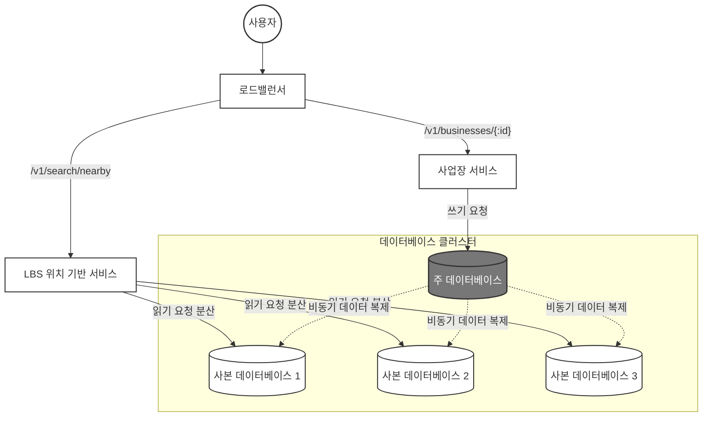
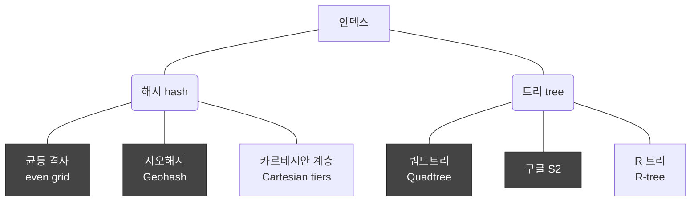
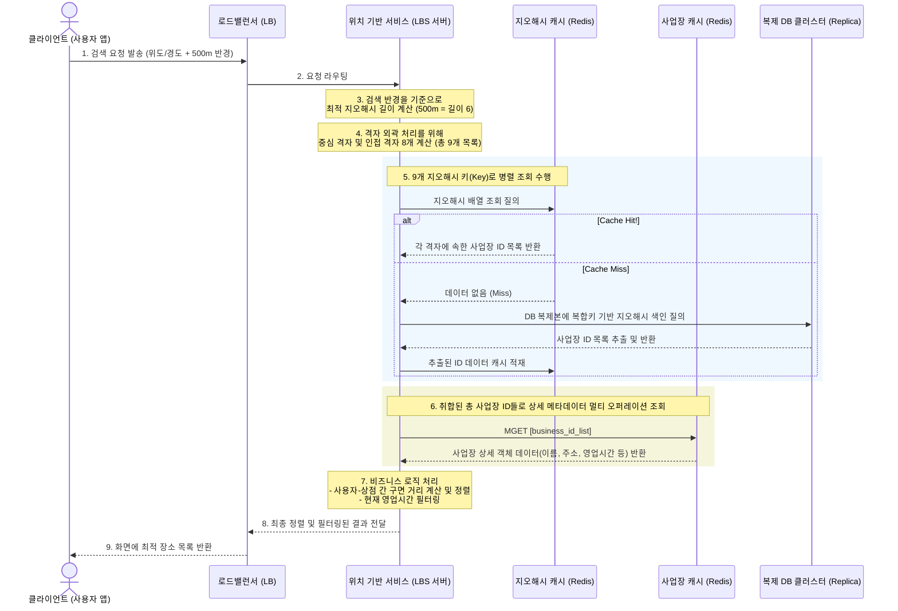

<!-- TOC -->
* [1. 요구사항 및 규모 추정](#1-요구사항-및-규모-추정)
  * [1.1. 기능 요구사항](#11-기능-요구사항)
  * [1.2. 비기능 요구사항](#12-비기능-요구사항)
  * [1.3. 개략적 규모 추정(Back-of-the-envelope calculation)](#13-개략적-규모-추정back-of-the-envelope-calculation)
* [2. 개략적 아키텍처와 지리 정보 인덱싱 알고리즘](#2-개략적-아키텍처와-지리-정보-인덱싱-알고리즘)
  * [2.1. 개략적 설계안 및 핵심 컴포넌트](#21-개략적-설계안-및-핵심-컴포넌트)
    * [2.1.1. 엔드포인트 및 API 설계](#211-엔드포인트-및-api-설계)
    * [2.1.2. 데이터 모델링 및 MySQL 채택 이유](#212-데이터-모델링-및-mysql-채택-이유)
      * [2.1.2.1. 데이터 스키마](#2121-데이터-스키마)
    * [2.1.3. 시스템 개략적 설계안](#213-시스템-개략적-설계안)
    * [2.1.4. 핵심 서비스 및 규모 확장성 전략](#214-핵심-서비스-및-규모-확장성-전략)
  * [2.2. 주변 사업장 검색 알고리즘](#22-주변-사업장-검색-알고리즘)
    * [2.2.1. 2차원 검색의 한계](#221-2차원-검색의-한계)
    * [2.2.2. 균등 격자(Even grid)](#222-균등-격자even-grid)
    * [2.2.3. 지오해시(Geohash)](#223-지오해시geohash)
      * [2.2.3.1. 격자 가장자리(Edge) 이슈](#2231-격자-가장자리edge-이슈)
      * [2.2.3.2. 표시할 사업장이 충분하지 않은 경우](#2232-표시할-사업장이-충분하지-않은-경우)
    * [2.2.4. 쿼드트리(Quadtree)](#224-쿼드트리quadtree)
      * [2.2.4.1. 쿼드트리를 저장하는데 필요한 메모리는?](#2241-쿼드트리를-저장하는데-필요한-메모리는)
      * [2.2.4.2. 쿼드트리 구축에 소요되는 시간은?](#2242-쿼드트리-구축에-소요되는-시간은)
      * [2.2.4.3. 쿼드트리로 주변 사업장을 검색하려면?](#2243-쿼드트리로-주변-사업장을-검색하려면)
      * [2.2.4.4. 쿼드트리 운영 시 고려사항](#2244-쿼드트리-운영-시-고려사항)
      * [2.2.4.5. 실제 사용되는 쿼드트리 사례](#2245-실제-사용되는-쿼드트리-사례)
    * [2.2.5. 구글 S2](#225-구글-s2)
  * [2.3. 지오해시 vs 쿼드트리](#23-지오해시-vs-쿼드트리)
* [3. 상세 설계: DB 샤딩, 초고효율 공간 캐싱](#3-상세-설계-db-샤딩-초고효율-공간-캐싱)
  * [3.1. 데이터베이스 규모 확장성 및 샤딩 전략](#31-데이터베이스-규모-확장성-및-샤딩-전략)
    * [3.1.1. 사업장 테이블 및 지오해시 테이블 설계](#311-사업장-테이블-및-지오해시-테이블-설계)
    * [3.1.2. 지리 정보 색인의 규모 확장](#312-지리-정보-색인의-규모-확장)
  * [3.2. 대규모 트래픽을 담당하는 고성능 캐시 아키텍처](#32-대규모-트래픽을-담당하는-고성능-캐시-아키텍처)
    * [3.2.1. 캐시 계층 도입 기준](#321-캐시-계층-도입-기준)
    * [3.2.2. 올바른 공간 캐시 key 설계](#322-올바른-공간-캐시-key-설계)
      * [3.2.2.1. 사용자 raw 좌표(위도, 경도)를 캐시 key로 쓰는 경우의 참사](#3221-사용자-raw-좌표위도-경도를-캐시-key로-쓰는-경우의-참사)
      * [3.2.2.2. 지오해시 정적 격자를 캐시 key 로 채택(해결책)](#3222-지오해시-정적-격자를-캐시-key-로-채택해결책)
      * [3.2.2.3. 캐시 구조 및 메모리 계산 산정](#3223-캐시-구조-및-메모리-계산-산정)
  * [3.3. 글로벌 가용성 및 부가 비즈니스 로직 처리](#33-글로벌-가용성-및-부가-비즈니스-로직-처리)
    * [3.3.1. 다중 Region 및 가용성 구역 배치](#331-다중-region-및-가용성-구역-배치)
    * [3.3.2. 실시간 영업 여부 및 유형별 필터링 기능 구현](#332-실시간-영업-여부-및-유형별-필터링-기능-구현)
* [4. 최종 아키텍처 다이어그램](#4-최종-아키텍처-다이어그램)
* [참고 사이트 & 함께 보면 좋은 사이트](#참고-사이트--함께-보면-좋은-사이트)
<!-- TOC -->

---

# 1. 요구사항 및 규모 추정

근접성 서비스(Proximity Service)는 사용자의 현재 지리적 위치(위도와 경도)를 기반으로 특정 반경 내에 있는 음식점, 주유소 등의 사업장 목록을 검색하고, 
정보를 제공하는 위치 기반 서비스(LBS, Location-Based Service)이다.
대표적으로 주변 식당을 찾는 '옐프(Yelp)'나 가까운 주유소를 검색하는 '구글 맵'이 이에 해당한다.

대규모 아키텍처를 설계할 때 가장 먼저 해야 할 일은 시스템의 한계와 범위를 명확히 하는 것이다.  
기획 및 기술적 제약 조건을 바탕으로 도출된 핵심 요구사항은 아래와 같다고 가정한다.

---

## 1.1. 기능 요구사항

- 위치 기반 검색
  - 사용자의 GPS 좌표(위도/경도)와 선택한 반경에 매칭되는 사업장 목록을 정확하게 반환해야 한다.
- 동적 반경 변경
  - 사용자는 UI에서 검색 반경을 **0.5km, 1km, 2km, 5km, 20km** 로 자유롭게 변경할 수 있어야 하며, 최대 허용 반경은 **20km**로 제한한다.
- 사업장 데이터 관리
  - 사업장 소유주는 자신의 사업장 정보를 시스템에 추가/삭제/갱신할 수 있다.
- 비실시간 반영 허용
  - 소유주가 수정한 정보가 검색 결과에 실시간으로 반영될 필요는 없으며, **다음 날까지만 반영**되어도 무방하다.
- 상세 정보 조회
  - 고객은 검색된 사업장의 상세 페이지를 조회할 수 있어야 한다.
- 화면 자동 갱신 비활성화
  - 사용자가 이동 중이더라도 이동 속도가 아주 빠르지 않으므로, 현재 위치 기준으로 화면을 상시 자동 갱신할 필요는 없다.

---

## 1.2. 비기능 요구사항

- 낮은 응답 지연(Low Latency)
  - 사용자가 주변 검색을 할 때 답답함을 느끼지 않도록 매우 신속하게 결과를 반환해야 한다.
- 고가용성 및 규모 확장성
  - 인구 밀집 지역(예: 강남역)에서 특정 시간대(점심/퇴근 시간)에 트래픽이 급증해도 시스템이 동작해야 한다.
- 데이터 보호 및 사생활 보장
  - 사용자 위치 정보는 민감한 개인정보이므로, 이를 안전하게 보호하고 관련 법령을 준수해야 한다.

> **GDPR(General Data Protection Regulation)**
> 
> GDPR(유럽 일반 개인정보보호법)은 유럽연합(EU)이 제정한 세계에서 가장 강력한 개인정보 보호 법령이다.  
> 사용자의 위치 데이터와 같은 민감 정보는 GDPR의 핵심 규제 대상이다.
> 
> - 핵심 원칙: 기업은 사용자의 위치 정보를 수집할 때 **명시적 동의**를 받아야 하며, 목적 달성 후에는 지체 없이 **파기 또는 익명화**해야 한다.
> - 잊힐 권리(Right to Forgotten): 사용자가 요청하면 시스템 내에 저장된 사용자의 위치 이력 등 모든 개인 데이터를 완전히 삭제할 수 있는 구조를 아키텍처 설계 단계부터 반영해야 한다.

---

## 1.3. 개략적 규모 추정(Back-of-the-envelope calculation)

시스템 인프라의 규모를 결정하기 위해 대략적인 트래픽과 처리량(QPS)를 산정해본다.

- **기본 가정 수치**
  - 일일 능동 사용자 수(DAU, Daily Active User): 1억명($$10^8$$)
  - 총 등록 사업장 수: 2억 개($$2 * 10^8$$)
  - 사용자당 일평균 검색 횟수: 5회
- **QPS(Query Per Second) 계산**
  - 하루 시간인 86,400초를 계산 편의상 $$10^5$$초로 올림하여 계산한다.
  - 하루 총 검색 수 = $$10^8$$명 * 5회 = 5 * $$10^8$$회
  - 평균 QPS = $$\frac{5 * 10^8회}{10^5초} = 5,000$$

최종적으로 시스템은 **평균 5,000 QPS**를 처리할 수 있어야 하며, 트래픽 피크 타임을 고려하면 이보다 2~3배 높은 대역폭을 감당할 수 있는 확장성이 필요하다.

---

이 시스템은 전형적인 **읽기 중심(Read-heavy)** 시스템으로, 초당 5,000번 이상의 읽기 요청을 지연 없이 처리하는 것이 핵심이다.  
위치 정보는 **GDPR/CCPA 규정**을 철저히 준수하도록 설계 단계부터 보안 및 익명화 전략을 수립해야 한다.  
데이터의 실시간 동기화 요구사항이 낮으므로(익일 반영), DB 쓰기 부하보다는 **조회 성능 최적화**와 **캐싱 전략**에 집중해야 한다.

---

# 2. 개략적 아키텍처와 지리 정보 인덱싱 알고리즘

**<위치 기반 서비스(LBS)와 공간 인덱싱의 필요성>**  
대규모 근접성 서비스를 안정적으로 구축하기 위해서는 수억 개의 지리적 좌표 데이터 속에서 사용자의 현재 위치와 인접한 사업장을 ms 단위로 찾아내는 **공간 인덱싱(Spatial Indexing)** 기술이 
필수적이다.  
Stateless 아키텍처 구조의 서버 설계와 더불어, 2차원의 위도/경도 데이터를 1차원 선형 인덱스로 변환하는 고성능 알고리즘의 trade-off를 이해해야 최적의 시스템을 설계할 수 있다.

---

## 2.1. 개략적 설계안 및 핵심 컴포넌트

### 2.1.1. 엔드포인트 및 API 설계

근접성 서비스의 핵심인 주변 검색 API는 대량의 트래픽과 데이터 반환을 안전하게 제어할 수 있도록 [**페이징**](https://developer.atlassian.com/server/confluence/pagination-in-the-rest-api/) 처리를 필수로 포함한다.

- **주변 사업장 검색 API**
  - Endpoint: GET /v1/search/nearby
  - Request Parameters:
    - latitude(검색할 위도, Decimal, 필수)
    - longitude(검색할 경도, Decimal, 필수)
    - radius(검색 반경, Int, 선택 항목이며 기본값은 5km)
    - Response Body:
```json
{
  "total": 10,
  "businesses": [
    { "business_id": 123, "name": "맛있는 식당", "address": "..." }
  ]
}
```

- **사업장 관리용 CRUD API**
  - 상세 정보 조회: GET /v1/businesses/:id
  - 사업장 추가: POST /v1/businesses
  - 사업장 수정: PUT /v1/businesses/:id
  - 사업장 삭제: DELETE /v1/businesses/:id

> **Tip!**
> 
> 실제 프로덕션 환경을 구축할 때는 구글 장소(Places)나 옐프(Yelp) 사업장 검색 API의 파라미터 구조를 벤치마킹하는 것이 큰 도움이 됩니다.
> 
> - 구글 장소 API: https://developers.google.com/maps/documentation/places/web-service/legacy/search?hl=ko
> - 옐프 사업장 API: https://docs.developer.yelp.com/reference/v3_business_search

---

### 2.1.2. 데이터 모델링 및 MySQL 채택 이유

주변 검색과 상세 조회가 시스템 연산의 대부분을 차지하는 **압도적인 읽기 중심(Read-heavy)** 시스템이다.  
반면, 소유주가 장소 정보를 편집하는 쓰기 연산의 비율은 극히 낮다.

<**읽기 중심에서 MySQL이 바람직한 이유와 타 DB와의 비교**>  
- **왜 모든 데이터를 MongoDB나 Redis에 넣지 않는가?**
  - **정형 데이터의 안정성**
    - 사업장 이름, 주소 등의 스키마가 매우 명확한 정형 데이터이다. RDBMS인 MySQL은 이러한 고정 스키마 데이터를 가장 안정적으로 관리한다.
  - **Redis의 한계**
    - Redis는 모든 데이터를 메모리에 상주시키는 **In-memory DB**이다.
    - 2억 개의 사업장 상세 데이터를 전부 Redis에 상시 보관하면 **메모리 유지 비용이 천문학적으로 발생**한다.
    - 따라서 Redis는 뒤에 나올 지오해시 인덱스나 캐싱 용도로만 사용하고, 마스터 데이터는 디스크 기반의 RDBMS에 두는 것이 비용 효율적이다.
  - **MongoDB의 한계**
    - NoSQL인 MongoDB 역시 뛰어난 읽기 성능과 지리 색인을 지원하지만, 정형 데이터의 엄격한 일관성과 다중 사본(Read Replica) 확장 신뢰성 측면에서 오랜 기간 검증된 MySQL이 구조적 안정감을 준다.
- **Oracle, MSSQL에 비해 MySQL이 추천되는 대규모 아키텍처적 이유**
  - 수만~수십만 QPS의 읽기 요청을 분산하려면 수십 대의 Replica를 Scale-out해야 한다.
  - 코어 단위나 서버 대수 단위로 **라이선스 비용이 청구되는 Oracle, MSSQL은 인프라 확장 시 비용 폭탄**으로 이어진다.
  - 반면 오픈소스인 MySQL은 비용 부담없이 무제한으로 Replica를 증설할 수 있다.

---

#### 2.1.2.1. 데이터 스키마

- **business 테이블**
  - business_id를 PK로 하며, 이름/주소 등 사업장 상세 정보를 담는다.
- **지리적 위치 색인 테이블**
  - 위치 기반 공간 연산 속도를 끌어올리기 위한 인덱스 전용 테이블이다.

---

### 2.1.3. 시스템 개략적 설계안

이 시스템은 위치 기반 서비스(LBS)와 사업장 관련 서비스, 두 부분으로 구성된다.




---

### 2.1.4. 핵심 서비스 및 규모 확장성 전략

**1) 위치 기반 서비스(LBS)**  
- 특정 반경 내 사업장을 조회하는 컴포넌트이며, 오직 **읽기 요청만 수없이 발생**한다.
- **Stateless 서비스**이므로 인구 밀집 지역의 트래픽 폭증 시 즉각적인 Scale-out이 가능하다.

**2) 사업장 서비스**  
- 소유주의 정보 관리(쓰기) 및 고객의 상세 조회(읽기)를 담당한다.
- 쓰기 QPS는 상대적으로 낮아 시스템 부하가 적다.

**3) 아키텍처 확장성 포인트**  
- **복제 지연(Replication Lag) 허용**
  - Master DB와 Replica 간의 비동기 복제로 인한 미세한 데이터 불일치가 발생할 수 있다.
  - 그러나 비기능 요구사항에서 검토했듯 사업장 정보는 실시간 반영이 불필요하므로 이러한 구조가 가용성 면에서 완벽히 유리하다.
- **오토스케일링**
  - 사업장 서비스와 LBS 모두 Stateless이므로 피크 타임(예: 점심 시간)에 맞추어 유연하게 서버 대수를 자동으로 조절할 수 있다.


---

## 2.2. 주변 사업장 검색 알고리즘

대규모 시스템에서 공간 정보를 다루는 대표적인 알고리즘 5가지의 핵심 원리와 한계에 대해 알아본다.

> 실제로 많은 회사가 [레디스 지오해시(Geohash in Redis)](https://redis.io/docs/latest/commands/GEOHASH/)나 PostGIS 확장을 설치한 Postgres DB를 활용한다.

---

### 2.2.1. 2차원 검색의 한계

가장 단순하게 위도와 경도 범위를 지정하여 SQL 상에서 격자 구역을 쿼리하는 방식이다.

```sql
SELECT business_id, latitude, longitude
  FROM business
 WHERE (longitude BETWEEN {:my_lat} - radius AND {:my_lat} + radius)
   AND (latitude BETWEEN {:my_long} - radius AND {:my_long} + radius)
```

이 쿼리는 데이터가 많아질수록 인덱스를 타더라도 테이블 전체를 풀스캔하듯 비효율적으로 작동한다.  
위도와 경도에 인덱스를 만들어도 데이터가 2차원적이므로 컬럼별로 가져온 결과도 여전히 엄청난 양이다.
위도 컬럼의 데이터 집합 1과 경도 컬럼의 데이터 집합 2는 빠르게 추출 가능하지만, 주어진 반경 내 사업장을 얻으려면 두 집합의 교집합을 구해야 하는데,
이 연산은 각 집합에 속한 데이터의 양 때문에 효율적일 수 없다.

이렇게 인덱스를 하는 것의 문제는 오직 한 차원의 검색 속도만 개선할 수 있다는 것이다.

> **위도와 경도를 복합키로 만들어도 해결되지 않는다.**
> 
> DB의 복합 인덱스는 기본적으로 **1차원 선형 구조(B-Tree 계열)**이다.  
> 인덱스를 (latitude, longitude) 순서로 묶어 생성하게 되면, DB는 첫 번째 조건인 latitude 범위에 해당하는 데이터를 먼저 일렬로 찾은 뒤,  
> 그 추출된 방대한 데이터 그룹 안에서 일일이 longitude 범위를 필터링해야 한다.
> 
> 즉, 두 차원의 데이터가 독립적으로 사각형 범위를 지니기 때문에 하나의 차원 인덱스 속도만 개선될 뿐,  
> 나머지 한 축은 인덱스의 혜택을 온전히 받지 못하고 거대한 교집합 연산 비용을 치러야 한다.
> 
> 따라서 2차원 데이터를 1차원 선형 데이터로 변환해 주는 특수 인덱싱이 필요하다.


그럼 자연스럽게 2차원 데이터를 1차원에 대응시킬 방법이 있을까? 를 알아보기 전에 인덱스를 만드는 방법들부터 알아보자.

지리적 정보에 인덱스를 만드는 방법을 두 종류이다.



각 색인법은 구현 방법은 다르지만 지도를 작은 영역으로 분할하고, 고속 검색이 가능하도록 색인을 만든다는 아이디어는 같다.

---

### 2.2.2. 균등 격자(Even grid)

지도를 단순하게 일정한 크기의 바둑판 격자로 나누는 직관적인 접근법이다.

균등 격자의 문제점은 아래와 같다.

- **불균등한 분포**
  - 강남역에는 수만 개의 상점이 모여있지만, 사막 한 가운데 격자에는 상점이 단 하나도 없다.
  - 전 세계를 동일 크기로 나누면 격자별 데이터 편차가 너무 심해진다.
- **인접 격자 탐색 분리**
  - 격자 ID 할당 체계에 계층이나 연관성이 없어 내 격자 바로 옆 격자의 식별자를 계산해 내기가 매우 까다롭다.

---

### 2.2.3. 지오해시(Geohash)

2차원의 위도/경도 좌표 데이터를 격자 기반의 재귀적 분할을 통해 **1차원 문자열**로 인코딩하는 방식이다.

본초 자오선(Prime Meridian)은 영국 그리니치 천문대를 통과하는 경도 $$0^\circ$$의 기준선이다.  
지구를 동반구(경도 $$0^\circ \sim 180^\circ$$)와 서반구(경도 $$-180^\circ \sim 0^\circ$$)로 가르는 수직 기준선이 된다.  
지오해시는 바로 이 본초 자오선과 적도(위도 $$0^\circ$$)를 기준으로 전 세계를 4개의 사분면으로 조각내며 비트 매핑을 시작한다.  
즉, 2차원의 위도,경도 데이터를 1차원의 문자열로 반환하고, 비트를 하나씩 늘려가면서 재귀적으로 세계를 더 작은 격자로 분할해나가는 방식이다.

먼저 전 세계를 본초 자오선과 적도 기준 사분면으로 나눈다.

- 위도 범위 [-90, 0]은 0에 대응
- 위도 범위 [0, 90]은 1에 대응
- 경도 범위 [-180, 0]은 0에 대응
- 경도 범위 [0, 180]은 1에 대응

그 격자를 또 다시 사분면으로 나누고, 이 때 각 격자는 경도와 위도 비트를 위처럼 순서대로 반복한다.
이 절차를 원하는 정밀도(precision)를 얻을 때까지 반복한다.


[지오해시](https://www.movable-type.co.uk/scripts/geohash.html)는 이진 분할을 반복하며 얻은 비트들을 모아 **Base32** 형태의 문자열로 나타낸다. 문자의 길이가 길어질수록 격자는 좁아지고 정밀도는 정교해진다.

예) 구글 본사 지오해시 (길이 = 6)
1001 10110 01001 10000 11011 11010 (base32 이진 표기) → 9q9hvu (base32)

지오해시는 12단계의 정밀도를 갖는데, 이 정밀도가 격자 크기를 결정한다.

[지오해시 길이와 격자 크기]

| 지오해시 길이 | 격자 너비 × 높이 |
| --- | --- |
| 1 | 5,009.4km × 4,992.6km (지구 전체) |
| 2 | 1,252.3km × 624.1km |
| 3 | 156.5km × 156km |
| 4 | 39.1km × 19.5km |
| 5 | 4.9km × 4.9km |
| 6 | 1.2km × 609.4m |
| 7 | 152.9m × 152.4m |
| 8 | 38.2m × 19m |
| 9 | 4.8m × 4.8m |
| 10 | 1.2m × 59.5cm |
| 11 | 14.9cm × 14.9cm |
| 12 | 3.7cm × 1.9cm |

그럼 최적 정밀도는 어떻게 정할까?
사용자가 지정한 반경으로 그린 원을 덮는 최소 크기 격자로 만드는 지오해시 길이를 구해야 한다.

[검색 반경과 지오해시 길이]

| 반지름 (킬로미터) | 지오해시 길이 |
| --- | --- |
| 0.5km (0.31마일) | 6 |
| 1km (0.62마일) | 5 |
| 2km (1.24마일) | 5 |
| 5km (3.1마일) | 4 |
| 20km (12.42마일) | 4 |

---

#### 2.2.3.1. 격자 가장자리(Edge) 이슈

지오해시는 공통 접두어(prefix)가 길수록 두 지점이 물리적으로 가깝다는 특성을 가지지만, **그 역은 성립하지 않을 수 있다.**


```sql
-- 대단히 위험한 쿼리 예시
SELECT * FROM geohash_index WHERE geohash LIKE 'u17e0%';
```

두 사업장이 단 30km 거리를 두고 마주보고 있더라도, 한 사업장은 적도 위(u000), 한 사업장은 적도 아래(ezzz) 격자에 걸치게 되면 두 지오해시 문자열은 
**공통 접두어가 단 한 글자도 존재하지 않게 된다.**

이에 대한 해결책은 내 위치가 속한 격자 하나만 검색하면 안되며, 내 격자를 에워싸고 있는 **인접 격자 8개(총 9개 격자)의 사업장을 상시 함께 조회**하여 취합해야 한다.  
인접 격자를 구하는 연산은 상수 시간($$O(1)$$) 내에 매우 빠르게 처리된다.


격자 가장자리의 또 다른 문제는 두 지점이 공통 prefix 길이는 길지만 서로 다른 격자에 놓이는 경우이다.


---

#### 2.2.3.2. 표시할 사업장이 충분하지 않은 경우

현재 격자와 주변 격자를 다 보아도 표시할 사업장이 충분하지 않으면 어떻게 해야할까?

- 주어진 반경 내 사업장만 반환한다.
  - 구현하지 쉽지만 사용자의 욕구를 만족하기 충분한 수의 사업장 정보를 반환하지 못함
- 검색 반경을 키운다.
  - 지오해시의 마지막 비트를 삭제하여 얻은 새 지오해시 값을 사용하여 주변 사업장을 검색한다. 
  - 그래도 사업장 수가 충분하지 않으면 또 한 비트를 지워서 범위를 다시 확장한다.

---

### 2.2.4. 쿼드트리(Quadtree)

쿼드트리는 자식 노드를 정확히 4개씩(2 * 2) 가질 수 있는 메모리 기반 트리 자료 구조이다.  
"하나의 격자 내부 사업장 수가 100개를 초과하면 공간을 사분면으로 쪼갠다"는 조건 기반으로 공간을 분할한다.

쿼드트리를 사용한다는 것은 결국 질의에 답하는 데 사용될 트리 구조를 메모리 안에서 만드는 것이다.
쿼드트리는 메모리 안에 놓이는 자료 구조일 뿐 DB가 아니라는 것에 유의하자.

이 자료구조는 각각의 LBS 서버에 존재해야 하며, 서버가 시작되는 시점에 구축된다.

전 세계에 백만개의 사업장이 있다고 해보자.


그 과정을 좀 더 자세히 시각화하면 아래와 같다.


트리의 루트 노드는 세계 전체 지도이고, 이 루트 노드를 사분면 각각을 나타내는 하위 노드로, 어떤 노드도 사업장 100개를 너지 않을때까지 재귀적으로 분할한다.

```kotlin
// 쿼드트리 구축 핵심 메커니즘 예시
fun buildQuadtree(node: TreeNode) {
  if (countNumberOfBusinessesInCurrentGrid(node) > 100) {
    node.subdivide() // 공간을 4개의 자식 노드로 분할
    for (child in node.children) {
      buildQuadtree(child) // 재귀 호출
    }
  }

```

---

#### 2.2.4.1. 쿼드트리를 저장하는데 필요한 메모리는?

이 질문에 답하려면 어떤 데이터가 쿼드트리에 보관되는지 먼저 알아야 한다.

- **Leaf Node에 저장되는 데이터**
  - 격자를 식별하는데 사용할 좌상단과 우하단 꼭짓점 좌표: 32 byte(8byte * 4)
    - 2차원 평면의 격자 범위를 특정하려면 **2개 점**의 좌표가 필요하다. 즉, '좌상단 꼭짓점'과 '우하단 꼭짓점'이다.
    - 그런데 점 하나는 내부적으로 **(위도,경도)**라는 2개의 실수형(double, 8 byte) 데이터 쌍으로 이루어져 있다.
    - 따라서 $$\text{점 2개} \times \text{좌표 2개(위도, 경도)} = \text{총 4개의 실수 데이터}$$가 필요하기 때문에 물리적으로 `8byte * 4 = 32byte`가 노드에 할당되는 것이다.
  - 격자 내부 사업장 ID 목록: ID당 8byte * 100 (한 격자에 허용되는 사업장 수의 최댓값)
    - 대개 ID(식별자)는 미래의 대규모 데이터 확장성을 고려하여 64bit 정수형(= 8byte)을 사용하기 때문에 하나의 사업장 ID는 8 byte(Java의 Long, DB의 BIGINT)
  - 총 832 byte
- **Internal Node에 저장되는 데이터**
  - 격자를 식별하는데 사용할 좌상단과 우하단 꼭짓점 좌표: 32 byte(8 byte * 4)
  - 하위 노드 4개를 가리킬 포인터: 32 byte(8 byte * 4)
    - 메모리 주소를 가리키는 포인터 크기는 OS와 CPU의 아키텍처 기반에 결정된다.
    - **포인터 1개의 크기 = 8byte**
      - 우리가 사용하는 대부분의 서버용 OS와 CPU는 64비트 아키텍처이다.
      - 64비트 시스템에서 메모리의 특정 주소를 가리키는 포인터 변수 1개의 크기는 예외없이 정확히 64비트, 즉 **8byte**가 된다.
    - **하위 노드가 4개인 이유**
      - 쿼드트리는 이름 그대로 공간을 늘 4개(사분면)로 분할하는 트리구조이다.
      - 하나의 부모(Internal node)는 쪼개진 4개의 자식 노드 주소를 모두 알고 있어야 한다.
      - 따라서 부모 노드가 자식 노드 4개의 메모리 주소를 저장하기 위해 필요한 공간은 아래와 같이 계산된다.
      - `포인터 크기(8byte) * 자식 노드 개수(4개) = 32byte`
  - 총 64 byte

한 격자에 허용되는 사업장 수의 최대값에 좌우되기는 하지만 그 값은 트리안에 저장하지 않아도 된다.    
메모리에 생성된 쿼드트리 구조 자체가 이미 조건(최대 100개)에 맞춰 하위 노드로 쪼개져 분할을 끝마친 상태이기 때문이다.  
즉, 노드 인스턴스 하나하나마다 `max_limit = 100` 이라는 상숫값 정보를 변수로 중복해서 저장하여 아까운 메모리 공간을 낭비할 필요가 없다는 뜻이다.  
인프라 설계 측면에서 순수 데이터만 적재하려는 극단적인 공간 최적화 관점이다.

이제 각 노드가 어떤 데이터를 저장하는지 알았으니 메모리를 계산해보자.
전 세계에는 이백만개의 사업장이 있다고 가정한다.

- 격자 안에는 최대 100개의 사업장이 있을 수 있음
- Leaf node의 수 =~ $$\frac{200m}{100}$$ =~ 2백만(2m)
- Internal node의 수 = 2m * $$\frac{1}{3}$$ =~ 0.67m
  - Internal node의 수가 왜 Leaf node 수의 $$\approx \frac{1}{3}$$ 인지는 [쿼드트리에는 얼마나 많은 Leaf node가 있는가](https://stackoverflow.com/questions/35976444/how-many-leaves-has-a-quadtree) 를 참고하면 된다.
- 총 메모리 요구량 = 2m * 832byte + 0.67m * 64byte =~ 1.71GB
  트리를 구축하는데 드는 부가적인 메모리를 감안하더라도 총 메모리 요구량은 꽤 작다.

<**Internal node의 수가 왜 Leaf node 수의 $$\approx \frac{1}{3}$$ 인 이유**>  
단 1개의 노드에서 시작해 트리가 확장되는 과정을 따라가보면 이해가 된다.  
- **단계 0(최초 상태)**: 루트 노드 1개만 존재한다. 아직 쪼개지지 않았으니 Leaf node이다.
  - Internal node: 0, Leaf node: 1
- **단계 1(1번 분할)**: 루트 노드에 데이터가 많아서 4개로 쪼갠다. 이제 루트는 Internal node가 되고, 아래 4개는 자식이 없는 Leaf node가 된다.
  - Internal node: 1, Leaf node: 4 → ($$1 = \frac{(4-1)}{3}$$ 성립)
- **단계 2(2번 분할)**: 4개의 Leaf node 중 단 1개만 데이터가 또 많아서 4개로 추가 분할되었다고 해보자.
  - 기존 Leaf node 4개 중 1개가 Internal node로 승격되었으니 Internal node = 1 + 1 = 2개
  - Leaf node는 기존 3개에서 새로 생긴 Leaf node 4개가 더해지므로 Leaf node = 3 + 4 = 7개
  - Internal node: 2, Leaf node = 7 → ($$2 = \frac{(7-1)}{3}$$ 성립)

이렇게 쿼드트리는 공간을 한 번 쪼갤 때마다 Internal node는 1개씩 늘어나는 반면, Leaf node는 순증가분 기준으로 항상 3개씩(4-1) 늘어나는 특징이 있다.  
따라서 트리가 아무리 거대해져도 Internal node의 총 개수는 언제나 Leaf node 개수의 $$\approx \frac{1}{3}$$ 에 수렴하게 된다.  
수억 개의 데이터를 다루는 아키텍처 설계에서도 이 불변의 법칙 덕분에 정확한 메모리 예측이 가능하다.

쿼드트리 인덱스가 메모리를 적게 사용하지만 읽기 연산 양이 많아지면 서버 한 대의 CPU나 네트워크 대역폭으로는 감당하기 어려워지므로 읽기 연산을 여러 대 쿼드트리 서버로 분리하는 것이 좋다.

---

#### 2.2.4.2. 쿼드트리 구축에 소요되는 시간은?

각 Leaf node에는 대략 100개의 사업장 ID가 저장된다.
전체 사업장 수를 n이라 하면 트리를 구축하는 시간 복잡도는 $$\frac{n}{100}\log\frac{n}{100}$$ 이다.

<**$$\frac{n}{100}\log\frac{n}{100}$$의 상세 설명**>  
전체 사업장 개수가 n이고, 한 Leaf node가 감당하는 최대 용량이 100개이므로, 최종적으로 트리가 다 쪼개졌을 때 형성되는 Leaf node의 총 개수는 대략 $$m = \frac{n}{100}$$ 개가 된다.  
완전히 균형 잡힌 사분트리 구조에서 새로운 요소를 탐색하고 분할 깊이를 찾아내려가는 과정의 깊이(Height)는 $$\log m$$, 즉 $$\log(\frac{n}{100})$$ 수준에 수렴한다.  
따라서 이 조각난 공간 단위를 기준으로 전체 인덱싱 크리를 완전히 조립하고 배치하는 총 구축 작업의 시간 복잡도는 Leaf 개수와 깊이(Height)의 곱인 $$O(m \log m) \rightarrow \frac{n}{100}\log\frac{n}{100}$$ 스케일을 형성하게 된다.

200m개의 사업장 정보를 인덱싱하는 쿼드트리 구축에는 몇 분 정도가 소요될 수 있다.

---

#### 2.2.4.3. 쿼드트리로 주변 사업장을 검색하려면?

- 메모리에 쿼드트리 인덱스를 구축한다.
- 검색 시작점이 포함된 Leaf node를 만날 때까지, 트리의 루트 노드부터 탐색한다.
  -해당 노드에 100개의 사업장이 있다면? → 해당 노드만 반환한다.
- 그렇지 않다면? → 충분한 사업장 수가 확보될 때까지 인접 노드도 추가한다.

---

#### 2.2.4.4. 쿼드트리 운영 시 고려사항

쿼드트리는 메모리 내에서 동작하므로 탐색 속도가 압도적으로 빠르다는 장점이 있지만, '모든 인덱스 데이터가 가동 중인 서버의 메모리(RAM)에만 존재한다'는 특성 때문에 
배포와 데이터 변경 관점에서 까다로운 운영 리스크를 동반한다.  
수억 개의 장소 데이터를 메모리에 올리고 동기화하는 과정에서 발생하는 인프라 병목 현상과 아키텍처적 해결책을 명확히 이해해야 한다.

---

**1.서버 초기 기동 지연 및 DB 과부하(Thundering Herd)**

**🚨문제점: 무거운 배포와 DB 병목**

쿼드트리 인덱스는 서버가 메모리에 직접 구축해야 하는 자료구조이므로, **LBS(위치 기반 서비스) 서버가 시작되는 시점에 전체 인덱스를 빌드**해야 한다.

- **서비스 중단 리스크**
  - 트리를 새로 구축하는 동안 클라이언트의 검색 트래픽을 처리할 수 없음
- **DB Thundering Herd 현상**
  - 서버를 배포하거나 Scale-out할 때, 수십 대의 LBS 서버가 대규모 사업장 정보(약 2억개)를 가져오기 위해 **DB에 동시에 READ 질의**를 던짐
  - 이로 이해 Master 혹은 Replica DB의 CPU가 100%를 찍으며 시스템 전체가 마비될 수 있음

**💡해결 전략: Blue/Green 배포 및 기동 시차 분산**
- **Blue/Green 배포**
  - 구 버전 서버 레이어(Blue)가 트래픽을 안정적으로 처리하는 동안, 새 버전 서버 레이어(Green)를 백그라운드에 띄워 쿼드트리 인덱스 빌드를 완전히 끝마친 후 트래픽 라우팅을 한 번에 전환함
- **단계적 기동(Staggered Startup)**
  - 새 서버들을 동시에 기동하지 않고 몇 분의 시차를 두고 순차적으로 띄워서 DB 레이어가 감당할 수 있는 수준으로 읽기 부하 제어

---

**2.데이터 추가/삭제 시 인덱스 갱신 및 동시성 제어 전략**

사용자가 새로운 사업장을 등록하거나 삭제할 때, 메모리에 상주하는 쿼드트리 인덱스를 어떻게 동기화할 것인가에 대한 문제이다.  
여기에는 3가지 트레이드오프가 존재한다.

- **방안 A: 점진적/순차적 갱신(가장 추천하는 현실적 대안)**
  - 클러스터 내부에 존재하는 수십 대의 LBS 서버를 한 번에 동기화하지 않고, **롤링 업데이트 방식으로 서버를 몇 개씩만 순차적으로 갱신**하는 전략이다.
    - **장점**: 시스템 전체에 가해지는 동기화 부하가 적고 구현이 단순함
    - **단점**: 서버마다 인덱스 반영 시점이 미세하게 달라져, 사용자가 접속한 서버에 따라 아주 짧은 시간 동안 일시적으로 오래된 데이터(Stale Data)가 반환될 수 있음
    - **적합성**: 요구사항 분석 단계에서 '신규 사업장 정보는 다음 날까지만 반영되어도 무방하다'라고 합의했으므로, 이 미세한 데이터 불일치는 서비스 운영상 전혀 문제가 되지 않음
- **방안 B: 야간 일괄 무효화 및 캐시 갱신**
  - 트래픽이 가장 적은 새벽 시간대에 배치를 돌려 인덱스와 캐시 데이터를 통째로 새로고침하는 방식이다.
  - **⚠️주의 사항(Cache Stampede 위험)**: 수많은 인덱스 key가 한 번에 만료되거나 무효화되면, 아침 피크 타임이 시작되자마자 수많은 검색 요청이 캐시를 
  통과하여 백엔드 서버와 DB로 일시에 몰리는 **캐시 스탬피드** 현상이 발생하여 서버가 다운될 수 있음
- **방안 C: 실시간 인덱스 갱신**
  - 데이터가 변경될 때마다 메모리에 있는 쿼드트리 구조를 즉시 변경하는 방식이다.
  - **단점(극심한 복잡성과 Lock 병목)**: 대규모 트래픽 환경에서 수많은 스레드가 하나의 쿼드트리 자료구조에 동시에 접근하여 읽고 쓰는 멀티스레드 환경이 강제된다.   
   데이터 무결성을 지키려면 **[뮤텍스(Mutex)](https://assu10.github.io/dev/2024/10/20/mutex-semaphore/)나 Lock 메커니즘**을 도입해야 하는데, 이로 인해 쓰기 작업이 수행되는 동안 수만 건의 읽기(검색) 요청이 대기하게 되므로 서비스 응답 지연이 급격히 악화된다.

---

실무에서는 아래와 같이 운영하는 것이 현실적이다.
- 쿼드트리는 빌드 시 막대한 DB READ 부하를 유발하므로 반드시 **Blue/Green 배포**와 서버 기동 시차 분산 전략을 결합해야 한다.
- 실시간 동기화는 Lock으로 인한 성능 저하를 초래하므로, 비실시간 비즈니스 요구사항에 맞춰 점진적 갱신(Eventual Consistency)이나 야간 배치를 활용하는 것이 대규모 아키텍처 관점에서 훨씬 성숙한 설계이다.

---

#### 2.2.4.5. 실제 사용되는 쿼드트리 사례

아래는 [실제 사용되는 쿼드트리 구축 사례](https://www.educative.io/answers/what-is-a-quadtree-how-is-it-used-in-location-based-services)이다.
인구 밀집 지역에는 작은 격자를, 그렇지 않은 지역에는 큰 격자를 사용한다.


---

### 2.2.5. 구글 S2

[구글 S2 기하(geometry) 라이브러리](https://s2geometry.io/)는 아주 유명한 솔루션이다.  
쿼드트리처럼 구글 S2도 메모리 기반이다.

구글 S2는 지구 전체를 3차원 정육면체로 감싸 안은 뒤, 이를 투영하여 [힐베르트 곡선(Hilbert curve)](https://en.wikipedia.org/wiki/Hilbert_curve)이라는 공간 채움 곡선(space-filling curve)을 
따라 1차원 인덱스로 매칭하는 최첨단 geometry 라이브러리이다.  
힐베르트 곡선 내부에서 인접한 두 격자는 1차원으로 인코딩된 결과물에서도 매우 가깝게 붙어있다는 가공할 만한 장점을 지니고 있다.  
1차원 공간 내에서의 검색은 2차원 공간에서의 검색보다 훨씬 효율적이다.

**[지오펜스(Geofence)](https://en.wikipedia.org/wiki/Geofence)**는 지리적(Geographic) 공간과 울타리(Fence)의 합성어로, 현실 세계의 물리적 
특정 지역 위에 설정한 **가상의 인지적 경계선(울타리)**를 의미한다.  
사용자의 스마트폰 GPS가 이 펜스 영역 안으로 '진입'하거나 '이탈'할 때 실시간 푸시 알림을 쏘거나 이벤트를 발생시키는 기술에 사용된다.  
구글 S2는 셀의 크기를 유연하게 조정할 수 있는 [영역 지정 알고리즘(Region Cover Algorithm)](https://s2.inair.space/)을 탑재하고 있어서 
지오해시처럼 고정된 정밀도를 사용하는 것이 아니라 최소 수준, 최고 수준, 최대 셀 개수 등을 지정할 수 있다.  
이렇게 셀 크기를 유연하게 조정할 수 있기 때문에 복잡한 다각형 형태의 스쿨존이나 정교한 지오펜스 경계를 구현하는데 전 세계에서 가장 최적화되어 있다.

---

## 2.3. 지오해시 vs 쿼드트리

|  비교 항목   | 지오해시                                   | 쿼드트리                                                                                                  |
|:--------:|:---------------------------------------|:------------------------------------------------------------------------------------------------------|
|  구현 난이도  | 매우 쉬움(문자열 연산 중심)                       | 까다로움(메모리 내 트리 관리 필요)                                                                                  |
|  격자 크기   | 정밀도별 고정 크기(동적 조절 불가)                   | 인구 밀도에 따라 **동적 크기 조절** 가능                                                                             |
| 색인 갱신 성능 | 매우 빠름($$O(1)$$ 단일 열 제거/추가)             | 비교적 무거움($$O(\log n)$$, n은 사업장 개수, 트리 순회 및 Lock 필요)                                                    |
|  특수 기능   | 단순 반경 내 검색 특화                          | 내 위치에서 가장 가까운 **k개 장소 찾기**에 특화<br />하위 노드 분할 과정이 숫자 k에 기반하는데다가 k개 사업장을 찾을 때까지 검색 범위를 자동으로 조정할 수 있기 때문 |
|  사용 기업   | Bing 지도, Redis, MongoDB, Elasticsearch | 엑스트(Yext), Elasticsearch                                                                              |


쿼드트리에서 색인 하나를 지우거나 더하려면 루트부터 하위 Leaf node까지 트리의 높이 깊이만큼 반드시 탐색 연산을 수행해야 하므로, 
트리의 높이에 비례하는 **$$O(\log n)$$의 시간 복잡도**를 가지며, 동시성 제어를 위한 Lock 메커니즘이 수반되어 구조가 무거워진다.

---

<**대규모 근접성 서비스 핵심 설계 요약**>
- 대규모 트래픽 분산을 위해 인프라는 Stateless 아키텍처 서버 계층과 오픈소스 MySQL Primary-Secondary 클러스터 조합으로 토대를 구축한다.
- 2차원 공간 조건 쿼리는 복합키 인덱스의 1차원적 한계로 인해 대량의 스캔 유발을 피할 수 없다.
- 대안으로 사용되는 지오해시는 단순 구조와 빠른 갱신 속도가 돋보이지만 가장자리 이슈 처리를 위해 주변 8개 격자를 항상 함께 묶어 질의해야 한다.
- 쿼드트리는 인구 밀도에 맞춰 유연하게 공간을 쪼갤 수 있어 k차 근접 검색에 최상인 반면, 메모리 상의 Lock 관리 및 배포 시 트리 재구축 비용을 신중히 다뤄야 한다.

---

# 3. 상세 설계: DB 샤딩, 초고효율 공간 캐싱

개략적인 구조 설계를 넘어 상세 설계 단계에서는 시스템의 병목을 완전히 제거하는데 집중한다.  
DB의 물리적 한계를 극복하기 위한 수평 분할(샤딩) 기법, GPS 노이즈를 방어하는 정적 격자 기반의 레디스 캐싱 모델, 그리고 글로벌 리전 배치를 통한 데이터 사생활 보호(GDPR) 대응까지 
실무 아키텍처의 디테일을 완성한다.

---

## 3.1. 데이터베이스 규모 확장성 및 샤딩 전략

### 3.1.1. 사업장 테이블 및 지오해시 테이블 설계

- **사업장 테이블(business)**
  - 등록된 사업장 수가 2억 개에 달하므로 단일 DB 서버의 디스크 용량과 성능 압박을 해결하기 위해 샤딩을 적용하기 좋은 후보이다.
  - 가장 직관적이고 효과적인 샤딩 방식은 **고유 식별자인 사업장 ID(business_id)를 샤딩 키**로 삼아 데이터를 여러 노드로 균등하게 분산하는 것이다.
- **지리 정보 색인 테이블**
  - 지오해시를 DB 내에 저장하고 활용하는 방법은 크게 두 가지 전략으로 나뉜다.

|      구성 방안       | 저장 형태                                                 | 장점                                                       | 단점                                                                               |
|:----------------:|:------------------------------------------------------|:---------------------------------------------------------|:---------------------------------------------------------------------------------|
| **방안 1: JSON 배열 구조** | 하나의 지오해시 코드(key)에 속한 모든 사업장 ID들을 JSON 배열로 묶어 단일 열에 보관 | 특정 격자 내부의 ID 목록을 한 번에 조회할 수 있어 읽기 속도가 최적화됨               | 사업장 추가/수정 시 JSON을 먼저 읽어 ID 중복을 체크해야 하고, 병렬 쓰기 시 데이터 유실을 막기 위한 **Lock 메커니즘이 강제**됨 |
| **방안 2: 개별 레코드 구조**  | 동일한 지오해시 구역에 속하더라도 사업장 ID마다 각각 독립된 열을 생성하여 저장 | **지오해시와 사업장 ID를 복합키**로 설정하면 Lock을 걸 필요가 없어 추가/삭제가 매우 용이함 | 데이터 열의 개수가 사업장 수만큼 늘어남                                                           |


대규모 아키텍처에서는 동시성 제어 병목을 유발하는 Lock을 최대한 배제하는 것이 철칙이므로, 방안 2(복합키를 활용한 개별 레코드 구조)를 채택하는 것이 훨씬 성숙한 설계이다.

---

### 3.1.2. 지리 정보 색인의 규모 확장

RDBMS의 경우 부하 분산에 두 가지 전략이 흔히 사용된다.  
하나는 사본 DB 서버를 늘리는 것이고, 다른 하나는 샤딩을 사용하는 것이다.  
지리 정보 색인의 규모 확장 시 테이블에 보관되는 데이터의 실제 크기를 고려하지 않고 샤딩 방법을 결정하는 실수를 하곤 한다.

전체 2억 개의 지리 정보 색인 테이블을 구축하는데 필요한 순수 데이터양은 앞서 [2.2.4.1. 쿼드트리를 저장하는데 필요한 메모리는?](#2241-쿼드트리를-저장하는데-필요한-메모리는)에서 계산한 
쿼드트리 메모리 명세와 유사하게 대략 **1.71GB**에 불과하다. 이 정도 크기는 저렴한 DB 서버 한 대의 메모리도 통째로 수용할 수 있는 용량이다.

따라서 데이터 적재 공간의 한계보다는, 엄청난 읽기 트래픽으로 인한 **CPU 및 네트워크 대역폭 부족이 진짜 병목**이 된다.  
이를 해결하기 위해 Read Replica를 다량 증설하여 읽기 부하를 분산하는 전략이 매우 유용하다.

---

**💡왜 지오해시 테이블 샤딩 로직은 애플리케이션 계층에 구현해야 하며 까다로울까?**

일반적인 DB 샤딩은 `hash(ID) % 서버 대수`와 같이 단일 키의 해시값을 기반으로 특정 서버로 요청을 바로 라우팅한다.  
하지만 지오해시를 통한 주변 검색은 격자 가장자리 이슈를 극복하기 위해 **내 위치 격자를 포함한 인접 8개의 격자(총 9개 지오해시 코드)를 동시에 조회**해야 한다.  
만약 지오해시 테이블을 무턱대고 샤딩해 버리면, 이 9개의 격자 데이터가 서로 전혀 다른 물리 샤드 서버에 쪼개져 저장될 수 있다.

RDBMS 자체는 여러 샤드에 흩어진 분산 데이터를 스스로 모아서 합쳐주는 기능을 네이티브하게 처리하지 못한다.  
결국 **애플리케이션 레이어**에서 9개의 지오해시 타겟 샤드 위치를 직접 계산해 낸 뒤, 각 샤드 서버에 쿼리를 병렬로 찔러 넣고, 돌아온 데이터들을 합산/정렬(Scatter-Gather-패턴)하는 
복잡한 분산 제어로 로직을 개발자가 직접 코드로 짜야 하므로 설계가 대단히 까다로워진다.

따라서 대규모 데이터 수용이 목적이 아니라면, 샤딩 대신 관리와 개발이 훨씬 간편한 **Read Replica 클러스터 구조**를 적극 추천한다.

---

## 3.2. 대규모 트래픽을 담당하는 고성능 캐시 아키텍처

### 3.2.1. 캐시 계층 도입 기준

무조건 캐시를 도입하는 것은 인프라 비용과 아키텍처 복잡도만 높이는 악수가 될 수 있으므로 도입 전에 데이터 크기를 먼저 보아야 한다.

- 읽기 중심이고, DB 크기가 상대적으로 작아서 모든 데이터가 한 대 DB 서버에 수용가능하다면 이 때 질의문 처리 성능은 I/O에 좌우되지 않으므로 메모리 캐시를 사용할 때와 비슷하다.
- 읽기 성능이 병목이라면 Replica DB를 증설해서 읽기 대역폭을 늘릴 수 있다.

---

**💡데이터 크기가 작아 DB 한 대에 다 들어가면 왜 질의 처리 성능이 I/O에 좌우되지 않을까?**

MySQL(InnoDB) 같은 현대적인 RDBMS는 메모리 내에 **버퍼 풀(Buffer Pool)**이라는 거대한 캐싱 공간을 운용한다.  
디스크에서 자주 읽는 데이터나 인덱스를 RAM 영역이 버퍼 풀에 상시 상주시키는 장치이다.

지리 정보 색인 데이터는 고작 1.71GB 규모이므로, DB 서버의 RAM 버퍼 풀 크기 안에 전체 인덱스가 100% 들어맞게 된다.  
즉, 사용자가 조회를 요청할 때 디스크 드라이브를 긁는 느린 물리 I/O 동작이 전혀 발생하지 않고, **오직 초고속 RAM 메모리 상에서만 쿼리 hit가 발생**한다.

이 경우 DB 자체가 인메모리 캐시 서버처럼 동작하므로, 굳이 외부에 레디스를 추가로 두지 않아도 I/O 병목이 사라져 메모리 캐시와 맞먹는 압도적인 속도를 내뿜게 된다.

---

### 3.2.2. 올바른 공간 캐시 key 설계

#### 3.2.2.1. 사용자 raw 좌표(위도, 경도)를 캐시 key로 쓰는 경우의 참사

가장 직관적으로 사용자의 GPS 좌표 문자열(예: 37.123456,127.123456)을 캐시 키로 설정하는 방안이다.

스마트폰의 GPS 디바이스가 주는 좌표는 사용자가 가만히 서 있어도 기기 고유의 오차와 신호 노이즈 때문에 측정할 때마다 소수점 끝자리가 계속해서 변한다.  
또한 사용자가 단 1m만 걸어가도 좌표 문자열은 완전히 다른 값으로 치환된다.

만일 이 미세하게 변하는 위도/경도 문자열을 캐시 키로 잡으면 **단, 0.00001도의 차이만으로도 캐시 미스가 발생**하여 시스템은 무조건 백엔드 DB를 찌르게 된다.  
정작 5km 반경 내에 존재하는 주변 식당 리스트 결과물은 아까 조회한 내용과 100% 동일해도 말이다.

결국 캐시 적중률(Hit rate)는 0%에 수렴하게 되고, 무의미하게 변경되는 좌표 키들이 캐시 서버의 RAM 용량을 순식간에 낭비(Memory Bloat)하게 만드므로 좌표를 키로 쓰는 것은 완벽하게 무의미히다.

---

#### 3.2.2.2. 지오해시 정적 격자를 캐시 key 로 채택(해결책)

사용자 좌표 대신, 그 좌표가 포함되어 있는 고정된 정적 공간 범위인 **지오해시 값을 캐시 키**로 삼아야 한다.  
사용자가 격자 내부에서 이리저리 흔들리며 움직이더라도 동일한 지오해시 격자 내에 있다면 항상 같은 캐시 키를 매핑하므로 극적인 캐시 적중률 상승을 이끌어낼 수 있다.

---

#### 3.2.2.3. 캐시 구조 및 메모리 계산 산정

지오해시나 쿼드트리는 같은 격자 내 모든 사업장이 같은 해시값을 갖도록 만들 수 있기 때문에 이 문제를 효과적으로 해결한다.

추천하는 캐시 키-값은 아래와 같다.

**1.지오해시 격자 기반 캐시**  
사업장 정보를 자주 변경되지 않으므로 특정 지오해시에 해당하는 사업장 ID 목록을 미리 계산하여 캐시에 저장한다.  
사업장을 추가/수정/삭제하는 연산의 빈도는 상대적으로 낮아서 Lock을 사용할 필요가 없다.  
주어진 요구사항으로 사용자는 500m, 1km, 2km, 5km 검색 반경 가운데 하나를 고를 수 있고, 이 각 검색 반경은 지오해시 길이 4,5,5,6에 해당한다.  
- key: `geohash`(정밀도 수준 4,5,6에 해당하는 정적 문자열)
- value: 해당 격자 내부에 존재하는 `List<business_id>`(사업장 ID 배열)

---

**지오해시 캐시 레이어의 물리 메모리 요구량 산정(5GB)**  
총 사업장 수 2억개(200m)에 대해 3가지 정밀도(길이 4,5,6)을 모두 지원하기 때문에 메모리를 수학적으로 증명해보자.

- value의 적재 공간: 8byte(BIGINT ID 크기) * 2억개(사업장 수) * 3(3가지 정밀도) = 약 5GB

key 문자열(지오해시 코드)이 차지하는 용량은 무시할 수 있는 수준이므로, 전체 필요 메모리는 약 **5GB** 내외로 수렴한다.  
이 정도는 단 한 대의 사양 좋은 레디스 서버로도 충족되지만, 글로벌 고가용성 보장과 전송 지연(Latency) 방지를 위해 전 세계 주요 거점별로 레디스 클러스터를 배치하여 
동일 데이터를 중복 복제 운용하는 것이 좋다.

---

**2.사업장 상세 정보 캐시**  
- key: `business_id`
- value: 사업장 이름, 주소 등 정형 메타데이터 객체(JSON)

---

## 3.3. 글로벌 가용성 및 부가 비즈니스 로직 처리

### 3.3.1. 다중 Region 및 가용성 구역 배치

LBS 시스템을 글로벌 멀티 리전 아키텍처로 해야 하는 3가지 실무적 이유는 아래와 같다.

- **물리적 속도 한계 극복**
  - 네트워크 지연을 줄이기 위해 전 세계 사용자 근처에 Edge 인프라와 서버를 전진 배치
- **인구 밀도별 트래픽 분산**
  - 서울과 같이 인구 밀집도가 높은 메트로 지역은 별도의 독립 리전으로 격리하거나, 단일 리전 내부에서도 다량의 가용성 구역(AZ, Avalilability Zone)을 엮어 트래픽 부하를 고르게 찢어 분산
- **데이터 사생활 보호법(GDPR/CCPA) 대응**
  - 일부 국가는 사용자의 개인정보가 자국 영토 국경선 밖의 해외 데이터 센터로 유출되는 것을 법으로 금지함
  - 해당 국가 영역 내에 독립 리전을 격리 빌드하고, 지리적 DNS 라우팅(GeoDNS)를 걸어 내수 트래픽이 외부로 나가지 못하게 아키텍처 환경을 강제 격리해야 법적 리스크를 피할 수 있음

---

### 3.3.2. 실시간 영업 여부 및 유형별 필터링 기능 구현

"지금 영엽 중인 500m 이내 일식집만 필터링해서 보여달라"와 같은 동적 조건 검색 요구사항이 들어왔을 때의 설계 기법이다.

공간 분할(지오해시/쿼드트리) 색인을 통해 1차적으로 걸러져 나오는 특정 반경 내 사업장의 모수 자체는 수십~수백 개 수준으로 매우 적다.  
따라서 지오해시 테이블이나 캐시 단계에서 영업시간 복잡도를 엮어 복잡한 다차원 인덱스를 설계하려 하지 말고,  
우선 공간 색인을 통해 사업장 ID 목록을 가볍게 1차 확보한 후, 해당 사업장들의 상세 메타 데이터 객체를 캐시에서 뽑아와 애플리케이션 메모리 상에서 실시간 조건식으로 필터링(In-Memory Filtering)하는 것이 
아키텍처 결합도는 낮추고 성능을 끌어올리는 방법이다.

---

# 4. 최종 아키텍처 다이어그램




---

<**상세 설계 요약**>

- **샤딩과 복제**
  - 정형 데이터인 사업장 정보는 유연한 수평 확장을 위해 **사업장 ID 기반 샤딩**을 적용하고, 지오해시 공간 색인 테이블은 복잡한 다중 샤드를 피하기 위해 관리가 편한 **Read Replica 클러스터**를 적극 활용
- **정적 격자 캐싱**
  - 흔들리는 사용자 GPS raw 좌표를 캐시 키로 잡으면 적중률이 무너짐
  - 고정된 공간 격자인 **지오해시 문자열을 캐시 키**로 삼아 유한한 메모리 공간(약 5GB) 안에서 무한 스케일의 조회를 완벽히 제어
- **가용성 및 법률**
  - 초저지연 Latency 달성과 특정 밀집 국가의 부하 제어, 그리고 **GDPR과 같은 엄격한 데이터 사생활 국가 보호법**에 유연하게 대처하기 위해 거점별 다중 리전 격리 배치를 선제적으로 수립

---


---

# 참고 사이트 & 함께 보면 좋은 사이트

*본 포스트는 알렉스 쉬, 산 람 저자의 **가상 면접 사례로 배우는 대규모 시스템 설계 기초 2**를 기반으로 스터디하며 정리한 내용들입니다.*

* [가상 면접 사례로 배우는 대규모 시스템 설계 기초 2](https://product.kyobobook.co.kr/detail/S000211656186)
* [REST API에서의 페이지 분할](https://developer.atlassian.com/server/confluence/pagination-in-the-rest-api/)
* [구글 장소 API](https://developers.google.com/maps/documentation/places/web-service/legacy/search?hl=ko)
* [옐프 사업장 API](https://docs.developer.yelp.com/reference/v3_business_search)
* [Redis Geohash](https://redis.io/docs/latest/commands/GEOHASH/)
* [지오해시](https://www.movable-type.co.uk/scripts/geohash.html)
* [쿼드트리에는 얼마나 많은 Leaf node가 있는가](https://stackoverflow.com/questions/35976444/how-many-leaves-has-a-quadtree)
* [쿼드트리를 활용한 위치 정보 캐시 개선안](https://www.educative.io/answers/what-is-a-quadtree-how-is-it-used-in-location-based-services)
* [구글 S2](https://s2geometry.io/)
* [힐베르트 곡선(Hilbert curve)](https://en.wikipedia.org/wiki/Hilbert_curve)
* [지오펜스(Geofence)](https://en.wikipedia.org/wiki/Geofence)
* [영역 지정 알고리즘(Region Cover Algorithm)](https://s2.inair.space/)
* [책에 나온 링크들 모음](https://github.com/alex-xu-system/bytebytego/blob/main/system_design_links_vol2.md)