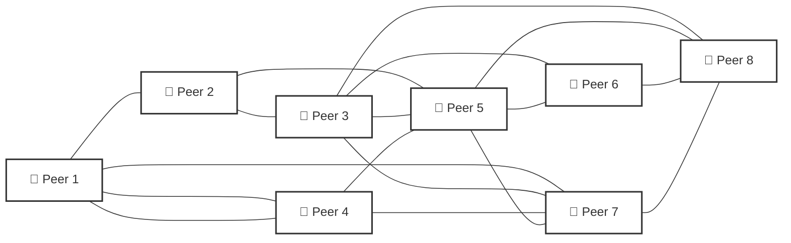
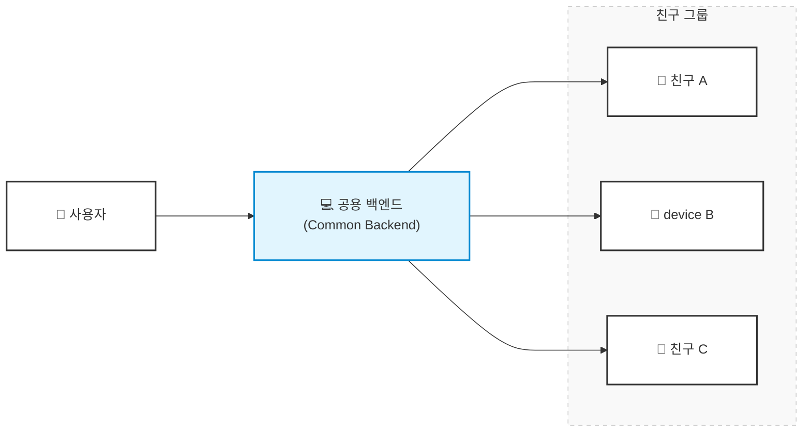
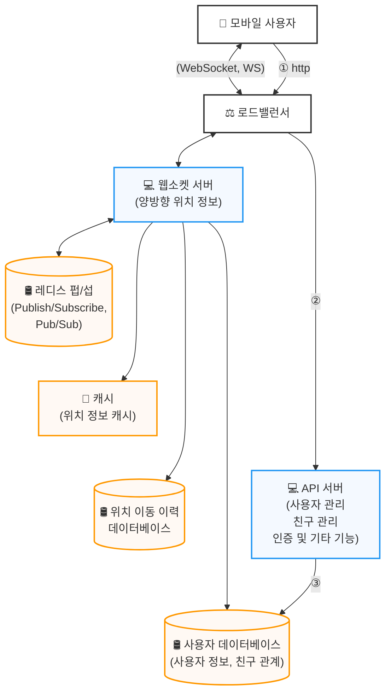
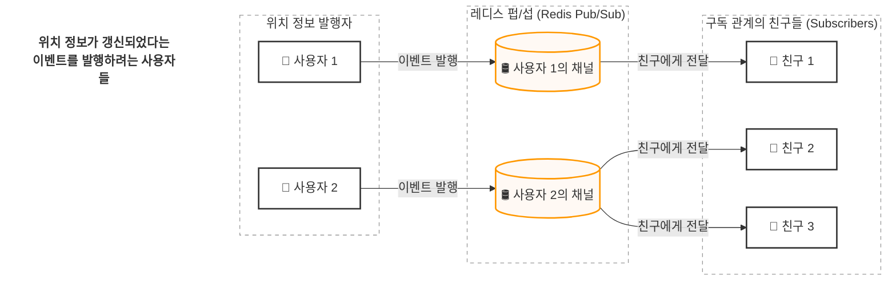

<!-- TOC -->
* [1. 요구사항 및 규모 추정](#1-요구사항-및-규모-추정)
  * [1.1. 기능 요구사항](#11-기능-요구사항)
  * [1.2. 비기능 요구 사항](#12-비기능-요구-사항)
  * [1.3. 개략적 규모 추정](#13-개략적-규모-추정)
* [2. 개략적 아키텍처](#2-개략적-아키텍처)
  * [2.1. 개략적 설계안](#21-개략적-설계안)
    * [2.1.1. 설계안](#211-설계안)
      * [2.1.1.1. 각 컴포넌트의 역할](#2111-각-컴포넌트의-역할)
      * [2.1.1.2. 사용자 위치 변경 시 발생하는 일](#2112-사용자-위치-변경-시-발생하는-일)
  * [2.2. API 설계](#22-api-설계)
  * [2.3. 데이터 모델](#23-데이터-모델)
* [3. 상세 설계](#3-상세-설계)
* [4. 마무리](#4-마무리)
* [요약](#요약)
* [참고 사이트 & 함께 보면 좋은 사이트](#참고-사이트--함께-보면-좋은-사이트)
<!-- TOC -->

---

여기서는 주변 친구라는 모바일 앱 기능을 지원하는 규모 확장이 가능한 BE를 설계해본다.

앱 사용자 중 본인 위치 정보 접근 권한을 허락한 사용자에 한대 인근의 친구 목록을 보여주는 시스템이다.

[Architecture - 근접성 서비스(Geohash, Quadtree)](https://assu10.github.io/dev/2026/05/24/architecture-proxiity/) 와 다른 점이 있다면 근접성 서비스의 경우 사업장 주소는 정적이지만, 
주변 친구 위치는 자주 바뀐다는 점이다.

---

# 1. 요구사항 및 규모 추정

- 지리적으로 얼마나 가까워야 '주변에 있다'고 할 수 있는가?
  -  5마일이며, 이 수치는 설정 가능해야 한다.
- 그 거리는 두 사용자 사이의 직선거리라고 가정해도 되는가?
  - 가정해도 된다.
- 얼마나 많은 사용자가 이 앱을 사용하는가? 10억명을 가정하고 그 중 10% 정도가 이 기능을 사용한다고 가정해도 되는가?
  - 그렇다.
- 사용자의 이동 이력을 보관해야 하는가?
  - 그렇다. 이동 이력은 머신 러닝 등 다양한 용도로 사용될 수 있다.
- 친구 관계에 있는 사용자가 10분 이상 비활성 상태면 해당 사용자를 주변 친구 목록에서 사라지게 해야하는가, 아니면 마지막으로 확인한 위치를 표시해야 하는가?
  - 사라지게 해야 한다.
- GDPR 이나 CCPA 같은 사생활 보호 및 데이터 보호법을 고려해야 하는가?
  - 원래는 고려해야 하지만 여기서는 생략한다.

---

## 1.1. 기능 요구사항

- 사용자는 모바일 앱에서 주변 친구를 확인할 수 있어야 한다.
  - 주변 친구 목록에 보이는 각 항목에는 해당 친구가지의 거리, 해당 정보가 마지막으로 갱신된 시각(timestamp)가 함께 표시되어야 함
- 친구 목록은 몇 초마다 한 번씩 갱신되어야 함

---

## 1.2. 비기능 요구 사항

- **낮은 지연 시간(low latency)**
  - 주변 친구의 위치 변화가 반영되는데 너무 오랜 시간이 걸리지 않아야 함
- **안정성**
  - 때로 몇 개 데이터가 유실되는 것 정도는 용인 가능하다.
- **결과적 일관성(eventual consistency)**
  - 위치 데이터를 저장하기 위해 강한 일관성을 지원하는 데이터 저장소를 사용할 필요는 없다.
  - 복제본이 데이터가 원본과 동일하게 변경되기까지 몇 초 정도 걸리는 것은 용인 가능하다.

---

## 1.3. 개략적 규모 추정

규모 추정을 위해 고려해야 할 제약사항과 가정을 정의해보자.

- '주변 친구'는 5마일(8km) 반경 이내 친구로 정의
- 친구 위치 정보는 30초 주기로 갱신
  - 걷는 속도가 시간당 3~4마일(4~6km) 정도로 느리기 때문에 이 속도로 30초 정도 이상한다고 해서 주변 친구 검색 결과가 크게 달라지지 않음
- 평균적으로 매일 주변 친구 검색 기능을 사용하는 사용자는 1억명으로 가정
- 동시 접속 사용자의 수는 DAU 수의 10%로 가정, 따라서 천만 명이 동시에 시스템을 이용한다고 가정한다.
- 평균적으로 한 사용자는 400명의 친구를 갖고, 그 모두가 주변 친구 검색 기능을 사용한다고 가정한다.
- 이 기능을 제공하는 앱은 페이지당 20명의 주변 친구를 표시하고 사용자의 요청이 있으면 더 많은 주변 친구를 보여준다.

<**QPS(Query Per Second) 계산**>
- 1억 DAU
- 동시 접속자: 10% * 1억 = 천만
- 사용자는 30초마다 자기 위치를 시스템에 전송
- 위치 정보 갱신 QPS: $$\frac{천만}{30초} =~ 334,000$$

---

# 2. 개략적 아키텍처

보통은 API 설계와 데이터 모델부터 논의한 후 개략적 설계를 보지만 이번 경우는 위치 정보를 모든 친구에게 전송(push)해야 한다는 요구사항 때문에 클라이언트와 서버 사이의 통신 프로토콜로 
단순한 HTTP 프로토콜을 사용하지 못하게 될 수도 있음을 감안하여 개략적 설계안을 먼저 논의한다.

개략적 설계안을 먼저 이해하지 않고는 어떤 API를 만들어야 하는지 알기 어렵다는 말이다.

---

## 2.1. 개략적 설계안

이번 문제는 메시지의 효과적 전송을 가능하게 할 설계안을 요구한다.

사용자는 근방의 모든 활성 상태 친구의 새 위치 정보를 수신해야 하므로 순수한 P2P(Peer-to-peer) 방식으로도 해결하는 것을 생각해보자.
다시 말해, 활성 상태인 근방 모든 친구와 항구적 통신 상태를 유지하는 것이다.
모바일 단말은 통신 연결 상태가 좋지 않은 경우도 있고, 사용 가능한 전력도 충분하지 않아서 실용적인 방향은 아니다.

이보다 실용적인 방법은 아래처럼 공용 백엔드를 사용하는 것이다.

여기서 백엔드는 아래와 같은 역할을 해야 한다.
- 모든 활성 상태 사용자의 위치 변화 내역 수신
- 사용자 위치 변경 내역을 수신할 때마다 해당 사용자의 모든 활성 상태 친구를 찾아서 그 친구들의 단말로 변경 내역 전송
- 두 사용자 간의 거리가 특정 임계치보다 먼 경우에는 변경 내역을 전송하지 않는다.

위와 같이 했을 때 문제점은 큰 규모에 적용하지 쉽지 않다는 점이다.  
동시 접속 사용자가 천만 명 정도이고, 그 모두가 자기 위치 정보를 30초마다 갱신한다고 하면 초당 334,000 의 위치 정보 갱신을 처리해야 한다.  
평균적으로 400명의 친구를 갖는다고 하고, 그 중 10%가 인근에서 활성화 상태라고 가정하면 초당 334,000 * 400 * 10% = 1400만 건의 위치 정보 갱신 요청을 처리해야 한다.  
또한 엄청난 양의 갱신 내역을 사용자 단말로 보내야 한다.

---

### 2.1.1. 설계안

기본적 설계안은 아래와 같다.

RESTful API 처리 흐름

---

#### 2.1.1.1. 각 컴포넌트의 역할

**로드밸런서**

RESTful API 서버 및 양방향 stateful 웹소켓 서버 앞단에 위치하며, 부하를 분산하는 역할을 한다.

---

**RESTful API 서버**

stateless API 서버의 클러스터로서, 통상적인 요청/응답 트래픽을 처리한다.

---

**웹소켓 서버**

친구 위치 정보 변경을 거의 실시간에 가깝게 처리하는 stateful 서버 클러스터이다.  
각 클라이언트는 그 가운데 한 대와 웹소켓 연결을 지속적으로 유지한다.  
검색 반경 내 친구 위치가 변경되면 해당 내역은 이 연결을 통해 클라이언트로 전송된다.

주변 친구 기능을 이용하는 클라이언트의 초기화도 담당한다.  
모바일 클라이언트가 시작되면, 온라인 상태인 모든 주변 친구 위치를 해당 클라이언트로 전송한다.

---

**레디스 위치 정보 캐시**

활성 상태 사용자의 가장 최근 위치 정보를 캐시한다.  
TTL을 통해 해당 시간이 지나면 해당 사용자는 비활성 상태로 바뀌고 그 위치 정보는 캐시에서 삭제된다.  
캐시에 보관된 정보를 갱신할 때는 TTL도 갱신한다.

---

**사용자 DB**

사용자 데이터 및 사용자의 친구 관계 정보를 저장한다.  
RDBMS나 NoSQL 어느 쪽이든 사용 가능하다.

---

**위치 이동 이력 DB**

주변 친구 표시와 직접 관계된 기능은 아니다.

---

**레디스 pub/sub 서버**

초경량 메시지 버스이다.  
레디스 펍/섭에 새로운 토픽을 추가하는 것은 아주 값싼 연산이다.

아래는 레디스 펍/섭의 동작 원리이다.

---

#### 2.1.1.2. 사용자 위치 변경 시 발생하는 일

---

## 2.2. API 설계

---

## 2.3. 데이터 모델

---

# 3. 상세 설계

---

# 4. 마무리

---

# 요약

---

# 참고 사이트 & 함께 보면 좋은 사이트

*본 포스트는 알렉스 쉬, 산 람 저자의 **가상 면접 사례로 배우는 대규모 시스템 설계 기초 2**를 기반으로 스터디하며 정리한 내용들입니다.*

* [가상 면접 사례로 배우는 대규모 시스템 설계 기초 2](https://product.kyobobook.co.kr/detail/S000211656186)
* [책에 나온 링크들 모음](https://github.com/alex-xu-system/bytebytego/blob/main/system_design_links_vol2.md)
* [Facebook Launches “Nearby Friends” With Opt-In Real-Time Location Sharing To Help You Meet Up](https://techcrunch.com/2014/04/17/facebook-nearby-friends/)
* [Redis Pub/Sub](https://redis.io/docs/latest/develop/pubsub/)