<!-- TOC -->
* [1. 요구사항 및 규모 추정](#1-요구사항-및-규모-추정)
  * [1.1. 시스템 제약 사항 및 가정](#11-시스템-제약-사항-및-가정)
  * [1.2. 기능 요구사항](#12-기능-요구사항)
  * [1.3. 비기능 요구 사항](#13-비기능-요구-사항)
  * [1.4. 핵심 트래픽 규모 추정(QPS 계산)](#14-핵심-트래픽-규모-추정qps-계산)
* [2. 개략적 아키텍처 설계](#2-개략적-아키텍처-설계)
  * [2.1. P2P 모델의 한계와 공용 백엔드 도입 배경](#21-p2p-모델의-한계와-공용-백엔드-도입-배경)
  * [2.2. 전체 컴포넌트 구조와 데이터 흐름](#22-전체-컴포넌트-구조와-데이터-흐름)
    * [2.2.1. 각 컴포넌트의 역할](#221-각-컴포넌트의-역할)
    * [2.2.2. 사용자 위치 변경 시 일어나는 일](#222-사용자-위치-변경-시-일어나는-일)
    * [2.2.3. 친구에게 위치 변경 내역이 전파되는 상세 라우팅 흐름](#223-친구에게-위치-변경-내역이-전파되는-상세-라우팅-흐름)
  * [2.3. 실시간 통신을 위한 웹소켓 API 설계](#23-실시간-통신을-위한-웹소켓-api-설계)
  * [2.4. 데이터 모델링 및 저장소 선택 배경](#24-데이터-모델링-및-저장소-선택-배경)
    * [2.4.1. 위치 정보 캐시(Redis)](#241-위치-정보-캐시redis)
    * [2.4.2. 위치 이동 이력 DB(Cassandra)](#242-위치-이동-이력-dbcassandra)
* [3. 시스템 확장성을 고려한 상세 설계](#3-시스템-확장성을-고려한-상세-설계)
  * [3.1. Stateless API 서버 vs Stateful 웹소켓 서버 확장 전략(Graceful Draining)](#31-stateless-api-서버-vs-stateful-웹소켓-서버-확장-전략graceful-draining)
    * [3.1.1. Stateless API 서버의 확장](#311-stateless-api-서버의-확장)
    * [3.1.2. Stateful 웹소켓 서버의 확장](#312-stateful-웹소켓-서버의-확장)
  * [3.2. 웹소켓 클라이언트 초기화](#32-웹소켓-클라이언트-초기화)
  * [3.3. 위치 정보 캐시 샤딩과 장애 복구(Warmed Up) 전략](#33-위치-정보-캐시-샤딩과-장애-복구warmed-up-전략)
    * [3.3.1. 사용자 DB의 Scale-out](#331-사용자-db의-scale-out)
    * [3.3.2. 위치 정보 캐시(Redis Cache)의 한계와 샤딩](#332-위치-정보-캐시redis-cache의-한계와-샤딩)
  * [3.4. 레디스 Pub/Sub 서버의 메모리 및 CPU 병목](#34-레디스-pubsub-서버의-메모리-및-cpu-병목)
    * [3.4.1. 병목은 메모리가 아니라 CPU 사용량](#341-병목은-메모리가-아니라-cpu-사용량)
  * [3.5. 분산 레디스 펍/섭 클러스터와 안정 해시(Consistent Hash Ring)](#35-분산-레디스-펍섭-클러스터와-안정-해시consistent-hash-ring)
  * [3.6. 레디스 펍/섭 서버 클러스터 규모 확장 시 주의사항](#36-레디스-펍섭-서버-클러스터-규모-확장-시-주의사항)
  * [3.7. 예외 케이스 처리 및 기능 확장](#37-예외-케이스-처리-및-기능-확장)
    * [3.7.1. 친구 추가/삭제 및 변경 처리](#371-친구-추가삭제-및-변경-처리)
    * [3.7.2. 친구가 많은 사용자](#372-친구가-많은-사용자)
    * [3.7.3. 주변의 임의 사용자 노출을 위한 지오해시 Pub/Sub 풀 구조](#373-주변의-임의-사용자-노출을-위한-지오해시-pubsub-풀-구조)
* [4. 레디스 Pub/Sub을 대체할 대안: 얼랭(Erlang)](#4-레디스-pubsub을-대체할-대안-얼랭erlang)
  * [4.1. 얼랭을 활용한 분산 메시지망 구조](#41-얼랭을-활용한-분산-메시지망-구조)
* [5. 최종 아키텍처 다이어그램](#5-최종-아키텍처-다이어그램)
* [핵심 요약 및 Takeaway](#핵심-요약-및-takeaway)
* [참고 사이트 & 함께 보면 좋은 사이트](#참고-사이트--함께-보면-좋은-사이트)
<!-- TOC -->

---

여기서는 주변 친구라는 모바일 앱 기능을 지원하는 규모 확장이 가능한 BE를 설계해본다.

앱 사용자 중 본인 위치 정보 접근 권한을 허락한 사용자에 한대 인근의 친구 목록을 보여주는 시스템이다.

[Architecture - 근접성 서비스(Geohash, Quadtree)](https://assu10.github.io/dev/2026/05/24/architecture-proxiity/) 와 다른 점이 있다면 근접성 서비스의 경우 사업장 주소는 정적이지만, 
주변 친구 위치는 자주 바뀐다는 점이다.

---

# 1. 요구사항 및 규모 추정

대규모 시스템을 설계할 때 가장 먼저 해야할 일은 **설계의 범위와 제약 조건을 명확히 하는 것**이다.  
여기서는 모바일 사용자들을 위해 인근에 있는 활성 상태의 친구 목록을 실시간으로 보여주는 '주변 친구(Nearby Friends)' 서비스의 요구 사항을 정의하고, 이를 감당하기 위한 
시스템 규모를 예측해본다.

---

## 1.1. 시스템 제약 사항 및 가정

- **주변 거리 정의**
  - 지리적으로 얼마나 가까워야 '주변에 있다'고 할 수 있나?
    - 사용자의 지리적 반경 5마일(약 8km) 이내의 친구를 '주변에 있다'라고 정의하며, 이 수치는 유연하게 설정 가능해야 한다.
- **거리 계산 방식**
  - 그 거리는 두 사용자 사이의 직선거리라고 가정해도 되나?
    - 두 사용자 사이의 거리는 복잡한 도로망이 아닌 단순 직선거리라고 가정한다.
- **서비스 이용 규모**
  - 얼마나 많은 사용자가 이 앱을 사용하나? 전체 가입자 10억 명 중 10% 정도가 이 기능을 쓴다고 가정해도 되나?
    - 서비스의 전체 가입자는 10억 명이며, 이 중 10% 수준인 1억 명이 이 주변 친구 기능을 활용한다고 가정한다.
- **이동 이력 보관**
  - 사용자의 이동 이력도 시스템에 보관해야 하는가?
    - 사용자가 이동한 과거 위치 정보 이력은 머신러닝 분석 등 다양한 비즈니스 용도로 활용할 수 있도록 시스템에 보관해야 한다.
- **비활성 유저 처리**
  - 친구 관계인 사용자가 10분 이상 비활성 상태(앱 종료 등)라면 주변 친구 목록에 마지막 위치를 보여줘야 하는가, 아니면 사라지게 해야 하는가?
    - 친구 관계인 사용자가 10분 이상 비활성 상태(앱 종료, 미이동 등)가 되면 해당 사용자를 주변 친구 목록에서 즉시 제거해야 한다.
- **규제 및 보호법 적용**
  - GDPR이나 CCPA 같은 글로벌 사생활 보호 및 데이터 보호법도 고려해야 하나?
    - GDPR이나 CCPA 같은 사생활 보호 및 데이터 보호법은 실서비스 시 필수 요건이나, 이번 아키텍처 설계 단계에서는 복잡성을 줄이기 위해 생략한다.

---

## 1.2. 기능 요구사항

- **주변 친구 목록 제공**
  - 사용자는 반경 5마일 이내의 활성 상태 친구 목록을 볼 수 있어야 하며, 목록에는 **거리**와 마지막 갱신 시각(Timestamp)이 표시된다.
- **실시간 위치 갱신**
  - 친구들의 위치는 수 초 주기로 실시간으로 자동 업데이트되어야 한다.
- **타임아웃 처리**
  - 10분 이상 비활성화된 친구는 목록에서 즉시 제거한다.
- **위치 이력 저장**
  - 대용량 쓰기 작업을 감당하며 유저의 이동 이력을 영속성 있게 보관해야 한다.

---

## 1.3. 비기능 요구 사항

- **낮은 지연 시간(low latency)**
  - 친구의 위치 변화가 주변 사용자에게 반영되기까지의 시간이 수 초 이내여야 한다.
- **안정성**
  - 대규모 ㅌ래픽 속에서 일부 위치 데이터가 전송 중에 유실되는 것 정도는 용인할 수 있다.
- **결과적 일관성(eventual consistency)**
  - 강한 일관성을 위해 시스템 전체를 멈출 필요는 없다. 몇 초 뒤에 데이터가 일치하는 결과적 일관성이면 충분하다.

---

## 1.4. 핵심 트래픽 규모 추정(QPS 계산)

규모 추정을 위해 고려해야 할 제약사항과 가정을 정의해보자.

- **일일 활성 사용자(DAU)**: 10억 명의 10%인 **1억 명**
- **동시 접속 사용자**: DAU의 10%인 **1,000만 명**
- **위치 전송 주기**: **30초 마다** 자신의 현재 위치를 전송
- **평균 친구 수**: 사용자당 **400명**

<**위치 정보 갱신 QPS(Query Per Second) 계산**>  
동시 접속자 1,000만 명이 30초에 한 번씩 서버로 위치 정보를 전송하므로, 서버가 받아내야 하는 실시간 write 트래픽의 규모는 아래와 같다.

$$\text{위치 갱신 QPS} = \frac{10,000,000 \text{ 명}}{30 \text{ 초}} \approx 333,333.3 \text{ QPS}$$

따라서 시스템은 **초당 약 334,000건**의 위치 요청을 감당할 수 있을 정도로 설계해야 한다.

---

# 2. 개략적 아키텍처 설계

주변 친구 서비스는 사용자의 위치가 실시간으로 끊임없이 변한다는 동적인 특성을 가진다.  
이 때문에 고정된 사업장 주소를 다루는 [정적 근접성 서비스](https://assu10.github.io/dev/2026/05/24/architecture-proxiity/)와는 전혀 다른 접근이 필요하다.  
수많은 활성 사용자 간에 실시간으로 위치 변경 데이터를 전송(Push)하기 위한 개략적 아키텍처에 대해 설계해 보자.

---

## 2.1. P2P 모델의 한계와 공용 백엔드 도입 배경

이번 문제는 메시지의 효과적 전송을 가능하게 할 설계안을 요구한다.

실시간으로 서로의 위치를 공유하는 가장 단순한 방법은 서버를 거치지 않고 단말끼리 직접 통신하는 **P2P(Peer-to-Peer)** 방식이다.  
활성 상태인 인근 모든 친구와 연결을 유지하며 데이터를 주고받는 구조이다.

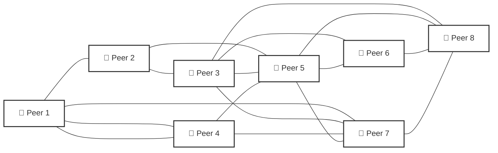

**🚨P2P 방식의 한계**  
모바일 단말은 통신 연결 상태가 불안정할 때가 많고, 배터리나 전력 소모 측면에서 극도로 제한된 자원을 가진다.  
수백 명의 친구 단말과 직접 mesh 네트워크를 구성하여 상시 통신을 유지하는 것은 모바일 환경에서 실용적이지 못하다.

---

**💡대안: 공용 백엔드 아키텍처**  
이 문제를 해결하기 위해 중앙에서 메시지 허브 역할을 해줄 공용 백엔드를 도입한다.

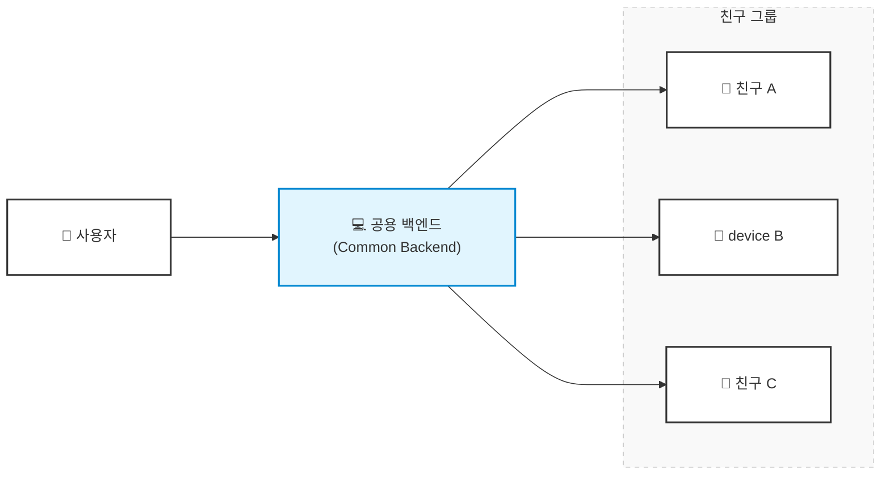

공용 백엔드는 다음과 같은 핵심 역할을 수행한다.
- 모든 활성 상태 사용자의 위치 변경 내역을 수신
- 위치 변경을 수신할 때마다 해당 사용자의 모든 활성 상태 친구를 조회
- 두 사용자 간의 거리가 설정된 임계치인 5마일 이내인 경우에만 변경 내역을 해당 친구의 단말로 전송

---

**⚠️대규모 확장의 핵심 병목 구간**

공용 백엔드 방식 역시 단순하게 구현하면 거대한 규모를 감당하기 어렵다.

- 동시 접속자 1,000만 명이 30초마다 위치를 갱신하면 **초당 334,000건의 위치 변경**을 처리해야 한다.
- 유저당 평균 400명의 친구가 있고 그 중 10%가 인근에서 활성화 상태라면, 백엔드가 처리해야 할 초당 위치 정보 전송 건수는 334,000 * 400 * 10% = 1,336만 건에 달한다.  
이 엄청난 양의 패킷을 지연 없이 단말로 밀어주기 위한 정교한 컴포넌트 설계가 필수적이다.

---

## 2.2. 전체 컴포넌트 구조와 데이터 흐름

트래픽 병목을 분산하기 위해 **무상태(Stateless) API 레이어**와 실시간 전송을 담당하는 **상태유지(Stateful) 웹소켓 레이어**를 분리한 개략적 설계안이다.

RESTful API 처리 흐름 예
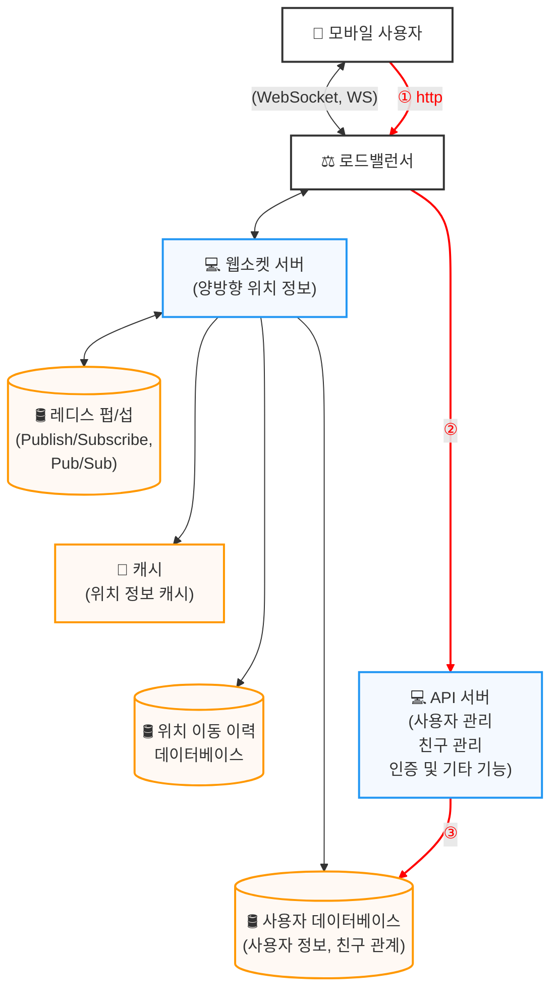

---

### 2.2.1. 각 컴포넌트의 역할

**로드밸런서**

RESTful API 요청 및 상태유지(Stateful) 웹소켓 연결 요청을 앞단에서 받아 적절한 서버 클러스터로 부하를 분산한다.

---

**RESTful API 서버**

Stateless API 서버 클러스터로, 회원 관리, 친구 추가/삭제, 인증 등 전통적인 HTTP 요청/응답 트래픽을 처리한다.

---

**웹소켓 서버**

실시간 위치 변경을 처리하는 상태유지(Stateful) 서버 클러스터이다.  
클라이언트는 앱 구동 시 웹소켓 서버 중 한 대와 연결을 맺고 이를 계속 유지한다.  
인근 친구의 위치가 바뀌면 이 상시 연결 채널을 통해 단말로 실시간 푸시가 이루어진다.  
또한 최초 진입 시 클라이언트 초기화 작업도 담당한다. 모바일 클라이언트가 시작되면, 온라인 상태인 모든 주변 친구의 위치를 해당 클라이언트로 전송한다.

---

**레디스 위치 정보 캐시**

활성 상태 사용자의 가장 최신 위치(위도, 경도, 타임스탬프)를 보관하는 인메모리 저장소이다.  
각 데이터에 TTL을 설정하여, 10분간 위치가 갱신되지 않으면 비활성 상태로 간주하고 캐시에서 자동으로 삭제되도록 제어한다.

---

**사용자 DB**

사용자 기본 프로필 및 친구 관계 매핑 정보를 보관하는 영속성 저장소이다.

---

**위치 이동 이력 DB**

유저의 과거 이동 동선을 누적 저장하는 곳으로, 실시간 서비스 성능에는 영향을 주지 않도록 비동기 처리 구조를 지향한다.

---

**레디스 Pub/Sub 서버**

사용자 간의 위치 변경 이벤트를 중계하는 초경량 메시지 버스 레이어이다.  
각 활성 사용자의 전용 채널(채널)을 개설하고, 그 친구들이 해당 채널을 구독하는 형태로 실시간 라우팅을 구현한다.

**레디스 Pub/Sub을 통한 실시간 위치 전파 메커니즘**  
웹소켓 서버를 통해 수신한 특정 사용자의 위치 정보 변경 이벤트는 해당 사용자에게 배정된 Pub/Sub 채널에 발행된다.  
특정 사용자의 위치가 변경되면 해당 사용자의 모든 친구의 웹소켓 연결 핸들러가 호출되고, 각 핸들러는 위치 변경 이벤트를 수신할 친구가 활성 상태인 경우 거리를 다시 계산한다.  
새로 계산한 거리가 검색 반경 이내면 갱신된 위치와 갱신 시각(timestamp)을 웹소켓 연결을 통해 해당 친구의 클라이언트 앱으로 보낸다.

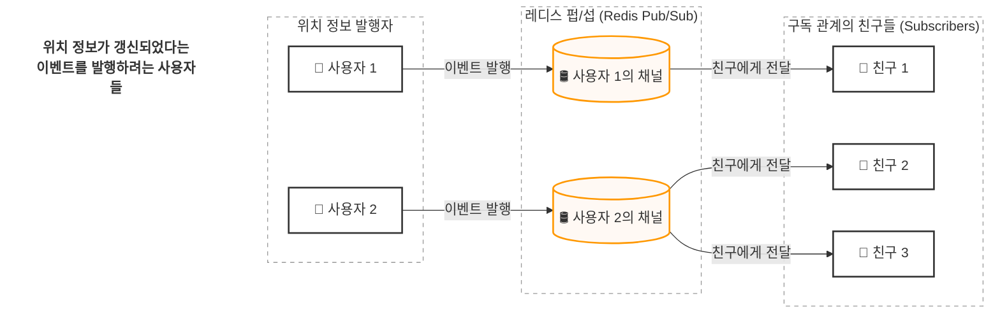

---

### 2.2.2. 사용자 위치 변경 시 일어나는 일

모바일 클라이언트가 주기적으로 자신의 위치를 바꿀 때 전체 시스템 컴포넌트가 연쇄적으로 반응하는 과정이다.

> **항구적**
> 
> 네트워크 설계에서 '항구적 연결'이란 **지속성 연결**을 뜻한다.  
> 일반적인 HTTP 통신은 클라이언트가 요청을 보내고 서버가 응답하면 그 즉시 TCP 커넥션을 끊어버리는 일회성 구조를 가진다.  
> 반면, 웹소켓 프로토콜은 최초에 한 번 커넥션을 맺고 나면 한쪽이 의도적으로 연결을 끊기 전까지 **양방향 파이프라인이 계속 유지**된다.  
> 서버가 원할 때 언제든 단말로 패킷을 보낼 수 있는 실시간 푸시의 기반이 된다.

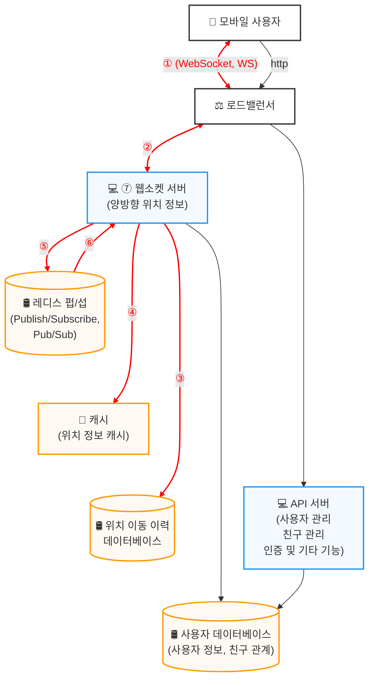

**① 위치 전송:** 모바일 클라이언트가 위도, 경도 좌표를 담은 패킷을 로드밸런서로 전송한다. 이 통신은 상시 열려있는 웹소켓 채널을 이용한다.  
**② 이벤트 전달:** 로드밸런서는 이미 수립되어 있는 전용 커넥션을 타고 해당 이벤트를 담당 웹소켓 서버 인스턴스로 넘긴다.  
**③ 이력 로깅:** 웹소켓 서버는 유저의 동선 트래킹을 위해 이 위치 정보를 비동기식으로 위치 이동 이력 DB에 적재한다.  
**④ 캐시 업포워딩 및 메모리 갱신:** 웹소켓 서버는 레디스 위치 캐시의 해당 유저 좌표를 신규 좌표로 업데이트하고 TTL도 새로 초기화한다. **이와 동시에 웹소켓 서버 내부의 연결 핸들러 세션 변수(로컬 메모리)에도 이 값을 즉시 덮어쓴다.**  
**⑤ 이벤트 발행:** 웹소켓 서버는 레디스 Pub/Sub 서버 상에 개설된 해당 유저 전용 채널 채널로 "위치 변경 이벤트"를 발행한다. (③~⑤ 단계는 내부적으로 **병렬** 처리)  
**⑥ 브로드캐스트:** 레디스 Pub/Sub 서버가 해당 유저 채널을 구독 중인 모든 수신처(즉, 현재 온라인 상태인 친구들의 웹소켓 서버 핸들러)로 이 이벤트를 전파한다.  
**⑦ 실시간 거리 재계산:** 이 이벤트를 수신한 친구 측의 웹소켓 서버는 이벤트를 보낸 유저의 새 좌표와, 자신이 관리 중인 타겟 유저의 좌표(④에서 세션 변수에 담아둔 로컬 메모리 값) 사이의 직선 거리를 연산한다.  
**➇ 조건별 푸시:** 계산 결과 거리가 서비스 반경(5마일) 이내라면, 웹소켓 연결을 통해 새 위치와 타임스탬프 정보를 친구의 모바일 단말 화면으로 즉시 push 한다. 검색 범위를 벗어났다면 패킷을 전송하지 않고 드롭한다.

> **💡④에서 저장하는 세션 변수 저장은 왜 하는 것일까?**
> 
> ⑦의 연산 과정과 직결되며, [3.2. 웹소켓 클라이언트 초기화](#32-웹소켓-클라이언트-초기화) 에서 더 심도있게 다룬다.  
> 내 위치가 바뀔 때마다 매번 무거운 레디스 캐시나 DB를 다시 쿼리해서 대조하는 것은 비용이 너무 크기 때문에, 웹소켓 서버가 커넥션 핸들러 인스턴스 내부 변수에 유저들의 
> 최근 좌표를 항상 들고 있다가 이벤트가 날아오는 즉시 메모리 상에서 초고속으로 연산(⑦단계)하기 위해 저장해둔다.

---

### 2.2.3. 친구에게 위치 변경 내역이 전파되는 상세 라우팅 흐름

[2.2.2. 사용자 위치 변경 시 일어나는 일](#223-친구에게-위치-변경-내역이-전파되는-상세-라우팅-흐름) 중 **레디스 Pub/Sub(⑤~⑥)을 관통하여 수많은 친구 유저들에게 메시지가** 
**어떻게 종단간(End-to-End)으로 확산**되는지 구체적인 토폴로지를 다시 한번 자세히 보자.

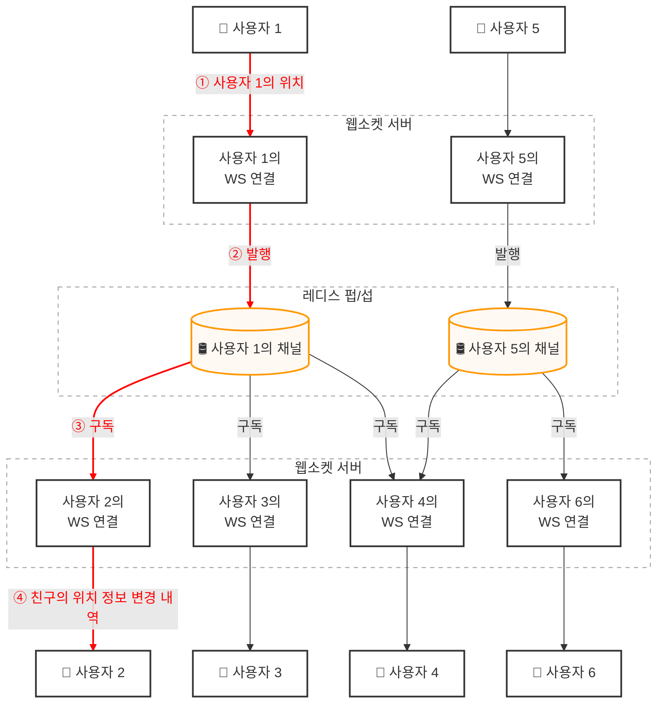

**① 위치 유입:** 사용자 1의 물리적 위치가 이동하면, 변경된 내역이 사용자 1과 실시간 상시 연결을 유지하고 있는 웹소켓 서버 레이어로 최초 전송된다.  
**② 메시지 인입(Publish):** 수신측 웹소켓 서버 인스턴스는 해당 데이터를 랩핑하여 레디스 Pub/Sub 서버 내부에 개설된 **사용자 1 전용 채널 채널**로 이벤트를 즉시 발행한다.  
**③ 분산 브로드캐스트(Subscribe):** 레디스 Pub/Sub 서버는 채널의 구독 관계를 해석하여 이 변경 내역을 모든 구독자에게 동시 전파한다. 이때 구독자는 **사용자 1과 친구 관계를 맺고 있으면서 현재 온라인을** 
**유지 중인 모든 친구들의 웹소켓 연결 핸들러**가 된다.  
**④ 조건별 최종 푸시:** 위치 변경 내역을 보낸 유저와 구독자 사이의 직선 거리가 5마일 이내이면, 새로운 위치 좌표와 타임스탬프 정보 파이프라인을 타고 최종 사용자 2의 모바일 단말 스크린으로 전송된다.

이 브로드캐스트 프로세스는 해당 채널을 링크하고 있는 모든 구독자들에게 완전히 독립적이고 병렬적으로 반복 적용된다.

앞서 한 사용자당 평균 400명의 친구가 있고 그 중 10% 내외가 인근에서 활성 상태일 것으로 예상했으므로, 한 사용자의 발걸음이 옮겨질 때마다 백엔드 내부에서는 
**평균 40건 안팎의 실시간 위치 전송 이벤트가 순식간에 사방으로 뻗어나가게 된다.**

---

## 2.3. 실시간 통신을 위한 웹소켓 API 설계

사용자는 웹소켓 프로토콜을 통해 위치 정보 내역을 전송하고 수신한다.  
최소한 아래 API 인터페이스를 구비되어야 한다.

- **[서버 수신 API] 주기적인 위치 정보 갱신**
  - 기능: 클라이언트가 30초마다 위경도 좌표를 전송할 때 사용한다.
  - Request(클라이언트 → 웹소켓 서버): 클라이언트는 위도, 경도, 시각 정보를 전송
  - Response(웹소켓 서버 → 클라이언트): 없음
- **[클라이언트 수신 API] 친구 위치 변경 알림(단방향 이벤트)**
  - 기능: 클라이언트가 내 주변 반경 이내에 있는 친구의 위치가 실시간으로 갱신되었을 때 서버가 단말로 밀어주는 이벤트 알림
  - 전송되는 데이터(웹소켓 서버 → 클라이언트): 친구 위치 데이터와 변경된 시각을 나타내는 타임스탬프
- **[서버 수신 API] 웹소켓 연결 초기화**
  - 기능: 유저가 앱을 켜고 웹소켓 채널을 최초 수립할 때 호출하는 API
  - Request(클라이언트 → 웹소켓 서버): 클라이언트는 위도, 경도, 시각 정보를 전송
  - Response(웹소켓 서버 → 클라이언트): 클라이언트는 현재 온라인 상태인 내 주변 친구들의 위치 정보 데이터 리스트를 한 번에 동기식으로 내려받음
- **[클라이언트 수신 API] 새 친구 구독 알림(단방향 이벤트)**
  - 기능: 서비스 이용 중 새 친구가 추가되거나 콜백 이벤트에 의해 친구 채널과의 동적 연결(구독 관계 확립)이 필요할 때 호출
  - 전송되는 데이터(웹소켓 서버 → 클라이언트): 웹소켓 서버는 친구 ID 전송, 이 알림과 함께 해당 친구의 가장 최근 위경도, 시각 정보가 패킷에 포함되어 클라이언트로 최종 전달됨
- **[클라이언트 수신 API] 구독 해지 알림(단방향 이벤트)**
  - 기능: 특정 친구의 관계가 끊어지거나 비활성화되어, 해당 친구의 채널 구독을 중단했음을 서버가 알려주는 이벤트
  - 전송되는 데이터(웹소켓 서버 → 클라이언트): 웹소켓 서버는 친구 ID 전송

> **💡'주기적인 위치 정보 갱신'과 '웹소켓 연결 초기화'의 인풋 포맷은 왜 완전히 똑같으며, 두 API의 차이는 무엇일까?**
> 
> 클라이언트가 웹소켓 서버로 던지는 인풋 데이터만 같은 뿐, 백엔드 내부의 동작과 아웃풋 메터니즘은 완전히 별개로 움직인다.
> - **웹소켓 연결 초기화**
>   - 유저가 접속하여 '나 이제 온라인이 되었으니, 레이더를 구성해'라고 하는 행위
>   - 웹소켓 서버는 이 요청을 받으면 유저의 정보를 셋팅하고, 레디스 캐시를 조회하여 현재 온라인 상태인 **모든 주변 친구의 전체 좌표 세트를 모아서 클라이언트 단말로 동기식 응답을 반환**함
>   - 또한, 내 모든 친구의 채널을 일괄 구독하는 무거운 작업이 수반됨
> - **주기적인 위치 정보 갱신**
>   - 초기화가 끝난 유저가 30초마다 단순히 내 현재 좌표만 계속 업데이트하는 가벼운 동기화 작업
>   - 웹소켓 서버는 이를 받으면 Pub/Sub 서버로 메시지를 던질 뿐, 요청을 보낸 단말 쪽으로는 어떠한 응답 데이터도 돌려주지 않고 통신을 끝냄

---

## 2.4. 데이터 모델링 및 저장소 선택 배경

### 2.4.1. 위치 정보 캐시(Redis)

'주변 친구' 기능을 켠 활성 상태 친구의 **가장 최근 위치 하나만** 보관하면 충분하므로, 초고속 읽기/쓰기가 가능한 레디스를 캐시로 구현한다.
- Key: 사용자 ID
- Value: {위도, 경도, 시각}

> **💡위치 정보 저장에 일반DB를 사용하지 않는 이유는?**
> 
> 이 서비스는 오직 사용자의 **현재 위치**만을 사용하므로 유저당 레코드 하나만 충분하다.  
> 레디스는 TTL 기능을 지원하기 때문에, 10분간 갱신이 없는 비활성 유저 정보를 시스템이 수동으로 지우는 로직을 짤 필요없이 캐시 레이어에서 자동으로 안전하게 파기할 수 있다.
> 
> 또한 위치 데이터는 영속성이 필수가 아니다.  
> 레디스 서버 하나가 죽더라도 새 장비로 교체한 뒤 유저들이 30초 주기로 쏘는 새 위치 패킷이 한두 번만 인입되면 캐시가 금방 자동으로 채워지는 **자동 Warmed up 구조**를 띄고 있어 
> 서비스 영향도가 매우 적다.

---

### 2.4.2. 위치 이동 이력 DB(Cassandra)

유저의 실시간 위치 변경 히스토리를 누적 저장하는 테이블이다.
- 데이터: 사용자 ID, 위도, 경도, 타임스탬프

> **💡왜 대규모 이력 저장을 위해 카산드라가 강력 추천될까?**
> 
> 카산드라는 전통적인 RDBMS가 아니라, 대규모 데이터 분산 처리에 특화된 **NoSQL 와이드 컬럼 스토어(Wide-Column Store)**이다.
> 
> 초당 334,000건에 달하는 **엄청난 쓰기 부하**를 감당해야 하는 이력 데이터의 특성상 일반 RDBMS는 디스크 I/O 병목이나 트랜잭션 Lock 비용 때문에 서버 한 대로 절대 버티지 못한다.
> 
> 반면 카산드라는 디스크에 데이터를 순차적으로 추가(Append-only)하는 LSM(Log-Structured Merge-tree) 트리 기반의 고속 쓰기 아키텍처를 가진다.  
> 또한 마스터 노드가 없는 분산 구조이므로, 데이터 양이 늘어나면 장비를 Scale-out 하기만 하면 성능이 선형적으로 늘어난다.  
> RDBMS로 규현하려면 유저 ID를 기준으로 수동 샤딩 레이어를 개발자가 직접 구현하고 운영 관리에 큰 리소스를 쏟아야 하지만, 카산드라는 내장된 파티셔닝 키 설계를 통해 부하를 모든 샤드(노드)에 알아서 고르게 분산시켜 주므로 
> 운영 관리 측면에서 압도적으로 유리하다.

> **💡LSM(Log-Structured Merge-tree) 트리**
> 
> - **메모리에 먼저 저장**: 데이터가 들어오면 디스크가 아닌 **메모리에 가장 먼저** 초고속으로 기록함
> - **차례대로 이어쓰기(Append-only)**: 메모리가 가득 차면 디스크 파일 끝에 **차례대로 이어쓰기**를 함, 위치를 찾아 헤매는 과정이 없어서 디스크 쓰기 속도가 압도적으로 빠름
> - **나중에 몰아서 정리(Compaction)**: 백그라운드 스레드가 디스크에 쌓인 파일들을 **나중에 하나로 합치고 최신 데이터만 남기며 정리**함
> 
> 즉, 디스크를 매번 뒤져가며 수정하는 대신, **"일단 메모리에 빠르게 모았다가 디스트 끝에 차곡차곡 이어쓰고, 정리는 나중에 백그라운드에서 몰아서 하는" Write 특화 구조**이다.

**💡B-Tree(RDBMS) vs LSM 트리(NoSQL)**

|     특징      | B-Tree(전통적 TDBMS)                   | LSM 트리(카산드라 등 NoSQL)                                     |
|:-----------:|:------------------------------------|:---------------------------------------------------------|
| 디스크 쓰기 매커니즘 | 지정된 페이지 위치에 덮어쓰기**(랜덤 쓰기)**         | 파일 끝에 차례대로 이어쓰기**(순차 쓰기)**                               |
|  Write 성능   | 인덱스 정렬 및 Lock 비용으로 상대적으로 **느림**     | 메모리 기록 후 일괄 처리하므로 **압도적으로 빠름**                           |
|   Read 성능   | 정렬된 인덱스 경로를 타고 바로 찾아가므로 **매우 빠름**   | 여러 SSTable(Sorted String Table) 파일을 뒤져야 하므로 상대적으로 **느림** |
| 최적화된 서비스 형태 | 금융, 결제 등 **읽기/수정**이 잦고 일관성이 중요한 서비스 | 로그, SNS 피드, **실시간 위치 트래킹** 등 대규모 쓰기가 폭발하는 서비스            |

> **💡SSTable(Sorted String Table)**
> 
> LSM 트리 구조에서 디스크에 저장되는 파일 포맷으로, 말 그대로 "Key를 기준으로 정렬된(Sorted), 문자열(String)들의 테이블"이라는 뜻이다.  
> 메모리에 대량으로 쌓여있던 실시가나 위치 데이터가 디스크로 한 번에 내려올 때 바로 이 SSTable 형태로 저장된다.

---

# 3. 시스템 확장성을 고려한 상세 설계

[2. 개략적 아키텍처 설계](#2-개략적-아키텍처-설계)는 대다수의 시스템에서 잘 작동하지만, 여기서 목표로 하는 동시 접속자 1,000만 명 규모에서는 대량의 병목 현상이 발생하게 된다.  
여기서는 대용량 트래픽 속에서 각 컴포넌트들을 어떻게 확장하고, 시스템 내부에서 어떤 연쇄 반응을 통해 자원을 최적화할 수 있는지 알아본다.

---

## 3.1. Stateless API 서버 vs Stateful 웹소켓 서버 확장 전략(Graceful Draining)

### 3.1.1. Stateless API 서버의 확장

RESTful API 서버의 규모 확장 방법은 이미 널리 알려져있다.  
서버가 세션 상태를 품고 있지 않기 때문에, CPU 사용률이나 부하 상태, I/O 상태에 따라 Auto-Scaling 그룹을 지정하여 서버 클러스터의 규모를 자동으로 느리고 줄이는 동적 확장이 자유롭다.

---

### 3.1.2. Stateful 웹소켓 서버의 확장

웹소켓 서버 클러스터 역시 사용률에 따라 규모를 자동으로 늘리는 것은 그다지 어렵지 않다.  
하지만 웹소켓 서버는 유저와의 연결 지속성을 보장해야 하는 **Stateful 서버**이기 때문에, 기존 서버를 제거할 때는 매우 신중해야 한다.

서버 장비를 안전하게 장비하려면 우아하게 종료(Graceful Draining)하는 연쇄 프로세스가 필수적이다.
- 무작위로 장비를 끄는 것이 아니라, 로드밸러서가 인식하는 해당 노드의 상태를 '연결 종료 중(draining)'으로 먼저 변경
- 해당 서버로는 더 이상 새로운 웹소켓 연결이 만들어지지 않음
- 기존에 연결되어 있던 유저들의 커넥션 세션이 자연스럽게 하나씩 종료되기를 기다림
- 모든 웹소켓 연결이 안전하게 종료되면 서버 제거

결국 Stateful 서버 클러스터의 규모를 자동으로 확장하려면, 이러한 Draining 메커니즘을 정교하게 제어할 수 있는 좋은 로드밸런서가 앞단에 있어야 한다.

---

## 3.2. 웹소켓 클라이언트 초기화

모바일 클라이언트가 기동되면 웹소켓 클러스터 내의 서버 가운데 한 대와 지속성 웹소켓 연결을 맺는다.  
'지속성 연결'이라 부르는 이유는 이 연결이 오랜 시간 유지되기 때문이다.

웹소켓 연결이 초기화되면 클라이언트는 해당 모바일 단말을 이용 중인 사용자의 위치 정보를 전송하며, 그 정보를 받은 웹소켓 연결 핸들러들은 아래 작업을 순차적으로 수행한다.

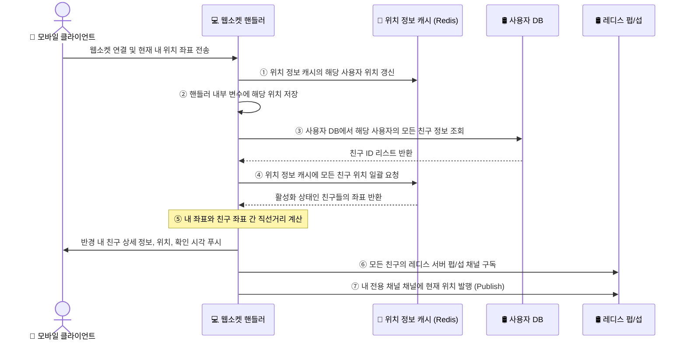

① **위치 정보 캐시에 보관된 해당 사용자의 위치를 갱신**함  
② 해당 위치 정보는 바로 뒤이은 계산 과정에 이용되므로 **연결 핸들러 내의 변수에 저장**해 둠  
③ **사용자 DB를 뒤져 해당 사용자의 모든 친구 정보를 가져옴**  
④ **위치 정보 캐시에 일괄 요청을 보내어 모든 친구의 위치를 한 번에 가져옴**  
캐시에 보관하는 모든 항목의 TTL은 비활성화 타임아웃 시간과 동일한 값으로 설정되어 있으므로 비활성화 친구의 위치는 캐시에 없으며, 자연스럽게 걸러짐  
⑤ 캐시가 돌려준 친구 위치 각가가에 대해 웹소켓 서버는 **해당 친구와 사용자 사이의 거리를 계산**함  
그 거리가 검색 반경 이내이면 해당 친구의 상세 정보, 위치, 해당 위치가 마지막으로 확인된 시각을 웹소켓 연결을 통해 클라이언트에 반환함  
⑥ 웹소켓 서버는 각 친구의 레디스 Pub/Sub 채널을 구독함  
채널 구독 비용은 저렴하므로 사용자는 **친구의 활성화/비활성화 상태에 관계없이 모든 친구 채널을 구독**할 수 있으며, 이는 아키텍처 구조를 단순하게 만들어줌  
⑦ 사용자의 현재 위치를 레디스 Pub/Sub 서버의 전용 채널을 통해 모든 친구에게 발행함

> **💡⑤에서 클라이언트에게 주는 '해당 친구의 정보'를 클라이언트는 어디에 사용할까?**
> 
> 클라이언트 단말 앱은 이 데이터를 받아 화면 지도 위에 친구들의 핀 아이콘을 동적으로 그려내고 레이더 화면 목록을 채우는 데 사용한다.

---

## 3.3. 위치 정보 캐시 샤딩과 장애 복구(Warmed Up) 전략

### 3.3.1. 사용자 DB의 Scale-out

사용자 DB에는 사용자 상세 정보와 친구 관계 데이터가 저장되며, 이 거대한 양의 데이터는 한 대의 RDBMS 서버로는 감당할 수 없다.  
하지만 사용자 ID를 기준으로 DB를 샤딩하면 RDBMS라 하더라도 부하를 모든 샤드에 고르게 분산시켜 Scale-out할 수 있으며, DB 운영 관리도 간편해진다.

주의할 점은 웹소켓 서버들이 DB를 직접 쿼리하는 것이 아니라, 반드시 격리된 **내부 API 서버 인터페이스를 통해 이용**해야만 시스템 안정성을 확보할 수 있다는 것이다.

---

### 3.3.2. 위치 정보 캐시(Redis Cache)의 한계와 샤딩

위치 정보 캐시를 레디스를 사용하며, 각 항목의 key에는 TTL을 설정한다. 이 TTL은 해당 사용자의 위치 정보가 갱신될 때마다 계속 초기화되므로 최대 메모리 사용량은 일정 한도 
아래로 유지된다.

> **💡왜 최대 사용량이 일정 한도 아래로 유지될까?**
> 
> 계속 초기화되면 수명이 늘어나니까 데이터가 안 없어지고 무한히 쌓여서 메모리가 터지는 거 아닌가? 하는 생각할 수도 있다.
> 
> **데이터는 '추가'되는 것이 아니라 '덮어쓰기'된다.**  
> 30초마다 위치가 갱신될 때, 레디스에 새로운 데이터가 계속 쌓이는 것이 아니다.  
> 유저당 딱 하나의 key(사용자 ID)만 가지고 값을 그 위에 **덮어쓰기** 하는 구조이다.  
> 예를 들어 사용자 A가 1시간 동안 앱을 쓰면서 위치를 100번 갱신하더라도, 레디스에 들어있는 사용자 A의 데이터를 늘 딱 1개이다.(= 활성 유저가 아무리 활발히 움직여도 용량은 늘어나지 않음)
> 
> **앱을 끈 유저는 10분 뒤에 '삭제'된다.**  
> 유저가 앱을 종료하면 이 유저의 key는 더 이상 TTL이 갱신되지 않으므로 10분이 지나면 이 유저의 key가 메모리에서 삭제(Evict)된다.
> 
> 즉, 레디스 캐시 메모리에 머무는 데이터의 총 개수는 아무리 많아도 '최근 10분간 한 번이라도 위치를 전송한 활성 사용자 수'를 절대 넘지 못한다.  
> 레디스 최대 메모리 사용량 = 피크 타임 동시 접속자 수 * 100 byte

만일 천만 명의 사용자가 활성화 상태이며 위치 정보 보관에 유저당 100byte가 필요하다고 할 때 총 용량은 몇이며, 단일 레디스 서버로 버틸 수 있는지 알아보자.

먼저 데이터 용량 측면과 초당 처리량(QPS) 측면을 쪼개서 계산해보아야 한다.
- **메모리 용량 계산**
  - 10,000,000명 * 100byte = 1GB
  - 1GB면 최신 레디스 서버 단 한 대로도 아주 넉넉하게 캐시 메모리에 올릴 수 있다.

이제 **CPU 처리량(QPS) 병목**을 계산해보자.  
용량은 충분하지만 트래픽이 너무 많다.  
천만 명의 활성 사용자가 30초마다 변경된 위치 정보를 계속 전송하면 레디스 서버가 감당해야 할 갱신 연산수는 **초당 334,000건**에 달한다.  
이는 최신 고사양 서버를 쓴다고 해도 단일 인스턴스의 싱글 스레드 연산으로는 엄청난 부담이 된다.

**해답은 캐시 데이터 샤딩**이다.  
각 사용자의 위치 정보는 서로 독립적인 데이터이므로, **사용자 ID를 기준으로 여러 레디스 서버에 샤딩**하면 쓰기 트래픽 부하 또한 모든 노드로 고르게 분배할 수 있어서 
병목을 원천 해결할 수 있다.  
또한 캐시 서버 한 대에 장애가 발생하더라도 새 서버로 바꾼 뒤 30초 주기의 위치 정보가 새로 채워지기를 기다리면 되는 **자연 예열(Warmed Up)** 구조이므로 일부 유실이 
발생하더라도 시스템 전체가 붕괴하지 않고 유연하게 복구된다.

---

## 3.4. 레디스 Pub/Sub 서버의 메모리 및 CPU 병목

여기서는 모든 온라인 친구에게 실시간으로 위치 변경 내역을 전달하는 핵심 라우팅 계층으로 **레디스 Pub/Sub** 서버를 활용한다.  
레디스 Pub/Sub은 채널을 생성하고 관리하는 비용이 매우 저렴하여 대규모 메시지 라우팅에 아주 유리하다.

구독자가 없는 채널로 전송된 메시지는 즉시 버려지며, 채널 관리를 위해 내부 해시 테이블과 연결 리스트에 최소한의 포인터 정보만 기록하므로 오프랄인 사용자의 채널은 CPU 자원을 전혀 소모하지 않는다.  
이를 기반으로 **'주변 친구' 기능을 활용하는 모든 사용자(약 1억명)에게 전용 채널을 하나씩 미리 부여**하는 단순한 설계를 취할 수 있다.  
친구가 온라인이든 오프라인이든 상관없이 무조건 구독 관계를 맺어둠으로써, 유저가 켜질 때마다 구독을 맺고 끊는 복잡한 제어 로직을 생략할 수 있게 된다.

모든 유저에게 채널을 주면 메모리가 터지지는 않을까?  
결론은 **메모리는 전혀 병목이 되지 않는다.**
- 전체 유저의 10%인 **1억 개**의 채널이 존재
- 평균적으로 한 유저의 친구 중 **100명**이 동시에 주변 친구 기능을 켠 활성 상태라고 가정
- 레디스가 내부 자료구조(해시 테이블 및 연결 리스트)에서 구독자 한 명을 추적하기 위해 사용하는 포인터 메모리는 **약 20byte**

이 때 필요한 총 메모리 용량 수식은 아래와 같다.  
$$\text{총 필요 메모리} = \frac{100,000,000 \text{ 개 (채널)} \times 20 \text{ 바이트} \times 100 \text{ 명}}{10^9} = 200 \text{ GB}$$

여기서 분모에 위치한 $$10^9$$은 byte 단위를 GB로 변환하기 위함이다.(1GB = $$10^9$$Byte)

계산 결과 총 **200GB**의 메모리가 필요하다. 최근 엔터프라이즈 서버들은 한 대에 100GB 이상의 메모리를 장착하는 경우가 흔하므로, 모든 유저의 상시 구독 관계를 올리는 데 
**고작 레디스 서버 2대*작*면 충분하다는 뜻이다.  
즉, 아키텍처 단순화를 위해 투입할 만한 가치가 충분하며 메모리는 여유롭다.

---

### 3.4.1. 병목은 메모리가 아니라 CPU 사용량

메모리와 달리 CPU 연산 및 네트워크 대역폭은 심각한 병목을 마주한다.  
주변 친구 기능을 위해 Pub/Sub 서버가 구독자들에게 보내야 하는 실시간 위치 정보 업데이트 양은 무려 **초당 1,400만 건**에 달한다.

초당 1,400만건에 대한 계산은 [2.1. P2P 모델의 한계와 공용 백엔드 도입 배경](#21-p2p-모델의-한계와-공용-백엔드-도입-배경) 을 참고하면 된다.

기가비트 네트워크 카드를 탑재한 최신 고사양 서버 한 대가 보수적으로 감당할 수 있는 동시 구독 전송 건수를 100,000건이라고 가정해보자.  
$$\text{필요한 레디스 펍/섭 서버 수} = \frac{14,000,000 \text{ 건 (초당 업데이트)}}{100,000 \text{ 건 (서버당 한계)}} = 140 \text{ 대}$$

이 추정치에 따르면 최소 140대 안팎의 레디스 서버가 필요하다.  
즉, 레디스 Pub/Sub 레이어의 핵심 과제는 메모리가 아닌 **CPU 연산 부하 및 네트워크 I/O를 가르는 일**이며, 이를 처리하기 위해 거대한 **분산 레디스 Pub/Sub 클러스터**가 반드시 필요하다.

---

## 3.5. 분산 레디스 펍/섭 클러스터와 안정 해시(Consistent Hash Ring)

수백 대에 달하는 레디스 Pub/Sub 서버로 채널을 유연하게 분산하기 위해, 모든 채널이 독립적이라는 특성을 활용하여 **바라행할 사용자 ID를 기준으로 서버를 샤딩**한다.  
이 때 서버의 동적 추가/제거 시 메시지 유실과 대규모 재구독 오버헤드를 막기 위해 **안정 해시(Consistent Hash Ring)** 아키텍처를 도입한다.

**💡안정 해시 링의 개념**

일반적인 나머지 연산(Modular) 기반의 샤딩 방식(`hash(key) % 서버대수`)은 서버가 한 대 추가되거나 죽었을 때, 완전히 다른 결과 값을 반환하여 전 세계 유저들의 
채널 위치를 한 순간에 바꿔버리는 치명적인 결함이 있다.

반면 **안정 해시**는 가상의 거대한 원형 링 위에 서버 노드들의 해시 값을 먼저 배치하고, 데이터 키(사용자 ID)의 해시 값이 링 위에서 시계 방향으로 순회하다가 처음 만나는 
서버 노드에 데이터를 할당하는 알고리즘이다.  
이 방식을 쓰면 서버가 추가되거나 사라져도 링 전체 데이터가 유실되지 않고, **오직 해당 서버와 인접한 소수의 데이터만 옆 서버로 재배치**되는 엄청난 이점을 얻는다.

레디스 자체의 내장 Pub/Sub 기능은 클러스터링 환경에서 모든 노드에 메시지를 브로드캐스트하는 비효율적인 구조를 가진다.  
따라서 이 시스템의 해시 링 라우팅 규칙은 **[etcd](https://etcd.io/), [주키퍼](https://zookeeper.apache.org/) 같은 서비스 탐색(Service Discovery) 컴포넌트를 
중심축에 두고 웹소켓 서버 레이어에서 구현**한다.

- etcd나 주키퍼 같은 소규모 key-value 저장소에 현재 살아있는 레디스 Pub/Sub 서버 목록을 해시 링 데이터 형태로 저장
  - 예) key: `config/pub_sub_ring` / value: `["p_1", "p_2", "p_3", "p_4"]`
- 웹소켓 서버들은 이 원본 해시 링의 상태를 상시 구독(Watch)하며 자신의 로컬 메모리에 사본으로 캐시한다.
- 애플리케이션 코드 레벨에서 사용자 ID가 인입되면, 프로그래밍 언어별로 검증된 오픈소스 안정 해시 라이브러리(또는 `TreeMap`같은 자료구조를 활용한 커스텀 클래스 구현체)를 사용하여 해시 링 사본과 대조한다.  
이를 통해 어떤 레디스 Pub/Sub 노드로 이벤트를 쏘거나 구독해야 할 지 초고속으로 판별이 가능하다.

레디스 펍/섭 서버는 메시지를 발행할 채널이나 구독할 채널을 정해야 할 때 이 해시 링을 참조한다.
예를 들면 위 그림에서 채널 2는 레디스 펍/섭 서버 1번에서 관리되고 있다.

---

**레디스를 발행할 레디스 Pub/Sub 서버 선정 및 발행 과정**

웹소켓 서버가 특정 사용자 채널에 위치 정보 변경 내역을 발행하는 구체적인 아키텍처 제어 흐름을 다음과 같다.

**① 레디스 Pub/Sub 서버 선정**: 웹소켓 서버는 해시 링을 참조하여 메시지를 발행할 레디스 Pub/Sub 서버를 선정한다.  
정확한 정보는 서비스 탐색 컴포넌트에 보관되어 있으나 성능 효율을 높이고 싶다면 해시 링 사본을 웹소켓 서버에 캐시하는 것도 괜찮다.  
다만 그 경우에는 웹소켓 서버는 해시 링 원본에 구독 관계를 설정하여 사본의 상태를 항상 원본과 동일하게 유지하도록 해야 한다.  
**② 위치 정보 변경 내역 발행**: 웹소켓 서버는 해당 서버가 관리하는 사용자 채널(그림상 채널 2)에 위치 정보 변경 내역을 발행한다.

내가 구독해야 할 채널이 존재하는 레디스 Pub/Sub 서버를 매칭하고 찾아내는 과정 역시 이와 완전히 동일한 메커니즘으로 처리된다.

---

## 3.6. 레디스 펍/섭 서버 클러스터 규모 확장 시 주의사항

레디스 Pub/Sub 채널을 타고 흐르는 실시간 위치 패킷 자체는 배달 직후 메모리에서 증발하므로 Stateless 데이터에 가깝다.  
하지만 **누가 어떤 채널을 구독하고 있는지에 대한 매핑 리스트를 메모리에 상시 쥐고 있기 때문에 Pub/Sub 서버 클러스터는 엄연한 Stateful 서버 클러스터로 취급**해야 한다.

**오버 프로비저닝(Over-provisioning)**이란 피크 타임의 최대 트래픽 부하보다 시스템 자원(서버 대수, 사양)을 **항상 훨씬 더 여유롭고 넉넉하게 미리 띄워두는 운영 전략**을 뜻한다.  
오버 프로비저닝을 해두면 서버 자원을 넉넉하게 마련해두었기 때문에 트래픽이 높아져도 **"부하 때문에 서버를 더 늘리거나 줄여야 할 원인" 자체가 시스템 내부에서 발생하지 않는다.**  
따라서 오버 프로비저닝을 해두면 불필요한 크기 변화를 피할 수 있다.

일반적인 Stateless API 서버들은 트래픽 패턴에 맞춰 실시간으로 대수를 조절하지만, Stateful Pub/Sub 서버 클러스터에서 그런 행위는 자살 행위와 다름없다.  
Stateful 클러스터 환경에서 오버 프로비저닝은 불필요한 크기 변화를 피하기 위해 비용을 지불하고 **인프라의 절대적인 정적 안정성**을 구매하는 고도의 트레이드 오프 전략이다.

안성 해시를 썼다 할지라도 클러스터의 크기를 조정하는 순간(노드 추가/제거), 수많은 채널이 해시 링 위의 다른 레디스 서버들로 대거 이동하게 된다.  
etcd가 웹소켓 서버들에게 링이 바뀌었음을 알리는 순간, 수천만 명의 연결을 쥐고 있던 웹소켓 서버들이 일제히 새 레디스 노드를 향해 **엄청난 재구독 트래픽 폭풍**을 일으킨다.

이 무거운 재구독 연산을 처리하느라 정작 유저들이 실시간으로 보내는 위치 정보 메시지 처리가 대거 누락되고 시스템 전체가 마비될 위험성이 크다.  
따라서 불필요한 Scale in/out을 원천 차단하기 위해 애초에 자원을 과도할 정도로 넉넉하게 상시 유지(오버 프로비저닝)하는 것이 비용 대비 시스템 안정성 측면에서 훨씬 이득이다.

만일 불가피하게 클러스터 크기를 조절해야 한다면, 하루 중 시스템 부하가 가장 낮은 새벽 시간대를 골라서 작업해야 한다.

---

**분산 Pub/Sub 클러스터 크기 조절 순서**

시스템에 가해지는 충격을 최소화하면서 클러스터의 규모를 안전하게 확장하는 3가지 실행 시나리오이다.

- **새로운 링 크기를 계산**한다.
  - 계산 결과에 따라 해시 링의 크기가 늘어나는 경우, 인프라 상에 물리적인 **새 레디스 서버를 준비**하고 구동시킨다.
- 서비스 탐색 컴포넌트(etcd)에 저장된 **해시 링의 key에 해당하는 value를 새로운 내용으로 갱신**한다.
- 변경사항이 전파되는 동안 대시보드를 모니터링한다.
  - 이 때 일제히 재구독 연산을 수행하느라 **웹소켓 클러스터의 CPU 사용량이 어느 정도 순간적으로 튀는 현상**이 명확하게 관측되어야 정상적으로 확장이 진행되고 있는 것이다.

---

**Pub/Sub 노드 5와 6을 추가할 때의 해시 링 값 변화**

만일 기존에 4대의 레디스로 운영되던 환경에 Pub/Sub 5번과 6번, 2개의 새로운 노드를 추가한다면 서비스 탐색 설정 저장소의 데이터 규칙은 다음과 같이 실시간으로 매핑 변경된다.
- key: /config/pub_sub_ring
- value: ["p_1", "p_2", "p_3", "p_4"] → ["p_1", "p_2", "p_3", "p_4", "p_5", "p_6"] 

---

**온콜(On-call) 엔지니어의 서버 교체 시나리오**

**온콜**은 시스템에 비상 얼럿이 떴을 때 24시간 언제든 즉각 긴급 대응할 수 있도록 대기하는 **장애 조치 담당 엔지니어 교대 근무 로테이션**을 의미한다.

다행히 기존 레디스 Pub/Sub 서버를 완전히 새 서버로 1:1 교체하는 운영 작업은 클러스터 크기 자체를 조정할 때보다 **장애 충격이나 위험성이 훨씬 낮다**  
해시 링의 구조적 토폴로지가 통째로 바뀌는 것이 아니기 때문에, 링 전체 채널들이 대규모로 이동을 하는 사태가 발생하지 않고 **오직 교체되는 특정 서버의 채널들만 핀포인트로 조치**하면 되기 때문이다.

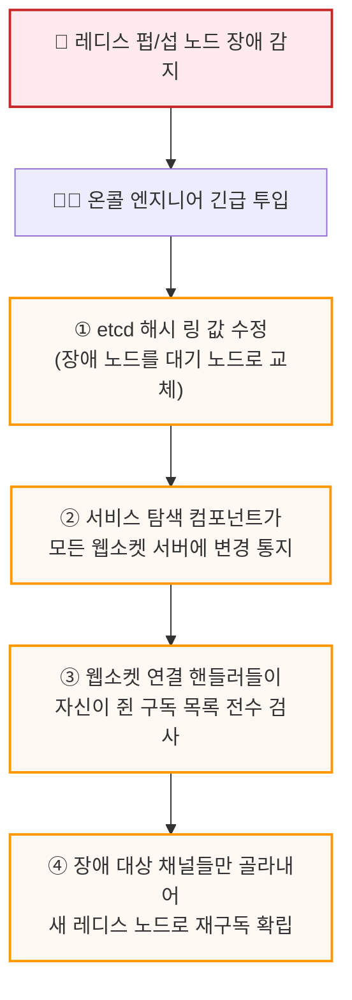

- 갱신 전: ["p_1", "p_2", "p_3", "p_4"]
- 갱신 후: ["p_1_new", "p_2", "p_3", "p_4"]

- **서비스 탐색 노드 교체:** 서비스 탐색 컴포넌트(etcd)의 해시 링 key에 해당하는 value 값을 즉시 갱신하여, **장애가 발생한 기존 노드를 미리 대기 중이던 예비 노드로 교체한다.**
  - 예) ["p_1", "p_2", "p_3", "p_4"] → ["p_1_new", "p_2", "p_3", "p_4"]
- **웹소켓 클러스터 전파:** 교체 사실은 감시(Watch) 메터니즘을 통해 모든 웹소켓 서버로 즉각 통지되며, 통지를 받은 웹소켓 서버들은 백엔드 내부에서 실행 중인 **각 연결 핸들러 세션들에게 새로운 Pub/Sub 서버의 채널을 다시 구독하도록 알린다.**
- **자체 재구독 검토 및 복구:** 통지를 받은 각 웹소켓 서버의 수많은 연결 핸들러 세션들은 자신이 구독 중이던 채널 목록을 들고 있으므로, 이 통지를 받는 즉시 그 모든 채널들을 새로운 해시 링 원본과 대조하여 **"내가 관리하던 채널 중 새 서버(p_1_new)로 구독 관계를 다시 설정해야 하는 것이 있는지"를 검토하고 타겟 채널만 재연결**을 수립한다.

이러한 정교한 격리 복구 메커니즘 덕분에 멀쩡한 다른 Pub/Sub 노드들은 아무런 타격을 입지 않고 부하 폭풍 없이 실시가나 위치 전파 서비스를 안전하게 유지할 수 있다.

---

## 3.7. 예외 케이스 처리 및 기능 확장

운영 시엔 정상적인 흐름 외에도 다양한 비즈니스 변화와 인프라 병목을 유발하는 엣지 케이스들이 존재한다.  
시스템의 안정성을 유지하면서도 이를 유연하게 처리하는 아키텍처 제어 전략에 대해 알아본다.

---

### 3.7.1. 친구 추가/삭제 및 변경 처리

사용자가 앱을 사용하는 도중에 친구를 새롭게 추가하거나 삭제하는 이벤트가 발생하면, 클라이언트 단말은 현재 연결을 맺고 있는 웹소켓 서버의 연결 핸들러에게 해당 사실을 
즉시 전파해야 한다.

- **동적 채널 구독 콜백**
  - 앱 내에서 새 친구가 추가되면 이를 감지하는 애플리케이션 콜백을 등록하여, 이 콜백은 호출되면 웹소켓 채널을 통해 서버로 "이 친구의 ID를 내 구독 리스트에 추가해"라는 메시지를 보낸다
- **최초 위치 동기화**
  - 요청을 받은 웹소켓 서버는 레디스 Pub/Sub 서버로 가서 해당 친구의 전용 채널을 즉시 구독한다.
  - 이와 동시에, 만약 그 친구가 현재 활성화 상태라면 위치 정보 캐시에서 **그 친구의 가장 최근 위경도 좌표 및 타임스탬프**를 조회하여 응답 메시지에 담아 클라이언트로 돌려준다.
- **구독 해지 및 권한 철회**
  - 반대로 친구를 삭제하거나, 상대방이 나에게 위치 공유 권한을 차단하는 예외 상황도 동일한 메커니즘으로 동작한다.
  - 콜백이 트리거되는 즉시 웹소켓 연결 핸들러가 해당 친구 채널에 대한 구독을 끊어버림으로써 실시간 위치 공유를 즉각 중단시킨다.

---

### 3.7.2. 친구가 많은 사용자

만일 친구가 수천 명에 이르는 헤비 유저가 실시간으로 위치를 바꾼다면 시스템 전체에 부하가 오지 않을까 하는 의문이 들 수 있다.

인스타그램이나 트위터 같은 단방향 팔로우 모델은 연예인 한 명이 움직일 대 수백만 명에게 메시지를 보내야 하므로 치명적인 병목이 생긴다.  
여기서는 페이스북(최대 5,000명 상한)처럼 **서로 동의하에 맺어지는 양방향 친구 관계**만 존재한다고 가정한다.  
따라서 극단적인 부하는 발생하지 안ㅇㅎ는다.

특정 헤비 유저의 친구가 5,000명이고 이들이 모두 온라인 상태라 하더라도, 그 5,000명의 웹소켓 커넥션을 쥐고 있는 연결 핸들러들은 단 하나의 서버가 아니라 
**클러스터 내의 수십, 수백 대의 웹소켓 서버 노드들에 골고루 분산**되어 존재하여 핫스팟(Hotspot) 문제는 발생하지 않을 것이다.

> **💡핫스팟(Hotspot)**
> 
> 분산 인프라 환경에서 특정 서버 노드가 특정 DB 저장소 한 곳에만 트래픽 부하가 비정상적으로 집중되어 시스템이 마비되는 현상

---

### 3.7.3. 주변의 임의 사용자 노출을 위한 지오해시 Pub/Sub 풀 구조

만일 비즈니스가 확대되어 친구 관계인 사람 뿐 아니라, 내 주변에 있는 **완전히 모르는 제3의 임의 사용자들**까지 화면 지도 위에 실시간으로 노출해주어야 한다면 
기존 설계안을 어떻게 수정해야 할까?

기존에 구축해 둔 사용자 ID 기반의 전용 채널 구조를 크게 훼손하지 않으면서 이 기능을 녹여내는 해법은, 바로 지리적 격자 단위인
**[지오해시](https://assu10.github.io/dev/2026/05/24/architecture-proxiity/#223-%EC%A7%80%EC%98%A4%ED%95%B4%EC%8B%9Cgeohash) 경계에 따라 대규모 레디스 Pub/Sub 채널 풀**을 개설하는 것이다.

아래 그림처럼 전 세계 지도를 격자 공간으로 분할한 뒤, 격자마다 고유한 지오해시 코드(예: 9q8znd)를 부여하고 해당 코드 이름으로 레디스 채널을 하나씩 미리 만들어둔다.

해당 격자 내의 모든 무작위 사용자들은 자기 격자의 채널을 상시 구독하게 만든다.

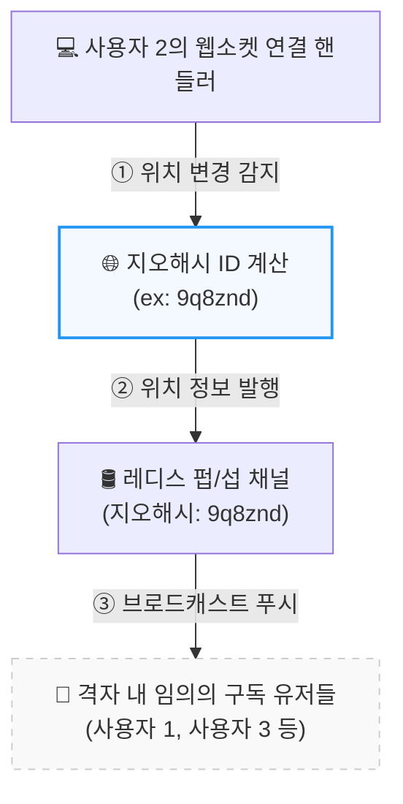

**① 지오해시 코드 산출:** 특정 사용자의 물리적 위치가 변경되면, 해당 사용자들 담당하는 웹소켓 연결 핸들러는 위경도 좌표를 바탕으로 현재 속한 지오해시 ID를 계산한다.     
**② 채널 발행 및 공유:** 핸들러는 계산된 지오해시 채널(9q8znd)로 사용자의 새 좌표를 발행한다.  
**③ 실시간 전파:** 같은 격자에 머물머 해당 지오해시 채널을 구독하고 있던 근방의 임의의 다른 유저들이 이 메시지를 수신하게 되며, 화면 레이더망에 서로의 위치를 실시간으로 업데이트해 줄 수 있게 된다.

**🚨격자 경계 사각지대 예외 처리 디테일**  
사용자가 격자의 아주 미세한 모서리나 경계선 부근에 서 있는 경우, 실제 물리적 거리는 코앞인데 격자 코드가 다르다는 이유로 바로 옆방에 있는 사람을 놓치는 사각지대가 발생한다.  
이 치명적인 엣지 케이스를 극복하기 위해, 
**모든 클라이언트 단말은 자신이 위치한 중심 격자 채널 1개 뿐 아니라, 자신을 둘러싸고 있는 인접한 8개의 지오해시 격자 채널까지 포함하여 총 9개의 채널을 동시에 상시 구독**하도록 넓혀 설계한다.  
이렇게 하면 경계선 경합 문제 없이 완벽하게 주변의 모든 무작위 사용자를 포착할 수 있다.

---

# 4. 레디스 Pub/Sub을 대체할 대안: 얼랭(Erlang)

여기서는 앞서 초당 1,400만 건의 실시간 메시지 부하를 버티기 위해 140대 규모의 분산 레디스 Pub/Sub 클러스터를 구축하고, 
안전 해시 링과 etcd 서비스 탐색 레이어까지 도입하는 거대한 엔지니어링 설계를 하였다.

하지만 인프라의 복잡도가 너무 높고 '재구독 부하'같은 잠재적 위험 요소를 늘 안고 가야 한다.  
만약 이 **모든 인프라 운영 부담과 복잡한 분산 라우팅 코드를 한번에 삭제할 수 있는 강력한 대안**이 있다면 어떨까?

바로 텔레콤 및 실시간 채팅 아키텍처의 절대 강자, **[얼랭(Erlang)](https://www.erlang.org/)** 모델이다.

얼랭은 1980년대 스웨덴의 통신장비 기업인 에릭슨(Ericsson)에서 수천만 개의 전화 통화를 끊김 없이 실시간으로 연결하고 제어하기 위해 개발한 기능형 프로그래밍 언어(Runtime OS)이다.

이 시스템 아키텍처에서 얼랭이 완벽한 게임 체인저가 되는 이유는 크게 3가지이다.
- **초경량 프로세스(Actor) 모델:** 얼랭의 프로세스는 OS의 무거은 스레드가 아니라, 얼랭 가상머신(BEAM)이 독립적으로 관리하는 '초경량 초소형 프로세스'이다. 생성 비용이 무시해도 될 정도로 작으며, 프로세스 1개가 차지하는 메모리는 고작 **2~3KB** 수준에 불과하다.
- **내장형 메시지 패싱(Message Passing):** 얼랭 프로세스들은 각자 독립된 Mailbox를 가진다. 프로세스 간에 메시지를 주고받는 행위가 라이브러리나 외부 저장소 없이 **언어 자체의 원시 기능**으로 완벽히 지원된다.
- **플러그앤플레이 분산 환경:** 여러 대의 서버에 얼랭 노드를 실행하고 서로 연결해 주기만 하면, 물리적으로 다른 서버에 떠 있는 프로세스일지라도 마치 같은 메모리 공간에 있는 것처럼 이름을 지정해 초고속으로 메시지를 보낼 수 있다.

---

## 4.1. 얼랭을 활용한 분산 메시지망 구조

얼랭 아키텍처를 도입하면 기존의 '웹소켓 서버 + 레디스 Pub/Sub 클러스터 + etcd 해시 링'으로 무겁게 쪼개져 있던 분리 계층이 하나의 일체형 분산 시스템으로 완전히 통합된다.

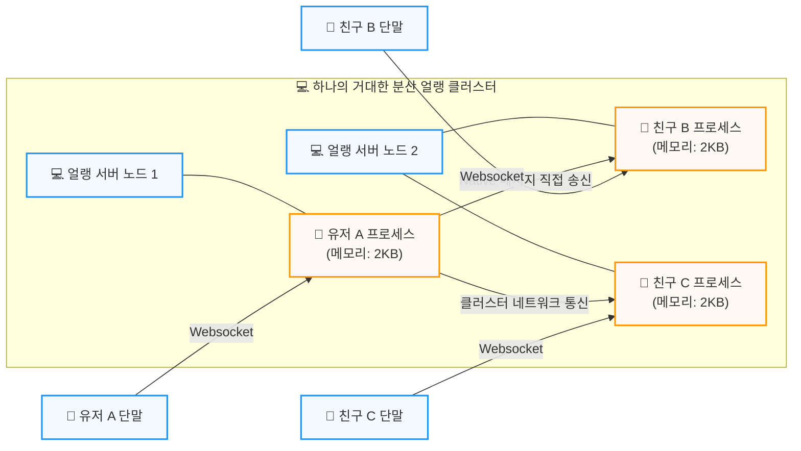

**얼랭 기반 실시간 위치 분산 중계 메커니즘**
- **1:1 매핑 프로세스 생성**
  - 1,000만 명의 활성 사용자가 웹소켓을 연결하는 즉시, 분산 얼랭 클러스터 내에 **유저당 정확히 1개씩의 초경량 프로세스**를 동적으로 생성한다.
  - 메모리 계산: 1,000만명 * 2.5KB = **고작 25GB 내외**
    - 수백 대의 레디스 서버 없이 서버 몇 대의 RAM 만으로 1,000만 명의 상태유지 세션을 통째로 올릴 수 있다.
- **상시 연결망 구성**
  - 유저 A가 로그인하면 유저 A의 프로세스는 사용자 DB를 통해 친구 목록을 가져온 뒤, 클러스터 내부에서 활성화되어 있는 친구 B와 C의 프로세스 주소(PID)를 직접 찾아내어 서로를 링크해둔다.
  - 외부 Pub/Sub 채널 개념이 사라지고, 프로세스 대 프로세스의 직접적인 연결망이 구축된다.
- **네이티브 메시지 릴레이**
  - 유저 A가 30초 주기로 최신 위치를 전송하면, 유저 A 프로세스는 자신과 링크된 친구 프로세스들의 주소로 **위치 변경 이벤트 패킷을 다이렉트로 던진다.**
- **실시간 연산 및 푸시**
  - 메시지를 수신한 친구 B와 C의 프로세스는 각자의 Mailbox에서 패킷을 꺼내 즉시 직선 거리를 계산하고, 반경 5마일 이내일 경우 자신이 쥐고 있는 웹소켓 파이프라인을 통해 최종 클라이언트 단말로 데이터를 응답한다.

---

**얼랭 모델이 가져다주는 이점**
- **인프라 비용의 혁신적인 절감:** 초당 1,400만 건의 트래픽을 처리하기 위해 관리해야 했던 140대 이상의 레디스 Pub/Sub 노드, 대기 노드, 오버 프로비저닝의 예산이 완전히 0이 된다.
- **재구독 부하 차단:** etcd의 래시 링 경계선이 출렁거릴 때 수천만 건의 채널 주인이 바뀌며 인프라를 마비시키던 재구독 부하가 원천 차단된다.
  - 얼랭 환경에서는 서버 노드가 추가되거나 죽더라도, 살아있는 프로세스들끼리 내장된 장애 복구 메커니즘을 통해 조용하게 연결 주소를 갱신할 뿐이다.
- **검증된 레퍼런스:** 전 세계 10억 명 이상이 사용하는 글로벌 실시간 서비스인 WhatsApp, Discord, WeChat이 바로 이 얼랭(또는 파생 언어닌 Elixir) 아키텍처를 핵심 기반으로 삼아 단 몇 대의 고성능 서버만으로 수천만 명의 실시간 동시 접속과 커넥션을 지연 없이 처리하고 있다.

---

# 5. 최종 아키텍처 다이어그램

아래는 모바일 클라이언트가 위치를 변경했을 때, 백엔드 인프라 내부의 전 영역이 어떻게 유기적으로 연쇄 반응을 일으키는지 보여준다.

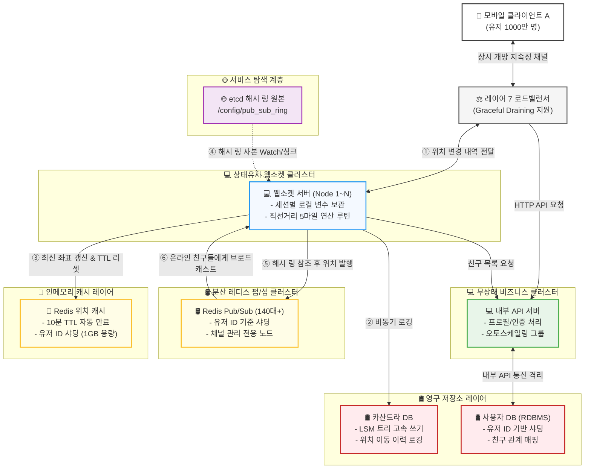

---

# 핵심 요약 및 Takeaway

대규모 트래픽을 감당하는 실시간 서비스 아키텍처를 설계할 때 반드시 고려해야 할 시스템 디자인 핵심이다.
- **Stateful 서버의 제1원칙은 '정적 안정성'이다.**
  - RESTful API 서버처럼 트래픽 추이에 따라 실시간으로 웹소켓이나 레디스 Pub/Sub 서버를 늘리고 줄이는 것은 매우 위험하다.
  - 경계선이 바뀔 때마다 밀려오는 재구독 부하는 인프라를 일시에 마비시킨다.
  - 인프라 비용을 더 지불하더라도 오버 프로비저닝을 통해 서버의 크기 변화 원인 자체를 차단하는 것이 훨씬 성숙한 설계이다.
- **용량(Storage) 병목와 연산(CPU/IO) 병목을 분리하여 산정하라.**
  - 1,000만 명의 위치 정보는 고작 1GB 내외로 레디스 한 대의 메모리에 넉넉히 들어간다.
  - 하지만 초당 33만 건의 쓰기와 초당 1,400만 건의 Pub/Sub 중계 연산은 단일 싱글 스레드 레디스로 절대 감당할 수 없다.
  - 대규모 설계 시에는 항상 용량이 아닌 **초당 처리량(QPS) 부하를 기준으로 샤딩 규모를 산정**해야 한다.
- **LSM 트리와 TTL 캐시로 대규모 쓰기와 메모리 누수를 극복하라.**
  - 매초 쏟아지는 위치 이력을 RDBMS에 저장하면 디스크 I/O 병목으로 시스템이 다운된다.
  - 순차 이어쓰기(Append-only) 구조를 가진 **카산드라의 LSM 트리**로 쓰기 성능을 극대화한다.
  - 레디스에는 **10분 TTL** 전략을 부여하여 앱을 끈 유저의 데이터가 메모리를 잠식하지 않도록 한다.
- **인프라 복잡도와 기술 스택의 트레이드 오프를 이해하라.**
  - 레디스 Pub/Sub 모델은 검증되고 대중적인 오픈소스 조합(Redis + etcd)을 활용하지만, 분산 샤딩 링과 서비스 디스커버리 계층이 추가되어 인프라 복잡도가 높아 진다.
  - 반면, **얼랭 아키텍처**는 언어 자체의 초경량 액터 프로세스 모델과 메시지 패싱 기능만으로 이 거대한 중계 인프라 레이어를 압축해버린다.
  - 엔지니어링 팀의 역량과 인프라 관리 비용을 저울질하여 최선의 대안을 선택하는 통찰이 필요하다.

---

# 참고 사이트 & 함께 보면 좋은 사이트

*본 포스트는 알렉스 쉬, 산 람 저자의 **가상 면접 사례로 배우는 대규모 시스템 설계 기초 2**를 기반으로 스터디하며 정리한 내용들입니다.*

* [가상 면접 사례로 배우는 대규모 시스템 설계 기초 2](https://product.kyobobook.co.kr/detail/S000211656186)
* [책에 나온 링크들 모음](https://github.com/alex-xu-system/bytebytego/blob/main/system_design_links_vol2.md)
* [Facebook Launches “Nearby Friends” With Opt-In Real-Time Location Sharing To Help You Meet Up](https://techcrunch.com/2014/04/17/facebook-nearby-friends/)
* [Redis Pub/Sub](https://redis.io/docs/latest/develop/pubsub/)
* [etcd](https://etcd.io/)
* [주키퍼](https://zookeeper.apache.org/)
* [안정 해시](https://www.toptal.com/developers/big-data/consistent-hashing)
* [얼랭](https://www.erlang.org/)
* [OTP](https://www.erlang.org/doc/system/design_principles.html)