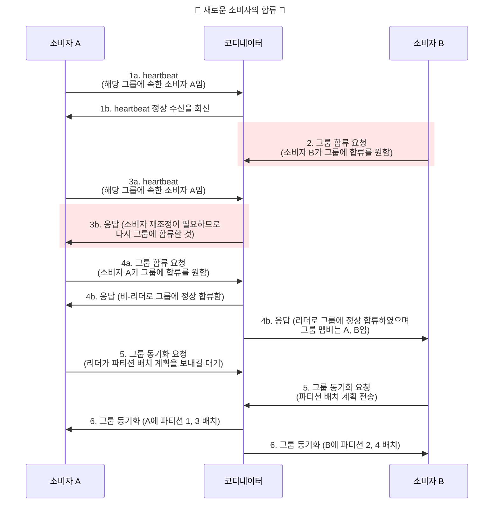
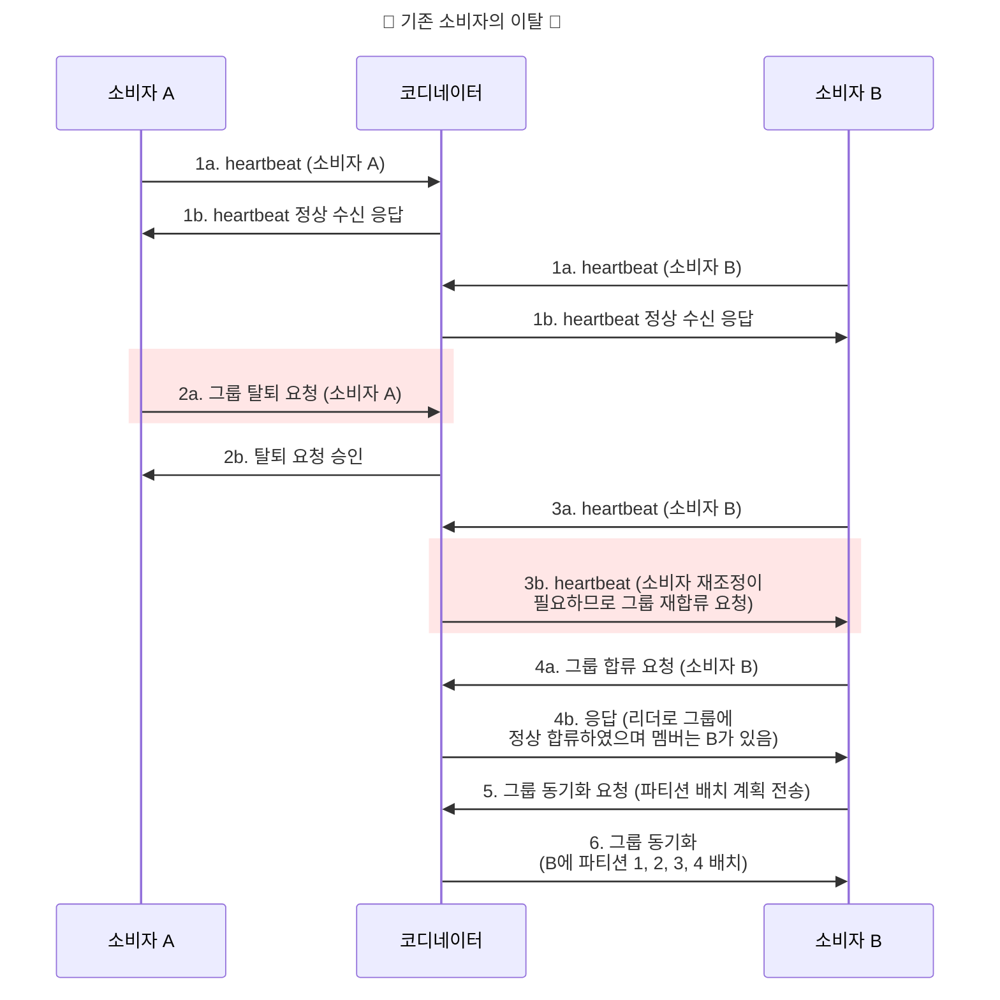
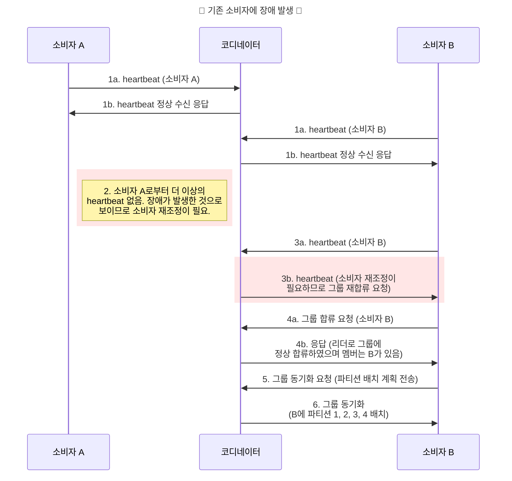

<!-- TOC -->
* [메시지 큐 vs 이벤트 스트리밍 플랫폼](#메시지-큐-vs-이벤트-스트리밍-플랫폼)
* [1. 문제 이해 및 설계 범위 확정](#1-문제-이해-및-설계-범위-확정)
  * [1.1. 기능 요구사항](#11-기능-요구사항)
  * [1.2. 비기능 요구사항](#12-비기능-요구사항)
  * [1.3. 전통적 메시지 큐와 다른점](#13-전통적-메시지-큐와-다른점)
* [2. 개략적 설계안](#2-개략적-설계안)
  * [2.1. 메시지 모델](#21-메시지-모델)
    * [2.1.1. 일대일(point-to-point) 모델](#211-일대일point-to-point-모델)
    * [2.1.2. 발행-구독(publish-subscribe) 모델](#212-발행-구독publish-subscribe-모델)
  * [2.2. 토픽, 파티션, 브로커](#22-토픽-파티션-브로커)
  * [2.3. Consumer Group](#23-consumer-group)
  * [2.4. 개략적 설계안](#24-개략적-설계안)
* [3. 상세 설계](#3-상세-설계)
  * [3.1. 데이터 저장소](#31-데이터-저장소)
  * [3.2. 메시지 자료 구조](#32-메시지-자료-구조)
  * [3.3. 일괄 처리](#33-일괄-처리)
  * [3.4. 생산자 측 작업 흐름](#34-생산자-측-작업-흐름)
  * [3.5. 소비자 측 작업 흐름](#35-소비자-측-작업-흐름)
  * [3.6. 푸시 vs 풀](#36-푸시-vs-풀)
    * [3.6.1. 푸시 모델](#361-푸시-모델)
    * [3.6.2. 풀 모델](#362-풀-모델)
  * [3.7. 소비자 재조정(Consumer rebalancing)](#37-소비자-재조정consumer-rebalancing)
  * [3.8. 상태 저장소](#38-상태-저장소)
  * [3.9. 메타데이터 저장소](#39-메타데이터-저장소)
  * [3.10. 주키퍼](#310-주키퍼)
  * [3.11. 복제](#311-복제)
  * [3.12. 사본 동기화](#312-사본-동기화)
  * [3.13. 규모 확장성](#313-규모-확장성)
    * [3.13.1. 생산자](#3131-생산자)
    * [3.13.2. 소비자](#3132-소비자)
    * [3.13.3. 브로커](#3133-브로커)
    * [3.13.4. 파티션](#3134-파티션)
  * [3.14. 메시지 전달 방식](#314-메시지-전달-방식)
  * [3.15. 고급 기능](#315-고급-기능)
    * [3.15.1. 메시지 필터링](#3151-메시지-필터링)
    * [3.15.2. 메시지의 지연 전송 및 예약 전송](#3152-메시지의-지연-전송-및-예약-전송)
* [4. 마무리](#4-마무리)
* [5. 최종 다이어그램 및 요약](#5-최종-다이어그램-및-요약)
* [참고 사이트 & 함께 보면 좋은 사이트](#참고-사이트--함께-보면-좋은-사이트)
<!-- TOC -->

여기서는 분산 메시지 큐 설계에 대히 알아본다.

메시지 큐를 사용하면 어떤 점이 좋을까?
- 결합도 완화(decoupling)
  - 컴포넌트 사이의 강한 결합이 사라지므로 각각을 독립적으로 갱신 가능
- 규모 확장성 개선
  - 메시지 큐에 대이터를 생산하는 producer와 큐에서 메시지를 소비하는 consumer 시스템 규모를 트래픽 부하에 맞게 독립적으로 늘릴 수 잇음
  - 예) 트래픽 부하가 많이 몰리는 시간에는 더 많은 consumer를 추가하여 처리 용량 늘릴 수 있음
  - (궁금증) 한번 늘린 consumer는 자동으로 줄어드나? 즉, auto-scaling 이 가능한가?
- 가용성 개선
  - 시스템의 특정 컴포넌트에 장애가 발생해도 다른 컴포넌트는 큐와 계속 상호작용할 수 있음
- 성능 개선
  - 메시지 큐를 사용하면 비동기 통신이 쉽게 가능하다. Producer는 응답을 기다리지 않고 메시지를 보내며, 소비자는 읽을 메시지가 있을 때만 해당 메시지를 소비하면 된다. 서로를 기다릴 필요가 없다.

---

# 메시지 큐 vs 이벤트 스트리밍 플랫폼

아래는 유명 메시지 큐이다.
- 아파치 카프카
- 아파치 Pulsar
- 아파키 RocketMQ
- 아파치 RabbitMQ
- 아파치 ActiveMQ
- ZeroMQ

엄밀히 말하면 아파치 카프카와 펄사는 메지시 큐가 아니라 이벤트 스트리밍 플랫폼이다.
(궁금증) 메시지 큐와 이벤트 스트리밍 플랫폼의 차이

하지만 메시지 큐와 이벤트 스트리밍 플랫폼 사이의 차이는 지원하는 기능이 서로 수렴하면서 점차 희미해지고 있다.
예를 들면 전형적인 메시지 큐인 래빗엠큐는 옵션으로 스트리밍 기능을 추가하면 메시지를 반복적으로 소비할 수 있는 동시에 데이터의 장기 보관도 가능하다. 
데이터 추가(append)만 가능한 로그 기능을 통해 구현되어 있는데, 이벤트 스트리밍 플랫품 구현과 유사하다.

여기서는 데이터 장기 보관(long data retention), 메시지 반복 소비 등의 부가 기능을 갖춘 분산 메시지 큐를 설계한다.

(궁금증)이번 설계가 내가 카프카와 같은 메시지 큐를 직접 만드는 것인가? 아니면 카프카와 같은 라이브러리를 이용해서 분산 메시지를 이용하는 시스템을 설계하는 것인가?
이건 전체적인 내용을 읽고 답해줘.

---

# 1. 문제 이해 및 설계 범위 확정

메시지 큐는 생산자는 메시지를 큐에 보내고 소비자는 큐에서 메시지를 꺼낼 수 있으면 된다.
하지만 이런 기본 기능 외에 성능, 메시지 전달 방식, 데이터 보관 기간 등의 고려할 사항들을 정하기 위해 요구 사항을 도출해보자.

- 메시지의 형태와 평균 크기는 어떻게 되는가? 텍스트 메시지만 지원해야 하는가, 아니면 멀티미디어도 지원해야 하는가?
  - 텍스트 형태 메시지만 지원하면 된다. 메시지 크기는 수 KB 수준이다.
  - (궁금증) 일반적인 카프카에서 멀티미디어도 지원할 수 있어?
- 메시지는 반복 소비가 가능해야 하는가>
  - 그렇다. 하나의 메시지를 여러 소비자가 수신 가능해야 한다. 하지만 이것은 부가 기능이다. 전통적인 분산 메시지 큐는 한 소비자라도 받아간 메시지는 지워버린다. 
  - 그러니 전통적인 메시지 큐 간은 시스템으로는 같은 메시지를 여러 소비자에게 반복해서 전달할 수 없다.
- 메시지는 큐에 전달된 순서대로 소비되어야 하는가>
  - 그렇다. 그러나 부가기능이다. 전통적인 분산 메시지 큐는 보통 소비 순서를 보증하지 않는다.
- 데이터의 지속성이 보장되어야 하는가? 그렇다면 기간은 어느 정도이어야 하는가>
  - 2주동안 보관되어야 하며 이것도 부가 기능이다. 전통적인 분산 메시지 큐는 메시지의 지속성 보관을 보증하지 않는다.
- 지원해야 하는 생산자와 소비자 수는 어느 정도인가?
  - 많으면 많을수록 좋다.
- 어떤 메시지 전달 방식을 지원해야 하는가? 최대 한번(at-most-once), 최소한번(at-least-once), 정확히 한 번(exactly once) 중?
  - 각각을 사용자가 설정 가능하게 해주어야 한다.
- 목표로 해야할 대역폭(throughput)과 end-to-end 지연 시간은?
  - 로그 수집 등을 위해 사용할 수 있어야 하므로 높은 수준의 대역폭을 제공해야 한다. 낮은 전송 지연도 필수이다.

---

## 1.1. 기능 요구사항

이제 아래와 같은 기능적 요구사항이 도출되었다.
- 생산자는 메시지 큐에서 메시지를 보낼 수 있어야 한다.
- 소비자는 메시지 쿠를 통해 메시지를 수신할 수 이썽야 한다.
- 메시지는 반복적으로 수신할 수도 있어야 하고, 단 한 번만 수신할 수 있도록 설정될 수도 이썽야 한다.
- 오래된 이력 데이터는 삭제될 수 있다.
- 메시지 크기는 KB 수준이다.
- 메시지가 생산된 순서대로 소비자에게 전달될 수 있어야 한다.
- 메시지 전달 방식은 최소 한 번, 최대 한 번, 정확히 한 번 가운데 설정할 수 있어야 한다.

---

## 1.2. 비기능 요구사항

- 높은 대역폭과 낮은 전송 지연 가운데 하나를 설정으로 선택 가능하게 하는 기능
- 규모 확장성
  - 이 시스템은 특성상 분산 시스템일수밖에 없으므로 메시지 양이 급증해도 처리 가능해야 함
- 지속성 및 내구성
  - 데이터는 디스크에 지속적으로 보관되어야 하므로 여러 노드에 복제되어야 함

---

## 1.3. 전통적 메시지 큐와 다른점

래빗 엠큐와 같은 전통적 메시지 큐는 이벤트 스트리밍 플랫폼처럼 메시지 보관 문제를 중요하게 다루지는 않는다.
전통적인 큐는 메시지가 소비자에게 전달되기 충분한 기간 동안만 메모리에 보관하며, [처리 용량을 넘어선 메시지는 디스크에 보관](https://www.rabbitmq.com/docs/maxlength)하긴 하는데 이벤트 스트리밍 플랫폼이 
감당하는 용량보다는 아주 낮은 수준이다.

전통적인 메시지 큐는 메시지 전달 순서도 보존하지 않는다.

---

# 2. 개략적 설계안

메시지 큐의 기본 기능부터 보자.

- 생산자는 메시지를 메시지 큐에 발행
- 소비자는 큐를 구독(subscribe)하고 구독한 메시지를 소비
- 메시지 큐는 생산자와 소비자 사이의 결합을 느슨하게 하는 서비르로, 각각의 독립적인 운영 및 규모 확장을 가능하게 하는 역할 담당
- 생산자와 소비자는 모두 클라이언트/서버 모델 관점에서 보면 클라이언트이고, 서버 역할을 하는 것은 메시지 큐이며, 이 클라이언트와 서버는 네트워크를 통해 통신

---

## 2.1. 메시지 모델

### 2.1.1. 일대일(point-to-point) 모델

전통적인 메시지 큐에서 흔히 발견되는 모델이다.
일대일 모델에서 큐에 전송된 메시지는 오직 한 소비자만 가져갈 수 있다.

어떤 소비자가 메시지를 가져갔다는 사실은 큐에 알리면(acknowledge) 해당 메시지는 큐에서 삭제된다. 이 모델은 데이터 보관(data retention)을 지원하지 않는다.
본 설계는 메시지를 2주 동안은 보관할 수 있어야 하는 지속성 계층을 포함하며, 해당 계층을 통해 메시지가 반복적으로 소비될 수 있어야 하므로 적합하지 않다.

---

### 2.1.2. 발행-구독(publish-subscribe) 모델

토픽은 메시지를 주제별로 정리하는데 사용되며, 각 토픽은 메시지 큐 서비스 전반에 고유한 이름을 갖는다.
메시지를 주고 받을 때는 토픽에 보내고 받게 된다.

이 모델에서 토픽에 전달된 메시지는 해당 토픽을 구독하는 모든 소비자에게 전달된다.

---

## 2.2. 토픽, 파티션, 브로커

메시지는 토픽에 보관된다. 토픽에 보관되는 데이터의 양이 커져서 서버 한 대로 감당하기 힘든 상황이 되면 어떻게 될까>
이 문제를 해결하는 방법은 파티션, 즉 샤딩 기법을 활용하는 것이다.

아래 그림처럼 토픽을 여러 파티션으로 분할한 후 메시지를 모든 파티션에 균등하게 보낸다.
파티션은 메시지 큐 클러스텉 내의 서버에 고르게 분산 배치한다.
파티션을 유지하는 서버는 브로커라고 부른다.
파티션을 브로커에 분산하는 것이 높은 규모 확장성을 달성하는 비결이다.

각 토픽 파티션은 FIFO 큐처럼 동작한다. 같은 파티션 안에서는 메시지 순서가 유지된다. 파티션 내에서의 메시지 위치는 오프셋이라고 한다.

생산자가 보낸 메시지는 해당 토픽의 파티션 가운데 하나로 보내지는데, 메시지에는 key를 붙일 수 있다.
같은 key를 가진 모든 메시지는 같은 파티션으로 보내지며, key 가 없는 메시지는 무작위로 선택된 파티션으로 전송된다.

토픽을 구독하는 소비자는 하나 이상의 파티션에서 데이터를 가져온다.
토픽을 구독하는 소비자가 여럿이면, 각 구독자는 해당 토픽을 구성하는 파티션을 일부를 담당하는데, 이 소비자들을 해당 토픽의 Consumer group 이라고 한다.

아래는 브로커와 파티션을 갖춘 메시지 큐 클러스터이다.

---

## 2.3. Consumer Group

본 설계는 일대일 모델과 발행-구독 모델을 전부 지원해야 한다.

하나의 소비자 그룹은 여러 토픽을 구독할 수 있고, 오프셋을 별도로 관리한다.

같은 그룹 내의 소비자는 메시지를 병렬로 소비할 수 있다.

- 소비자 그룹 1은 토픽 A를 구독
- 소비자 그룹 2는 토픽 A, B 구독
- 토픽 A는 그룹 1과 2가 그독하므로 해당 토픽 내 메시지는 그룹 1과 2 내의 소비자에게 전달된다. 따라서 발행-구독 모델을 지원한다.

근데 문제가 하나 있다.
데이터를 병렬로 읽으면 대역폭 측면에서는 좋지만 같은 파티션 안에 있는 메시지를 순서대로 소비할 수는 없다. 만일 소비자 1과 2가 같은 파티션1의 메시지를 읽어야 한다고 치면 파티션 1내의
메시지 소비 순서를 보장할 수 없게 된다.

그래서 한 가지 제약사항을 추가한다.
어떤 파티션의 메시지는 한 그룹 안에서는 오직 한 소비자만 읽을 수 있도록 하는 것이다.
다만, 이렇게 하면 그룹 내 소비자의 수가 구독하는 토픽의 파티션 수보다 크면 어던 소비자는 해당 토픽에서 데이터를 읽지 못하게 된다.
예를 들면 위 그림에서 그룹 2에 있는 소비자 3은 토픽 B의 메시지를 수신할 수 없다.
같은 그룹 내의 소비자 4가 이미 소비하도록 되어있기 때문이다.

---

## 2.4. 개략적 설계안

- 클라이언트
  - 생산자: 메시지를 특정 토픽으로 보냄
  - 소비자: 토픽을 구독하고 메시지 소비
- 핵심 서비스 및 저장소
  - 브로커: 파티션들을 유지. 하나의 파티션은 특정 토픽에 대한 메시지의 부분 집합을 유지
  - 저장소
    - 데이터 저장소: 메시지는 파티션 내 데이터 저장소에 보관
    - 상태 저장소: 소비자 상태 저장
    - 메타데이터 저장소: 토픽 설정, 토픽 속성 등을 저장
  - 조정 서비스(coodination service)
    - 서비스 탐색: 어떤 브로커가 살아있는지 알려줌
    - 리더 선출: 브로커 가운데 하나는 컨트롤러 역할을 담당해야 하며, 한 클러스터에는 반드시 활성 상태 컨트롤러가 하나 있어야 함. 이 컨트롤러가 파티션 배치를 책임짐
    - 아파치 주키퍼가 etcd가 보통 컨트롤러 선출을 담당하는 컴포넌트로 널리 이용됨

---

# 3. 상세 설계

데이터의 장기 보관 요구 사항을 만족하면서 높은 대역폭을 제공하기 위해 3가지 중요 결정을 내렸다.
- 회전 디스크(rotational disk)의 높은 순차 탐색 성능과 OS가 제공하는 적극적 디스크 캐시 전략(aggressive disk cacheing strategy)을 잘 이용하는 디스크 기반 자료 구조(on-disk data structure)를 활용
- 메시지가 생산자로부터 소비자에게 전달되는 순간까지 아무 수정 없이도 전송이 가능하도록 하는 메시지 자료 구조를 설계. 전송 데이터 양이 많은 경우 메시지 복사에 드는 비용을 최소화하기 위함임
- 일괄 처리를 우선하는 시스템 설계
  - 소규모 I/O가 많으면 높은 대역폭 지원이 어려움
  - 따라서 여기서는 일괄 처리를 장려함
  - 생산자는 메시지를 일괄 전송하고, 메시지 큐는 그 메시지들을 더 큰 단위로 묶어서 보관
  - 소비자도 가능하면 메시지를 일괄 수신

---

## 3.1. 데이터 저장소

메시지를 어떻게 지속적으로 저장할 것인지에 대해 알아본다.
그러기 위해 메시지 큐의 트래픽 패턴을 보자.
- 읽기/쓰기가 빈번
- 갱신/삭제 연산은 발생하지 않음
  - 전통적인 메시지 큐는 메시지를 지속적으로 보관하지 않는다. 큐에서 메시지가 소비되면 저장된 메시지에 대한 삭제 연산이 발생하기는 하지만 여기서 이야기하는 데이터 지속성은 데이터 스트리밍 플랫폼에 관계된 것임
- 순차적인 읽기/쓰기가 대부분

---

**선택지 1: 데이터베이스**

- RDBMS: 토픽별로 테이블 생성, 토픽에 보내는 메시지는 해당 테이블의 새로운 레코드로 추가
- NoSQL: 토픽별로 collection 생성, 토픽에 보내는 메시지는 하나의 document

읽기 연산과 쓰기 연산이 동시에 대규모로 빈번하게 발생하는 상황을 DB 는 설계하기 어렵다.

---

**선택지 2: 쓰기 우선 로그(WAL, Write-Ahead Log)**

WAL은 새로운 항목이 추가되기만 하는(append-only) 일반 파일이다.
(궁금증) 혹시 https://assu10.github.io/dev/2026/06/05/architecture-nearby/#242-%EC%9C%84%EC%B9%98-%EC%9D%B4%EB%8F%99-%EC%9D%B4%EB%A0%A5-dbcassandra 여기의 LSM 이 WAL인거야?

mysql의 복구 로그도 WAL로 구현되어 있다.

지속성을 보장해야 하는 메시지는 디스크에 WAL로 보관할 것을 추천한다.
WAL에 대한 접근 패턴은 읽기/쓰기 전부 순차적이다. 접근 패턴이 순차적일 때 디스크는 아주 좋은 성능을 보이며, 회전식 디스크 기반 저장장치는 큰 용량을 저렴한 가격에 제공한다.

아래 그림에서 보듯이 새 메시지는 파티션 꼬리 부분에 추가되며, 오프셋은 그 결과로 점진적으로 증가한다.
로그 줄 파일 번호를 오프셋으로 사용해도 되지만, 파일의 크기가 무한정 커질 수는 없으니 오프셋은 세그먼트 단위로 나누는 것이 바람직하다.
세그먼트를 사용하는 경우 새 메시지는 활성 상태의 세그먼트 파일에만 추가된다. 해당 세그먼트의 크기가 일정 한계에 도달하면 새로운 활성 세그먼트 파일이 만들어져 새로운 메시지를 수용하고, 
종전까지 활성 상태였던 세그먼트 파일은 비활성 상태로 바뀐다.
비활성 세그먼트는 읽기 요청만 처리하며, 낡은 비활성 세그먼트 파일은 보관 기한이 만료되거나 용량 한계에 도달하면 삭제 가능하다.

---

**디스크 성능 관련 유의사항**

데이터 장기 보관에 대한 요구사항 때문에 여기서는 디스크 드라이브를 활용하여 다량의 데이터를 보관한다.
회전식 디스크는 느리다는 편견이 있는데 이는 데이터 접근 패턴이 무작위일 때이다. 순차적 데이터 접근 패턴을 적국 활용하는 디스크 기반 자료 구조를 사용하면, RAID 로 구성된 
디스크 드라이브에서 수백 MB/sec 수준의 읽기/쓰기 성능을 달성하는 것은 어렵지 않다.

OS는 디스크 데이터를 메모리에 아주 적극적으로 캐시하며, WAL 도 OS가 제공하는 디스크 캐시 기능을 적극적으로 활용한다.

---

## 3.2. 메시지 자료 구조

메시지 구조는 높은 대역폭 달성의 키이다.
메시지 자료 구조는 생산자, 메시지 큐, 그리고 소비자 사이의 contract 이다.
여기서는 메시지가 큐를 거쳐 소비자에게 전달되는 과정에서 불필요한 복사가 일어나지 않도록 함으로써 높은 대역폭을 달성할 것이다.

만일 이 계약을 그대로 받아들이지 못하는 컴포넌트가 있다면 메시지는 변경되어야 하고, 그 과정에서 값비싼 복사가 발생하여 그 결과로 시스템 전반의 성능은 심각하게 낮아질 수 있다.

아래는 메시지 자료 구조의 스키마 사례이다.

| 필드 이름 | 데이터 자료형 |
| :--- | :--- |
| key | byte[] |
| value | byte[] |
| topic | string |
| partition | integer |
| offset | long |
| timestamp | long |
| size | integer |
| crc | integer |

**메시지 키**
파티션을 정할 때 사용한다. 키가 없는 메시지의 파티션은 무작위적으로 결정되고, 키가 주어진 경우 파티션은 hash(key) % numPartitions 의 공식에 따라 결정된다.
키에는 비즈니스 관련 정보가 담기는 것이 보통이다.
파티션 번호는 메시지 큐 내붑적으로 사용되는 개념이므로 클라이언트에게 노출되어서는 안된다.

키를 파티션에 대응시키는 알고리즘을 적절히 정의해놓으면 파티션의 수가 달라져도 모든 파티션에 메시지가 계속 균등히 분산되도록 할 수 잇다.

**메시지 값**
payload 를 말한다.

- 파티션: 메시지가 속한 파티션의 ID
- 오프셋: 파티션 내 메시지의 위치. 메시지는 ㅌ토픽, 파티션, 오프셋을 알면 찾을 수 있다.
- CRC: 순환 중복 검사(Cyclic Redundancy Check), 주어진 데이터의 무결성을 보장하는데 이용

---

## 3.3. 일괄 처리

일괄 처리는 시스템 성능에 아주 중요하다.
여기서는 메시지 큐 안에서 메시지 일괄 처리를 위해 무슨 일을 하는지에 대해 알아본다.

일괄 처리가 성능 개선에 중요한 이유는 아래와 같다.
- 여러 메시지를 한 번의 네트워크 요청으로 전송하도록 하기 때문에 값 비싼 네트워크 왕복 비용을 제거할 수 있다.
- 브로커가 여러 메시지를 한 번에 로그에 기록하면 더 큰 규모의 순차 쓰기 연산이 발생하고, OS가 관리하는 디스크 캐시에서 더 큰 규모의 연속된 공간을 점유하게 된다.
  - 그 결과 더 높은 디스크 접근 대역폭을 달성할 수 있다.
  - (궁금증) 왜 더 큰 규모의 순차 쓰기 연산이 더 높은 디스크 접근 대역폭을 달성할 수 있는거야?

그러나 높은 대역폭고 낮은 응답 지연을 동시에 달성하기 어려운 목표이다.
낮은 응답 지연이 중요하면 일괄 처리 메시지 양을 낮추면 되는데, 그러면 디스크 성능은 다소 낮아진다.
처리량을 높여야 한다면 토픽당 파티션의 수는 늘린다. 그래야 낮아진 순차 쓰기 연산 대역폭을 벌충할 수 있다.

---

## 3.4. 생산자 측 작업 흐름

생산자가 어떤 파티션에 메시지를 보내야 한다고 하면 어느 브로커에 연결해야 할까?
한 가지 해결책은 라우팅 계층을 도입하는 것이다. 이 라우팅 계층은 적절한 브로커에게 메시지를 보내는 역할을 한다.
여러 개의 라우터 중 메시지를 받을 적절한 브로커는 바로 리더 브로커이다.

아래 그림에서 생산자는 토픽 A 의 파티션-1로 메시지를 보내고자 한다.

- 생산자는 메시지를 라우팅 계층으로 보냄
- 라우팅 계층은 메타데이터 저장소에서 사본 분산 계획(=각 파티션 사본의 분산 배치 정보)를 읽어서 자기 캐시에 보관
  - 메시지가 도착하면 라우팅 계층은 파티션-1의 리더 사본에 보냄 (여기서는 브로커-1에 저장되어 있음)
- 리더 사본이 메시지를 받고 해당 리더를 따르는 다른 사본은 해당 리더로부터 데이터를 받음
- '충분한' 수의 사본이 동기화되면 리더는 데이터를 디스크에 기록(commit)
  - 데이터가 소비 가능 상태가 되는 것이 바로 이 시점임
  - 기록이 끝나고 나면 생산자에게 회신을 보냄

리더와 사본이 필요한 이유는 무엇일까? 바로 장애 감내(falut tolerance)가 가능한 시스템을 만들기 위해서이다.
이 부분에 대해서는 사본 동기화 절에서 좀 더 상세히 알아본다. (뒤의 어느 부분에서 좀 더 상세히 알아보는건지 제목 알려줘)

지금까지 본 방법에는 한 가지 단점이 있다.
- 라우팅 계층을 도입하면 거쳐야 할 네트워크 노드가 하나 더 늘어나므로 네크워크 전송 지연이 늘어담
- 일괄 처리가 가능하면 효율을 많이 높일 수 있는데, 그런 부분은 고려하지 않는다.

---

아래는 위 문제를 고려하여 수정한 설계안이다.

위 그림을 보면 라우팅 계층을 생산자 내부로 편입시키고, 버퍼를 도입하였다.
- 네트워크를 거칠 필요가 없어 전송 지연이 줄어듦
- 생산자는 메시지를 어느 파티션에 보낼지 결정하는 자신만의 로직을 가질 수 있음
- 버퍼에 메시지를 보관했다가 일괄 전송하여 대역폭을 높일 수 있음

---

얼마나 많은 메시지를 일괄 처리하는 것이 좋을지는 결국 대역폭과 응답 지연 사이에서 타협점을 찾는 문제이다.

일괄 처리할 메시지 양을 늘리면 대역폭은 늘어나지만 응답 속도는 느려진다. 일괄 처리가 가능한 양의 메시지가 쌓이길 기다려야 하기 때문이다.
양을 줄이면 메시지를 더 빨리 보낼 수 있으니 지연을 줄어들겠지만 대역폭은 손해는 본다.
생산자는 메시지 큐의 용도를 감안하여 일괄 처리 메시지 양을 조정해야 한다.

---

## 3.5. 소비자 측 작업 흐름

소비자는 특정 파티션의 오프셋을 주고 해당 위치에서부터 이벤트를 묶어 가져온다.

---

## 3.6. 푸시 vs 풀

브로커가 데이터를 소비자에게 보낼 것인지, 소비자가 브로커에서 가져가게 할 것인지도 중요하다.

---

### 3.6.1. 푸시 모델

- 장점
  - 낮은 지연: 브로커는 메시지를 받는 즉시 소비자에게 보냄
- 단점
  - 생산자가 메시지를 만드는 속도가 소비자가 메시지를 처리하는 속도보다 빠르면, 소비자에게 큰 부하가 걸림
  - 생상자가 데이터 전송 속도를 좌우하므로, 소비자는 항상 그에 맞는 가능하 컴퓨팅 자원을 준비해두어야 함

---

### 3.6.2. 풀 모델

- 장점
  - 메시지를 소비하는 속도는 소비자가 알아서 결정, 따라서 어떤 소비자는 메시지를 실시간으로 가져가고, 어떤 소비자는 일괄로 가져가는 등의 구성이 가능
  - 메시지를 소비하는 속도가 생산 속도보다 느려지만 소비자를 늘려 해결할 수도 있고, 생산 속도를 따라잡을 때까지 기다려도 됨
  - 일괄 처리에 적합
    - 푸시 모델의 경우 브로커는 소비자가 메시지를 바로 처리할 여건이 되는지 알지 못하기 때문에 소비자가 처리하지 못한 메시지는 버퍼에 쌓여 처리를 기다리게 됨
    - 반면, 풀 모델은 소비자가 지난 번 마지막으로 가져간 로그 위치 다음에 오는 모든 메시지 혹은 설정된 최대 개수만큼 한 번에 가져갈 수 있음
    - 따라서 데이터의 공격적 일괄 처리에 좀 더 적합
- 단점
  - 브로커에 메시지가 없어도 소비자는 계속 데이터를 끌어가려 시도하므로 소비자 측 컴퓨팅 자원이 낭비됨
    - 이를 해결하기 위해 많은 메시지 큐가 [롱 폴링(long polling)](https://kafka.apache.org/43/getting-started/introduction/) 모드를 지원함, 당장은 가져갈 메시지가 없더라도 일정 시간은 기다리도록 하는 것임
    - (궁금증) 롤 폴링에 대해 간략히 설명해줘. 롤 폴링이 당장 가져갈 메시지가 없어도 일정 시간 기다리는 거야? 메시지가 있어도 일정 시간 기다리는게 아니고? 책이 잘못된 건가?

이러한 이유로 대부분의 메시지 큐는 푸시 모델 대신 풀 모델을 지원한다.

- 그룹-1에 합류하고 토픽-A를 구독하길 원하는 새로운 소비자가 있음. 이 소비자는 그룹 이름을 해싱하여 접속할 브로커 노드를 찾으므로 같은 그룹의 모든 소비자는 같은 브로커에 접속함
  - (궁금증) 소비자가 그룹 이름을 해싱해서 브로커 노드를 찾는데 왜 같은 그룹의 소비자가 모두 같은 브로커에 접속하는 거야? 그 소비자만 그 브로커에 접속하는게 아니고?
  - 이런 브로커를 해당 소비자 그룹의 코디네이터라고 한다. 이 코디네이터는 소비자 그룹의 조정 작업만 담당한다. 조정 서비스는 브로커 클러스터 조정 작업을 한다. 헷갈리지 말자.
- 코디네이터는 해당 소비자를 그룹에 참여시키고 파티션-2를 해당 소비자에 할당하낟. 0파티션 배치 정책에는 라운드 로빈이나 range 기반 등 여러 가지가 있다.](https://kafka.apache.org/20/configuration/consumer-configs/)
- 소비자는 마지막으로 소비한 오프셋 이후 메시지를 가져온다. 오프셋 정보는 상태 저장소에 있다.
- 소비자는 메시지를 처리하고 새로운 오프셋을 브로커에 보낸다.
  - 데이터 처리와 오프셋 갱신 순서는 메시지 전송 시맨틱에 영향을 미치는데, 이는 잠시 후에 본다.
  - (궁금증) 메시지 전송 시맨틱에 대해서 설명해줘.
  - 그리고 잠시 후에 어디서 보는 건지 제목 알려줘

---

## 3.7. 소비자 재조정(Consumer rebalancing)

소비자 재조정은 어떤 소비자가 어떤 파티션을 책임지는지 다시 정하는 프로세스다.
새로운 소비자 합류, 기존 소비자가 그룹을 떠나거나, 어떤 소비자에 장애가 발생하거나, 파티션들이 조정되는 경우에 시작될 수 있다.
이 때 코디네이터가 중요한 역할을 한다.
코디네이터는 소비자 재조정을 통해 소비자들과 통신하는 브로커노드이다. 
코디네이터는 소비자로부터 오는 hearbeat 메시지를 살피고 각 소비자의 파티션 내 오프셋 정보를 괸리한다.

코디네이터와 소비자가 어떻게 상호작용하는지 보자.

- 각 소비자는 특정 그룹에 속한다. 해당 그룹 전담 코디네이터는 그룹 이름을 해싱하면 찾을 수 있다. 같은 그룹의 모든 소비자는 같은 코디네이터ㅓ에 연결한다.
  - (궁금증) 그룹 이름을 해싱해서 어떻게 해당 그룹 전담 코디네이터를 찾아?
- 코디네이터는 자신이 연결한 소비자 목록을 유지하며, 이 목록에 변화가 생기면 코디네이터는 해당 그룹의 새 리더를 선출한다.
  - (궁금증) 목록에 변화가 생기면 무조건 새 리더를 선출하는거야?
- 새 리더는 새 파티션 배치 계획을 만들고 코디네이터에게 전달한다. 코디네이터는 해당 계획을 그룹 내 다른 소비자들에게 알린다.

소비자에게 발생한 장애는 hearbeat가 사라지는 현상을 통해 코디네이터가 감지할 수 있고, 소비자 장애를 감지하면 코디네이터는 재조정 프로세스를 시작하여 파티션을 
아래와 같이 재배치한다.

---

아래는 새로운 소비자 B가 그룹에 합류하는 경우의 흐름도이다.

- 시작 시점에는 그룹에 소비자 A만 있다. 소비자 A는 모든 파티션의 메시지를 소비하며, 코디네이터에게 지속적으로 hearbeat를 보냄
- 소비자 B가 그룹에 합류 요청
- 코디네이터는 소비자 재조정이 필요한 시점이라고 판단하여 모든 소비자에게 그 사실을 알림. 즉, 소비자 A의 hearbeat가 왔을 때 그 응답으로 그룹에 다시 합류하라고 알림
- 모든 소비자가 그룹에 합류하면 코디네이터는 그 가운데 하나를 리더로 선출하고 모든 소비자에게 그 사실을 알림
- 리더는 파티션 배치 계획을 생성하여 코디네이터에게 보냄, 리더 외의 소비자는 코디네이터에게 요청하여 파티션 배치 계획을 받아옴
- 소비자는 자신에게 배치된 파티션에서 메시지를 가져오기 시작함

---

아래는 기존 소비자 A가 그룹을 떠나는 과정이다.

- 소비자 A, B는 같은 소비자 그룹 멤버
- 소비자 A가 가동 중단이 필요하여 그룹 탈퇴 요청
- 코디네이터는 소비자 재조정이 필요한 시점이라고 판다하고 소비자 B의 hearbeat를 수신하면 그룹에 재합류할 것을 지시
- 나머지 절차는 위와 비슷

---

아래는 소비자 A가 비정상적으로 가동을 중단한 경우에 대한 처리 흐름이다.

- 소비자 A, B는 같은 소비자그룹 멤버
- 소비자 A에 장애가 발생하면 더 이상의 hearbeat는 코디네이터에게 전달되지 못하고, 코디네이터는 일정 시간 해당 상황이 지속되면 해당 소비자가 사라진 것으로 판단
- 코디네이터는 소비자 재조정 프로세스 갯;
- 나머지는 위와 비슷

---

## 3.8. 상태 저장소

메시지 큐 브로커의 상태 저장소에는 아래 정보가 저장된다.
- 소비자에 대한 파티션의 배치 관계
- 각 소비자 그룹이 각 파티션에서 마지막으로 가져간 메시지의 오프셋

그룹 1의 한 소비자가 파티션의 메시지를 순서대로 읽은 뒤 마지막으로 읽어간 메시지의 오프셋을 6으로 갱신하였다. 해당 소비자에 장애가 생기면 
같은 그룹의 새로운 소비자가 이어받아 해당 위치 다음부터 메시지를 읽어갈 것이다.

소비자 상태 정보 데이터가 이용되는 패턴은 다음과 같다.
- 읽기/쓰기가 빈번하게 발생하지만 양은 많지 않음
- 데이터 갱신은 빈번하지만 삭제되는 일은 거의 없음
- 읽기/쓰기 연산은 무작위적인 패턴을 보임
- 데이터의 일관성이 주요

이런 상태 데이터를 보관하는데 어떤 저장소 기술을 이용하는 것이 좋을까?
데이터의 일관성 및 높은 읽기/쓰기 속도에 대한 요구사항을 고려하면 주키퍼와 같은 키-값 저장소를 사용하는 것이 바람직하다.
(궁금증) 왜 데이터의 일관성 및 높은 읽기/쓰기 속도에 대한 요구사항을 고려하면 주키퍼와 같은 키-값 저장소를 사용하는 것이 바람직한거야?

[한편 카프카는 오프셋 저장소로 주키퍼를 이용하다가 카프카 브로커로 이전하였다.](https://towardsdatascience.com/kafka-no-longer-requires-zookeeper-ebfbf3862104/)

---

## 3.9. 메타데이터 저장소

메타데이터 저장소에는 토픽 설정이나 속성 정보를 보관한다. 파티션 수, 메시지 보관기간, 사본 배치 정보 등이 이에 해당한다.
메타데이터는 자주 변경되지 않으며 양도 적다. 하지만 높은 일관성을 요구한다.
이런 데이터의 보관에는 주키퍼가 적절하다.
(궁금증) 여기선 왜 또 주키퍼가 적절한거야?

---

## 3.10. 주키퍼

주키퍼는 계층적 키-값 저장소(hierarchical key-value store) 기능을 제공하는, 분산 시스템에 필수적인 서비스이다.
보통 분산 설정 서비스, 동기화 서비스, 이름 레지스트리 등으로 이용된다.

주키퍼를 이용하여 아래 그림처럼 설계를 단순화하였다.

- 메타데이터와 상태 저장소는 주키퍼를 이용하여 구현
- 브로커는 이제 메시지 데이터 저장소만 유지하면 됨
- 주키퍼가 브로커 클러스터의 리더 선출 과정을 도움

---

## 3.11. 복제

높은 고가용성을 위해 복제를 사용한다.

아래는 각 파티션은 3개의 사본을 갖고, 이 사본들은 서로 다른 브로커 노드에 분산되어 있다.

짙은 색으로 강조한 사본은 해당 파티션의 리더이다.
생산자는 파티션에 메시지를 보낼 때 리더에게만 보낸다. 다른 사본은 리더에서 새 메시지를 지속적으로 가져와 동기화한다.
메시지를 완전히 동기화한 사본의 개수가 지정된 임계값을 넘으면 리더는 생산자에게 메시지를 잘 받았다는 ack를 보낸다.
이 ack를 어떻게 정할지는 [3.12. 사본 동기화](#312-사본-동기화)에서 알아본다.

사본을 파티션에 어떻게 분산할지 기술하는 것을 사본 분산 계획이라고 하는데 예를 들어 위 그림의 사본 분산 계획은 아래와 같다.
- 토픽-A의 파티션-1: 사본 3개. 리더는 브로커-1, 단순 사본은 브로커-2와 3에 배치
- 토픽-A의 파티션-2: 사본 3개. 리더는 브로커-2, 단순 사본은 브로커-3와 4에 배치
- 토픽-A의 파티션-3: 사본 3개. 리더는 브로커-3, 단순 사본은 브로커-1와 4에 배치

사본 계획은 조정 서비스의 도움으로 브로커 노드 가운데 하나가 리더로 선출되면 해당 리더 브로커 노드가 사본 분산 계획을 만들어서 메타데이터 저장소에 ㅂ관한다.

---

## 3.12. 사본 동기화

어떤 한 노드의 장애로 메시지가 소실되는 것을 막기 위해 메시지는 여러 파티션에 두며, 각 파티션은 다시 여러 사본으로 복제한다.
(궁금증) 메시지를 여러 파티션에 두면 같은 메시지가 여러 파티션에 중복되서 저장되는거야?

메시지는 리더로만 보내고, 다른 단순 사본은 리더에서 메시지를 가져와 동기화한다는 것도 설명했다.
이제 그 모두를 어떻게 동기화할 것인가?

동기화된 사본(ISR, In-Sync Replicas)은 리더와 동기화된 사본을 말한다.
`replica.lag.max.message`가 5로 설정되어 있을 때 단순 사본에 보관된 메시지 개수와 리더 사이의 차이가 3이라면 해당 사본은 여저너히 ISR 이다.
리더는 항상 ISR 이다.

- 리더 사본의 합의 오프셋(committed offset)값은 13이다. 이 리더에 2개의 새로운 메시지가 기록ㄱ되었지만, 아직 사본 간에 합의가 이루어진 것은 아니다.
  - 합의 오프셋은 이 오프셋 이전에 기록된 모든 메시지는 이미 ISR 집합 내 모든 사본에 동기화가 끝났다는 것이다.
- 사본 2와 3은 이미 리더 상태를 동기화하여 ISR이 되었으므로 새로운 메시지를 가져올 수 있다.
- 사본 4는 리더 상태를 충분히 따라잡지 못하였으므로 아직 ISR이 아니다. 리더 상태를 충분히 따라잡고 나면 ISR이 될 수 있다.

ISR은 성능과 영속성 사이의 타협점이다.
생산자가 보낸 어떤 메시지도 소실하지 않는 가장 안전한 방법은 생산자에게 메시지를 잘 받았다는 응답을 보내기 전에 모든 사본을 동기화하는 것이다.
하지만 어느 사본 하나라도 동기화를 신속하게 처리하지 못하게 되면 파티션 전부가 느려지거나, 아예 못 쓰는 일이 벌어지고 말 것이다.

---

이제 ACK에 대해 살펴보자.
생산자는 k개의 ISR이 메시지를 받았을 때 응답을 받도록 k값을 설정할 수 있다.

**ACK=all**

생산자는 모든 ISR이 메시지를 수신한 뒤에 ACK 응답을 받는다.
가장 느린 ISR의 응답을 기다려야 하므로 메시지를 보내기 위한 시간이 길어지지만 메시지의 영속성 측면에서는 가장 좋은 구성이다.

---

**ACK=1**

생산자는 리더가 메시지를 저장하고 나면 바로 ACK 응답을 받는다.
데이터가 동기화 될때까지 기다리지 않으니 응답 지연은 개선되지만, 메시지 ACK를 보낸 직후 리더에게 장애가 생기면 해당 메시지는 다른 사본에 반영되지 못하였으므로 복구할 길이 없다.
때대로 데이터가 사라져도 상관없는 대신 낮은 응답 지연을 보장해야 하는 시스템에 적합하다.

---

**ACK=0**

생산자는 보낸 메시지에 대한 수신 확인 메시지를 기다리지 않고 계속 메시지를 전송하며, 어떤 retry 도 하지 않는다.
낮은 응답 지연을 달성하기 위해 메시지 손실은 감수하는 구성이다.
지표 수집이나 데이터 로깅 등 처리해야 하는 메시지의 양이 많고 때로 데이터 손실이 발생해도 상관 없는 경우데 좋다.

---

이제 소비자 측면에서 이 문제를 살펴보자. 가장 쉬운 구성은 소비자로 하여금 리더에서 메시지를 읽어가도록 하는 것이다.
그러나 리더 사본에 요청이 너무 몰리면 어덯게 될까? 왜 ISR 요건을 만족하는 사본에서 메시지를 가져가지 않는 것인가?

- 설계 및 운영이 단순하기 때문
- 특정 파티션의 메시지는 같은 소비자 그룹 안에서는 오직 한 소비자만 읽어갈 수 있으므로 리더 사본에 대한 연결이 그리 많이 않ㅇㅁ
- 아주 인기 있는 토픽이 아니라면 리더 사본에 대한 연결의 수는 그리 많지 않음
- 아주 인기 있는 토픽의 경우 파티션 및 소비자 수를 늘려 규모를 확장하면 된다.

어떤 사본이 ISR인지 어떻게 판별할까?
보통 각 파티션 담당 리더는 자기 사본들이 어디 메시지까지 가져갔는지 추적하여 ISR 목록을 관리한다.
(궁금증) ISR 목록을 관리하는 알고리즘인 https://rongxinblog.wordpress.com/2016/07/29/kafka-high-watermark/ 와 https://www.confluent.io/blog/hands-free-kafka-replication-a-lesson-in-operational-simplicity/ 이거를 아주 간단히 요약해줘.

---

## 3.13. 규모 확장성

여기서는 4개 컴포넌트의 규모 확장성에 대해 알아본다.

### 3.13.1. 생산자

생산자는 그룹 단위의 조정이 필요없기 때문에 새로운 생산자를 추가하거나 삭제함으로써 쉽게 달성 가능하다.

---

### 3.13.2. 소비자

소비자 그룹은 서로 독립적이르모 새 소비자 그룹은 쉽게 추가/삭제 가능하다.
같은 소비자 그룹 내의 소비자가 새로 추가/삭제되거나 장애로 제거되어야 하는 경우 재조정(rebalancing) 메커니즘이 맡아 처리한다.

---

### 3.13.3. 브로커

브로커의 규모 확장성을 알아보기 전에 브로커의 결함 내성(fault tolerance)에 대해 먼저 알아보자.

---

**브로커의 결함 내성(fault tolerance)**

아래 그림을 통해 브로커 노드의 장애가 어떻게 복구되는지 알아보자.

- 4개의 브로커가 있고, 파티션 분산 계획은 아래와 같음
  - 토픽-A의 파티션-1: 사본은 각각 브로커-1(리더), 2, 3에 존재
  - 토픽-A의 파티션-2: 사본은 각각 브로커-2(리더), 3, 4에 존재
  - 토픽-B의 파티션-1: 사본은 각각 브로커-3(리더), 1, 4에 존재
- 브로커3에 장애가 발생하여 해당 노드의 모든 파티션이 소실됨, 이 때 파티션 분산 계획은 아래와 같이 변경됨
  - 토픽-A의 파티션-1: 사본은 각각 브로커-1(리더), 2에 존재
  - 토픽-A의 파티션-2: 사본은 각각 브로커-2(리더), 4에 존재
  - 토픽-B의 파티션-1: 사본은 각각 1, 4에 존재
- 브로커 컨트롤러는 브로커-3이 사라졌음을 감지하고, 남은 브로커 노드를 위해 아래와 같이 파티션 분산 계획을 생성함
  - 토픽-A의 파티션-1: 사본은 각각 브로커-1(리더), 2, 4(신규)에 존재
  - 토픽-A의 파티션-2: 사본은 각각 브로커-2(리더), 4, 1(신규)에 존재
  - 토픽-B의 파티션-1: 사본은 각각 브로커-4(리더), 1, 2(신규)에 존재
- 새로 추가된 사본은 단순 사본으로서, 리더에 보관된 메시지를 따라잡는 동작 개시

브로커의 결함 내성을 높이기 위해 아래도 추가로 고려해야 한다.
- 메시지가 성공적으로 합의(committed)되었다고 판단하려면 얼마나 많은 사본에 메시지가 반영되어야 하는가?
  - 그 수치가 높을수록 안전하지만 응답 지연과 안전성 사이의 균형을 맞춰야 한다.
- 파티션의 몯ㄴ 사본이 같은 브로커 노드에 있으면 해당 노드에 장애 발생 시 해당 파티션이 완전히 소실되므로 사본은 같은 노드에 두면 안된다.
- 파티션의 모든 사본에 문제가 생기면 해당 파티션의 데이터는 영원히 사라지므로 사본은 여러 데이터 센터에 분산하는 것이 안전하다.
  - 하지만 그러면 데이터 동기화때문에 응답 지연과 비용이 늘어난다.
  - [데이터 미러링](https://cwiki.apache.org/confluence/pages/viewpage.action?pageId=27846330)을 도입하여 센터 간 데이터 복사를 용이하게 할 수도 있다.

---

**브로커의 규모 확장**

가장 간단한 해법은 브로커 노드가 추가되거나 삭제될 때 사본을 재배치하는 것이지만, 그보다 더 좋은 방법은 브로커 컨트롤러로 하여금 한시적으로 시스템에 설정된 
파티션의 사본 수보다 더 많은 사본을 허용하도록 하는 것이다.
새로 추가된 브로커 노드가 기존 브로커 상태를 따라잡고 나면 더 이상 필요없는 노드를 제거하면 된다.

- 최초 구성: 3개의 브로커, 2개의 파티션, 파티션 당 3개의 사본
- 새로운 브로커-4가 추가됨
  - 브로커 턴트롤러는 파티션-2의 사본 분산 계획을 (2,3,4)로 변경한다는 결정을 내림
  - 브로커-4에 추가된 새 사본은 리더인 브로커-2의 파티션에서 메시지를 가져오기 시작함
  - 이 때 파티션-2의 사본 수는 한시적으로 3보다 큼
- 브로커-4의 사본이 리더의 상태를 완전히 따라잡으면 브로커-1에 있는 불필요한 사본은 삭제함

---

### 3.13.4. 파티션

토픽 규모를 늘리거나, 대역폭 조정을 하거나, 가용성과 대역폭 사이의 균현을 맞추는 등의 운영상 이유로 파티션의 수를 조정해야 할 수도 있다.
생산자는 브로커와 통신할 때 그 사실을 통지받으며, 소비자는 rebalancing을 시행하므로 파티션 수의 조정은 생산자와 소비자의 안전성에는 영향을 미치지 않는다.

이제 파티션 수가 달라질 때 데이터 저장 계층에 어떤 일이 일어나는지 살펴본다.

아래는 토픽에 새로운 파티션이 추가된 경우다.

- 지속적으로 보관된 메시지는 여전히 기존 파티션에 존재하며, 해당 데이터는 이동하지 않음
- 새로운 파티션이 추가되면(파티션-3) 그 이후 오는 메시지는 3개의 파티션 전부에 지속적으로 보관됨

따라서 파티션을 늘리면 간단히 토픽의 규모를 늘릴 수 있다.

- 파티션-3을 decommission 시킨다는 결정이 내려지면 새로운 메시지는 다른 파티션에만 보관된다.(파티션 1,2)
- decommission 된 파티션은 바로 제거하지 않고 일정 시간동안 유지한다. 해당 파티션의 데이터를 읽고 있는 소비자가 있을 수 있기 때문이다.
  - 해당 유지 기간이 지나면 데이터를 삭제하고 저장 공간을 반환한다. 따라서 파티션을 줄여도 저장 용량을 신속하에 늘어나지 않음
- 파티션 decommission 후 실제로 제거가 이루어지는 시점까지 생산자는 메시지를 남은 두 파티션으로만 보내지만 소비자는 3개의 파티션 모두에서 메시지를 읽음
  - 실제로 파티션이 제거되는 시점이 오면 생산자 그룹은 재조정 작업을 개시해야 함
  - (궁금증) 생산자는 그룹이 없는 것 아니야? 생산자 그룹도 재조정이 있는거야?

---

## 3.14. 메시지 전달 방식

**최대 한 번**

메시지가 전달 과정에서 소실되더라도 다시 전달되는 일은 없다.
- 생산자는 토픽에 비동기적으로 메시지를 보내고 ack 를 기다리지 않는다.(ack=0), 메시지 전달이 실패해도 다시 시도하지 않는다.
- 소비자는 메시지를 읽고 처리하기 전에 오프셋부터 갱신한다. 오프셋이 갱신된 직후 소비자가 장애가 나면 메시지는 다시 소비될 수 없다.

이 방식은 지표 모니터링, 소량의 데이터 손실은 감수할 수 있는 애플리케이션에 적합하다.

---

**최소 한 번**
같은 메시지가 한 번 이상 전달될 수는 있으나 메시지 소실은 발생하지 않는 전달 방식이다.
- 생산자는 메시지를 동기적/비동기적으로 보낼 수 있으며 ACK=1 또는 ACK=all 의 구성을 이용한다. 즉, 메시지가 브로커에게 전달되었음을 반드시 확인한다. 메시지 전달이 실패하면 계속 재시도한다.
- 소비자는 메시지를 성공적으로 처리한 뒤에만 오프셋을 갱신한다. 메시지 처리가 실패한 경우 메시지를 다시 가져오므로 데이터가 손실되는 일은 없다. 한편 메시지를 처리한 소비자가 미처 오프셋을 갱신하지 못하고 장애가 났다가 다시 살아나면 메시지는 중복 처리 될 것이다.
- 따라서 메시지는 브로커나 소비자에게 한 번 이상 전달될 수 있다.

메시지가 소실되는 일은 없지만 같은 메시지가 여러 번 전송될 수 있다.
데이터 중복이 큰 문제가 아닌 애플리케이션이나 소비자가 중복을 직접 제거할 수 있는 애플리케이션의 경우에는 충분히 괜찮은 전송 방식이다.
예를 들어 메시지마다 고유한 키가 있는 경우 해당 키가 이미 DB에 있는 메시지는 처리하지 않고 버리면 된다.

---

**정확히 한 번**
지불, 매매, 회계 등 금융 관련 서비스에서 적합하다.
중복을 허용하지 않으며, 구현에 이용할 서비스는 같은 입력에 항상 같은 결과를 내놓도록 구현되어 있지 않은 애플리케이션에 특히 중요한 방식이다.

---

## 3.15. 고급 기능

### 3.15.1. 메시지 필터링

토픽은 같은 유형의 메시지를 담아 처리하기 위해 도입된 논리적 개념이다.
하지만 어떤 소비자 그룹은 그 가운데서도 특정한 세부 유형의 메시지에만 관심있다.
예를 들어 주문 시스템은 토픽에 주문과 관련된 모든 활동을 전송하지만, 지불 시스템은 그 가운데 결재나 환불 관련 메시지에만 관심이 있을 것이다.

지불 전용 토픽을 주문 토픽과 분리할 수도 있지만 그럼 아래와 같은 우려가 발생한다.
- 다른 시스템에도 비슷한 니즈가 있을 수 있는데, 그 때마다 전용 토픽을 만들 것인가?
- 같은 메시지를 여러 토픽에 저장하는 것은 자원 낭비
- 생산자와 소비자 사이의 결합도가 높아졌기 때문에 새로운 소비자 측 요구사항이 등장할 때마다 생산자 구현을 변경해야할 수도 있다.

따라서 다른 접근법을 모색해야 하는데 그 중 하나가 메시지 필터링이다.

메시지를 필터링하는 방법은 3가지가 있다.
1.소비자가 일단 모든 메시지를 받은 후 필요 없는 메시지를 버리는 방법
유연성은 높지만 불필요한 트래픽이 발생하여 시스템 성능이 저하되는 문제가 있다.

2.브로커에서 메시지를 필터링하여 소비자는 원하는 메시지만 받을 수 있게 하는 방법
하지만 이 방안을 구현하기 위해서는 필터링을 하기 위해 복호화와 역직렬화가 필요하다면 브로커 성능은 저하될 것이다.
또한 메시지에 민간한 데이터, 즉 보호되어야 하는 데이터가 포함되어 있다면 메시지 큐에서는 해당 메시지를 읽어서는 안될 것이다.
따라서 브로커에 필터링 로직은 메시지의 payload를 추출해서는 안된다.

3.필터링에 사용될 데이터는 메시지의 메타데이터 영역에 두어 브로커로 하여금 효율적으로 읽어갈 수 있도록 해야한다.
예를 들어 tag를 두는 방안이 있다. 태그 필드가 있으면 브로커는 해당 필드를 사용하여 메시지를 필터링할 수 있다.
메시지에 태그 목록을 필드로 둘 수 있으면 대부분의 필터링 ㅗ간련 요구사항은 처리할 수 있다.

메시지마다 태그를 두면 아래 그림처럼 소비자는 어떤 태그를 가진 메시지를 구독할 지 지정할 수 있게 된다.
좀 더 자세한 내용은 [Filtering methods](https://partners-intl.aliyun.com/help/en/doc-detail/29543.htm) 를 봐라.
(궁금증) https://partners-intl.aliyun.com/help/en/doc-detail/29543.htm 에 대해 아주 간략히 요약해줘

---

### 3.15.2. 메시지의 지연 전송 및 예약 전송

소비자에게 보낼 메시지를 일정 시간만큼 지연시켜야 하는 경우가 있다.
예를 들어 주문을 넣은 후 30분 안에 결재가 이루어지지 않으면 해당 주문을 취소하고 싶다고 하자. 결재 완료 확인을 지시하는 메시지를 주문 시점에 바로 전송하되 
큐 소비자에게는 30분 뒤에 전달되도록 해두면, 소비자는 메시지를 받았을 때 결재 여부만 확인하면 된다.

발송 즉시 전달되는 메시지와 달리 이런 메시지는 토픽에 바로 저장하지 않고 브로커 내부의 임시 저장소에 넣어두었다가 시간이 되면 토픽으로 옮긴다.

이 시스템의 핵심 컴포넌트는 임시 저장소 및 타이밍 기능이다.
- 하나 이상의 특별 메시지 토픽을 임시 저장소로 활용할 수 있다.
  - (궁금증) 특별 메시지 토픽을 임시 저장소로 활용하는 것에 대해 좀 더 이해하기 쉽게 설명해줘
- 타이밍 기능은 아래 두 범주의 기술 시장에서 널리 활용되고 있다.
  - 메시지 지연 전송 전용 메시지 큐를 사용하는 방안
    - https://partners-intl.aliyun.com/help/en/doc-detail/43349.htm
    - (궁금증)https://partners-intl.aliyun.com/help/en/doc-detail/43349.htm 에 대해 아주 간략히 설명해줘 
  - 계층적 타이밍 휠을 사용하는 방안
    - https://www.cs.columbia.edu/~nahum/w6998/papers/sosp87-timing-wheels.pdf
    - (궁금증) https://www.cs.columbia.edu/~nahum/w6998/papers/sosp87-timing-wheels.pdf 에 대해 아주 간략히 설명해줘

메시지 예약 전송은 지정된 시간에 소비자에게 메시지를 보낼 수 있게 하는 기능으로, 시스템 설계 철악은 메시지 지연 전송 시스템과 유사하다.
(궁금증) 어떻게 유사한지 설명해줘

---

# 4. 마무리

이제 아래 내용도 보면 좋다.
- 프로토콜
  - 프로토콜은 노드 사이에 오고 가는 데이터에 관한 규칙, 문법, API를 규정한다.
  - 분산 메시지 큐 시스템의 경우 프로토콜은 아래 사항을 기술해야만 한다.
    - 메시지 생산과 소비, heartbeat 교환 등의 모든 활동을 설명
    - 대용량 데이터를 효과적으로 전송할 방법
    - 데이터의 무결성을 검증할 방법

유명한 프로토콜로는 [AMQP(Advanced Message Queuing Protocol)](https://en.wikipedia.org/wiki/Advanced_Message_Queuing_Protocol), [카프카 프로토콜](https://kafka.apache.org/43/design/protocol/) 등이 있다.
(궁금증) 카프카가 프로토콜이야?

- 메시지 소비 재시도
  - 제대로 처리하지 못한 메시지들은 일정 시간 뒤에 다시 처리를 시도해야 한다.
  - 재시도 방법 중 하나는 실패한 메시지는 재시도 전용 토픽에 보낸 후, 나중에 다시 소비하는 것이다.
- 이력 데이터 아카이브
  - 시간 기반 혹은 용량 기반 로그 보관 메커니즘이 있다고 가정할 때 이미 삭제된 메시지를 다시 처리하길 원하는 소비자가 있다면 오래된 데이터는 [HDFS](https://hadoop.apache.org/docs/r1.2.1/hdfs_design.html)와 같은 대용량 저장소 시스템에 보관해두는 방법이 있다.
  - (궁금증)시간 기반 혹은 용량 기반 로그 보관 메커니즘이 있어야만 HDFS에 저장할 수 있는거야?

---

# 5. 최종 다이어그램 및 요약

이건 네가 해줘.

---

---

# 참고 사이트 & 함께 보면 좋은 사이트

*본 포스트는 알렉스 쉬, 산 람 저자의 **가상 면접 사례로 배우는 대규모 시스템 설계 기초 2**를 기반으로 스터디하며 정리한 내용들입니다.*

* [가상 면접 사례로 배우는 대규모 시스템 설계 기초 2](https://product.kyobobook.co.kr/detail/S000211656186)
* [책에 나온 링크들 모음](https://github.com/alex-xu-system/bytebytego/blob/main/system_design_links_vol2.md)
* [큐 길이 제한](https://www.rabbitmq.com/docs/maxlength)
* [카프카](https://kafka.apache.org/43/getting-started/introduction/)
* [카프카 컨슈머 config](https://kafka.apache.org/20/configuration/consumer-configs/)
* [Kafka No Longer Requires ZooKeeper](https://towardsdatascience.com/kafka-no-longer-requires-zookeeper-ebfbf3862104/)
* [주키퍼](https://en.wikipedia.org/wiki/Apache_ZooKeeper)
* [Hands-Free Kafka Replication: A Lesson in Operational Simplicity](https://www.confluent.io/blog/hands-free-kafka-replication-a-lesson-in-operational-simplicity/)
* [Kafka High Watermark (HW)](https://rongxinblog.wordpress.com/2016/07/29/kafka-high-watermark/)
* [Kafka mirroring (MirrorMaker)](https://cwiki.apache.org/confluence/pages/viewpage.action?pageId=27846330)
* [AMQP(Advanced Message Queuing Protocol)](https://en.wikipedia.org/wiki/Advanced_Message_Queuing_Protocol)
* [카프카 프로토콜](https://kafka.apache.org/43/design/protocol/)
