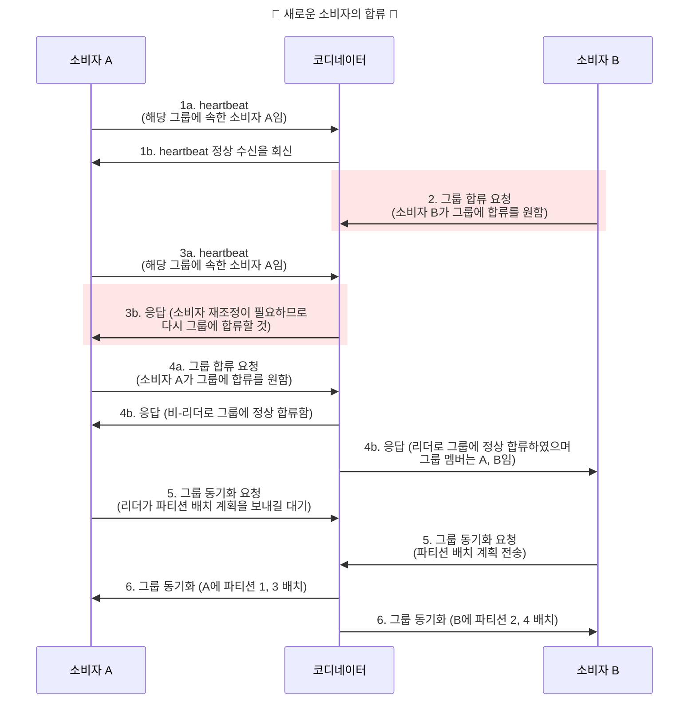
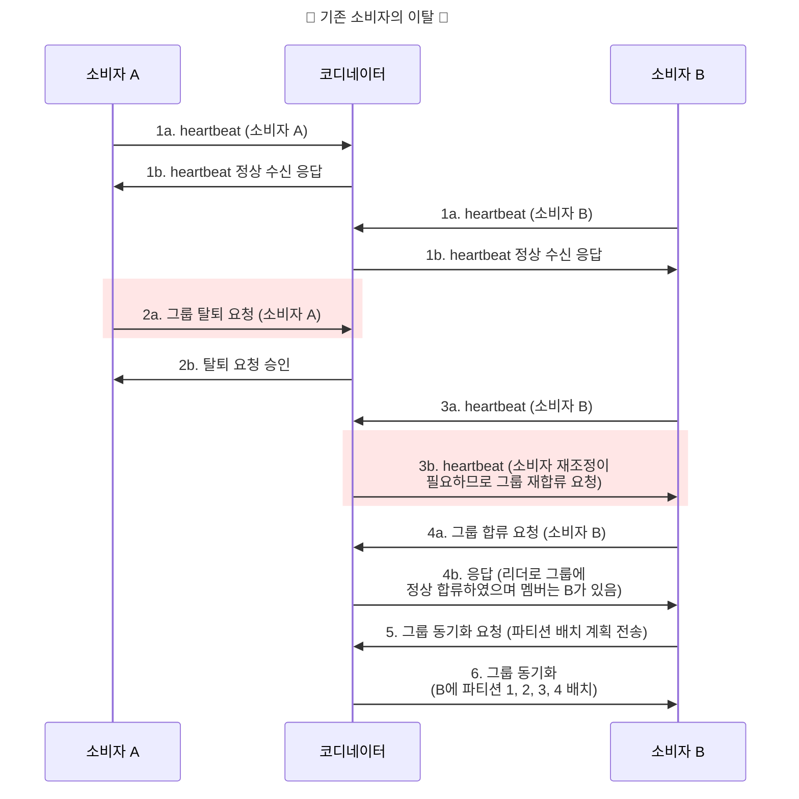
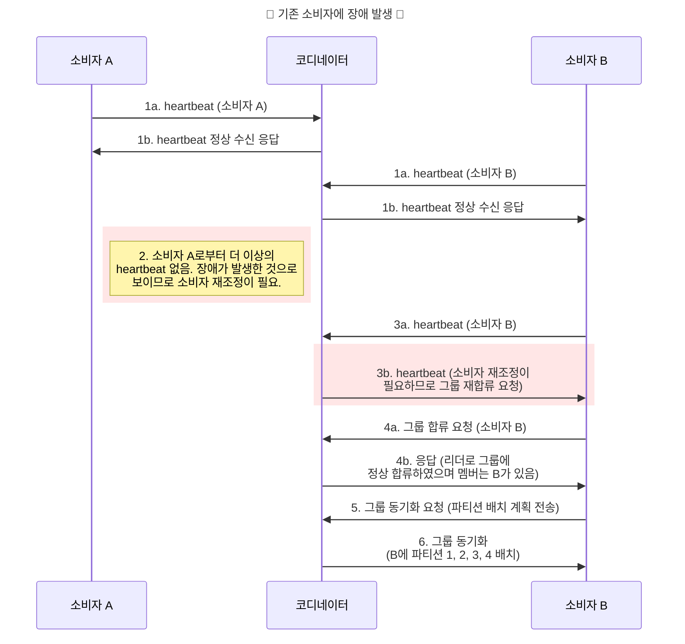

<!-- TOC -->
* [💡한번 늘어난 Consumer는 자동으로 줄어들 수 있을까? (Auto-scaling 가능 여부)](#한번-늘어난-consumer는-자동으로-줄어들-수-있을까-auto-scaling-가능-여부)
* [1. 메시지 큐 vs 이벤트 스트리밍 플랫폼](#1-메시지-큐-vs-이벤트-스트리밍-플랫폼)
* [2. 문제 이해 및 설계 범위 확정](#2-문제-이해-및-설계-범위-확정)
  * [💡카프카에서 멀티미디어도 지원이 가능할까?](#카프카에서-멀티미디어도-지원이-가능할까)
  * [2.1. 기능 요구사항](#21-기능-요구사항)
  * [2.2. 비기능 요구사항](#22-비기능-요구사항)
  * [2.3. 전통적 메시지 큐와 이번 설계의 다른 점](#23-전통적-메시지-큐와-이번-설계의-다른-점)
* [3. 개략적 아키텍처](#3-개략적-아키텍처)
  * [3.1. 메시지 모델](#31-메시지-모델)
    * [3.1.1. 일대일(point-to-point) 모델](#311-일대일point-to-point-모델)
    * [3.1.2. 발행-구독(publish-subscribe) 모델](#312-발행-구독publish-subscribe-모델)
  * [3.2. 토픽, 파티션, 브로커](#32-토픽-파티션-브로커)
  * [3.3. Consumer Group](#33-consumer-group)
  * [3.4. 개략적 설계안](#34-개략적-설계안)
* [4. 상세 설계](#4-상세-설계)
  * [4.1. 데이터 저장소](#41-데이터-저장소)
    * [4.1.1. 선택지 1: 데이터베이스(RDBMS/NoSQL)](#411-선택지-1-데이터베이스rdbmsnosql)
    * [4.1.2. 선택지 2: 쓰기 우선 로그(WAL, Write-Ahead Log)(채택)](#412-선택지-2-쓰기-우선-로그wal-write-ahead-log채택)
      * [💡LSM 트리와 WAL은 같은 개념일까?](#lsm-트리와-wal은-같은-개념일까)
      * [💡왜 더 큰 규모의 순차 쓰기가 더 높은 디스크 접근 대역폭을 달성할까?](#왜-더-큰-규모의-순차-쓰기가-더-높은-디스크-접근-대역폭을-달성할까)
      * [4.1.2.1. Segment 단위 분할](#4121-segment-단위-분할)
  * [4.2. 메시지 자료 구조와 일괄 처리](#42-메시지-자료-구조와-일괄-처리)
    * [4.2.1. 바이너리 계약과 제로 카피](#421-바이너리-계약과-제로-카피)
    * [4.2.2. 일괄 처리](#422-일괄-처리)
  * [4.3. Producer 측 작업 흐름](#43-producer-측-작업-흐름)
    * [4.3.1. 선택지 1: 별도의 라우팅 계층 도입](#431-선택지-1-별도의-라우팅-계층-도입)
    * [4.3.2. 선택지 2: 생산자 내부 버퍼 및 스마트 라우팅(채택)](#432-선택지-2-생산자-내부-버퍼-및-스마트-라우팅채택)
  * [4.4. Consumer 측 작업 흐름 및 데이터 전달 모델(Push vs Pull)](#44-consumer-측-작업-흐름-및-데이터-전달-모델push-vs-pull)
    * [4.4.1. 소비자 측 기본 작업 흐름](#441-소비자-측-기본-작업-흐름)
    * [4.4.2. Push 모델](#442-push-모델)
    * [4.4.3. Pull 모델(채택)](#443-pull-모델채택)
      * [💡`Long Polling` 이란?](#long-polling-이란)
      * [💡데이터 처리와 오프셋 갱신 순서가 메시지 전송 시맨틱에 미치는 영향은?](#데이터-처리와-오프셋-갱신-순서가-메시지-전송-시맨틱에-미치는-영향은)
  * [4.5. 소비자 재조정(Consumer rebalancing)](#45-소비자-재조정consumer-rebalancing)
    * [💡소비자 목록에 변화가 생기면 코디네이터 브로커는 무조건 '새 리더'를 선출할까?](#소비자-목록에-변화가-생기면-코디네이터-브로커는-무조건-새-리더를-선출할까)
    * [4.5.1. 새로운 소비자가 그룹에 합류하는 경우](#451-새로운-소비자가-그룹에-합류하는-경우)
    * [4.5.2. 기존 소비자가 우아하게 그룹을 떠나는 경우(Graceful Shutdown)](#452-기존-소비자가-우아하게-그룹을-떠나는-경우graceful-shutdown)
    * [4.5.3. 기존 소비자가 비정상적으로 다운된 경우(장애 감지)](#453-기존-소비자가-비정상적으로-다운된-경우장애-감지)
  * [4.6. 상태 저장소, 메타데이터 저장소, 주키퍼](#46-상태-저장소-메타데이터-저장소-주키퍼)
    * [4.6.1. 상태 저장소](#461-상태-저장소)
      * [💡왜 데이터의 일관성 및 높은 읽기/쓰기 속도에 요구될 때 주키퍼와 같은 키-값 저장소가 바람직할까?](#왜-데이터의-일관성-및-높은-읽기쓰기-속도에-요구될-때-주키퍼와-같은-키-값-저장소가-바람직할까)
      * [💡카프카는 왜 오프셋 저장소를 브로커로 이전했을까?](#카프카는-왜-오프셋-저장소를-브로커로-이전했을까)
      * [💡최신 트렌드: `KRaft`](#최신-트렌드-kraft)
    * [4.6.2. 메타데이터 저장소](#462-메타데이터-저장소)
      * [💡메타데이터 저장소로 주키퍼가 적절한 이유는?](#메타데이터-저장소로-주키퍼가-적절한-이유는)
    * [4.6.3. 주키퍼](#463-주키퍼)
  * [4.7. 데이터 유실 제로: 파티션 사본, 동기화(ISR) 전략](#47-데이터-유실-제로-파티션-사본-동기화isr-전략)
    * [4.7.1. 파티션 사본](#471-파티션-사본)
    * [💡메시지를 여러 파티션에 두면 같은 메시지가 여러 파티션에 중복되어 저장되는 걸까?](#메시지를-여러-파티션에-두면-같은-메시지가-여러-파티션에-중복되어-저장되는-걸까)
    * [4.7.2. 사본 동기화(ISR)](#472-사본-동기화isr)
      * [🚀Deep Dive: ISR 목록을 관리하는 `High Watermark`와 `Hands-Free 복제`](#deep-dive-isr-목록을-관리하는-high-watermark와-hands-free-복제)
  * [4.8. Producer ACK(`all`, `0`, `1`) 옵션](#48-producer-ackall-0-1-옵션)
    * [4.8.1. `ACK=all` 또는 `ACK=-1`](#481-ackall-또는-ack-1)
    * [4.8.2. `ACK=1`](#482-ack1)
    * [4.8.3. `ACK=0`](#483-ack0)
    * [💡Producer 측의 ACK 와 Consumer 측의 ACK](#producer-측의-ack-와-consumer-측의-ack)
  * [4.9. 규모 확장성](#49-규모-확장성)
    * [4.9.1. 브로커 결함 허용(Fault Tolerance)과 장애 복구](#491-브로커-결함-허용fault-tolerance과-장애-복구)
    * [4.9.2. 무중단 브로커 규모 확장(Scale-out)](#492-무중단-브로커-규모-확장scale-out)
    * [4.9.3. 파티션 개수 변경과 저장소 계층의 변화](#493-파티션-개수-변경과-저장소-계층의-변화)
    * [4.9.4. Producer의 확장성](#494-producer의-확장성)
    * [4.9.5. Consumer의 확장성](#495-consumer의-확장성)
  * [4.10. 메시지 전달 시맨틱과 오프셋 갱신 타이밍](#410-메시지-전달-시맨틱과-오프셋-갱신-타이밍)
    * [4.10.1. 최대 한 번(At-most-once)](#4101-최대-한-번at-most-once)
    * [4.10.2. 최소 한 번(At-least-once)](#4102-최소-한-번at-least-once)
    * [4.10.3. 정확히 한 번(Exactly-once)](#4103-정확히-한-번exactly-once)
* [5. 고급 기능](#5-고급-기능)
  * [5.1. 메시지 필터링](#51-메시지-필터링)
  * [5.2. 메시지의 지연 전송 및 예약 전송](#52-메시지의-지연-전송-및-예약-전송)
* [6. 최종 요약](#6-최종-요약)
* [참고 사이트 & 함께 보면 좋은 사이트](#참고-사이트--함께-보면-좋은-사이트)
<!-- TOC -->

메시지 큐는 Producer와 Consumer 사이에서 메시지를 중재하는 비동기 통신 플랫폼이다.  
이를 도입함으로써 얻을 수 있는 아키텍처적 이점은 크게 4가지로 요약된다.
- **결합도 완화(Decoupling)**
  - 컴포넌트 간의 강한 의존성이 사라진다.
  - 생산자와 소비자가 현재 살아있는지, 어떤 기술 스택을 쓰는지 알 필요 없이 오직 큐에 데이터를 넣기만 하면 된다.
  - 따라서 각 시스템을 독립적으로 수정하고 배포할 수 있다.
- **규모 확장성 개선**
  - 트래픽 부하에 맞춰 생산자와 소비자의 규모를 완전히 독립적으로 확장할 수 있다.
  - 예) 이벤트 기간에 주문 트래픽이 몰리면 생산자 서버를 늘리고, 큐에 쌓인 메시지를 처리하는 소비자 서버만 유연하게 늘려 대응 가능
- **가용성 개선**
  - Consumer 중 하나에 일시적인 장애가 발생하여 다운되어도 메시지는 안전하게 큐에 보관된다.
  - 소비자 시스템이 복구되는 즉시 중단된 시점부터 다시 메시지를 읽어와 처리할 수 있으므로 전체 시스템의 가동률이 극대화된다.
- **성능 개선**
  - 메시지 큐는 비동기 통신을 보장한다.
  - Producer는 응답을 기다리며 Blocking 되지 않고, 메시지를 큐에 던진 후 즉시 다음 작업을 수행한다.
  - Consumer 역시 자신이 처리할 수 있는 속도에 맞춰 메시지를 가져가므로 시스템 전체의 처리량이 향상된다.

---

# 💡한번 늘어난 Consumer는 자동으로 줄어들 수 있을까? (Auto-scaling 가능 여부)
**가능하다.**  
Kubernetes에서는 **KEDA(Kubernetes-based Event-driven Autoscaler)**와 같은 도구를 활용하여 메시지 큐의 **Consumer Lag**(쌓여 있는 메시지의 양)을 모니터링 한다.  
처리해야 할 잔여 메시지가 임계치 이하로 떨어지면 컨슈머 Pod를 자동으로 축소하며, 이 때 시스템은 자연스럽게 '소비자 재조정(Rebalancing)'을 일으켜 자원을 최적화한다.

---

# 1. 메시지 큐 vs 이벤트 스트리밍 플랫폼

시중에는 아파치 카프카, 아파치 RabbitMQ, 아파치 Pulsar, 아파치 RocketMQ, 아파치 ActiveMQ 등 수많은 메시지 브로커가 존재한다.  
흔히 혼용하여 부르지만 기술적으로는 **전통적인 메시지 큐**와 **이벤트 스트리밍 플랫폼**으로 명확히 구분된다.

|         | 전통적 메시지 큐(예: RabbitMQ, ActiveMQ)                    | 이벤트 스트리밍 플랫폼(예: Kafka, Pulsar)                     |
|---------|-----------------------------------------------------|----------------------------------------------------|
| 메시지 보관성 | 소비자가 메시지를 수신하고 확인 응답(ACK)을 보내면 **메시지를 즉시 파괴**함(소멸성) | 메시지를 소비하더라도 보관 기간 동안 **디스크에 영구히 유지**함(지속성)          |
| 소비 패턴   | 단 한 명의 소비자만 해당 메시지를 가져갈 수 있는 구조가 기본                 | 동일한 데이터를 여러 Consumer Group이 **몇 번이고 반복해서** 읽을 수 있음 |
| 데이터 순서  | 메시지의 소비 순서를 엄격하게 보장하기 어려움                           | 동일한 파티션 내에서는 메시지가 들어온 **순서를 완벽히 보장**함                  |

최근에는 RabbitMQ에 스트리밍 기능이 추가되는 등 두 기술의 경계가 희미해지고 있지만, 대규모 로그 수집이나 실시간 스트림 처리를 위해서는 데이터 장기 보관 및 반복 소비가 
가능한 시스템이 필수적이다.  
여기서는 이러한 **이벤트 스트리밍 플랫폼의 강점을 지닌 분산 메시지 큐**를 다룬다.

---

# 2. 문제 이해 및 설계 범위 확정

대규모 트래픽과 지속성을 모두 만족하는 분산 메시지 큐를 설계하기 위한 구체적인 요구사항을 정의한다.

- **메시지 형태 및 크기**
  - **Q:** 메시지의 형태와 평균 크기는 어느 정도인가? 텍스트만 지원해야 하는가, 멀티미디어도 지원해야 하는가?
  - **A:** 텍스트 형태의 메시지만 지원하며, 메시지 크기는 수 KB 수준이다.
- **메시지 반복 소비 여부**
  - **Q:** 메시지는 반복 소비가 가능해야 하는가?
  - **A:** 그렇다. 하나의 메시지를 여러 Consumer Group이 반복해서 수신할 수 있어야 한다.
          한 소비자가 받아가면 대기열에서 즉시 지워버리는 전통적인 분산 메시지 큐와 달리, 본 시스템은 보관 기한 동안 메시지를 유지하여 멀티캐스팅을 지원한다.
- **메시지 소비 순서 보장**
  - **Q:** 메시지는 큐에 전달된 순서대로 소비되어야 하는가?
  - **A:** 그렇다. 동일한 파티션 내에서는 메시지가 생성된 순서(FIFO)대로 소비자에게 전달되어야 한다.
- **데이터 지속성 및 보관 기간**
  - **Q:** 데이터의 지속성이 보장되어야 하는가? 그렇다면 기간은 어느 정도이어야 하는가?
  - **A:** 그렇다. 하드웨어 장애에 대응하기 위해 디스크 기반의 지속성을 보장해야 하며, 메시지의 기본 보관 기간은 **2주**로 설정한다.  
  보관 기간이 만료되거나 용량을 초과한 오래된 이력 데이터는 자동으로 삭제된다.
- **서비스 이용 규모**
  - **Q:** 지원해야 하는 Producer와 Consumer 수는 어느 정도인가?
  - **A:** 많으면 많을수록 좋다. 트래픽 급증 시 브로커 노드나 파티션을 추가하여 선형적으로 확장 가능한 분산 클러스터 구조이어야 한다.
- **메시지 전달 방식(Delivery Semantics)**
  - **Q:** 어떤 메시지 전달 방식을 지원해야 하는가? 최대 한 번(at-most-once), 최소 한 번(at-least-once), 정확히 한 번(exactly once) 중 무엇인가?
  - **A:** 비즈니스 도메인의 특성에 맞춰 세 가지 방식 모두를 사용자가 설정을 통해 선택할 수 있어야 한다.
- **목표 성능(대역폭 및 지연 시간)**
  - **Q:** 목표로 해야할 대역폭과 end-to-end 지연 시간은 어떻게 되는가?
  - **A:** 대규모 로그 수집 시스템 등으로도 활용할 수 있어야 하므로 높은 수준의 대역폭을 제공해야 하며, 동시에 실시간 이벤트 처리를 위한 낮은 전송 지연도 필수적이다.

---

## 💡카프카에서 멀티미디어도 지원이 가능할까?

일반적인 카프카도 멀티미디어(이미지, 동영상 등) 바이너리 데이터를 `byte[]` 형태로 담아 전송하는 것 자체는 가능하다.  
하지만 대용량 파일이 브로커로 직접 유입되면 메모리 캐시 효율이 급격히 떨어지고 디스크 I/O 병목이 발생한다.

따라서 실무에서는 대용량 멀티미디어 파일을 S3와 같은 오브젝트 스토리지에 업로드하고, 메시지 큐에는 '파일의 저장 경로'만 메타데이터로 담아 
전달하는 **클레임 체크(Claim-Check) 패턴**을 사용하는 것이 표준이다.

---

## 2.1. 기능 요구사항

- 생산자는 메시지 큐에 메시지를 발행할 수 있어야 한다.
- 소비자는 메시지 큐로부터 메시지를 수신(Pull)할 수 있어야 한다.
- 메시지는 설정에 따라 **반복적으로 수신**할 수도 있고, 전통적인 방식처럼 단 한 번만 수신되도록 설정할 수도 있어야 한다.
- 보관기한이 만료되거나 용량을 초과한 오래된 이력 데이터는 자동으로 삭제된다.
- 메시지의 형태는 수 KB 수준의 일반적인 텍스트 데이터를 지원한다.
- 동일 파티션 내에서는 생산된 순서대로 소비자에게 전달되어야 한다.
- 사용자 설정에 따라 세 가지 메시지 전달 방식(최대 한 번, 최소 한 번, 정확히 한 번)을 모두 지원해야 한다.

---

## 2.2. 비기능 요구사항

- **높은 대역폭(Throughput) 혹은 낮은 전송 지연(Latency)** 중 비즈니스 특성에 맞게 시스템 옵션을 튜닝할 수 있어야 한다.
- **규모 확장성:** 트래픽이 급증하더라도 브로커 노드나 파티션을 추가하여 선형적으로 성능을 확장할 수 있는 분산 구조이어야 한다.
- **지속성 및 내구성(Persistence & Durability)**: 하드웨어 장애로 노드가 죽더라도 데이터가 유실되지 않도록 디스크 기반 저장소를 활용하고, 여러 브로커에 데이터를 복제해야 한다.

---

## 2.3. 전통적 메시지 큐와 이번 설계의 다른 점

여기서 설계할 분산 메시지 큐의 차별점은 결국 **데이터의 수명 관리와 순서 보장**에 있다.

전통적 큐는 메모리 효율성을 위해 대기열의 메시지를 처리하는 즉시 지워버리며 [성능 임계치를 넘을 때만 디스크를 임시 버퍼](https://www.rabbitmq.com/docs/maxlength)로 사용한다.

반면, 여기서 다룰 대규모 시스템용 분산 큐는 모든 이벤트를 디스크에 순차적 로그 형태로 기록하여 최대 2주간 안전하게 보관(Retention)한다.  
이 지속성 때문에 소비자의 유연한 데이터 재생(Replay)이 가능해지며, 대규모 장애 상황에서도 데이터 유실 없는 완벽한 내결함성을 갖추게 된다.

---

# 3. 개략적 아키텍처

요구사항을 명확히 했으니, 이제 분산 메시지 큐의 개략적인 구조에 대해 설계해보자.  
대규모 시스템에서 메시지를 어떻게 분류하고, 저장하고, 분산 처리하는지 핵심 메커니즘에 대해 알아본다.

---

## 3.1. 메시지 모델

메시징 시스템은 데이터를 소비자에게 전달하는 방식에 따라 크게 두 가지 모델로 나뉜다.

---

### 3.1.1. 일대일(point-to-point) 모델

전통적인 메시지 큐에서 흔히 발견되는 구조이다.  
큐에 전송된 메시지는 오직 한 명의 소비자만 가져갈 수 있다.


어떤 소비자가 메시지를 성공적으로 가져갔다고 큐에 확인 응답(ACK)을 보내면, 해당 메시지는 큐에서 즉시 삭제된다.  
데이터 보관(Retention) 개념이 없기 때문에, 동일한 데이터를 다른 시스템에서 재소비할 수 없다.

따라서 여기서 목표로 하는 '2주간 보관 및 반복 소비' 요건에는 적합하지 않다.

---

### 3.1.2. 발행-구독(publish-subscribe) 모델

본 설계의 기반이 되는 모델이다.  
메시지를 주제별로 정리하는 토픽(Topic)이라는 개념을 사용하며, Producer는 특정 토픽에 메시지를 발행하고, Consumer는 해당 토픽을 구독하여 데이터를 가져온다.


이 모델에서는 토픽에 전달된 메시지가 해당 토픽을 구독하는 **모든 Consumer Group에게 복사되어 전달**된다.  
덕분에 하나의 이벤트를 결제 시스템, 알림 시스템 등 여러 곳에서 동시에 받아볼 수 있다.

---

## 3.2. 토픽, 파티션, 브로커

발행-구독 모델은 훌륭하지만, 거대한 트래픽이 하나의 토픽으로 몰리면 서버 한 대의 디스크나 네트워크 대역폭으로는 감당할 수 없는 병목이 생긴다.  
이 문제를 해결하는 분산 시스템의 핵심이 바로 **파티션**, 즉 **데이터 샤딩 기법**이다.

- **파티션 분할**
  - 하나의 토픽을 여러 개의 파티션으로 쪼개어 메시지를 분산 저장
  - 각 파티션은 독립적인 FIFO 큐처럼 동작
- **브로커(Broker)**
  - 파티션을 유지하고 관리하는 메시지 큐 클러스터 내의 개별 서버
  - **파티션들을 여러 브로커에 고르게 분산 배치하는 것이 성능 선형 확장의 비결**임
- **오프셋(Offset)**
  - 파티션 내에서 메시지의 위치를 나타내는 순차적인 고유 번호
  - 파티션 내부에서는 이 오프셋 덕분에 메시지의 순서가 완벽히 보장됨


Producer가 메시지를 보낼 때는 메시지에 Key를 붙일 수 있다.  
같은 Key를 가진 메시지는 항상 동일한 파티션으로 전송되어 완벽한 순서 보장을 받게 되며, Key가 없는 메시지는 라운드 로빈이나 무작위 방식으로 파티션에 균등하게 분산된다.

아래는 브로커와 파티션을 갖춘 메시지 큐 클러스터이다.


---

## 3.3. Consumer Group

토픽을 구독하는 Consumer 가 여럿일 때, 이들을 효율적으로 관리하기 위해 Consumer Group이라는 개념을 도입한다.  
하나의 Consumer Group은 독립된 하나의 비즈니스 서비스(예: 배송 시스템 전용 그룹)를 대변한다.


위 그림처럼 Consumer Group 내의 컴포넌트들은 토픽의 파티션들을 나누어 맡아 메시지를 병렬로 읽어온다.  
대역폭 측면에서 대단히 유리하다. 하지만 여기서 아주 중요한 아키텍처적 딜레마가 발생한다.

**⚠️Q: 데이터를 병렬로 읽으면 처리량은 늘어나지만, 만일 소비자-1과 소비자-2가 같은 파티션-1의 메시지를 동시에 무작위로 읽어간다면 어떻게 될까?**

**A:** 파티션 내에서의 메시지 소비 순서가 완전히 깨지게 된다. 1번 주문 이벤트보다 2번 결제 완료 이벤트가 먼저 처리되는 대참사가 발생할 수 있다.

**해결책**: 시스템의 엄격한 순서 보장을 위해 제약 조건을 추가한다.  
**'어떤 파티션의 메시지는 하나의 Consumer Group 내에서 오직 단 한 명의 Consumer만 읽을 수 있다'**  
이 제약 조건 때문에 Consumer Group 내의 Consumer 수가 구독하는 토픽의 파티션 수보다 많아지면, 몇몇 Consumer는 할당받을 파티션이 없어 Idle 상태가 된다.  
위 그림에서 소비자 그룹-2의 소비자-3이 토픽-B의 메시지를 수신하지 못하는 이유가 바로 이 때문이다.  
이미 소비자-4가 해당 파티션을 점유하고 있기 때문이다.  
따라서 병렬 처리량을 늘리려면 Consumer만 늘릴 게 아니라 **토픽의 파티션 수도 함께 늘려주어야 한다.**

---

## 3.4. 개략적 설계안


- **클라이언트 레이어**
  - **Producer:** 메시지를 생성하여 특정 토픽의 파티션으로 발행
  - **Consumer:** Consumer Group을 형성하여 토픽을 구독하고 오프셋을 기반으로 메시지를 당겨와 처리
- **코어 브로커 및 저장소 레이어**
  - **Broker:** 파티션을 나누어 저장하고 디스크 기반의 지속성 제공
  - **데이터 저장소:** 파티션 실데이터(메시지)가 물리적으로 기록되는 공간
  - **상태 저장소:** Consumer Group별로 각 파티션에서 어디까지 읽었는지 나타내는 **오프셋 상태 정보**를 관리
  - **메타데이터 저장소:** 토픽명, 파티션 수, Replica 배치 계획 등 클러스터의 전반적인 설정 정보 보관
- **조정 서비스(Coordination Service)**
  - **서비스 탐색 및 Health check:** 어떤 브로커가 살아있고 죽었는지 모니터링
  - **컨트롤러 선출:** 브로커 중 하나를 브로커 클러스터의 컨트롤러로 선출하며, 이 컨트롤러가 파티션 배치와 관리를 총괄
    - 전통적으로 아파치 주키퍼나 etcd같은 도구가 이 역할을 담당함

---

# 4. 상세 설계

<**대규모 대역폭 달성을 위한 3가지 아키텍처 결정**>
- **OS 페이지 캐시와 순차 디스크 I/O 극대화**
  - 회전 디스크(Rotational Disk)의 높은 순차 탐색 성능과 OS가 제공하는 적극적 디스크 캐시 전략(Aggressive Disk Caching Strategy)을 잘 이용하는 
  디스크 기반 자료 구조(On-disk Data Structure)를 활용
- **수정 없는 전송을 위한 메시지 구조 설계**
  - 메시지가 생산자로부터 소비자에게 전달되는 순간까지 아무런 수정 없이도 전송이 가능하도록 메시지 자료 구조 설계
  - 전송 데이터 양이 많은 경우 메모리 상에서 메시지를 복사하는데 드는 비용을 최소화하기 위함
- **일괄 처리 우선 시스템 설계**
  - 소규모 I/O가 많아지면 시스템은 컨텍스트 스위칭과 네트워크 오버헤드로 인해 높은 대역폭을 지원하기 어려움
  - 따라서 생산자는 메시지를 일괄 전송하고, 큐는 이를 더 큰 단위로 묶어 보관하며, 소비자도 일괄 수신하도록 시스템 전반에서 일괄 처리를 장려

---

## 4.1. 데이터 저장소

첫 번째 결정인 '디스크 기반 자료 구조 활용'을 위해, 분산 메시지 큐의 트래픽 패턴을 먼저 분석한다.
- **읽기/쓰기 연산:** 대규모로 빈번하게 발생
- **갱신/삭제 연산:** 기본적으로 전혀 발생하지 않음(보관 주기가 지난 데이터만 통째로 날림)
- **접근 패턴:** 오프셋을 따라 순차적으로 읽고 맨 뒤에 추가하는 패턴이 대부분

---

### 4.1.1. 선택지 1: 데이터베이스(RDBMS/NoSQL)

토픽별로 테이블을 만들고 메시지가 올 때마다 레코드로 추가하는 방식이다.  
읽기와 쓰기가 동시에 몰아치면 인덱스(B+ Tree)를 갱신하고 페이지를 분할하는 과정에서 엄청난 메모리 오버헤드와 무작위 디스크 I/O가 발생한다.  
대규모 스트리밍 트래픽을 받기에는 인프라 비용과 오버헤드가 너무 크다.

---

### 4.1.2. 선택지 2: 쓰기 우선 로그(WAL, Write-Ahead Log)(채택)

WAL은 새로운 항목이 오직 맨 뒤에 추가되기만 하는(Append-only) 일반 파일이다.  
수정이 없고 뒤에 붙이기만 하므로 접근 패턴이 100% 순차적이다.

---

#### 💡LSM 트리와 WAL은 같은 개념일까?

종종 대규모 쓰기 성능을 위해 언급되는 [**LSM 트리(Log-Structured Merge-tree)**](https://assu10.github.io/dev/2026/06/05/architecture-nearby/#242-%EC%9C%84%EC%B9%98-%EC%9D%B4%EB%8F%99-%EC%9D%B4%EB%A0%A5-dbcassandra)와 
**WAL**을 같은 것으로 오해하곤 한다.  
결론부터 말하면 **WAL은 LSM 트리의 구성 요소 중 하나일 뿐, 완전히 다른 개념**이다.

- **WAL**
  - 데이터 유실을 막기 위해 디스크에 순차적으로 기록하는 '가장 단순한 형태의 로그 파일'
  - 별도의 인덱스가 없어 특정 키를 통한 무작위 조회가 불가능
- **LSM 트리**
  - WAL에 먼저 쓴 뒤 메모리 버퍼(MemTable)에 적재하고, 이를 디스크에 정렬된 파일(SSTable)로 주기적으로 내려보내어 주기적으로 병합(Compaction)하는 **고급 키-값 데이터 구조**이다.

카프카 같은 분산 큐는 특정 키의 무작위 조회가 필요 없고 오직 오프셋 번호로만 순차 리딩을 한다.  
따라서 굳이 복잡한 LSM 트리를 쓸 필요 없이, **가장 가볍고 가공하기 쉬운 WAL 방식(세그먼트 로그 파일)을 채택**한다.

---

#### 💡왜 더 큰 규모의 순차 쓰기가 더 높은 디스크 접근 대역폭을 달성할까?

HDD든 SSD든 디스크 헤더가 물리적으로 이동하거나 메모리 블록을 지우고 쓰는 과정에서 무작위 접근(Random Access)은 엄청난 병목을 만든다.  
반면, 대량의 메시지를 묶어서 순차 접근(Sequential Access)을 하면 디스크 탐색 시간이 사실상 0에 수렴한다.


OS는 디스크 데이터를 페이지 캐시에 아주 적극적으로 밀어 넣는데, 순차 쓰기 연산의 규모가 클수록 OS는 디스크 캐시에서 더 큰 규모의 연속된 공간을 한 번에 점유할 수 있게 된다.  
즉, 자잘한 I/O 요청이 여러 번 발생하는 것보다 코어 브로커가 큰 덩어리의 순차 I/O를 일으키는 것이 디스크 접근 대역폭을 물리적 한계치까지 끌어올리는 비결이다.

---

#### 4.1.2.1. Segment 단위 분할

하나의 파일이 무한정 커질 수는 없으므로, 시스템은 파티션을 **세그먼트** 단위의 작은 파일로 쪼개어 관리한다.

새로운 메시지는 오직 현재 활성화된 **'활성 상태(Active)의 세그먼트 파일'** 맨 뒤에만 추가되며, 파일 크기가 한계(예: 1GB)에 도달하면 새로운 활성 세그먼트가 개설된다.

보관 기한(2주)이 지난 낡은 비활성 세그먼트는 파일 내부의 레코드를 일일이 지우는 대신, OS 레벨에서 파일 자체를 디스크에서 통째로 삭제하므로 쓰기 성능에 미치는 영향이 전무하다.


---

## 4.2. 메시지 자료 구조와 일괄 처리

- **제로 카피:** CPU의 **데이터 복사 오버헤드**를 제거
- **일괄 처리:** CPU의 **시스템 콜(컨텍스트 스위칭) 오버헤드**를 제거

Producer가 뭉쳐놓은 대용량 메시지 번들을 브로커가 단 1번의 시스템 콜로 Consumer에게 통째로 보내기 때문에(제로 카피), 대용량 로그 수집도 가볍게 버티는 초고속 대역폭이 완성된다.

| 필드 이름 | 데이터 자료형 | 설명 |
| :--- | :--- | :--- |
| crc | integer | 데이터의 무결성을 검증하기 위한 순환 중복 검사 값 |
| size | integer | 메시지의 전체 크기 |
| timestamp | long | 메시지가 생성된 타임스탬프 |
| attributes | byte | 압축 코덱 정보 등 메시지 속성 플래그 |
| key | byte[] | 파티션을 결정하는 해시 키 |
| value | byte[] | 실제 비즈니스 데이터 페이로드 (Payload) |
| offset | long | 파티션 내 메시지 고유 위치 (브로커가 할당) |

---

### 4.2.1. 바이너리 계약과 제로 카피

두 번째 결정인 '메시지 복사 비용 최소화' 를 구현하는 방법이다.

Producer가 정의한 위 스키마 형식을 브로커가 아무런 수정 없이 그대로 파일에 쓰고 Consumer에게 전달하면 [제로 카피(Zero-Copy)](https://assu10.github.io/dev/2024/07/13/kafka-mechanism-1/#42-%EC%9D%BD%EA%B8%B0-%EC%9A%94%EC%B2%AD)를 
구현할 수 있다.

일반적으로 디스크의 파일을 네트워크로 보낼 때는 `디스크 → 커널 버퍼 → 유저 버퍼 → 소켓 버퍼 → 네트워크 카드`라는 많은 복사를 거친다.  
하지만 데이터의 변경이 전혀 없다면, 리눅스의 `sendfile` 시스템 콜을 이용해 유저 공간을 거치지 않고 **OS 페이지 캐시에서 네트워크 카드 버퍼로 데이터를 다이렉트로 전송**할 수 있다.  
이 기법 덕분에 대용량 데이터 전송 시 브로커 CPU 오버헤드가 극적으로 줄어든다.

---

### 4.2.2. 일괄 처리

세 번째 결정인 '일괄 처리 우선 설계'를 구현하는 방법이다.

제로 카피가 데이터 복사 비용을 줄여준다면, 일괄 처리는 시스템 콜과 네트워크 왕복 횟수를 줄여주는 기술이다.

만일 메시지를 건당 하나씩 전송한다면, 제로 카피를 쓰더라도 메시지 1만 개를 보낼 때 1만 번의 콜(컨텍스트 스위칭)과 네트워크 Lag이 발생하여 CPU 부하가 크다.  
또한 디스크에도 자잘한 쓰기 연산이 흩어져 발생하므로 I/O 효율이 극도로 떨어진다.

이를 극복하기 위해 Producer 단계부터 메시지를 묶어 하나의 거대한 바이너리 배치를 만든다.  
브로커는 이 덩어리를 디스크에 한 번에 순차 쓰기를 하므로 **연속된 공간을 점유하여 디스크 접근 대역폭이 비약적으로 상승**한다.

---

## 4.3. Producer 측 작업 흐름

Producer가 특정 파티션에 메시지를 보내고자 할 때, 어느 브로커 노드가 해당 파티션의 리더인지 알고 찾아가야 한다.  
이를 처리하는 두 가지 설계안이 있다.

---

### 4.3.1. 선택지 1: 별도의 라우팅 계층 도입

가장 직관적인 방법은 생산자와 브로커 클러스터 사이에 라우팅 프록시 서버를 두는 것이다.

생산자는 아무 생각 없이 라우팅 계층에 메시지를 던지면, 라우팅 계층이 메타데이터 저장소에서 사본 분산 계획을 읽어와 적절한 브로커(파티션 리더)에게 메시지를 전달한다.

아래 그림에서 생산자는 토픽 A 의 파티션-1로 메시지를 보내고자 한다.


- **메시지 발송**
  - 생산자는 메시지를 특정 브로커가 아닌 **라우팅 계층**으로 보냄
- **메타데이터 캐싱**
  - 라우팅 계층은 메타데이터 저장소에서 **사본 분산 계획(어떤 파티션의 사본들이 어느 브로커에 분산 배치되어 있는지에 대한 정보)**를 읽어와 자기 캐시에 보관
- **리더 사본으로 라우팅**
  - 메시지가 도착하면 라우팅 계층은 캐시된 메타데이터를 기반으로 해당 파티션의 리더 사본(Leader Replica)이 있는 브로커로 메시지를 전송
  - 예) 토픽-A 파티션-1의 리더가 브로커-1에 있다면 브로커-1로 포워딩
- **사본 동기화**
  - 리더 사본이 메시지를 받으면, 해당 리더를 따르는 단순 사본(Follower)들이 리더 브로커로부터 새 메시지를 지속적으로 읽어가며 데이터를 동기화
- **데이터 커밋 및 ACK**
  - '충분한' 수의 사본이 동기화되면 리더는 데이터를 디스크에 최종 기록(Commit)
  - **데이터가 소비자에게 노출되어 소비 가능한 시점이 되는 바로 이 합의(Commit) 시점**임
  - 기록이 끝나면 리더는 생산자에게 수신 확인 응답(ACK)를 회신

하지만 이 구조는 **추가적인 네트워크 홉이 발생**하므로 전송 지연 시간이 늘어나고, 대규모 일괄 처리를 구현하기 어렵다는 한계가 존재한다.

---

**장애 감내(Fault Tolerance)를 위한 사본 메커니즘**

여기서 메시지를 받는 브로커는 **리더 사본**이다.  
특정 브로커가 죽어도 데이터 유실을 막기 위해 이 복제본 간의 동기화 원리는 [4.7. 사본 동기화(ISR 전략)](#472-사본-동기화isr)에서 알아본다.

---

### 4.3.2. 선택지 2: 생산자 내부 버퍼 및 스마트 라우팅(채택)

네트워크 전송 지연을 줄이고 대역폭을 극대화하기 위해, 선택지 1에서 가상으로 두었던 라우터 계층의 역할을 **Producer 클라이언트 라이브러리 내부로 완전히 편입**시키고 
**메모리 버퍼**를 도입한다.


- **스마트 클라이언트**
  - 생산자 자체가 브로커 클러스터와 통신하여 메타데이터(사본 분산 계획)을 직접 읽어와 로컬에 캐싱
  - 즉, 생산자가 스스로 어떤 브로커가 리더인지 알고 직접 다이렉트로 접속하므로 라우팅 프록시 서버를 거칠 필요가 없어 전송 지연이 줄어듦
- **클라이언트 측 메모리 버퍼링**
  - 생산자는 메시지를 발행할 때 브로커로 즉시 네트워크 전송을 보내지 않고, 내부 메모리 버퍼에 파티션별로 메시지를 차곡차곡 모아둠
- **일괄 전송**
  - 버퍼에 설정된 임계치만큼 데이터가 쌓이면, 대량의 메시지를 하나의 큰 바이너리 배치 단위로 묶어 리더 브로커에서 한 번에 전송

---

버퍼를 도입하면 메시지 묶음이 한 번에 전송되므로 브로커 디스크에 더 큰 규모의 순차 쓰기가 발생하고 디스크 대역폭을 극한까지 끌어올릴 수 있다.


결국 일괄 처리할 메시지의 양을 얼마나 잡을지는 아키텍처적 Trade-off의 문제이다.  
양을 늘리면 대역폭은 치솟지만 버퍼가 찰 때까지 기다려야 하므로 Latency가 늘어난다.  
따라서 시스템의 용도를 감안하여 이 일괄 처리 크기를 미세조정해야 한다.

---

## 4.4. Consumer 측 작업 흐름 및 데이터 전달 모델(Push vs Pull)

생산자 측 작업 흐름과 마찬가지로, 소비자가 브로커로부터 데이터를 안전하고 효율적으로 읽어 가기 위한 핵심 워크 플로우와 클라이언트-브로커 간의 데이터 전달 패러다임을 
정립해야 한다.

---

### 4.4.1. 소비자 측 기본 작업 흐름

소비자 아키텍처의 가장 기본적인 작동 원리는 단순하다.  
**소비자는 브로커에게 특정 파티션의 오프셋 번호를 건네고, 해당 위치에서부터 이벤트를 묶어(Batch) 가져온다.**


소비자-1은 오프셋 6번을 브로커에 요청하여 그 이후의 이벤트들을 묶음으로 당겨오며, 처리가 더 빠른 소비자-2는 오프셋 13번을 주고 그 이후의 이벤트를 가져온다.  
이처럼 각 소비자는 본인이 읽어야 할 위치를 독립적으로 제어할 수 있다.

그렇다면 이 일괄 조회 과정을 브로커가 메시지를 받는 즉시 소비자에게 밀어주어야 할까(Push), 아니면 소비자가 준비되었을 때 당겨와야 할까?(Pull)

---

### 4.4.2. Push 모델

브로커가 메시지를 밀어 넣는 푸시 모델은 Latency를 최소화하는데 유리하다.
- **장점**
  - 메시지가 브로커에 도착하자마자 소비자에게 전송되므로 실시간성에 가까움
- **단점**
  - 생산자가 메시지를 생성하는 속도가 소비자가 처리하는 속도보다 빠르면, 소비자는 트래픽을 감당하지 못하고 결국 Crash됨
  - 결국 소비자는 항상 최고 트래픽에 맞춘 오버 스펙의 컴퓨팅 자원을 상시 대기시켜야 하므로 자원 효율성이 떨어짐

---

### 4.4.3. Pull 모델(채택)

소비자가 본인의 처리 역량과 타이밍에 맞춰 브로커로부터 데이터를 직접 당겨오는 방식이다.  
대규모 대역폭을 지향하는 시스템(예: 카프카)의 표준 아키텍처이다.

- **그룹 합류 및 할당**
  - 소비자는 Consumer Group 내에서 본인이 전담할 코디네이터 브로커를 찾아 그룹에 합류하고 파티션을 할당받음
- **오프셋 기반 Pull**
  - 소비자는 상태 저장소에 기록된 본인의 마지막 오프셋 이후부터 메시지를 자신의 처리 능력만큼 당겨(Pull)옴
- **데이터 처리 및 갱신**
  - 가져온 메시지 번들을 처리한 후, 성공적으로 완료되면 새로운 오프셋 정보를 브로커에 보냄
- **장점**
  - 소비 속도를 소비자가 제어하므로 시스템 안정성이 극대화됨
  - 실시간 처리가 필요한 서비스는 끊임없이 당겨가고, 무거운 처리를 하는 배치 분석 시스템은 새벽에 한 번에 당겨가는 등 유연한 구성이 가능
  - 무엇보다 **한 번에 가져올 최대 메시지 크기를 소비자가 지정할 수 있어 '공격적인 일괄 처리'에 완벽하게 부합**함
- **단점**
  - 브로커에 새로 들어온 메시지가 없더라도 소비자가 계속 데이터를 달라고 요청(Polling)하므로, 무의미한 네트워크 트래픽과 소비자 측 CPU 자원이 낭비될 수 있음
  - 이 단점은 아래 **Long Polling** 기술로 해결 가능함

---

#### 💡`Long Polling` 이란?

[롱 폴링(long polling)](https://kafka.apache.org/43/getting-started/introduction/)은 데이터가 **없을 때만** 대기하는 최적화 기법이다.  
만일 브로커에 소비자가 가져갈 메시지가 이미 쌓여 있다면, 대기 시간은 **0초이며, 즉시 데이터를 반환**한다.

브로커가 완전히 비어 있을 때, 일반적인 '쇼트 폴링(Short Polling)'은 '데이터 없음'이라는 빈 응답을 즉시 주고 연결을 끊어버려 소비자가 무한 루프를 돌며 
브로커를 Polling 한다.  
반면, 롱 폴링은 데이터가 없을 때 빈 응답을 주는 대신, 데이터가 들어오거나 설정한 타임아웃이 될 때까지 **소켓 커넥션을 끊지 않고 브로커가 대기**한다.  
대기 도중 메시지가 단 한 건이라도 들어오면 그 즉시 커넥션을 통해 데이터를 전달하며 응답하므로 자원 낭비를 막아준다.

이러한 이유로 대부분의 메시지 큐는 푸시 모델 대신 풀 모델을 지원한다.


- **① 그룹 합류 및 코디네이터 접속**
  - 소비자 그룹-1에 합류하고 토픽-A를 구독하길 원하는 새로운 소비자가 추가된다.
  - 이 소비자는 그룹 이름을 해싱하여 자신이 접속할 브로커 노드를 찾는다.
  - 동일한 해시 함수와 그룹 이름을 사용하기 때문에, **같은 그룹의 모든 소비자는 결국 클러스터 내의 동일한 브로커 노드에 접속**하게 된다.
  - ⚠️아래 두 개념을 헷갈리지 말자
  - **소비자 그룹 코디네이터(Consumer Group Coordinator)**
    - 위의 해싱 과정을 통해 지정된 특정 브로커 노드를 뜻하며, 오직 **해당 소비자 그룹의 조정 작업(멤버 관리, 오프셋 관리 등)**만 전담한다.
  - [**조정 서비스(Coordination Service)**](#34-개략적-설계안)
    - 주키퍼나 etcd같은 외부 컴포넌트를 뜻하며, 소비자 개별 그룹이 아니라 **전체 브로커 클러스터의 조정 작업(컨트롤러 선출, 브로커 헬스 체크 등)**을 담당한다.
- **② 파티션 할당**
  - 그룹 전담 코디네이터 브로커는 해당 소비자를 그룹에 참여시키고, 토픽-A의 파티션-2를 해당 소비자에게 할당한다.
  - 이때 파티션을 분배하는 [파티션 배치 정책](https://kafka.apache.org/20/configuration/consumer-configs/)에는 라운드 로빈, Range 기반, Sticky 등 비즈니스 요구사항에 따라 설정할 수 있는 여러 알고리즘이 존재한다.
- **③ 상태 저장소 기반 메시지 수신**
  - 소비자는 자신이 마지막으로 소비했던 오프셋 이후부터 메시지를 브로커(파티션-2)로부터 가져온다.
  - 소비자가 이전에 어디까지 읽었는지에 대한 과거 오프셋 정보는 상태 저장소에 있다.
- **④ 데이터 처리 및 오프셋 갱신**
  - 소비자는 가져온 메시지를 성공적으로 처리한 후, 자신이 어디까지 읽었는지 나타내는 새로운 오프셋 정보를 브로커(코디네이터)에게 보낸다.
    - 위 그림에서는 브로커-2로 되어있지만, 실제로는 브로커-1로 오프셋 정보를 보낸다.
  - 이 **'실제 데이터 비즈니스 로직 처리'와 '오프셋 갱신'을 처리하는 순서는 시스템의 신뢰성을 결정하는 '메시지 전송 시맨틱(전송 보장 등급)'에 절대적인 영향**을 미친다.

---

#### 💡데이터 처리와 오프셋 갱신 순서가 메시지 전송 시맨틱에 미치는 영향은?

**데이터를 먼저 처리하느냐, 오프셋 번호를 먼저 표기하느냐에 따라 시스템의 시스템 등급이 완전히 달라진다.**

예를 들어 데이터를 받자마자 오프셋부터 늘려놓고 비즈니스 로직을 수행하다가 서버가 다운되면 데이터가 유실(최대 한 번)될 수 있다.  
반대로 로직을 다 끝내고 오프셋을 늘리려다 다운되면 데이터가 중복 처리(최소 한 번)될 수 있다.

이 메커니즘은 [4.10. 메시지 전달 시맨틱과 오프셋 갱신 타이밍](#410-메시지-전달-시맨틱과-오프셋-갱신-타이밍)에서 다룬다.

---

## 4.5. 소비자 재조정(Consumer rebalancing)

Consumer Group 내에 새로운 소비자가 합류하거나, 기존 소비자가 장애로 이탈하면 파티션 소유권을 누구에게 어떻게 재분배할 지 결정해야 한다.  
이 동적인 오케스트레이션 과정을 소비자 재조정(Consumer rebalancing)이라고 한다.

이 과정에서 앞서 해시 함수로 찾아낸 **그룹 코디네이터 브로커**가 관제탑 역할을 한다.

코디네이터 브로커는 소비자들이 주기적으로 보내는 **Heartbeat 메시지**를 살피며 헬스 체크를 하다가, 멤버 목록에 변화가 생기면 즉시 그룹 전체를 재조정 모드로 전환한다.

코디네이터와 소비자가 어떻게 상호작용하는지 보자.


코디네이터는 자신이 연결한 소비자 목록을 유지하며, 이 목록에 변화가 생기면 코디네이터는 해당 그룹의 새 리더를 선출한다.

---

### 💡소비자 목록에 변화가 생기면 코디네이터 브로커는 무조건 '새 리더'를 선출할까?

그렇다. **재조정이 시작되면 코디네이터는 소비자 그룹 중에서 '리더 소비자'를 무조건 새로 선출**한다.

주의할 점은 여기서 말하는 리더는 브로커 서버가 아니라 클라이언트 애플리케이션인 **소비자 노드 중 하나**라는 것이다.

코디네이터 브로커가 파티션 분배 계획까지 직접 짜면 부하가 너무 커지기 때문에, 코디네이터는 재조정 요청을 가장 먼저 보낸 활성 컨슈머를 **그룹 리더 소비자**로 임명한다.  
리더 소비자가 파티션 배치 계획을 짜서 코디네이터에게 넘겨주면, 코디네이터는 이를 그룹 내의 다른 일반 소비자(Follower)들에게 전파하는 방식으로 역할을 분담한다.


---

### 4.5.1. 새로운 소비자가 그룹에 합류하는 경우



---

### 4.5.2. 기존 소비자가 우아하게 그룹을 떠나는 경우(Graceful Shutdown)

아래는 기존 소비자 A가 그룹을 떠나는 과정이다.



---

### 4.5.3. 기존 소비자가 비정상적으로 다운된 경우(장애 감지)

아래는 소비자 A가 비정상적으로 가동을 중단한 경우에 대한 처리 흐름이다.



---

## 4.6. 상태 저장소, 메타데이터 저장소, 주키퍼

분산 메시지 큐 클러스터가 대용량 트래픽 속에서도 질서를 유지하려면 브로커의 상태, 소비자들의 오프셋, 토픽의 설정 정보를 관리하는 '분산 제어 계층'이 단단해야 한다.  
여기서는 복잡도를 낮추기 위해 데이터 계층과 제어 계층을 엄격히 분리하고, 그 중심에 주키퍼(ZooKeeper)를 배치하여 관리한다.

---

### 4.6.1. 상태 저장소

상태 저장소에는 Consumer Group이 각 파티션에서 마지막으로 읽어간 메시지의 위치인 **오프셋** 정보와 소비자에 대한 파티션 배치 관계가 저장된다.


위 그림처럼 소비자 그룹-1의 한 소비자가 파티션의 메시지를 순서대로 읽은 뒤 마지막으로 읽어간 메시지의 오프셋을 6으로 갱신해 두면, 해당 소비자가 고장 나더라도 같은 그룹의 
새로운 소비자가 이어받아 7번부터 안전하게 읽어갈 수 있다.

이 상태 저장소 데이터의 이용 패턴을 인프라 관점에서 보면 아래와 같다.
- 읽기/쓰기가 매초 수만 번 이상 극도로 빈번하게 발생하지만, 데이터의 전체 양은 아주 적다.
- 데이터의 번호가 계속해서 올라가는 **갱신 연산이 대부분**이며, 삭제되는 일은 거의 없다.
- 소비자들이 각자 다른 속도로 다른 파티션을 읽으므로, 읽기/쓰기 연산이 매우 **무작위적인 패턴**을 보인다.
- 전송 보장을 위해 데이터의 일관성이 무엇보다 중요하다.

데이터의 일관성 및 높은 읽기/쓰기 속도에 대한 요구사항을 고려하면 주키퍼와 같은 키-값 저장소를 사용하는 것이 바람직하다.

---

#### 💡왜 데이터의 일관성 및 높은 읽기/쓰기 속도에 요구될 때 주키퍼와 같은 키-값 저장소가 바람직할까?

**상태 데이터의 특성인 '잦은 무작위 갱신'을 메모리 기반으로 가볍게 소화하면서 분산 노드 간의 동기화를 완벽하게 보장**하기 때문이다.

오프셋 데이터는 용량이 작지만 무작위로 끊임없이 업데이트된다.  
이를 일반적인 디스크 기반 RDBMS에 쓰면 디스크 헤더가 물리적으로 요동치며 쓰기 병목이 발생한다.  
반면 주키퍼 같은 키-값 저장소는 데이터를 **메인 메모리에 트리 구조로 유지**하므로 무작위 업데이트 속도가 압도적으로 빠르다.

또한 주키퍼는 자체적인 분산 합의 프로토콜(Zab)을 통해 클러스터 노드 간의 '강한 일관성'을 제공한다.  
덕분에 하나의 컨슈머 서버가 다운되어 재조정이 일어나도, 새로 투입된 컨슈머가 단 1번의 오차도 없이 일관된 최신 오프셋 상태를 즉시 읽어와 작업을 이어갈 수 있다.

---

#### 💡카프카는 왜 오프셋 저장소를 브로커로 이전했을까?

초기 아파치 카프카는 이 오프셋 상태 정보를 주키퍼에 직접 저장했다. 하지만 트래픽이 거대해지자 소비자가 메시지를 읽을 때마다 주키퍼에 쓰기 연산이 발생하면서, 
**주키퍼 클러스터 전체가 오프셋 쓰기 트래픽을 견디지 못하고 마비**되는 병목 현상이 발생했다.

이를 해결하기 위해 [카프카는 오프셋 저장소를 주키퍼에서 카프카 브로커 내부로 이전하였다.](https://towardsdatascience.com/kafka-no-longer-requires-zookeeper-ebfbf3862104/)  
오프셋 정보를 주키퍼가 아닌, 카프카 브로커가 관리하는 내부 특수 토픽인 `__consumer_offsets`에 일괄 처리 순차 쓰기 방식으로 기록하게 한 것이다.  
이 결정 덕분에 주키퍼는 무거운 쓰기 부하에서 해방되었다.

---

#### 💡최신 트렌드: `KRaft`

오프셋 저장소를 브로커 내부로 옮겼음에도 불구하고, 메타데이터 때문에 여전히 주키퍼에 의존해야 하는 구조는 대규모 환경(파티션 수십만 개 이상)에서 동기화 지연이라는 한계가 있었다.  
이에 최신 대규모 아키텍처 트렌드는 메타데이터마저 카프카 자체 로그 토픽으로 관리하고, 브로커들이 직접 Raft 합의 알고리즘을 수행하는 **KRaft 모드**를 채택하여 주키퍼를 
완전히 제거하는 방향으로 진화하였다.

---

### 4.6.2. 메타데이터 저장소

메타데이터 저장소에는 토픽 설정 정보, 파티션 수, 메시지 보관 기간(2주), 사본 배치 계획(어느 브로커에 복제본을 둘 것인가) 등이 저장된다.  
이 데이터의 트래픽 패턴은 상태 저장소와 정반대이다.

- 토픽 설정을 바꿀 때만 데이터가 변경되므로 **자주 변경되지 않으며, 전체 데이터양도 매우 적다.**
- 하지만 메타데이터가 브로커마다 다르게 인식되면 데이터 라우팅이 꼬여 유실이 발생하므로 **절대적인 일관성을 요구**한다.

---

#### 💡메타데이터 저장소로 주키퍼가 적절한 이유는?

주키퍼는 자주 바뀌지 않지만 절대 틀려서는 안되는 'CP(일관성 중심) 데이터'를 지키는 분산 제어에 아주 탁월하다.

주키퍼는 CAP 이론 중 가용성(Availability)을 일부 타협하더라도 일관성(Consistency)을 완벽하게 지켜낸다.  
메타데이터처럼 빈도는 낮지만 클러스터 전체가 단 1바이트의 오차도 없이 동일한 상태를 동기화해야 하는 '제어용 데이터'를 보관하기에 주키퍼의 계층적 트리 구조와 
분산 Lock 기능은 완벽한 선택지이다.

---

### 4.6.3. 주키퍼

주키퍼는 **계층적 키-값 저장소** 기능을 제공하는, 분산 시스템에 필수적인 서비스이다.  
디렉토리 구조와 유사한 트리 형태로 데이터를 관리하며, 신뢰성이 극도로 높아 보통 분산 설정 서비스, 동기화 서비스, 레지스트리 등으로 널리 이용된다.

여기서는 주키퍼를 활용하여 아래 아키텍처 다이어그램처럼 분산 큐 시스템 설계를 단순화한다.


- **메타데이터와 상태 저장소의 위임**
  - 클러스터 제어에 필요한 핵심 저장소인 메타데이터 저장소와 상태 저장소를 주키퍼를 이용하여 구현한다.
- **브로커의 역할 최소화**
  - 복잡한 제어용 데이터를 외부에 위임한 덕분에, 브로커는 이제 오직 본연의 임무인 [**'메시지 데이터 저장소(WAL)'](#412-선택지-2-쓰기-우선-로그wal-write-ahead-log채택)만 유지**하면 된다.
  - 복잡도가 내려가니 브로커의 성능과 안정성이 극대화된다.
- **클러스터 리더 선출 과정 지원**
  - 브로커 클러스터를 총괄할 브로커(컨트롤러)를 선출하는 과정에서 주키퍼가 분산 동기화 기술을 통해 리더 선출 과정을 돕는다.

---

## 4.7. 데이터 유실 제로: 파티션 사본, 동기화(ISR) 전략

### 4.7.1. 파티션 사본

하드웨어는 언제든 고장날 수 있다.  
특정 브로커 노드가 갑자기 다운되거나 디스크 에러가 발생하더라도 데이터가 유실되지 않고 중단 없이 서비스를 이어가게 만드는 핵심 메커니즘이 바로 사본 복제(Replication)이다.

아래는 각 파티션은 3개의 사본을 갖고, 이 사본들은 서로 다른 브로커 노드에 분산되어 있다.


위 그림처럼 토픽의 각 파티션은 지정된 복제 계수(Replication Factor, 여기서는 3)에 따라 여러 브로커 노드에 사본을 분산 배치한다.

- **리더 사본(Leader Replica):** 짙은 색으로 강조된 파티션으로, Producer의 쓰기 요청과 Consumer의 읽기 요청을 최전선에서 담당
- **단순 사본(Follower Replica):** 오직 고가용성 백업을 위해 리더 브로커로부터 데이터를 지속적으로 복사해두는 역할만 수행

생산자가 보낸 메시지를 완전히 동기화한 사본의 개수가 지정된 임계값을 넘으면, 리더 브로커는 생산자에게 메시지를 잘 받았다는 수신 확인 응답(ACK)를 보낸다.  
이 ACK를 얼마나 까다롭게 정의할지에 대해서는 [4.8. Producer ACK(`all`, `0`, `1`) 옵션](#48-producer-ackall-0-1-옵션)에서 알아본다.

사본을 어떤 브로커 노드에 어떤 규칙으로 분산하여 배치할지 기술하는 것을 **사본 분산 계획**이라고 한다.  
예를 들어 위의 그림에서의 사본 분산 계획은 아래와 같다.
- 
- 토픽-A의 파티션-1: 사본 3개 배치. 리더 사본은 **브로커-1**에 두고, 단순 사본들은 **브로커-2와 브로커-3**에 분산
- 토픽-A의 파티션-2: 사본 3개 배치. 리더 사본은 **브로커-2**에 두고, 단순 사본들은 **브로커-3와 브로커-4**에 분산
- 토픽-A의 파티션-3: 사본 3개 배치. 리더 사본은 **브로커-3**에 두고, 단순 사본들은 **브로커-1와 브로커-4**에 분산

이 사본 분산 계획은 누가 만들까?

주키퍼 같은 조정 서비스의 도움으로 브로커 노드 가운데 하나가 클러스터의 대장인 컨트롤러로 선출되면, 해당 활성 컨트롤러 브로커 노드가 전체 클러스터의 지원 상태를 보고 
이 사본 분산 계획을 직접 수립한다.  
계획 작성이 완료되면 이를 **메타데이터 저장소**에 보관하여 모든 브로커와 클라이언트가 라우팅 가이드로 삼도록 제어한다.

---

### 💡메시지를 여러 파티션에 두면 같은 메시지가 여러 파티션에 중복되어 저장되는 걸까?

**절대 아니다. 분산 시스템의 '샤딩'과 '복제'를 명확히 구분해야 한다.**

- **파티션 분할(샤딩)**
  - 하나의 토픽 데이터를 **서로 다른 내용으로 쪼개는 것**이다.
- **사본 복제(Replication)**
  - 쪼개진 파티션-1 이라는 파일 자체를 **브로커-1, 브로커-2, 브로커-3에 똑같이 복사해서 복제본을 만드는 것**이다.

즉, 데이터의 중복 저장은 파티션 간에 일어나는 것이 아니라, **동일한 하나의 파티션을 안전하게 지키기 위해 리더와 팔로워 사본 사이에서 의도적으로 발생하는 것**이다.

---

### 4.7.2. 사본 동기화(ISR)

ISR(In-Sync Replicas)은 동기화된 사본을 말한다.  
리더는 항상 ISR 그룹에 포함된다.

리더 브로커 혼자만 디스크에 쓰고 바로 응답을 주면 리더가 장애로 죽었을 때 데이터가 소실된다.  
반대로 클러스터 안의 모든 팔로워 사본이 복제를 끝낼 때까지 생산자를 무한정 대기시키면 시스템의 응답 속도가 지연된다.  
어느 사본 하나라도 네트워크 지연이 생기면 파티션 전체가 마비되기 때문이다.

이 극단적인 성능과 영속성의 타협점이 바로 ISR이다.

ISR은 파티션 리더의 최신 데이터를 잘 복사하여 실시간으로 따라잡고 있는 **팔로워 사본들의 멤버 집합**이다.  
만일 어떤 팔로워 사본이 성능 저하로 인해 리더의 최신 오프셋을 제시간에 따라잡지 못하면, 리더는 해당 사본을 ISR 목록에서 즉시 추방한다.  
추후 리더 브로커가 장애로 다운되었을 때, 컨트롤러 브로커는 **오직 이 ISR 그룹 내에서 검증된 단순 사본 중에서만 새로운 리더를 선출**하여 데이터 유실을 원천 방어한다.

어떤 사본이 ISR 집합에 계속 남아있을 수 있는지 결정하는 과거 기준 중 하나로 `replica.lag.max.message` 설정이 있다.  
리더 사본과 팔로워 사본 간의 메시지 개수 차이 한계선을 뜻한다.  
예를 들어 이 값이 5로 설정되어 있을 때, 단순 사본에 보관된 메시지 개수와 리더 사본과의 차이가 3이면 해당 사본은 격차가 한계선인 5보다 작으므로 ISR 집합의 일원이다.

아래 다이어그램을 보면서 ISR 내부에서 합의와 동기화가 어떻게 연산되는지 보자.


- **합의 오프셋(Committed Offset)의 흐름**
  - 현재 리더 사본의 합의 오프셋 값은 **13**이다.
  - 합의 오프셋은 **이 오프셋 이전에 기록된 모든 메시지가 이미 ISR 집합 내의 모든 사본에 동기화가 완전히 끝났음**을 보장하는 선이다.
  - 이후 이 리더의 14번, 15번이라는 2개의 새로운 메시지가 Producer로부터 기록되지만, 아직 사본 간의 전체 합의가 이루어진 것은 아니므로 컨슈머는 이 데이터를 읽을 수 없다.
- **사본-2, 사본-3(ISR 멤버)**
  - 두 사본은 현재 리더의 상태를 동기화하여 ISR 상태를 유지하고 있다.
  - 따라서 리더에 새로 들어온 14번, 15번 메시지를 즉시 읽어 가기 위한 가져오기(Fetch) 연산을 수행할 수 있다.
- **사본-4(ISR 추방 상태)**
  - 현재 11번 오프셋까지만 복제한 상태로, 리더의 최신 상태(15번)을 충분히 따라잡지 못했다.
  - 격차가 임계치를 넘어섰기 때문에 아직 ISR 그룹이 아니다.
  - 사본-4가 고장 상태에서 복구되어 리더의 오프셋을 충분히 따라잡고 나면, 컨트롤러에 의해 다시 ISR 집합으로 승격될 수 있다.

---

#### 🚀Deep Dive: ISR 목록을 관리하는 `High Watermark`와 `Hands-Free 복제`

둘 다 **Consumer가 읽어도 안전한 '최종 합의선'을 긋고, 뒤쳐지는 사본을 시스템이 알아서 걸러내는 지능형 관리 기법**이다.

- [**`High Watermark`**](https://rongxinblog.wordpress.com/2016/07/29/kafka-high-watermark/)
  - 위 그림의 **합의 오프셋(Committed Offset=13)**과 정확히 일치하는 개념이다.
  - ISR 내의 모든 사본이 복제를 완료한 안전 한계선으로, Consumer는 오직 이 HW 이하의 메시지만 읽을 수 있다.
  - 리더가 응답을 주기 직전에 다운되더라도 Consumer가 유령 데이터를 읽게 되는 현상을 막아주는 방어선이다.
- [**`Hands-Free 복제`**](https://www.confluent.io/blog/hands-free-kafka-replication-a-lesson-in-operational-simplicity/)
  - 과거 리더와 팔로워 간의 메시지 개수 차이 설정인 `replica.lag.max.message` 방식은 트래픽 피크 타임에 멀쩡한 팔로워가 순간적 격차 때문에 ISR에서 억울하게 방출되었다가 다시 들어오는 배싱(Thrashing) 현상이 발생했다.
  - 이를 개선하여 최신 아키텍처는 오직 **시간 기반의 지연 한계선(`replica.lag.time.max.ms`, 예: 10초)**만 측정한다.
  - 팔로워가 10초 이상 리더에게 데이터를 달라는 요청(`FetchRequest`)을 보내지 않을 때만 진짜 고장난 것으로 판단하여 ISR에서 제외하므로 급격한 트래픽 변동 속에서도 인프라 복제 계층이 안정적으로 유지된다.

---

## 4.8. Producer ACK(`all`, `0`, `1`) 옵션

파티션 복제와 ISR 집합이 준비되었다면, 이제 Producer가 메시지를 보낼 때 '어느 수준까지 복제되는 것을 확인하고 수신 확인 응답(ACK)를 받을 것인가?'를 결정해야 한다.  
이 설정은 시스템의 영속성과 지연시간 사이의 타협점을 정의하는 핵심이다.

---

### 4.8.1. `ACK=all` 또는 `ACK=-1`

Producer는 파티션 리더 뿐만 아니라, 현재 ISR 집합 내에 속한 **모든 동기화된 사본(팔로워)이 메시지를 완전히 수신한 것까지 확인**한 뒤에야 브로커로부터 최종 ACK 응답을 받는다.


- **특징**
  - 가장 느린 팔로워 브로커의 네트워크 응답까지 기다려야 하므로 전송 지연 시간이 다소 길어진다.
- **장점**
  - 메시지의 영속성 측면에서는 가장 완벽하다.
  - 리더 브로커가 ACK를 보낸 직후 다운되어도, ISR 내의 다른 사본들이 데이터를 100% 갖고 있으므로 데이터 유실이 절대 발생하지 않는다.
  - 금융 결제 등 데이터 유실이 곧 대참사로 이어지는 도메인에 필수적이다.

---

### 4.8.2. `ACK=1`

Producer는 파티션의 **리더 사본이 자신의 디스크(WAL)에 메시지를 무사히 기록하고 나면** 팔로워들이 복제를 마쳤는지 확인하지 않고 브로커로부터 즉시 ACK 응답을 받는다.


- **특징**
  - 팔로워들의 복제를 기다리지 않으므로 `ACK=all`에 비해 응답 지연 시간이 크게 개선된다.
- **위험성**
  - 리더 브로커가 메시지를 디스크에 쓰고 Producer에게 ACK를 보낸 바로 그 직후, 단순 사본들이 데이터를 읽어가기 전에 리더 브로커가 다운되면 해당 메시지는 유실된다.
  - 약간의 데이터 손실은 감수할 수 있지만 적당히 빠른 응답 속도가 필요한 일반적인 서비스 환경에 적합하다.

---

### 4.8.3. `ACK=0`

Producer는 메시지를 브로커로 발송하는 즉시 **수신 확인 응답을 전혀 기다리지 않고** 곧바로 다음 메시지를 전송한다.  
브로커가 메시지를 잘 받았는지 실패했는지 관심이 없으므로 어떠한 retry도 하지 않는다.


- **특징**
  - 네트워크 왕복 비용(RTT)이 제로에 수렴하므로 지연 시간이 극도로 낮아지고 처리량은 물리적 한계치까지 치솟는다.
- **위험성**
  - 네트워크 장애로 브로커에 닿지 못했거나 브로커 디스크가 꽉 차서 저장이 실패해도 Producer는 이를 알 방법이 없어 데이터 유실율이 가장 높다.
- **용도**
  - 실시간 웹 트래픽 지표 수집, 데이터 로깅 등 유실이 조금 발생해도 비즈니스 전체 흐름에 큰 타격이 없는 서비스에 좋다.

---

### 💡Producer 측의 ACK 와 Consumer 측의 ACK

분산 메시지 큐 시스템에는 **'생산자 측 ACK'와 '소비자 측 ACK'가 완전히 다른 목적으로 둘 다 존재**한다.

- **Producer 측의 ACK 설정(`acks=all, 1, 0`)**
  - **핵심 질문**
    - 생산자가 보낸 데이터가 브로커 디스크와 사본(ISR)에 **안전하게 저장되었는가?**
  - **동작 원리**
    - 생산자가 브로커에게 메시지를 전달했을 때, 브로커가 '디스크에 기록 완료했음'이라고 생산자에게 응답을 보내주는 기준을 정의
  - **설정 위치**
    - 생산자 클라이언트 애플리케이션 소스코드
- **Consumer 측의 ACK 설정 (오프셋 커밋)**
  - **핵심 질문**
    - 브로커에서 가져간 데이터가 소비자 비즈니스 로직에서 **안전하게 처리되었는가?**
  - **동작 원리**
    - 소비자가 Pull 방식으로 메시지를 당겨와 처리한 뒤, 코디네이터 브로커에게 '메시지를 성공적으로 처리 완료했으니 다음 메시지 오프셋으로 기록해'라고 응답을 보내주는 행위
  - **설정 위치**
    - 소비자 클라이언트 애플리케이션(예: `auto.commit`)

즉, 
- **생산자 ACK(`acks=all, 1, 0`)**: Write 의 안전선을 제어하는 생산자 옵션
- **소비자 ACK(오프셋 커밋)**: Read의 완료선을 제어하는 소비자 옵션

---

## 4.9. 규모 확장성

대규모 아키텍처 환경에서는 트래픽 증가에 따라 서버를 증설하거나, 고장난 서버를 교체하는 작업이 **서비스 중단없이(Zero-Downtime)** 진행되어야 한다.  
브로커의 장애 복구와 무중단 확장 계층에 대해 알아보자.

---

### 4.9.1. 브로커 결함 허용(Fault Tolerance)과 장애 복구

4개의 브로커 노드를 운영 중이던 클러스터에서 브로커-3이 다운되었다고 가정해보자.  
이 상황을 복구하는 흐름은 아래와 같다.


- **최초 구성**
  - 4개의 브로커가 있고, 파티션 분산 계획은 아래와 같음
    - 토픽-A의 파티션-1: 사본은 각각 브로커-1(리더), 2, 3에 존재
    - 토픽-A의 파티션-2: 사본은 각각 브로커-2(리더), 3, 4에 존재
    - 토픽-B의 파티션-1: 사본은 각각 브로커-3(리더), 1, 4에 존재
- **장애 감지 및 컨트롤러의 개입**
  - 조정 서비스(주키퍼 등)가 브로커-3의 하트비트가 끊겼음을 감지함
  - 대장 브로커인 **컨트롤러**가 브로커-3 내부에 있던 리더 파티션들(예: 토픽-B 파티션-1)을 정상적인 다른 사본 노드 중 하나로 긴급 승격시킴
    - 토픽-A의 파티션-1: 사본은 각각 브로커-1(리더), 2에 존재
    - 토픽-A의 파티션-2: 사본은 각각 브로커-2(리더), 4에 존재
    - 토픽-B의 파티션-1: 사본은 각각 1, 4에 존재
- **분산 계획 재수립**
  - 브로커 컨트롤러는 남은 브로커들을 대상으로 아래와 같이 파티션 분산 계획을 수립함
    - 토픽-A의 파티션-1: 사본은 각각 브로커-1(리더), 2, 4(신규)에 존재
    - 토픽-A의 파티션-2: 사본은 각각 브로커-2(리더), 4, 1(신규)에 존재
    - 토픽-B의 파티션-1: 사본은 각각 브로커-4(리더), 1, 2(신규)에 존재
- **백그라운드 동기화**
  - 새로 지정된 브로커의 단순 사본들은 리더 사본의 데이터를 백그라운드에서 따라잡기 시작함

<**글로벌 인프라 설계 시 추가 고려사항**>
- 파티션의 모든 복제본이 같은 Rack 이나 같은 가용 영역(AZ)에 몰려있으면 데이터 센터 전력 마비 시 파티션이 전멸한다.
  - 따라서 사본 배치 정책 수립 시 반드시 **랙 인식(Rack-Awareness) 및 멀티 가용 영역 분산** 전략을 적용해야 한다.
- 서로 다른 물리적 데이터 센터 간의 실시간 복제는 지연 시간이 너무 크므로, 평소에는 센터 내 복제만 수행하고 센터 간에는 [**데이터 미러링(MirrorMaker 등)**](https://cwiki.apache.org/confluence/pages/viewpage.action?pageId=27846330) 도구를 사용하여 비동기로 데이터를 복제하는 것이 정석이다.


---

### 4.9.2. 무중단 브로커 규모 확장(Scale-out)

클러스터의 용량이 부족하여 새로운 브로커-4 서버를 네트워크에 추가하였다.  
이 때 데이터의 쏠림 없이 자원을 균등하게 분배하기 위해 시스템은 일시적인 **오버 복제(Over-Replication)** 전략을 취한다.


- **최초 구성**
  - 3개의 브로커, 2개의 파티션, 파티션 당 3개의 사본
- **임시 계획 수립**
  - 컨트롤러 브로커는 토픽-A 파티션-2를 새로운 서버로 나누기 위해 사본 배치 계획을 임시로 변경한다.
- **복제 가동**
  - 신규 노드인 브로커-4에 배치된 사본이 파티션 리더인 브로커-2로부터 데이터를 당겨와 동기화를 개시한다.
  - **이 동기화가 진행되는 동안 해당 파티션의 사본 수는 일시적으로 목표치(3개)보다 많아진다.**
- **구 사본 제거**
  - 브로커-4가 리더의 오프셋을 완벽히 따라잡아 동기화가 완료되면, 원래 계획에 있었던 브로커-1 내부의 불필요해진 사본을 안전하게 삭제하고 저장 공간을 반환한다.
  - 서비스 중단은 단 1초도 발생하지 않는다.

---

### 4.9.3. 파티션 개수 변경과 저장소 계층의 변화

토픽의 처리 대역폭을 더 늘리기 위해 파티션 개수를 늘리거나(Scale-up) 반대로 유지비 절감을 위해 안 쓰는 파티션을 제거(Decommission)해야 하는 경우가 있다.  
이 때 저장소 파일 계층은 아래와 같이 움직인다.

---

**파티션 추가 시**

아래는 토픽에 새로운 파티션이 추가된 경우다.


기존에 보관되어 디스크 점유 중이던 2주치 이력 데이터 파일들은 기존 파티션(파티션-1, 2)내에 그대로 유지되며, 다른 곳으로 이동하지 않는다.  
새로운 파티션-3 파일 디렉토리가 브로커 디스크 상에 개설되는 즉시, 그 시점 이후부터 들어오는 새로운 유입 메시지들이 해시 알고리즘에 의해 3개의 파티션 전체로 
균등하게 분산 보관되기 시작한다.

---

**파티션 제거 시**


파티션-3을 제거하기로 결정(Decommission)되면 브로커는 즉시 해당 파티션을 '쓰기 금지(Read-Only)' 상태로 만든다.  
이후 Producer가 보내는 새 메시지들은 남은 파티션-1,2 로그 파일에만 기록된다.

하지만 디스크에서 파티션-3 파일을 즉시 지우지는 않는다.  
아직 해당 파티션의 낡은 메시지를 읽고 있는 느린 소비자가 존재할 수 있기 때문이다.  
설정된 유예 기간동안 소비자들이 남은 잔여 메시지를 다 읽어갈 때까지 파일을 유지(Retention)하다가, 기간이 만료되는 시점에 파일 전체를 날려 저장 공간을 반환한다.  

이처럼 **생산자는 브로커와 통신할 때 메타데이터를 통해 파티션 변경 사실을 통지받으며, 소비자는 브로커의 통제 하에 안전하게 Rebalancing을 시행하므로, 파티션 수의 
인프라적 조정은 생산자와 소비자의 안전성과 중단 없는 서비스 레이어에 아무런 영향을 미치지 않는다.**

---

### 4.9.4. Producer의 확장성

브로커와 파티션 같은 저장소 인프라가 무중단으로 확장될 수 있는 것처럼, 데이터를 밀어 넣고 당겨가는 클라이언트(생산자/소비자) 계층 역시 아무런 병목 없이 독립적으로 
규모를 확장(Scale-out)하거나 축소할 수 있다.

생산자들은 서로의 존재를 알 필요가 없으며, 그룹 단위의 조정이 전혀 필요하지 않다.

트래픽이 몰려서 메시지를 더 빨리 발행해야 한다면, 그저 새로운 생산자 서버 인스턴스를 추가하기만 하면 된다.  
반대로 트래픽이 줄면 서버를 그냥 삭제하면 된다.

생산자는 메타데이터 저장소에서 사본 분산 계획만 읽어와 각자 브로커로 독립적으로 전송하기 때문에 수천 대의 생산자로 늘어나도 클러스터 전체 연산에 아무런 부담을 주지 않는다.

---

### 4.9.5. Consumer의 확장성

소비자 계층은 Consumer Group 이라는 단위 덕분에 구조적으로 우아하게 확장을 달성한다.
- **Consumer Group 간의 독립성**
  - 서로 다른 서비스(예: 결제 팀 그룹, 푸시 팀 그룹)는 완전히 독립적이다.
  - 토픽에 영향을 주지 않고 새로운 Consumer Group을 언제든지 자유롭게 추가하거나 삭제할 수 있다.
- **그룹 내부의 동적 확장**
  - 동일한 Consumer Group 내에서 새로운 소비자 인스턴스를 추가하거나 삭제하는 경우, 혹은 특정 소비자 서버가 장애로 갑자기 제거되는 상황이 발생할 수 있다.
  - 이 모든 변동 사항은 앞서 다룬 [4.5. 소비자 재조정(Consumer rebalancing)](#45-소비자-재조정consumer-rebalancing)이 백그라운드에서 완전히 자동으로 전담하여 
  파티션 할당 선을 재배치하므로 개발자의 수동 개입 없이도 완벽한 Auto-Scaling 이 가능하다.

---

## 4.10. 메시지 전달 시맨틱과 오프셋 갱신 타이밍

분산 메시지 큐 시스템에서 가장 까다로운 문제 중 하나는 '장애가 발생했을 때 데이터의 유실이나 중복을 어떻게 막을 것인가?' 이다.  
[💡데이터 처리와 오프셋 갱신 순서가 메시지 전송 시맨틱에 미치는 영향은?](#데이터-처리와-오프셋-갱신-순서가-메시지-전송-시맨틱에-미치는-영향은)에서 살짝 보았듯이, 
소비자가 메시지를 읽어간 뒤 **'오프셋 확정 도장(Commit)'을 찍는 타이밍**에 따라 비즈니스의 신뢰성을 결정짓는 3가지 메시지 전달 보장 등급이 나뉜다.

---

### 4.10.1. 최대 한 번(At-most-once)

**유실은 감수하지만, 중복은 절대 허용하지 않는다.**

메시지가 소비자에게 **최대 한 번만 전달됨을 보장**하는 방식이다.  
데이터가 유실될 수는 있어도 똑같은 데이터가 두 번 처리되는 일은 결코 없다.


```text
[동작 순서]
1. 브로커로부터 메시지 수신 (오프셋: 10)
2. 오프셋을 11로 즉시 먼저 커밋 (수신 확인 완료)
3. 데이터베이스 저장 등 실제 비즈니스 로직(처리) 수행
```

- **장애 시나리오**
  - Consumer가 오프셋을 11로 갱신(2단계)한 후, 실제 비즈니스 로직(3단계)를 수행하던 중 서버가 Crash 되었다.
  - 서버가 복구된 후 상태 저장소에서 오프셋을 읽어오면 이미 11번으로 적혀있기 때문에, Consumer는 10번 메시지를 건너뛰고 11번부터 읽기 시작한다.
  - **결과적으로 10번 메시지는 유실**된다.

성능 오버헤드가 적고 중복 처리가 없어 가볍다.  
하지만 데이터 유실 위험이 크기 때문에 대량의 로그 수집이나 실시간 메트릭 모니터링처럼 '중간에 한두 건 누락되어도 전체 비즈니스에 영향이 없는' 도메인에서만 제한적으로 사용된다.

---

### 4.10.2. 최소 한 번(At-least-once)

**중복은 감수하지만, 유실은 절대 허용하지 않는다.**

메시지가 소비자에게 **최소 한 번 이상은 반드시 전달됨을 보장**하는 방식이다.  
데이터 유실은 절대 용납하지 않지만, 대신 똑같은 메시지가 중복 처리될 가능성은 있다.  
**대부분의 상용 분산 메시지 큐 시스템이 기본 모드로 채택하는 방식**이다.


```text
[동작 순서]
1. 브로커로부터 메시지 수신 (오프셋: 10)
2. 데이터베이스 저장 등 실제 비즈니스 로직(처리) 수행 완료
3. 오프셋을 11로 최종 커밋 (나 다 끝냈어!)
```

- **장애 시나리오**
  - 소비자가 10번 메시지를 가져와 성공적으로 처리(2단계)했다.
  - 오프셋을 11로 늘리려는 찰나(3단계) 서버가 Crash 되었다.
  - 브로커는 오프셋 11 커밋 요청을 받지 못했으므로 상태 저장소에는 여전히 10번으로 기록되어 있다.
  - 잠시 후 대체 투입된 새로운 소비자는 상태 저장소의 값대로 10번 메시지를 브로커에서 다시 Pull 해온다.
  - 그리고 똑같은 데이터를 **또 한번 처리**하게 된다.

데이터가 절대 사라지지 않는다는 안정성을 준다.  
대신 중복 데이터 처리에 대한 방어 로직이 필요하다.  
쇼핑몰 주문 처리 등 데이터 누락이 치명적인 거의 모든 핵심 비즈니스 로직의 표준이다.

<**실무 해결책: 멱등성(Idempotency)**>  
'최소 한 번' 모드에서 중복 결제 같은 사고를 막기 위해, Consumer 애플리케이션 레이어에 **멱등성**을 반드시 확보해야 한다.  
메시지 내부에 고유한 UUID를 심어두고, Consumer가 DB에 넣기 전에 이미 처리한 아이디인지 검증 등을 통해 걸러내는 작업이 병행되어야 한다.

---

### 4.10.3. 정확히 한 번(Exactly-once)

데이터의 **유실도 없고, 중복도 없이 단 한 번만 정확하게 처리됨을 보장**하는 이상적인 등급이다.  
모든 분산 시스템 엔지니어가 꿈꾸는 완벽한 신뢰성이지만, 구현 난이도가 매우 높고 시스템 자원 소모가 가장 크다.


- **구현 원리**
  - 단순히 오프셋 갱신 타이밍만 조율해서는 달성이 불가능하다.
  - 생산자-브로커-소비자로 이어지는 전체 파이프라인이 하나의 거대한 분산 트랜잭션으로 묶여야 한다.
    - **Producer 멱등성**
      - 생산자가 메시지를 보낼 때 고유한 시퀀스 번호를 함께 보내어, 브로커가 중복 유입된 메시지를 디스크 기록 단계에서 원천 차단함
    - **2단계 커밋(2-Phase Commit)**
      - 소비자가 메시지를 읽어와 외부 저장소(DB 등)에 데이터를 쓰고 오프셋을 커밋하는 과정을 '원자적(Atomic) 트랜잭션'으로 묶어버린다.
      - 데이터 저장은 성공했는데 오프셋 커밋이 실패하면 전체 과정을 롤백하는 정교한 트랜잭션 코디네이터 프로토콜이 가동된다.

인프라 오버헤드가 크고 초당 처리 대역폭이 다소 저하되지만, 금융권의 계좌 이체 등 단 1원의 오차나 중복도 허용하지 않는 극도의 신뢰도가 요구되는 아키텍처의 종착지이다.

---

# 5. 고급 기능

기본적인 대역폭 확장과 고가용성 복제 아키텍처를 넘어, 엔터프라이즈 환경의 실제 워크로드에 분산 메시지 큐를 투입하려면 정교한 최적화 기술과 실무적인 요구사항(지연 전송, 필터링, 이력 보관)을 
수용할 수 있어야 한다.

---

## 5.1. 메시지 필터링

하나의 토픽에 수많은 메시지가 쌓일 때, 특정 소비자 그룹은 그 중 일부 카테고리의 메시지만 골라서 처리하고 싶어할 수 있다.  
예) 주문 시스템은 토픽에 주문에 관련된 모든 이벤트를 전송하지만, 지불 시스템은 그 중 결제 이벤트만 관심이 있음

지불 전용 토픽을 주문 토픽과 분리할 수도 있지만 그럼 아래와 같은 우려가 발생한다.
- 나중에 비슷한 니즈가 생길 경우, 그 때마다 전용 토픽을 생성해야 함
- 같은 메시지를 여러 토픽에 저장하는 것은 자원 낭비
- 생산자-소비자 간의 결합도가 높아졌기 때문에 새로운 소비자 측 요구사항이 등장할 때마다 생산자 구현을 변경해야 함

이를 해결하는 방식은 크게 3가지로 나뉜다.

---

**1)소비자 측 필터링(Client-side Filtering)**

소비자가 토픽의 모든 데이터를 무조건 당겨온 뒤, 애플리케이션 코드 단에서 걸러내는 방식이다.

자신에게 필요없는 데이터까지 전부 네트워크로 전송받으므로 대량의 **네트워크 대역폭 낭비**가 발생한다는 문제점이 있다.

---

**2)브로커 측 본문 파싱 필터링(Broker-side Full Parsing)**

브로커가 디스크에서 메시지를 읽은 뒤, 메시지 본문(Payload)을 일일이 압축 해제하고 역직렬화하여 조건에 맞는지 검사하는 방법이다.

네트워크 대역폭은 아낄 수 있지만, 초당 수백만 건의 메시지를 열어보는 과정에서 **브로커의 CPU 부하 때문에 병목**이 생긴다.  
제로 카피 메커니즘도 완전히 파괴된다.

또한 메시지에 민감한 데이터가 있다면 메시지 큐에서는 해당 메시지를 읽어서는 안되므로, 브로커에서는 메시지의 payload를 추출하면 안된다.

> 좀 더 자세한 내용은 [Filtering methods](https://partners-intl.aliyun.com/help/en/doc-detail/29543.htm)을 참고하세요.


---

**3)메타데이터 태그(Tag) 기반 필터링(채택)**

메시지를 발행할 때 헤더 영역에 아주 작은 크기의 태그 문자열이나 바이트 플래그를 심어둔다.

브로커는 암호화되거나 압축된 거대한 메시지 본문은 손대지 않고, **고정된 스키마 크기를 가진 헤더의 태그 필드만 찰나의 속도로 스캔**한다.  
조건에 맞지 않는 메시지는 버린다.

네트워크 대역폭을 극적으로 아끼면서도 브로커 CPU 복호화 오버헤드를 0으로 유지하는, '제로 카피'와 '필터링'을 동시에 구현할 수 있다.

---

## 5.2. 메시지의 지연 전송 및 예약 전송

'결제 시도 후 30분 동안 응답이 없으면 취소 이벤트 발생', '내일 아침 9시에 푸시 알림 메시지 발송'과 같은 요구사항은 매우 흔하게 발생한다.  
하지만 순차적인 Append-only 로그(WAL) 파일 구조를 가진 메시지 큐에서 특정 메시지만 중간에 홀딩했다가 나중에 보내는 것은 구조적으로 불가능하다.  
앞에 대기 중인 실시간 메시지들이 전부 막혀버리기 때문이다.

**1)특별 임시 저장소 토픽의 활용**

결제 완료 확인을 지시하는 메시지를 주문 시점에 바로 전송하되 큐 소비자에게는 30분 뒤에 전달되도록 해두면, 소비자는 메시지를 받았을 때 결제 여부만 확인하면 된다.

이 문제를 해결하기 위해 시스템 내부에 비즈니스에 노출되지 않는 **'특수 목적용 지연 임시 토픽(예: SCHEDULE_TOPIC_XXX)'**을 개설한다.

생산자가 '10분 뒤 전송' 옵션을 걸어 메시지를 전달하면, 브로커는 이를 실제 목적지 토픽이 아닌 임시 저장소 토픽에 순차적으로 격리 보관한다.  
클러스터 내부의 백그라운드 타이머 스레드가 이 임시 토픽을 상시 감시하다가, 지정된 지연 시간이 만료되는 타이밍에 메시지를 꺼내어 원래 가야 했던 실제 목적지 토픽으로 
배달해주는 아키텍처이다.


메시지 예약 전송은 지정된 시간에 소비자에게 메시지를 보낼 수 있게 하는 기능으로, 시스템 설계 철학은 메시지 지연 전송 시스템과 유사하다.  
예약 전송은 '특정 미래 시각에 보내줘', 지연 전송은 '지금으로부터 10분 뒤에 보내줘' 이고 시스템은 오직 **현재 시각이 목표 시각 이상이 되었는가?**라는 단일 조건문만 
바라보고 동작한다.

---

# 6. 최종 요약


---

# 참고 사이트 & 함께 보면 좋은 사이트

*본 포스트는 알렉스 쉬, 산 람 저자의 **가상 면접 사례로 배우는 대규모 시스템 설계 기초 2**를 기반으로 스터디하며 정리한 내용들입니다.*

* [가상 면접 사례로 배우는 대규모 시스템 설계 기초 2](https://product.kyobobook.co.kr/detail/S000211656186)
* [책에 나온 링크들 모음](https://github.com/alex-xu-system/bytebytego/blob/main/system_design_links_vol2.md)
* [Apache ZooKeeper 공식 가이드 (위키피디아)](https://en.wikipedia.org/wiki/Apache_ZooKeeper)
* [AMQP(Advanced Message Queuing Protocol) 표준 명세](https://en.wikipedia.org/wiki/Advanced_Message_Queuing_Protocol)
* [Apache Kafka 공식 가이드: 시작하기 및 소개](https://kafka.apache.org/43/getting-started/introduction/)
* [Apache Kafka 공식 가이드: 디자인 및 프로토콜 명세](https://kafka.apache.org/43/design/protocol/)
* [Apache Kafka 공식 설정: 컨슈머(Consumer) 클라이언트 옵션 가이드](https://kafka.apache.org/20/configuration/consumer-configs/)
* [Towards Data Science: 카프카가 주키퍼를 버리고 브로커 자체 저장(KRaft)으로 전환한 이유](https://towardsdatascience.com/kafka-no-longer-requires-zookeeper-ebfbf3862104/)
* [Confluent Tech Blog: 운영 편의성을 극대화하는 핸즈프리 카프카 복제 기술](https://www.confluent.io/blog/hands-free-kafka-replication-a-lesson-in-operational-simplicity/)
* [Rongxin's Tech Blog: 카프카 High Watermark(HW) 구조와 일관성 제어 원리](https://rongxinblog.wordpress.com/2016/07/29/kafka-high-watermark/)
* [Apache Wiki: 데이터 센터 간 비동기 복제를 위한 MirrorMaker 설계](https://cwiki.apache.org/confluence/pages/viewpage.action?pageId=27846330)
* [Alibaba Cloud Docs: RocketMQ 브로커 부하를 줄이는 메시지 필터링 기법과 태그 활용](https://partners-intl.aliyun.com/help/en/doc-detail/29543.htm)
* [Assu's DevLog: LSM 트리 자료 구조와 대규모 쓰기 성능 최적화의 비밀](https://assu10.github.io/dev/2026/06/05/architecture-nearby/#242-%EC%9C%84%EC%B9%98-%EC%9D%B4%EB%8F%99-%EC%9D%B4%EB%A0%A5-dbcassandra)
* [Assu's DevLog: 리눅스 sendfile 시스템 콜을 활용한 카프카 제로 카피(Zero-Copy) 메커니즘](https://assu10.github.io/dev/2024/07/13/kafka-mechanism-1/#42-%EC%9D%BD%EA%B8%B0-%EC%9A%94%EC%B2%AD)
* [RabbitMQ 가이드: 대기열 효율을 제어하는 큐 길이 제한(Max Length Limits) 정책](https://www.rabbitmq.com/docs/maxlength)