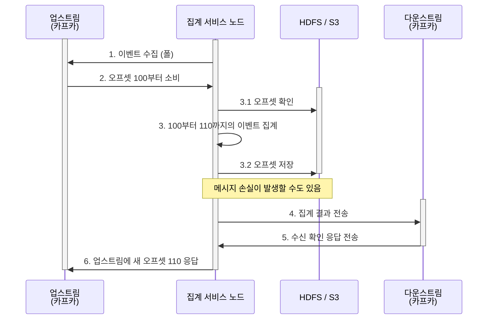
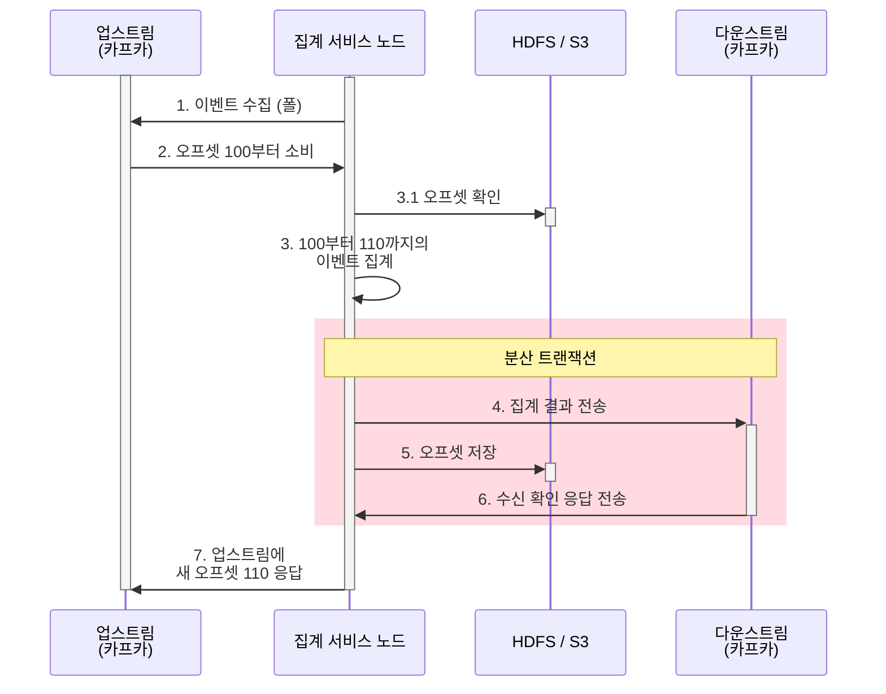

<!-- TOC -->
* [대규모 광고 클릭 집계 시스템, 왜 중요할까?](#대규모-광고-클릭-집계-시스템-왜-중요할까)
  * [RTB(Real-Time Bidding, 실시간 경매)](#rtbreal-time-bidding-실시간-경매)
  * [광고 성과 측정 지표: CTR, CVR](#광고-성과-측정-지표-ctr-cvr)
  * [💡집계 데이터는 RTB에 어떻게 사용되는 걸까?](#집계-데이터는-rtb에-어떻게-사용되는-걸까)
* [1. 요구사항 파악 및 설계 범위 확정](#1-요구사항-파악-및-설계-범위-확정)
  * [1.1. 요구사항 파악](#11-요구사항-파악)
  * [1.2. 기능 요구사항](#12-기능-요구사항)
  * [1.3. 비기능 요구사항](#13-비기능-요구사항)
  * [1.4. 개략적 추정치](#14-개략적-추정치)
* [2. 개략적 설계안: 동기식 파이프라인의 한계와 비동기 스트림의 도입](#2-개략적-설계안-동기식-파이프라인의-한계와-비동기-스트림의-도입)
  * [2.1. 질의 API 설계](#21-질의-api-설계)
  * [2.2. 데이터 모델](#22-데이터-모델)
  * [2.3. 올바른 DB의 선택](#23-올바른-db의-선택)
  * [2.4. 개략적 설계안](#24-개략적-설계안)
  * [2.5. 집계 서비스](#25-집계-서비스)
* [3. 상세 설계](#3-상세-설계)
  * [3.1. 스트리밍 vs 일괄 처리](#31-스트리밍-vs-일괄-처리)
    * [3.1.1. 데이터 재계산](#311-데이터-재계산)
  * [3.2. 시간](#32-시간)
  * [3.3. 집계 윈도](#33-집계-윈도)
  * [3.4. 전달 보장](#34-전달-보장)
  * [3.5. 시스템 규모 확장](#35-시스템-규모-확장)
    * [3.5.1. 메시지 큐의 규모 확장](#351-메시지-큐의-규모-확장)
    * [3.5.2. 브로커(broker)](#352-브로커broker)
    * [3.5.3. 집계 서비스의 규모 확장](#353-집계-서비스의-규모-확장)
    * [3.5.4. 데이터베이스의 규모 확장](#354-데이터베이스의-규모-확장)
  * [3.6. 핫스팟(Hotspot) 문제](#36-핫스팟hotspot-문제)
  * [3.7. 결함 내성(Fault Tolerance)](#37-결함-내성fault-tolerance)
  * [3.8. 데이터 모니터링 및 정확성](#38-데이터-모니터링-및-정확성)
    * [3.8.1. 지속적 모니터링](#381-지속적-모니터링)
    * [3.8.2. 조정(Reconciliation)](#382-조정reconciliation)
  * [3.9. 대안적 설계안](#39-대안적-설계안)
* [4. 마무리](#4-마무리)
* [5. 최종 다이어그램 및 요약](#5-최종-다이어그램-및-요약)
* [참고 사이트 & 함께 보면 좋은 사이트](#참고-사이트--함께-보면-좋은-사이트)
<!-- TOC -->

# 대규모 광고 클릭 집계 시스템, 왜 중요할까?

디지털 광고 생태계에서 '클릭 집계'는 단순히 숫자를 세는 것 이상의 의미가 있다.  
이는 광고주에게 청구될 '돈'과 직결되며, 광고 캠페인의 성공 여부를 결정짓는 나침반 역할을 하기 때문이다.

기술적인 세부 사항에 들어가기에 앞서, RTB(Real-Tie Bidding)와 핵심 지표들을 먼저 살펴보자.

**광고 클릭 집계(Ad Click Aggregation)**란 분산된 여러 서버에서 발생하는 무수한 광고 클릭 로그를 수집하여, 특정 시간 단위(분, 시간 등)별로 광고 아이디(ad_id) 당 
클릭 횟수를 정밀하게 계산해내는 프로세스이다.

---

## RTB(Real-Time Bidding, 실시간 경매)

사용자가 웹사이트나 앱을 여는 짧은 순간, 보이지 않는 곳에서는 거대한 경매가 있어난다.

RTB는 광고 지면(Inventory)이 노출될 때마다 광고주들이 실시간으로 입찰 경쟁을 벌여 가장 높은 가격을 제시한 광고를 즉시 노출시키는 자동화된 거래 방식이다.

사용자가 웹페이지를 클릭했을 때, 페이지 콘텐츠보다 광고가 늦게 뜬다면 사용자 경험을 급격히 저하된다.  
만약 경매 프로세스가 길어져 1초를 넘기게 되면 사용자는 광고가 뜨기 전에 페이지를 이탈하거나 콘텐츠에만 집중하게 되어 광고 효과가 사라진다.  
따라서 **경매 시작부터 광고 노출까지 전 과정은 보통 100~300ms 내외**로 완료되어야 하며, 시스템 전체 지연 시간은 엄격하게 1초 미만으로 제한된다.

RTB가 초저지연(Ultra-low latency)를 지향한다면, 집계 시스템은 데이터의 무결성에 더 무게 중심을 둔다.

---

## 광고 성과 측정 지표: CTR, CVR

집계된 데이터를 바탕으로 광고주는 자신의 광고가 얼마나 효율적인지 판단한다. 이 때 가장 많이 활용되는 지표가 **CTR(Click-Through Rate, 클릭률)**과 [**CVR(Conversion Rate, 전환율)**](https://support.google.com/google-ads/answer/2684489?hl=en)이다.

- CTR(클릭률)
  - 광고를 본 사람(노출) 중 몇 명이나 광고를 **클릭**했는지 보여주는 지표
  - '광고가 얼마나 매력적이어서 사람들의 눈길을 끌었는가?'
  - 계산: (클릭 수 / 노출 수) * 100
- CVR(전환율)
  - 광고를 클릭해서 들어온 사람 중 몇 명이나 구매, 회원가입 등 **최종 목표(전환)**을 달성했는지 보여주는 지표
  - 여기서 '전환'은 단순 상품 구매 뿐 아니라 웹사이트 가입, 뉴스레터 구독, 앱 설치 등 비즈니스 가치를 더하는 모든 행위
  - '사이트에 들어온 사람들이 실제로 물건을 얼마나 샀는가?'
  - 계산: (전환 수 / 클릭 수) * 100

---

## 💡집계 데이터는 RTB에 어떻게 사용되는 걸까?

집계 데이터는 RTB의 입차라 결정에 결정적인 영향을 미친다.

- **예산 소진 제어**
  - 특정 광고의 예산이 모두 소진되었다면 RTB 경매에서 해당 광고를 즉시 제외해야 하는데 이 때 실시간 집계 데이터가 필요함
- **부정 클릭 차단**
  - 특정 IP에서 비정상적인 클릭이 집계된다면, RTB 엔진은 해당 소스에서 오는 입찰 요청을 무시
```shell
[1. 사용자가 웹사이트 방문] 
       ↓
[2. 매체가 RTB 엔진에 "입찰 요청(Bid Request)" 전송]  ← "이 사용자 IP에 광고 보여줄 사람?"
       ↓
[3. RTB 엔진들이 경쟁하여 "입찰(Bid)" 및 낙찰]
       ↓
[4. 사용자 화면에 광고 노출(Impression)]
       ↓
[5. 사용자가 광고를 "클릭(Click)"] -> ★ 바로 여기서 클릭 집계 서비스가 작동!
```
  - 특정 IP가 악의적인 매크로 봇이라고 가정하고 이 봇이 광고주들에게 돈을 물리려고 광고를 매 분 수백 번씩 누르고 있다고 하자.
  - 집계 서비스는 이 비정상적인 패턴을 감지하고 해당 IP를 '광고 사기 봇 IP'로 분류하여 블랙 리스트에 저장
  - 잠시 후 이 봇이 다른 사이트에 접속했을 때, 뉴스 사이트는 광고를 보여주기 위해 RTB 엔진에 입찰 요청을 보냄
  - 이 때 RTB 엔진은 입찰하기 전에 집계 서비스가 업데이트해 둔 블랙리스트 확인하여, 가짜 클릭이므로(= 광고비만 날리게 될 것이므로) 해당 입찰 요청을 무시함
  - 즉, RTB 엔진은 특정봇 IP가 웹서핑을 할 때 '저 봇에게는 광고를 팔지 않겠다'라며 경매 참여를 거절하는 것임
- **입찰가 최적화**
  - 과거의 집계 데이터(CTR/CVR 추이)를 학습한 AI 모델이 현재 RTB 경매에서 얼마를 써야 가장 효율적인지 결정함

과거에는 Cookie 기반의 개별 사용자 추적이 핵심이었으나, 최근 **애플의 ATT(App Tracking Transparency) 정책**과 **구글의 Privacy Sandbox** 도입으로 인해 
개별 사용자 추적보다는 **집계된 데이터**를 활용한 성과 측정이 더욱 중요해지고 있다.  
이제는 '누가' 클릭했는지보다 '어떤 그룹'에서 '얼마나' 집계되었는지가 시스템 설계의 핵심이다.

---


# 1. 요구사항 파악 및 설계 범위 확정

## 1.1. 요구사항 파악

- **입력 데이터의 형태**
  - **Q:** 데이터는 어떤 방식으로 저장되고 인입되는가? 클릭 이벤트의 구체적인 속성은?
  - **A:** 데이터는 여러 애플리케이션 서버에 분산된 로그 파일 형태로 존재함  
  클릭 이벤트가 수집될 때마다 이 로그 파일의 끝에 단방향으로 추가(Append-only)됨.  
  각 클릭 이벤트 메시지에는 ad_id(광고 식별자), click_timestamp(클릭 시각), user_id(사용자 식별자), country(국가 코드) 등의 속성이 있음
- **데이터 양**
  - **Q:** 감당해야 할 전체 데이터 양과 트래픽 규모는?
  - **A:** 시스템적으로 매일 10억 개의 광고 클릭 이벤트가 발생하며, 광고는 하루에 약 2백만 회 게재된다고 가정
- **비즈니스 규모**
  - **Q:** 비즈니스 성장세에 따른 규모 확장성도 고려해야 하는지?
  - **A:** 그렇다. 광고 클릭 이벤트 수는 매년 30%씩 증가한다고 가정
- **주요 질의 요구사항**
  - **Q1:** 가장 핵심적인 질의와 대시보드 기능은 무엇인가?
  - **A1:** 첫째는 **특정 관고에 대한 지난 N분 간의 클릭 이벤트 수**이고, 둘째는 **지난 1분간 가장 많이 클릭된 상위 100개 광고 목록**임
  - **Q2:** 질의 조건이나 파라미터가 동적으로 변할 수도 있는가?
  - **A2:** 그렇다. 질의 기간(N)과 추출할 광고 수(상위 M개)는 유연하게 변경 가능해야 하며, 집계 연산 자체는 매분 주기적으로 이루어져야 함.  
  또한 광고주나 데이터 과학자가 ip, user_id, county 등의 속성을 기준으로 위 두 가지 질의 결과를 자유롭게 필터링할 수 있어야 함
- **예외 상황 및 결함 내성(Edge case)**
  - **Q:** 네트워크 지연이나 장애 상황 등 엣지 케이스는 어디까지 고려해야 하는가?
  - **A:** 예상보다 늦게 도착하는 이벤트, 네트워크 재시도로 인한 중복된 이벤트, 특정 집계 서버가 완전히 다운되는 시스템 장애 상황까지 모두 감내할 수 있도록 견고하게 설계해야 함
- **지연 시간 요건**
  - **Q:** 최종 응답 지연 요구사항은 얼마나 엄격한가?
  - **A:** 실시간 경매(RTB) 시스템과 광고 클릭 집계 서비스의 지연 시간 요건은 완전히 다름
    - RTB는 사용자에게 즉시 광고를 보여줘야 하므로 1초 미만의 초저지연이 필수적임
    - 반면, 광고 클릭 집계 시스템은 주로 광고 과금 및 대시보드 통계 보고에 사용되므로, 데이터의 무결성만 보장된다면 **수 분 정도이 지연 처리는 충분히 허용**됨

---

## 1.2. 기능 요구사항

시스템 사용자(광고주, 데이터 과학자 등)에게 제공해야 하는 핵심 기능은 아래와 같다.

- **기간별 클릭 수 집계**
  - 지난 N분 동안 특정 광고(ad_id)에 발생한 클릭 이벤트 수를 실시간으로 집계
- **인기 광고 추출**
  - 매분 가장 많이 클릭된 상위 100개의 광고 아이디 목록 반환
  - 질의 기간과 상위 M개 광고 수는 유연하게 변경 가능해야 함
- **다차원 필터링 지원**
  - 집계된 결과를 IP, user_id 등 다양한 속성을 기준으로 필터링하여 조회할 수 있어야 함

---

## 1.3. 비기능 요구사항

대규모 과금 데이터와 연동되는 시스테인 만큼, 인프라의 안정성을 위한 엄격한 제약 조건이 필요하다.

- **데이터 정확성**
  - 집계 데이터는 광고주에게 비용을 청구하고, RTB 엔진의 예산 소진 제어를 조절하는 기준이 되므로 데이터 누락이나 중복이 없어야 함
- **결함 내성(Fault Tolerance)**
  - 특정 집계 노드가 다운되거나 지연되더라도, 시스템은 멈추지 않고 중복없이 이벤트를 복구하여 처리할 수 있어야 함
- **허용 가능한 지연 시간**
  - 초저지연(1초 미만)을 요구하는 RTB 시스템과 달리, 광고 정산 및 보고용 클릭 집계 서비스는 데이터 무결성이 더 중요하므로 **수 분 정도의 지연 시간은 허용**됨

---

## 1.4. 개략적 추정치

시스템 규모 확장의 기준이 되는 대략적인 트래픽과 저장 용량을 산정해본다.

<**트래픽 추정치(QPS)**>
- **일간 능동 사용자(DAU):** 1,000,000,000(10억 명)
- **일일 광고 클릭 수:** 모든 사용자가 하루 평균 1개 광고를 클릭한다고 가정하면, **하루에 총 10억 건**의 광고 클릭 이벤트가 발생함
- **평균 광고 클릭 QPS:** $$\text{Average QPS} = \frac{10^9 \text{ 이벤트를}}{86,400 \text{ 초 (하루)}} \approx 11,574 \rightarrow \text{약 10,000 QPS}$$
- **최대 광고 클릭 QPS:** 평균 QPS의 5배로 가정할 경우 **50,000 QPS**를 감당해야 함

<**저장 용량 요구량**>
- **광고 클릭 이벤트 당 크기:** 0.1KB 가정
- **일일 저장소 요구량:** 0.1KB * 10억 = 100GB/일
- **월간 저장소 요구량:** 약 3TB
- **비즈니스 성장률:** 광고 클릭 이벤트 수는 매년 30%씩 증가한다고 가정하며, 시스템은 약 3년마다 트래픽이 2배로 증가하는 구조에 대응해야 함

---

- **목표 처리량:** 평균 10,000 QPS / 최대 50,000 QPS
- **일일 데이터 양:** 100GB
- **핵심 트레이드오프:** 초저지연보다는 **정확히 한 번(Exactly-once)**의 데이터 무결성 확보

이 시스템은 막대한 양의 원시 로그를 유실 없이 받아내면서도 비즤스 요구사항에 맞는 집계 데이터를 실시간으로 산출해야 하는 **쓰기 중심(Write-heavy)의 빅데이터 파이프라인** 아키텍처가 필요하다.

---

# 2. 개략적 설계안: 동기식 파이프라인의 한계와 비동기 스트림의 도입

여기서는 질의 API 설계, 데이터 모델, DB 선택, 비동기 맵리듀스(MapReduce) 프레임워크 연동 구조에 대해 알아본다.

---

## 2.1. 질의 API 설계

클라이언트(대시보드를 이용하는 데이터 과학자, 광고주 등)가 데이터를 조회할 때 호출할 두 가지 핵심 API 이다.

API 설계를 위해 기능 요구사항을 검토해보자.
- 지난 n분 동안 ad_id에 발생한 클릭 수 집계
- 지난 n분 동안 가장 많은 클릭이 발생한 상위 N개 ad_id 목록 반환
- 다양한 속성을 기준으로 집계 결과를 필터링하는 기능

여기서는 2개의 API만 있으면 된다.

---

**API 1: 지난 N분간 각 ad_id에 발생한 클릭 수 집계**
- **HTTP Method:** GET /v1/ads/{:ad_id}/aggregated_count
- **Query String:**
  - from: 집계 시작 시간(Long, 기본값: 현재 시각 기준 1분 전)
  - to: 집계 종료 시간(Long, 기본값: 현재 시각)
  - filer: 필터링 전략 식별자(예: filter=001)
- **Response:**
  - ad_id: 광고 식별자(String)
  - count: 집계된 클릭 횟수(Long)

**API 2: 지난 N분간 가장 많은 클릭이 발생한 상위 M개 ad_id 목록**
- **HTTP Method:** GET /v1/ads/popular_ads
- **Query String:**
  - count: 상위 몇 개의 광고를 반환할 것인가
- **Response:**


API 2: 지난 n분간 가장 많은 클릭이 발생한 상위 M개 ad_id 목록
- GET /v1/ads/popular_ads (지난 N분간 가장 많은 클릭이 발생한 상위 M개 광고 목록 반환)
- query string
  - count: 상위 몇 개의 광고를 반환할 것인지, integer
  - window: 분 단위로 표현된 집계 윈도 크기, integer
    - (궁금증) window가 정확히 뭘 말하는 거고, 무슨 역할을 하는거야?
  - filter: 필터링 전략 식별자: long
- Respoinse
  - ad_dis: 광고 식별자 목록, array

---

## 2.2. 데이터 모델

여기서 다루는 데이터는 원시 데이터(raw data)와 집계 결과 데이터(aggregated), 두 종류로 나눌 수 있다.

---

원시 데이터

아래는 로그 파일에 포함된 원시 데이터 예시이다.

```shell
 ad001, 2021-01-01 00:00:01, user 1, 207.148.22.22, USA
```

위 로그를 구조화된 형식으로 표현하면 아래와 같으며, 이런 데이터가 여러 애플리케이션 서버에 산재해있게 된다.

| ad_id | click_timestamp | user_id | ip | country |
| :--- | :--- | :--- | :--- | :--- |
| ad001 | 2021-01-01 00:00:01 | user1 | 207.148.22.22 | USA |
| ad002 | 2021-01-01 00:00:02 | user2 | 209.153.56.11 | USA |


---

집계 결과 데이터

광고 클릭 이벤트가 매 분 집계된다고 가정했을 때의 집계 결과 테이블은 ad_id, click_minute, count 가 있을 것이다.
아래는 광고 필터링을 지원하기 위해 filter_id를 추가하여, 같은 ad_id와 click_minute를 값을 갖는 레코드를 filter_id 필터 적용 결과에 따라 집계한 결과이다.

| ad_id | click_minute | filter_id | count |
| :--- | :--- | :--- | :--- |
| ad001 | 2021101010000 | 0012 | 2 |
| ad001 | 2021101010000 | 0023 | 3 |
| ad001 | 2021101010001 | 0012 | 1 |
| ad001 | 2021101010001 | 0023 | 6 |

아래는 필터 테이블이다.

| filter_id | region | ip | user_id |
| :--- | :--- | :--- | :--- |
| 0012 | US | 0012 | * |
| 0013 | * | 0023 | 123.1.2.3 |

지난 N분 동안 가장 많이 클릭된 상위 N개의 광고를 반환하는 질의를 위해서는 아래 구조를 이용한다. 

| most_clicked_ads | | |
| :--- | :--- | :--- |
| window_size | integer | 분 단위로 표현된 집계 윈도 크기 |
| update_time_minute | timestamp | 마지막으로 갱신된 타임스탬프 (1분 단위) |
| most_clicked_ads | array | JSON 형식으로 표현된 ID 목록 |


---

비교

| | 원시 데이터만 보관하는 방안 | 집계 결과 데이터만 보관하는 방안 |
| :--- | :--- | :--- |
| **장점** | • 원본 데이터를 손실 없이 보관<br>• 데이터 필터링 및 재계산 지원 | • 데이터 용량 절감<br>• 빠른 질의 성능 |
| **단점** | • 막대한 데이터 용량<br>• 낮은 질의 성능 | • 데이터 손실. 원본 데이터가 아닌 계산/유도된 데이터를 저장하는 데서 오는 결과. 예를 들어 10개의 원본 데이터는 1개의 데이터로 집계/축약될 수 있다. |

원시데이터와 집계 결과 데이터는 둘 다 저장하는 것을 추천한다.
- 문제 발생 시 디버깅을 위해 원시 데이터 보관
  - 버그로 집계 데이터가 손상되면 버그 수정 후 원시 데이터에서 집계 결과를 다시 만들 수 ㅣㅇㅆ음
- 원시 데이터는 양이 많으므로 직접 질의하는 것은 비효율적
  - 질의는 집계 결과 데이터를 질의하는 것이 바람직
- 원시 데이터는 백업 데이터로 활용
  - 오래된 원시 데이터는 cold storage로 옮겨 비용 절감
- 집계 결과 데이터는 활성 데이터(active data) 구실
  - 질의 성능을 높이기 위해 튜닝하는 것이 보통임

---

## 2.3. 올바른 DB의 선택

DB 선택을 위해 아래와 같은 내용을 고려해야 한다.
- 데이터는 어떤 형태인가? 관계형 데이터인가? 문서 데이터인가? BLOB 형태인가?
- 작업 흐름이 읽기 중심인가? 쓰기 중심인가? 둘 다 인가?
- 트랜잭션을 지원해야 하는가?
- 질의 과정에서 sum 이나 count 같은 [온라인 처리 분석 처리(OLAP)](https://docs.oracle.com/database/121/OLAXS/olap_functions.htm#OLAXS169) 함수를 많이 사용해야 하는가?

---

**원시 데이터 관점**

일상 작업에서 원시 데이터는 질의할 필요가 없지만, 데이터 과학자가 기계 학습 엔지니어가 사용자 반응 예측, 관련성 피드백 등을 연구하는 경우엔 유용하다.

개략적 추정치를 계산하면서 보앗듯이 평균 쓰기 QPS는 10,000이고, 최대 QPS는 50,000dlek.
따라서 이 시스템은 쓰기 중심 시스템이다.
원시 데이터는 백업과 재계산 용도로만 이용되므로 이론적으로는 읽기 연산 빈도는 낮다.

RDBMS로도 할 수는 있지만 이 정도 규모의 쓰기 연산이 가능하도록 구성하기는 어려우므로, 쓰기 및 시간 범위 질의에 최적화된 [카산드라](https://assu10.github.io/dev/2026/06/05/architecture-nearby/#242-%EC%9C%84%EC%B9%98-%EC%9D%B4%EB%8F%99-%EC%9D%B4%EB%A0%A5-dbcassandra)나 InfluxDB를 사용하는 것이 좀 더 바람직하다.

[ORC](https://cwiki.apache.org/confluence/display/hive/languagemanual+orc), [Parquet(파케이)](https://www.databricks.com/blog/what-is-parquet), [AVRO](https://www.ibm.com/think/topics/avro) 같은 칼럼형 데이터 형식 가운데 하나를 사용하여 아마존 S3에 데이터를 저장하는 방법도 있다.
(궁금증) 컬럼형 데이터 형식이 뭐야?

여기서는 카산드라를 활용한다.


---

**집계 데이터 관점**

집계 데이터는 본질적으로 시계열 데이터이며, 이 데이터를 처리하는 워크플로는 읽기 연산과 쓰기 연산 둘 다 많이 사용한다.
각 광고에 대해 매 분마다 DB에 질의를 던져 최신 집계 결과를 고객에서 제시해야 하기 때문이다.

원시 데이터와 집계 결과 데이터를 저장하는 데는 같은 유형의 DB를 활용하는 것이 가능하다.


---

## 2.4. 개략적 설계안

실시간으로 빅데이터를 처리할 때 데이터는 보통 무제한으로 입력되었다가 흘러나간다. 집계 서비스도 마찬가지이디ㅏ.
다만 입력은 원시 데이터(무제한 데이터 스트림)이고, 출력은 집계 결과이다.


위의 워크플로는 데이터를 동기식으로 처리한다.
이런 방식은 생산자와 소비자 용량이 항상 같은 수는 없으므로 좋지 않다.
트래픽이 갑자기 증가하며 이벤트 수가 소비자의 처리 용량을 넘어서는 순간, 소비자는 메모리 부족 오류 등의 문제를 겪게 되며, 동기식은 특정 컴포넌트의 장애가 전체 시스템 장애로 이어진다.

이를 해결하는 방안은 카프카 같은 메시지 큐를 도입하여 생산자와 소비자의 결합을 끊는 것이다.


로그 모니터, 집계 서비스, DB는 2개의 메시지 큐로 분리되어 있다.
DB 기록 프로세스는 메시지 큐에서 데이터를 꺼내 DB가 지원하는 형식으로 변환한 다음 기록하는 역할을 한다.

첫 번째 메시지 큐에는 아래와 같은 광고 클릭 이벤트 데이터가 기록된다.
ad_id, click_timestamp, user_id, ip, country

두 번째 메시지 큐에는 2가지 유형의 데이터가 입력될 수 있다.
- 분 단위로 집계된 광고 클릭 수
  - ad_id, click_minute, count
- 분 단위로 집계한, 가장 많이 클릭한 상위 N개 광고
  - update_time_minute, most_clicked_ads

집계 결과를 왜 바로 DB에 기록하지 않는 것일까? [정확하게 한 번(exactly once) 데이터를 처리하기 위해(원자적 커밋) 카프카 같은 시스템을 두 번째 메시지 큐로 도입하기 때문이다.](https://flink.apache.org/2018/02/28/an-overview-of-end-to-end-exactly-once-processing-in-apache-flink-with-apache-kafka-too/)
(궁금증) /assets/img/dev/2026/0620/exactly.png 그림엔 첫 번째 메시지큐부터 두 번째 메시지큐가지 원자적 커밋이라고 묶여 있어. 이거랑 카프카로 원자적 커밋을 하는 거랑 무슨 연관인거야?

---

## 2.5. 집계 서비스

광고 클릭 이벤트를 집계하는 좋은 방안은 맵리듀스(MapReduce) 프레임워크를 사용하는 것이다.
(궁금증) 맵리듀스 프레임워크가 무엇인지 간략히 설명해줘

맵리듀스 프레임워크에 좋은 모델은 유향 비순환 그래프(DAG, Directed Acyclic Graph)이다.
(궁금증) DAG에 대해 간략히 설명해줘.

DAG 모델의 핵심은 아래 그림처럼 시스템은 맵/집계/리듀스 노드 등의 작은 컴퓨팅 단위로 세분화하여 각 노드는 한 가지 작업만 처리하고 처리 결과를 다음 노드에 인계하는 것이다.


---

**맵 노드**


맵 노드는 데이터 출처에서 읽은 데이터를 필터링하고 변환하는 역할을 담당한다.
위 그림에서 맵 노드는 `ad_id % 2 = 0` 의 조건을 만족하는 데이터는 집계 노드 1로 보내고, 그렇지 않은 데이터는 집계 노드 2로 보낸다.

과연 맵 노드가 필수일까? 카프카 파티션이나 태그를 구성한 후 집계 노드가 카프카를 직접 구도가도록 하면 안되는 것일까?
그렇게 해도 되지만, 입력 데이터를 정리하거나 정규화해야 하는 경우에는 맵 노드가 필요하다.
(궁금증)입력 데이터를 정리하거나 정규화해야 하는 경우에는 맵 노드가 필요한 이유가 뭐야?

맵 노드가 필요한 또 한가지 이유는 데이터가 생성되는 방식에 대한 제어권이 없는 경우에는 동일한 ad_id를 갖는 이벤트가 서로 다른 카프카 파티션에 입력될 수도 있다는 점이다.

---

**집계 노드**

집계 노드는 ad_id별 광고 클릭 이벤트 수를 매 분 메모리에서 집계한다.
맵리듀스 패러다임에서 사실 집계 노드는 리듀스 프로세스의 일부이다.

---

**리듀스 노드**

리듀스 녿는 모든 '집계' 모드가 산출한 결과를 최종 결과로 축약한다.
아래 그림에서 각 집계 노드는 자기 관점에서 가장 많은 클릭이 발생한 광고 3개를 추려 리듀스 노드로 보내고, 리듀스 노드는 그 결과를 모아 최종적으로 3개의 광고만 남긴다.


DAG는 맵리듀스 패러다임을 표현하기 위한 모델이다.
빅데이터를 입력으로 받아 병렬 분산 컴퓨팅 자원을 활용하여 빅데이터를 작은 크기의 데이터로 변환할 수 있도록 설계된 모델이다.

---

**주요 사용 사례**

이제 이번 설계에서 지원해야 하는 주요 집계 사례를 지원하는데 맵리듀스 프레임워크를 어떻게 활용할 수 있는지 살펴보자.

**지난 M분간 ad_id 에 발생한 클릭 이벤트 수 집계**

아래 그림처럼 맵 노드는 시스템에 입력되는 이벤트를 ad_id % 3 을 기준으로 분배하며, 이렇게 분배한 결과는 각 집계 노드가 집계함
(궁금증) ad_id % 3 이라는 건 만일 ad_id 종류가 5개이면 ad_id % 5를 해야하는 거야?


---

**지난 M분간 가장 많은 클릭이 발생한 상위 N개의 ad_id 집계**

아래 그림은 가장 많이 클릭된 상위 광고 3개를 가져오는 방법의 단순화된 설계이다. 이 방안은 상위 N개 광고도로 확장될 수 있다.


입력 이벤트는 ad_id 기준으로 분배되고, 각 집계 노드는 힙을 내부적으로 사용하여 상위 3개 광고를 효율적으로 식별한다.
마지막 단계에서 리듀스 노드는 전달받은 9개의 광고 중 지난 1분간 가장 많이 클릭된 광고 3개를 골라낸다.

---

**데이터 필터링**

'한국 내 광고 ad001'에 대해 집계된 클릭 수만 표시'와 같은 데이터 필터링을 지원하려면 필터링 기준을 사전에 정의한 후 해당 기준에 따라 집계하면 된다.

| ad_id | click_minute | country | count |
| :--- | :--- | :--- | :--- |
| ad001 | 202101010001 | USA | 100 |
| ad001 | 202101010001 | GPB | 200 |
| ad001 | 202101010001 | others | 3000 |
| ad002 | 202101010001 | USA | 10 |
| ad002 | 202101010001 | GPB | 25 |
| ad002 | 202101010001 | others | 12 |

이런 기법을 [스타 스키마(star schema)](https://learn.microsoft.com/en-us/power-bi/guidance/star-schema)라고 한다.
(궁금증) 스타 스키마에 대해 간략히 설명해줘.

데이터 웨어하우스에서 널리 쓰이는 기법으로 필터링에 사용되는 필드는 차원(dimension)이라 부른다.
이 접근법은 아래와 같은 장점이 있다.
- 이해하기 쉽고 구축이 쉬움
- 기존 집계 서비스를 재사용하여 스타 스키마에 더 많은 차원을 생성할 수 있으며, 다른 추가 컴포넌트는 필요하지 않음
- 결과를 미리 계산해두는 방식으로, 필터링 기준에 따라 데이터에 빠르게 접근할 수 있음

이 접근법은 많은 bucket과 레코드가 생성된다는 한계가 있다. 필터링 기준이 많은 경우 더더욱 그렇다.

---

# 3. 상세 설계

## 3.1. 스트리밍 vs 일괄 처리

위에서 나온 아래 그림은 일종의 스트림 처리 시스템이다.


| | 서비스 (온라인 시스템) | 일괄 처리 시스템 (오프라인 시스템) | 스트리밍 시스템 (실시간에 가깝게 처리하는 시스템) |
| :--- | :--- | :--- |:-----------------------------|
| **응답성** | 클라이언트에게 빠르게 응답 | 클라이언트에게 응답할 필요가 없음 | 클라이언트에게 응답할 필요가 없음           |
| **입력** | 사용자의 요청 | 유한한 크기를 갖는 입력. 큰 규모의 데이터 | 입력에 경계가 없음 (무한 스트림)          |
| **출력** | 클라이언트에 대한 응답 | 구체화 뷰, 집계 결과 지표 등 | 구체화 뷰, 집계 결과 지표 등            |
| **성능 측정 기준** | 가용성, 지연 시간 | 처리량 | 처리량, 지연 시간                   |
| **사례** | 온라인 쇼핑 | 맵리듀스 | [플링크(Flink)](https://flink.apache.org/)               |

여기서는 스트림 처리와 일괄 처리 방식 모두를 사용한다.
스트림 처리는 데이터를 오는 대로 처리하고 거의 실시간으로 집계된 결과를 생성하는데 사용한다.
일괄 처리는 이력 데이터를 백업하기 위해 활용한다.

일괄 및 스트리밍 처리 경로를 동시에 지원하는 시스템 아키텍처를 [람다(Lambda)](https://www.databricks.com/blog/what-is-lambda-architecture)라고 한다.
(궁금증) 람다 아키텍처에 대해 간략히 설명해줘.


람다 아키텍처의 단점은 두 가지 어리 경로를 지원하기 때문에 관리할 코드가 두 벌이라는 점이다.

[카파 아키텍처(Kappa Architecture)](https://hazelcast.com/foundations/software-architecture/kappa-architecture/)는 일괄 처리와 스트리밍 처리 경로를 
하나로 결합하여 실시간 데이터 처리 및 끊임없는 데이터 재처리 문제를 모두 해결하는 것이다.

여기서는 카파 아키텍처를 따른다. 따라서 이력 데이터의 재처리도 실시간 집계 서비스를 거친다.

좀 더 상세한 내용은 데이터 재계산 에서 다룬다.

---

### 3.1.1. 데이터 재계산

이미 집계한 데이터를 다시 계산하는 것을 이력 데이터 재처리(historical data replay)라고 한다.
예를 들어 집계 서비스에 버그가 있었다면, 버그 발생 시점부터 원시 데이터를 다시 읽어 집계 데이터를 재계산하고 고쳐야 한다.

아래 그림은 이 재계산 흐름을 요약하여 보여준다.


1.재계산 서비스는 원시 데이터 저장소에서 데이터를 검색한다. 일괄 처리 프로세스를 따른다.
2.추출된 데이터는 전용 집계 서비스로 전송된다. 전용 집계 서비스를 두는 것은 실시간 데이터 처리 과정이 과거 데이터 재처리 프로세스와 간섭하는 것을 막기 위해서다.
3.집계 결과는 두 번째 메시지 큐로 전송되어 집계 결과 데이터베이스에 반영된다.

재계산 프로세스는 데이터 집계 서비스를 재사용하기는 하지만 처리 대상 데이터는 다른 곳에서 읽는다. (= 원시 데이터를 직접 읽는다.)

---

## 3.2. 시간

집계를 하려면 타임스탬프가 필요하다.
타임 스탬프는 두 가지 다른 위치에서 만들어진다.
- 이벤트 시각: 광고 클릭이 발생한 시각
- 처리 시각: 집계 서버가 클릭 이벤트를 처리한 시스템 시각

네트워크 지연이나 비동기적 처리 환경(메시지 큐)에서는 이벤트가 발생한 시각와 처리 시각 차이의 격차가 커질 수 있다.

이벤트가 발생한 시각을 집계에 사용하는 경우엔 지연된 이벤트 처리 문제를 잘 해결해야 한다.
처리 시각을 집계에 사용하는 경우에는 집계 결과가 부정확할 수 있다는 점을 고려해야 한다.
따라서 두 방안의 장단을 고려하여 적절한 결정을 내려야 한다.

| | 장점 | 단점 |
| :--- | :--- | :--- |
| **이벤트 발생 시각** | 광고 클릭 시점을 정확히 아는 것은 클라이언트이므로 집계 결과가 보다 정확 | 클라이언트가 생성한 타임스탬프에 의존하는 방식이므로 클라이언트에 설정된 시각이 잘못되었거나 악성 사용자가 타임스탬프를 고의로 조작하는 문제에서 자유로울 수 없음 |
| **처리 시각** | 서버 타임스탬프가 클라이언트 타임스탬프보다 안정적 | 이벤트가 시스템에 도착한 시각이 한참 뒤인 경우에는 집계 결과가 부정확해짐 |

데이터 정확도는 아주 중요하므로 여기서는 이벤트 발생 시각을 사용할 것을 추천한다.
이 때 늦게 도착한 이벤트를 처리하기 위해서 워터마크(Watermark) 라는 기술을 일반적으로 사용한다.

아래 그림은 광고 클릭 이벤트를 1분 단위로 끊어지는 텀블링 윈도우(tumbling window)를 사용하여 집계하는 사례이다.


이벤트 발생 시각을 기준으로 이벤트가 어떤 윈도에 속하는지 결정하면 윈도1은 이벤트2를 집계하지 못하게 되고, 윈도 3은 이벤트 5를 집계하지 못하게 된다.
이벤트가 집계 윈도가 끝나는 시점보다 살짝 늦게 도착하기 때문이다.
(궁금증) 윈도1이 이벤트2를 집계하지 못하면 어떤 상황이 발생하는 거야? 윈도2가 이벤트2를 집계하면 되는 거 아니야?

이 문제는 아래 그림처럼 '워터마크'를 이용하여 해결한다. 각 위도 마지막에 붙은 여분의 사각형이 워터마크이다.
워크마크는 집계 윈도의 확장으로 보며, 이렇게 하면 집계 결과의 정확도를 높일 수 있다.


약 15초 워터마크를 윈도마다 붙이면 윈도1은 이벤트2를 집계할 수 있고, 윈도3은 이벤트 5를 집계할 수 있게 된다.

워터마크 구간이 길면 늦게 도착하는 이벤트를 포착할 수 있지만 시스템의 이벤트 처리 시간은 늘어난다.
워터마크가 짧으면 데이터 정확도는 떨어지지만 시스템의 응답 지연은 낮아진다.

워터마크 기법으로도 시간이 한참 흐른 후에 시스템에 도달하는 이벤트는 처리할 수 없다.
발생 확률이 낮은 이벤트 처리를 위해 시스템을 복잡하게 설계하면 투자 대비 효능(ROI, Return On Investment)이 떨어지며, 사소한 데이터 오류는 하루치 데이터 처리를 
마감할 때 조정할 수 있다. (자세한 내용은 "조정" 내용을 다룰 때 다룬다.)

워터마크를 사용하면 데이터의 정확도는 높아지지만 대기 시간이 늘어나 전반적인 지연 시간은 늘어난다.

---

## 3.3. 집계 윈도

윈도에는 4가지 종류의 윈도가 있다. 텀블링 윈도, 고정 윈도(fixed window), 호핑 윈도(hopping window), 슬리이딩 윈도(sliding window)
이 중 본 설계안과 관련이 있는 윈도는 텀블링 윈도와 슬라이딩 윈도이다.

텀블링 윈도는 시간을 같은 크기의 겹치지 않는 구간으로 분할한다. 따라서 매 분 발생한 클릭 이벤트를 집계하기에 적합하다. (요구사항 1)


슬라이딩 윈도는 데이터 스트림을 미끄러져 나아가면서 같은 시간 구간 안에 있는 이벤트를 집계한다. 서로 겹칠 수 있다.
따라서 두 번째 요구사항, 즉 지난 M분간 가장 많이 클릭된 상위 N개 광고를 알아내기에 적합하다.


(궁금증) 고정 윈도와 호핑 윈도에 대해서도 간략히 설명해줘.

---

## 3.4. 전달 보장

집계 결과는 과금 등에 활용될 수 있기 때문에 데이터의 정확성과 무결성이 아주 중요하다.
시스템은 아래 질문에 답할 수 있어야 한다.
- 이벤트의 중복 처리를 어떻게 피할 수 있는가?
- 모든 이벤트의 처리를 어떻게 보장할 수 있는가?

카프카는 보통 세 가지 유형의 전달 방식을 지원한다.
[최대 한 번(at-most once)](https://assu10.github.io/dev/2026/06/12/architecture-distributed-message-queue-architecture/#4101-%EC%B5%9C%EB%8C%80-%ED%95%9C-%EB%B2%88at-most-once), 
[최소 한 번(at-least once)](https://assu10.github.io/dev/2026/06/12/architecture-distributed-message-queue-architecture/#4102-%EC%B5%9C%EC%86%8C-%ED%95%9C-%EB%B2%88at-least-once), 
[정확히 한 번(exactly once)](https://assu10.github.io/dev/2026/06/12/architecture-distributed-message-queue-architecture/#4103-%EC%A0%95%ED%99%95%ED%9E%88-%ED%95%9C-%EB%B2%88exactly-once)

약간의 중복이 괜찮다면 대체로 '최소 한 번'이 적절하지만 여기서는 그렇지 않다.
데이터의 몇 퍼센트 차이가 수백만 달러 차이로 이어질 수 있으므로 '정확히 한 번' 방식을 권장한다.

이를 실제 광고 집계 시스템에서 어떻게 사용하는지는 [옐프(Yelp) 정확히 한 번을 어떻게 구현했는지](https://www.youtube.com/watch?v=hzxytnPcAUM)를 보면 된다.
(궁금증) 옐프는 회사 이름이야?

---

**중복 데이터 처리**

중복 데이터가 많이 발생하는 사례는 아래 두 가지이다.
- 클라이언트 측: 한 클라이언트가 악의적으로 같은 이벤트를 여러 번 보내는 경우, 악의적인 의도로 전송되는 중복 이벤트를 처리하는 데는 [광고 사기/위험 제어(ad fraud/risk control) 컴포넌트](https://www.google.com/ads/adtrafficquality/)가 적합하다.
(궁금증) 광고 사기/위험 제어 https://www.google.com/ads/adtrafficquality/ 에 대해 간략히 설명해줘.
- 서버 장애: 집계 도중 집계 서비스 노드에서 장애가 발생하여 업스트림 서비스가 이벤트 메시지에 대해 응답을 받지 못했다면, 같은 이벤트가 다시 전송되어 중복 집계될 수 있다.

아래는 집계 서비스에 장애가 발생하여 중복 데이터가 생기는 과정이다.
이 노드는 업스트림 카프카에 오프셋을 저장하여 데이터 소비 상태를 관리한다.

```mermaid
sequenceDiagram
  participant U as 업스트림<br/>(카프카)
  participant S as 집계 서비스 노드
  participant D as 다운스트림<br/>(카프카)

  activate S # 집계 서비스 노드의 긴 동작 블록 시작
  S->>U: 1. 이벤트 수집 (폴)

  activate U # 업스트림의 동작 블록 시작
  U->>S: 2. 오프셋 100부터 소비
  S->>S: 3. 100부터 110까지의 이벤트 집계

  S->>D: 4. 집계 결과 전송
  D-->>S: 5. 수신 응답

  S-xU: 6. 110까지 소비하였음을 응답
  deactivate U # 업스트림의 동작 블록 종료

  Note over U,D: 6단계를 마치지 못하고 장애를 내면<br/>오프셋 100부터 다시 소비하여야 하므로<br/>데이터 중복이 발생
  deactivate S # 집계 서비스 노드의 긴 동작 블록 종료
```

(궁금증) 업스트림(카프카)와 다운스트림(카프카)는 첫 번째 메시지 큐와 두 번째 메시지 큐를 의미하는거야?

이 문제의 간단한 해결책은 HDFS(하둡인가?)나 S3같은 외부 파일 저장소에 오프셋을 기록하는 것이다.



하지만 이 방안에도 문제는 있다.
집계 결과를 다운스트림으로 전송하기 전에 오프셋을 HDFS나 S3에 저장한 직후에 집계 서비스 노드에 장애가 
발생하여 4단계를 완료하지 못하면, 외부 저장소에 저장된 오프셋은 110이고 실제 처리된 이벤트의 오프셋은 100인 경우 ,
복구된 집계 서비스 노드는 100부터 110까지의 이벤트를 다시 처리할 시도를 하지 않을 것이다.
따라서 데이터 손실을 막으려면 다운스트림에서 집계 결과 수신 확인 응답을 받을 후 오프셋을 저장해야 한다.



이제 5.1단계 실행 전에 집계 서비스 노드에 장애가 생기면 복구 후에 100부터 110가지의 이벤트를 다운스트림에 다시 보낼 수 있다.
이벤트를 정확하게 한 번만 처리하고 싶다면 4~6단계의 작업을 하나의 분산 트랜잭션으로 넣어야 한다.
분산 트랜잭션은 여러 노드에서 작동하는 트랜잭션으로, 그 안에서 실행하는 작업 가은데 하나라도 실패하면 모든 작업의 상태를 실행 전으로 되돌리게 된다.

정확히 한 번 처리하는 것은 난이도가 아주 높은 작업이다.
자세한 내용은 [An Overview of End-to-End Exactly-Once Processing in Apache Flink (with Apache Kafka, too!)](https://flink.apache.org/2018/02/28/an-overview-of-end-to-end-exactly-once-processing-in-apache-flink-with-apache-kafka-too/) 를 읽어봐라.
(궁금증) [An Overview of End-to-End Exactly-Once Processing in Apache Flink (with Apache Kafka, too!)](https://flink.apache.org/2018/02/28/an-overview-of-end-to-end-exactly-once-processing-in-apache-flink-with-apache-kafka-too/) 내용 간략이 요약해줘

---

## 3.5. 시스템 규모 확장

간략히 추정해 본 결과, 사업은 매년 30%씩 성장하며 트래픽은 약 3년 마다 두 배가 된다.
이 성장세를 뒷받침하려면 시스템 규모 확장도 고려해야 한다.

본 설계안은 메시지 큐, 집계 서버, 데이터베이스의 세 가지 독립 구성 요소로 이루어져 있다.
이 구성 요소들은 상호 결합도가 낮으므로 각기 독립적으로 규모를 늘릴 수 있다.

---

### 3.5.1. 메시지 큐의 규모 확장

- 생산자
  - https://assu10.github.io/dev/2026/06/12/architecture-distributed-message-queue-architecture/#494-producer%EC%9D%98-%ED%99%95%EC%9E%A5%EC%84%B1
  - 생산자 인스턴스 수에는 제한을 두지 않으므로 확장성은 쉽게 달성할 수 있다.
- 소비자
  - https://assu10.github.io/dev/2026/06/12/architecture-distributed-message-queue-architecture/#495-consumer%EC%9D%98-%ED%99%95%EC%9E%A5%EC%84%B1
  - Consumer Group 내의 Rebalancing 메커니즘은 노드 추가/삭제를 통해 규모를 쉽게 조정할 수 있다.

아래 그림은 소비자를 2개 더 추가하여 각 소비자가 오직 한 파티션에서만 이벤트를 소비할 수 있도록 하는 예시이다.


시스템에 수백 개의 카프카 소비자가 있는 경우 rebalancing 작업 시간이 길어져 수 분 이상 걸릴 수 있으므로 더 많은 소비자를 추가하는 작업은 시스템 사용량이 
많지 않은 시간에 실행하여 영향을 최소화하는 것이 좋다.

---

### 3.5.2. 브로커(broker)

- **해시 키**
  - 같은 ad_id를 갖는 이벤트를 같은 카프카 파티션에 저장하기 위해 ad_id를 해시 키로 사용한다.
  - 그렇면 집계 서비스는 같은 ad_id를 갖는 이벤트를 전부 같은 파티션에서 구독할 수 있다.
  - (궁금증) ad_id를 해시 키가 아니라 그냥 key로 설정해도 같은 ad_id는 같은 파티션에 들어가지 않아? 해시 키가 카프카 메시지의 key를 의미하는 거야?
- **파티션의 수**
  - 파티션 수가 변하면 같은 ad_id를 가자는 이벤트가 다른 파티션에 기록되는 일이 생길 수 있ㅇ므로 사전에 충분한 파티션을 확보하여 파티션의 수가 동적으로 일어나는 일은 피하는 것이 좋다.
  - (궁금증) 파티션 수가 변해도 ad_id를 키로 설정하면 같은 ad_id를 가지는 이벤트가 다른 파티션에 기록되는 일은 없지 않아?
- **토픽의 물리적 샤딩**
  - 지역에 따라 여러 토픽을 둘 수도 있고, 사업 유형에 따라 토픽을 둘 수도 있다.(topic_web_ads, topic_mobile_ads 등)
  - 장점
    - 데이터를 여러 토픽으로 나누면 시스템의 처리 대역폭을 높일 수 있다. 단일 토픽에 대한 소비자의 수가 줄면 Consumer group 의 rebalancing 시간도 단축된다.
  - 단점
    - 복잡성이 증가하고 유지 관리 비용이 늘어난다.

---

### 3.5.3. 집계 서비스의 규모 확장

앞에서(앞에 어디서 말했지..?) 집계 서비스는 본질적으로 맵리듀스 연산으로 구현된다고 하였다.
아래 그림은 이 연산이 실제로 어떻게 상호 연결되는지 보여준다.


집계 서비스의 규모는 노드의 추가/삭제를 통해 수평적으로 조정이 가능하다. 흥미로운 질문은 집계 서비스의 처리 대역폭을 높이려면 어떻게 해야하는가? 이다.
두 가지 선택지가 있다.

방안1. 아래 그림처럼 ad_id마다 별도의 처리 스레드를 두는 방안이다.


방안2. 집계 서비스 노드를 아파치 하둡 YARN 같은 resource provider에 배포하는 방식이다. 다중 프로세싱을 활용하는 방안이다.
(궁금증)  아파치 하둡 YARN에 대해 간략히 설명해줘
(궁금증) 집계 서비스 노드를 아파치 하둡 YARN 같은 resource provider에 배포하는 방식이다. 다중 프로세싱을 활용하는 방안이다. 이게 정확히 어떤 방식으로 동작하는 것인지 간략히 설명해줘

방안1이 구현하기 더 쉽지만 실제로는 방안2가 더 많이 사용된다. 더 많은 컴퓨팅 자원을 추가하여 시스템 규모를 확장할 수 있기 때문이다.

---

### 3.5.4. 데이터베이스의 규모 확장

카산드라(Cassandra)는 [안정 해시(Consistent hash)](https://assu10.github.io/dev/2026/06/05/architecture-nearby/#35-%EB%B6%84%EC%82%B0-%EB%A0%88%EB%94%94%EC%8A%A4-%ED%8E%8D%EC%84%AD-%ED%81%B4%EB%9F%AC%EC%8A%A4%ED%84%B0%EC%99%80-%EC%95%88%EC%A0%95-%ED%95%B4%EC%8B%9Cconsistent-hash-ring)와 유사한 방식으로 수평적인 규모 확장을 기본적으로 지원한다.
데이터는 각 노드에 균등하게 분산한다. 이 때 사본도 적당한 수만큼 만들어 분산한다.
각 노드는 해시 링 위의 특정 해시 값 구간의 데이터 보관을 담당하며 다른 가상 노드의 데이터 사본도 보관한다.


클러스터에 새 노드를 추가하면 가상 노드 간의 균형은 자동으로 다시 조정되며, 수동으로 샤딩을 조정하는 과정은 필요하지 않다.
좀 더 자세한 내용은 [How data is distributed across a cluster (using virtual nodes)](https://docs.datastax.com/en/cassandra-oss/3.0/cassandra/architecture/archDataDistributeDistribute.html)를 참고하면 된다.
(궁금증) [How data is distributed across a cluster (using virtual nodes)](https://docs.datastax.com/en/cassandra-oss/3.0/cassandra/architecture/archDataDistributeDistribute.html) 에 대한 내용 간략히 설명해줘.

---

## 3.6. 핫스팟(Hotspot) 문제

다른 서비스나 샤드보다 더 많은 데이터를 수신하는 서비스나 샤드를 핫스팟이라고 한다.

광고 클릭 집계 시스템의 경우, 큰 회사는 수백만 달러의 광고 예산을 집행하고 그런 회사의 광고에는 더 많은 클릭이 발생할 수 있기 때문에 핫스팟 문제가 생길 수 있다.
이벤트 파티션을 ad_id로 나누기 때문에, 어떤 집계 서비스는 다른 노드보다 더 많은 광고 클릭 이벤트를 수신하게 될 것이고, 그러다 보면 서버 과부하 문제가 발생할 수 있다.
이 문제는 더 많은 집계 서비스 노드를 할당하여 완화할 수 있다.

예를 들어 각 집계 서비스 노드는 100개 이벤트만 처리할 수 있다고 해보자.


1.집계 서비스 노드에 300개 이벤트가 도착. 한 노드가 감당할 수 있는 양을 초과함. 따라서 자원 관리자에게 추가 자원 싲청
2.자원 관리자는 해당 서비스 노드에 과부하가 걸리지 않도록 추가 자원 할당 (여기서는 2개의 집계 서비스 노드 추가)
3.원래 집계 서비스 노드는 각 서비스 노드가 100개씩 이벤트를 처리할 수 있도록 이벤트를 3개의 그룹으로 분할
4.집계가 끝난 축약된 결과는 다시 원래 집계 서비스 노드에 기록됨

전역-지역 집계(Global-Local Aggregation)이나 분할 고유 집계(Split Distinct Aggregation)과 같은 더 복잡한 방법도 있다.
더 자세한 내용은 [Performance Tuning #](https://nightlies.apache.org/flink/flink-docs-master/docs/dev/table/tuning/)을 참고하면 된다.
(궁금증) [Performance Tuning #](https://nightlies.apache.org/flink/flink-docs-master/docs/dev/table/tuning/) 에 대해 아주 간략히 설명해줘

---

## 3.7. 결함 내성(Fault Tolerance)

집계는 메모리에서 이루어지므로 집계 노드에 장애가 생기면 집계 결과도 손실된다. 하지만 업스트림 카프카 브로커에서 이벤트를 닫시 받아오면 그 숫자를 다시 만들어낼 수 있다.
카프카 데이터를 원점부터 다시 재생하여 집계하면 시간이 오래 걸리므로 업스트림 오프셋 같은 '시스템 상태'를 스냅숏으로 저장하고 마지막으로 
저장된 상태부터 복구해나가는 것이 바람직하다.

여기서는 '시스템 상태'에 해당하는 정보는 업스트림 오프셋 뿐 아니라 지난 M분간 가장 많이 클릭된 광고 N개 같은 데이터도 시스템 상태의 일부로 저장해야 한다.


스냅숏을 이용하면 집계 서비스 복구 절차가 단순해진다. 어떤 집계 서비스 노드 하나에 장애가 발생하면 해당 노드를 새 것으로 교체한 후 마지막 스냅숏에서 데이터를 
복구하면 된다.


스냅숏을 마지막으로 찍은 후 도착한 새로운 이벤트는 새로운 집계 서비스 노드가 카프카 브로커에서 읽어가 처리한다.

---

## 3.8. 데이터 모니터링 및 정확성

집계 결과는 RTB(Real-Time Bidding) 및 청구서 발행 목적으로 사용되므로 시스템이 정상적으로 동작하는지 모니터링하고 데이터 정확성을 보장하는 것은 아주 중요하다.
(궁금증) 집계 결과가 RTB에 어떤 식으로 사용이 되는거야? RTB에서 성공한 수요자의 정보가 집계 결과에 쌓이는 거로 이해하고 있었는데 잘못 이해한거야?

### 3.8.1. 지속적 모니터링

아래 지표는 지속적으로 모니터링해야 한다.
- 지연 시간
  - 데이터를 처리하는 각 단계마다 지연시간이 추가될 수 있으므로, 시스템의 중요 부분마다 timestamp 추적이 가능하도록 해야함
  - 기록된 시각 사이의 차이를 지연 시간 지표로 변환하여 모니터링
- 메시지 큐 크기
  - 큐의 크기가 갑자기 늘어나면 더 많ㅇㄴ 집계 서비스 노드를 추가해야 함
  - 카프카는 분산 커밋 로그(distributed commit log) 형태로 구현된 메시지 큐이므로, 카프카를 사용하는 경우에는 레코드 처리 지연 지표(records-lag)를 대신 추적하면 됨
  - (궁금증) 분산 커밋 로그가 뭐야? 그게 뭔데 레코드 처리 지연 지표를 추적하면 된다고 하는 거야?
- 집계 노드의 시스템 자원
  - CPU, disk, JVM 같은 지표들

---

### 3.8.2. 조정(Reconciliation)

조정은 다양한 데이터를 비교하여 데이터 무결성을 보증하는 기법이다.
은행이라면 은행에서 만든 데이터와 비교하면 되지만 광고 클릭 집계 결과는 비교할 제 3자가 없다.

한 가지 방법은 매일 각 파티션에 기록된 클릭 이벤트를 이벤트 발생 시각에 따라 정렬한 결과를 일괄 처리하여 만들어 낸 후, 실시간 집계 결과와 비교해보는 것이다.
더 높은 정확도가 필요하다면 더 작은 집계 윈도를 사용하면 된다.

아래는 조정 프로세스를 고려하여 수정한 설계안이다.


---

## 3.9. 대안적 설계안

빅데이터 파이프라인에 대한 일반적인 대안적 설계에 대해 알아보잗.

다른 한 가지 가능한 설계안은 광고 클릭 데이터를 하이브(Hive)에 저장한 후, 빠른 질의는 ElasticSearch 계층을 얹어서 처리하는 것이다.
(궁금증) 하이브(Hive)가 뭐야?
집계는 [클릭하우스(ClickHouse)](https://clickhouse.com/)나 [드루이드(Druid)](https://druid.apache.org/)같은 OLAP 데이터베이스를 통해 처리할 수 있을 것이다.
(궁금증)OLAP 데이터베이스 가 뭐야?

아래는 대안적 설계안이다.


---

# 4. 마무리

여기서는 페이스북이나 구글 규모의 광고 클릭 이벤트 집계 시스템을 설계하는 프로세스를 다루어보았다.
- 데이터 모델 및 APi 설계
- 맵리듀스 데이터 처리 패러다임을 통해 광고 클릭 이벤트 집계
- 메시지 큐, 집계 서비스, DB 의 규모 확장 방안
- 핫스팟 문제 해결하는 법
- 시스템의 지속적 모니터링
- 데이터 조정을 통한 정확성 보증 방안
- 결함 내성

광고 클릭 이벤트 집계 시스템은 전형적인 빅데이터 처리 시스템이다. 
아파치 카프카, 아파치 플링크, 아파치 스파크 같은 업계 표준 솔루션에 대한 사전 지식이나 경험이 있다면 이해하기 쉬울 것이다.
(궁금증) 아파치 플링크와 아파치 스파크에 대해 설명해줘.


---

# 5. 최종 다이어그램 및 요약

이건 네가 해줘.


(궁금증) https://assu10.github.io/dev/2026/06/12/architecture-distributed-message-queue-architecture/ 이거 같은 경우는 카프라카는 상용화된 제품이 있잖아.
이번 포스트로 이런 기능을 하는 상용화된 제품이 있어?

---

# 참고 사이트 & 함께 보면 좋은 사이트

*본 포스트는 알렉스 쉬, 산 람 저자의 **가상 면접 사례로 배우는 대규모 시스템 설계 기초 2**를 기반으로 스터디하며 정리한 내용들입니다.*

* [가상 면접 사례로 배우는 대규모 시스템 설계 기초 2](https://product.kyobobook.co.kr/detail/S000211656186)
* [책에 나온 링크들 모음](https://github.com/alex-xu-system/bytebytego/blob/main/system_design_links_vol2.md)
* [OLAP Expression Syntax Reference](https://docs.oracle.com/database/121/OLAXS/olap_functions.htm#OLAXS169)
* [ORC](https://cwiki.apache.org/confluence/display/hive/languagemanual+orc)
* [What is Parquet?](https://www.databricks.com/blog/what-is-parquet)
* [What is Apache Avro?](https://www.ibm.com/think/topics/avro)
* [An Overview of End-to-End Exactly-Once Processing in Apache Flink (with Apache Kafka, too!)](https://flink.apache.org/2018/02/28/an-overview-of-end-to-end-exactly-once-processing-in-apache-flink-with-apache-kafka-too/)
* [스타 스키마(star schema)](https://learn.microsoft.com/en-us/power-bi/guidance/star-schema)
* [플링크(Flink)](https://flink.apache.org/)
* [What is Lambda Architecture?](https://www.databricks.com/blog/what-is-lambda-architecture)
* [What Is the Kappa Architecture?](https://hazelcast.com/foundations/software-architecture/kappa-architecture/)
* [We protect you from invalid activity and advertising fraud](https://www.google.com/ads/adtrafficquality/)
* [How data is distributed across a cluster (using virtual nodes)](https://docs.datastax.com/en/cassandra-oss/3.0/cassandra/architecture/archDataDistributeDistribute.html)
* [Performance Tuning #](https://nightlies.apache.org/flink/flink-docs-master/docs/dev/table/tuning/)