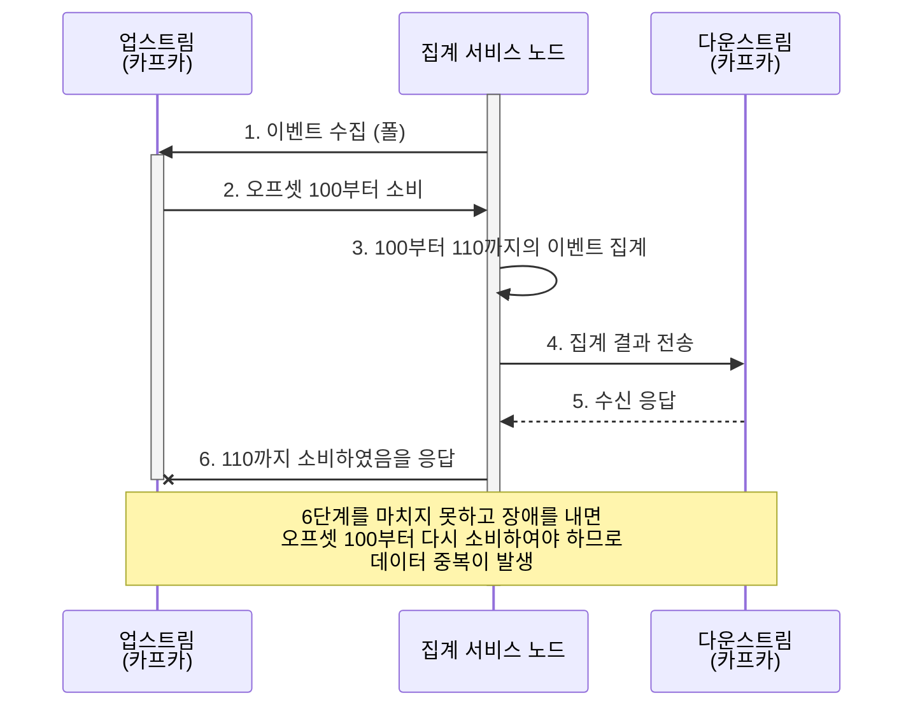
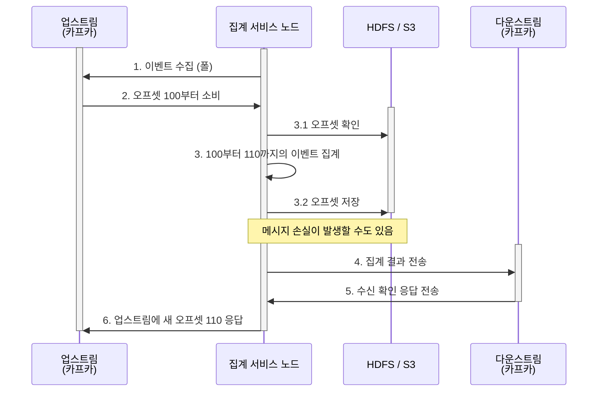
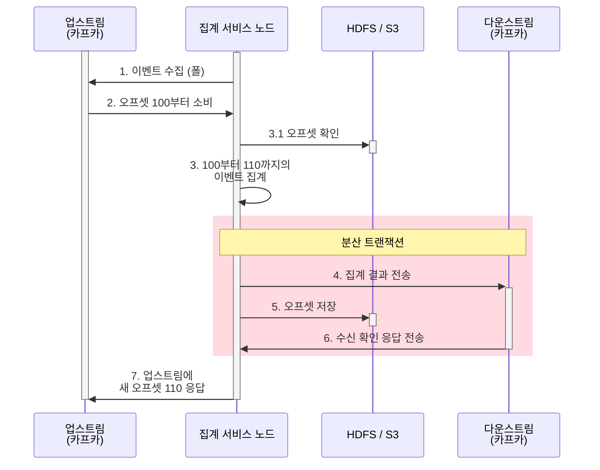

<!-- TOC -->
* [대규모 광고 클릭 집계 시스템, 왜 중요할까?](#대규모-광고-클릭-집계-시스템-왜-중요할까)
  * [RTB(Real-Time Bidding, 실시간 경매)](#rtbreal-time-bidding-실시간-경매)
  * [광고 성과 측정 지표: CTR, CVR](#광고-성과-측정-지표-ctr-cvr)
  * [💡집계 데이터는 RTB에 어떻게 사용되는 걸까?](#집계-데이터는-rtb에-어떻게-사용되는-걸까)
* [1. 요구사항 파악 및 설계 범위 확정](#1-요구사항-파악-및-설계-범위-확정)
  * [1.1. 요구사항 파악](#11-요구사항-파악)
  * [1.2. 기능 요구사항](#12-기능-요구사항)
  * [1.3. 비기능 요구사항](#13-비기능-요구사항)
  * [1.4. 개략적 추정치](#14-개략적-추정치)
* [2. 개략적 설계안: 비동기 스트림 파이프라인 수립](#2-개략적-설계안-비동기-스트림-파이프라인-수립)
  * [2.1. 질의 API 설계](#21-질의-api-설계)
    * [💡window란?](#window란)
  * [2.2. 데이터 모델](#22-데이터-모델)
  * [2.3. DB 선택 전략](#23-db-선택-전략)
    * [💡컬럼형 데이터 형식(Columnar Data Format)이란?](#컬럼형-데이터-형식columnar-data-format이란)
  * [2.4. 개략적 설계안: 동기식의 한계와 비동기 스트림 도입](#24-개략적-설계안-동기식의-한계와-비동기-스트림-도입)
    * [💡집계 결과를 왜 바로 DB에 기록하지 않을까?](#집계-결과를-왜-바로-db에-기록하지-않을까)
  * [2.5. 집계 서비스: 맵리듀스(MapReduce)와 DAG 모델](#25-집계-서비스-맵리듀스mapreduce와-dag-모델)
    * [2.5.1. 맵(Map) 노드](#251-맵map-노드)
      * [💡데이터 정규화에 맵 노드가 필수일까?](#데이터-정규화에-맵-노드가-필수일까)
    * [2.5.2. 집계(Aggregation) 노드](#252-집계aggregation-노드)
    * [2.5.3. 리듀스 노드](#253-리듀스-노드)
    * [2.5.4. 맵리듀스와 DAG모델 활용](#254-맵리듀스와-dag모델-활용)
    * [2.5.5. 다차원 데이터 필터링을 위한 스타 스키마(Star Schema)](#255-다차원-데이터-필터링을-위한-스타-스키마star-schema)
      * [💡스타 스키마(Star Schema)란?](#스타-스키마star-schema란)
* [3. 상세 설계 1: 실시간 데이터 스트리밍과 시간의 제어](#3-상세-설계-1-실시간-데이터-스트리밍과-시간의-제어)
  * [3.1. 스트리밍(Flink) vs 일괄 처리(MapReduce)](#31-스트리밍flink-vs-일괄-처리mapreduce)
    * [💡람다 아키텍처의 한계를 극복하는 카파(Kappa) 아키텍처](#람다-아키텍처의-한계를-극복하는-카파--kappa--아키텍처)
  * [3.2. 장애 복구를 위한 이력 데이터 재처리(Replay) 파이프라인](#32-장애-복구를-위한-이력-데이터-재처리replay-파이프라인)
  * [3.3. 기준 시간 설정의 트레이드 오프: 이벤트 시각 vs 처리 시각](#33-기준-시간-설정의-트레이드-오프-이벤트-시각-vs-처리-시각)
  * [3.4. 스트림 데이터 윈도(Window)](#34-스트림-데이터-윈도window)
    * [💡고정 윈도와 호핑 윈도란?](#고정-윈도와-호핑-윈도란)
* [4. 상세 설계 2: '정확히 한 번' 전달 보장](#4-상세-설계-2-정확히-한-번-전달-보장)
  * [4.1. 메시지 큐의 3가지 전달 방식](#41-메시지-큐의-3가지-전달-방식)
    * [💡옐프(Yelp) 사례와 아파치 플링크(Flink)의 '정확히 한 번' 메커니즘](#옐프yelp-사례와-아파치-플링크flink의-정확히-한-번-메커니즘)
  * [4.2. 중복 데이터 처리 아키텍처](#42-중복-데이터-처리-아키텍처)
    * [💡구글 가이드 기반 광고 사기/위험 제어 컴포넌트의 역할](#구글-가이드-기반-광고-사기위험-제어-컴포넌트의-역할)
    * [4.3. 분산 트랜잭션이 필요한 이유](#43-분산-트랜잭션이-필요한-이유)
* [5. 시스템 규모 확장 및 결함 내성 확보](#5-시스템-규모-확장-및-결함-내성-확보)
  * [5.1. 메시지 큐의 규모 확장](#51-메시지-큐의-규모-확장)
  * [5.2. 브로커(broker)의 규모 확장 및 데이터 라우팅 전략](#52-브로커broker의-규모-확장-및-데이터-라우팅-전략)
    * [💡ad_id 를 해시 키가 아니라 메시지 Key로 설정해도 항상 같은 파티션에 들어가지 않나?](#ad_id-를-해시-키가-아니라-메시지-key로-설정해도-항상-같은-파티션에-들어가지-않나)
  * [5.3. 집계 서비스의 규모 확장](#53-집계-서비스의-규모-확장)
    * [5.3.1. 다중 스레드 모델 vs 다중 프로세싱(리소스 프로바이더) 모델](#531-다중-스레드-모델-vs-다중-프로세싱리소스-프로바이더-모델)
      * [💡아파치 하둡 YARN 리소스 프로바이더의 다중 프로세싱 동작 원리](#아파치-하둡-yarn-리소스-프로바이더의-다중-프로세싱-동작-원리)
  * [5.4. 카산드라(Cassandra) DB의 가상노드 기반 자동 샤딩 구조](#54-카산드라cassandra-db의-가상노드-기반-자동-샤딩-구조)
  * [5.5. 핫스팟(Hotspot) 문제 해결](#55-핫스팟hotspot-문제-해결)
    * [💡Flink 성능 튜닝의 핵심: 전역-지역 집계(Global-Local Aggregation)](#flink-성능-튜닝의-핵심-전역-지역-집계global-local-aggregation)
* [6. 결함 내성(Fault Tolerance)와 스냅숏 복구](#6-결함-내성fault-tolerance와-스냅숏-복구)
* [7. 데이터 모니터링, 정확성 검증 및 대안적 설계](#7-데이터-모니터링-정확성-검증-및-대안적-설계)
  * [7.1. 지속적 모니터링 지표](#71-지속적-모니터링-지표)
    * [💡분산 커밋 로그는 무엇이며, 왜 `records-lag`을 추적해야 할까?](#분산-커밋-로그는-무엇이며-왜-records-lag을-추적해야-할까)
  * [7.2. 종단 간 조정(Reconciliation) 프로세스](#72-종단-간-조정reconciliation-프로세스)
  * [7.3. 대안적 아키텍처 설계](#73-대안적-아키텍처-설계)
    * [💡Hive란?](#hive란)
    * [💡클릭하우스(ClickHouse)나 드루이드(Druid)같은 OLAP 데이터베이스란?](#클릭하우스clickhouse나-드루이드--druid-같은-olap-데이터베이스란)
* [8. 마무리](#8-마무리)
* [💡아파치 플링크(Flink) vs 아파치 스파크(Spark)](#아파치-플링크flink-vs-아파치-스파크spark)
* [💡이 아키텍처를 그대로 제공하는 상용화된 오픈소스 제품군](#이-아키텍처를-그대로-제공하는-상용화된-오픈소스-제품군)
* [참고 사이트 & 함께 보면 좋은 사이트](#참고-사이트--함께-보면-좋은-사이트)
<!-- TOC -->

# 대규모 광고 클릭 집계 시스템, 왜 중요할까?

디지털 광고 생태계에서 '클릭 집계'는 단순히 숫자를 세는 것 이상의 의미가 있다.  
이는 광고주에게 청구될 '돈'과 직결되며, 광고 캠페인의 성공 여부를 결정짓는 나침반 역할을 하기 때문이다.

기술적인 세부 사항에 들어가기에 앞서, RTB(Real-Time Bidding)와 핵심 지표들을 먼저 살펴보자.

**광고 클릭 집계(Ad Click Aggregation)**란 분산된 여러 서버에서 발생하는 무수한 광고 클릭 로그를 수집하여, 특정 시간 단위(분, 시간 등)별로 광고 아이디(ad_id) 당 
클릭 횟수를 정밀하게 계산해내는 프로세스이다.

---

## RTB(Real-Time Bidding, 실시간 경매)

사용자가 웹사이트나 앱을 여는 짧은 순간, 보이지 않는 곳에서는 거대한 경매가 일어난다.

RTB는 광고 지면(Inventory)이 노출될 때마다 광고주들이 실시간으로 입찰 경쟁을 벌여 가장 높은 가격을 제시한 광고를 즉시 노출시키는 자동화된 거래 방식이다.

사용자가 웹페이지를 클릭했을 때, 페이지 콘텐츠보다 광고가 늦게 뜬다면 사용자 경험을 급격히 저하된다.  
만약 경매 프로세스가 길어져 1초를 넘기게 되면 사용자는 광고가 뜨기 전에 페이지를 이탈하거나 콘텐츠에만 집중하게 되어 광고 효과가 사라진다.  
따라서 **경매 시작부터 광고 노출까지 전 과정은 보통 100~300ms 내외**로 완료되어야 하며, 시스템 전체 지연 시간은 엄격하게 1초 미만으로 제한된다.

RTB가 초저지연(Ultra-low latency)를 지향한다면, 집계 시스템은 데이터의 무결성에 더 무게 중심을 둔다.

---

## 광고 성과 측정 지표: CTR, CVR

집계된 데이터를 바탕으로 광고주는 자신의 광고가 얼마나 효율적인지 판단한다. 이 때 가장 많이 활용되는 지표가 **CTR(Click-Through Rate, 클릭률)**과 [**CVR(Conversion Rate, 전환율)**](https://support.google.com/google-ads/answer/2684489?hl=en)이다.

- CTR(클릭률)
  - 광고를 본 사람(노출) 중 몇 명이나 광고를 **클릭**했는지 보여주는 지표
  - '광고가 얼마나 매력적이어서 사람들의 눈길을 끌었는가?'
  - 계산: (클릭 수 / 노출 수) * 100
- CVR(전환율)
  - 광고를 클릭해서 들어온 사람 중 몇 명이나 구매, 회원가입 등 **최종 목표(전환)**을 달성했는지 보여주는 지표
  - 여기서 '전환'은 단순 상품 구매 뿐 아니라 웹사이트 가입, 뉴스레터 구독, 앱 설치 등 비즈니스 가치를 더하는 모든 행위
  - '사이트에 들어온 사람들이 실제로 물건을 얼마나 샀는가?'
  - 계산: (전환 수 / 클릭 수) * 100

---

## 💡집계 데이터는 RTB에 어떻게 사용되는 걸까?

집계 데이터는 RTB의 입찰 결정에 결정적인 영향을 미친다.

- **예산 소진 제어**
  - 특정 광고의 예산이 모두 소진되었다면 RTB 경매에서 해당 광고를 즉시 제외해야 하는데 이 때 실시간 집계 데이터가 필요함
- **부정 클릭 차단**
  - 특정 IP에서 비정상적인 클릭이 집계된다면, RTB 엔진은 해당 소스에서 오는 입찰 요청을 무시
```shell
[1. 사용자가 웹사이트 방문] 
       ↓
[2. 매체가 RTB 엔진에 "입찰 요청(Bid Request)" 전송]  ← "이 사용자 IP에 광고 보여줄 사람?"
       ↓
[3. RTB 엔진들이 경쟁하여 "입찰(Bid)" 및 낙찰]
       ↓
[4. 사용자 화면에 광고 노출(Impression)]
       ↓
[5. 사용자가 광고를 "클릭(Click)"] -> ★ 바로 여기서 클릭 집계 서비스가 작동!
```
  - 특정 IP가 악의적인 매크로 봇이라고 가정하고 이 봇이 광고주들에게 돈을 물리려고 광고를 매 분 수백 번씩 누르고 있다고 하자.
  - 집계 서비스는 이 비정상적인 패턴을 감지하고 해당 IP를 '광고 사기 봇 IP'로 분류하여 블랙 리스트에 저장
  - 잠시 후 이 봇이 다른 사이트에 접속했을 때, 뉴스 사이트는 광고를 보여주기 위해 RTB 엔진에 입찰 요청을 보냄
  - 이 때 RTB 엔진은 입찰하기 전에 집계 서비스가 업데이트해 둔 블랙리스트 확인하여, 가짜 클릭이므로(= 광고비만 날리게 될 것이므로) 해당 입찰 요청을 무시함
  - 즉, RTB 엔진은 특정봇 IP가 웹서핑을 할 때 '저 봇에게는 광고를 팔지 않겠다'라며 경매 참여를 거절하는 것임
- **입찰가 최적화**
  - 과거의 집계 데이터(CTR/CVR 추이)를 학습한 AI 모델이 현재 RTB 경매에서 얼마를 써야 가장 효율적인지 결정함

과거에는 Cookie 기반의 개별 사용자 추적이 핵심이었으나, 최근 **애플의 ATT(App Tracking Transparency) 정책**과 **구글의 Privacy Sandbox** 도입으로 인해 
개별 사용자 추적보다는 **집계된 데이터**를 활용한 성과 측정이 더욱 중요해지고 있다.  
이제는 '누가' 클릭했는지보다 '어떤 그룹'에서 '얼마나' 집계되었는지가 시스템 설계의 핵심이다.

---


# 1. 요구사항 파악 및 설계 범위 확정

## 1.1. 요구사항 파악

- **입력 데이터의 형태**
  - **Q:** 데이터는 어떤 방식으로 저장되고 인입되는가? 클릭 이벤트의 구체적인 속성은?
  - **A:** 데이터는 여러 애플리케이션 서버에 분산된 로그 파일 형태로 존재함  
  클릭 이벤트가 수집될 때마다 이 로그 파일의 끝에 단방향으로 추가(Append-only)됨.  
  각 클릭 이벤트 메시지에는 ad_id(광고 식별자), click_timestamp(클릭 시각), user_id(사용자 식별자), country(국가 코드) 등의 속성이 있음
- **데이터 양**
  - **Q:** 감당해야 할 전체 데이터 양과 트래픽 규모는?
  - **A:** 시스템적으로 매일 10억 개의 광고 클릭 이벤트가 발생하며, 광고는 하루에 약 2백만 회 게재된다고 가정
- **비즈니스 규모**
  - **Q:** 비즈니스 성장세에 따른 규모 확장성도 고려해야 하는지?
  - **A:** 그렇다. 광고 클릭 이벤트 수는 매년 30%씩 증가한다고 가정
- **주요 질의 요구사항**
  - **Q1:** 가장 핵심적인 질의와 대시보드 기능은 무엇인가?
  - **A1:** 첫째는 **특정 광고에 대한 지난 N분 간의 클릭 이벤트 수**이고, 둘째는 **지난 1분간 가장 많이 클릭된 상위 100개 광고 목록**임
  - **Q2:** 질의 조건이나 파라미터가 동적으로 변할 수도 있는가?
  - **A2:** 그렇다. 질의 기간(N)과 추출할 광고 수(상위 M개)는 유연하게 변경 가능해야 하며, 집계 연산 자체는 매분 주기적으로 이루어져야 함.  
  또한 광고주나 데이터 과학자가 ip, user_id, county 등의 속성을 기준으로 위 두 가지 질의 결과를 자유롭게 필터링할 수 있어야 함
- **예외 상황 및 결함 내성(Edge case)**
  - **Q:** 네트워크 지연이나 장애 상황 등 엣지 케이스는 어디까지 고려해야 하는가?
  - **A:** 예상보다 늦게 도착하는 이벤트, 네트워크 재시도로 인한 중복된 이벤트, 특정 집계 서버가 완전히 다운되는 시스템 장애 상황까지 모두 감내할 수 있도록 견고하게 설계해야 함
- **지연 시간 요건**
  - **Q:** 최종 응답 지연 요구사항은 얼마나 엄격한가?
  - **A:** 실시간 경매(RTB) 시스템과 광고 클릭 집계 서비스의 지연 시간 요건은 완전히 다름
    - RTB는 사용자에게 즉시 광고를 보여줘야 하므로 1초 미만의 초저지연이 필수적임
    - 반면, 광고 클릭 집계 시스템은 주로 광고 과금 및 대시보드 통계 보고에 사용되므로, 데이터의 무결성만 보장된다면 **수 분 정도의 지연 처리는 충분히 허용**됨

---

## 1.2. 기능 요구사항

시스템 사용자(광고주, 데이터 과학자 등)에게 제공해야 하는 핵심 기능은 아래와 같다.

- **기간별 클릭 수 집계**
  - 지난 N분 동안 특정 광고(ad_id)에 발생한 클릭 이벤트 수를 실시간으로 집계
- **인기 광고 추출**
  - 매분 가장 많이 클릭된 상위 100개의 광고 아이디 목록 반환
  - 질의 기간과 상위 M개 광고 수는 유연하게 변경 가능해야 함
- **다차원 필터링 지원**
  - 집계된 결과를 IP, user_id 등 다양한 속성을 기준으로 필터링하여 조회할 수 있어야 함

---

## 1.3. 비기능 요구사항

대규모 과금 데이터와 연동되는 시스템인 만큼, 인프라의 안정성을 위한 엄격한 제약 조건이 필요하다.

- **데이터 정확성**
  - 집계 데이터는 광고주에게 비용을 청구하고, RTB 엔진의 예산 소진 제어를 조절하는 기준이 되므로 데이터 누락이나 중복이 없어야 함
- **결함 내성(Fault Tolerance)**
  - 특정 집계 노드가 다운되거나 지연되더라도, 시스템은 멈추지 않고 중복없이 이벤트를 복구하여 처리할 수 있어야 함
- **허용 가능한 지연 시간**
  - 초저지연(1초 미만)을 요구하는 RTB 시스템과 달리, 광고 정산 및 보고용 클릭 집계 서비스는 데이터 무결성이 더 중요하므로 **수 분 정도의 지연 시간은 허용**됨

---

## 1.4. 개략적 추정치

시스템 규모 확장의 기준이 되는 대략적인 트래픽과 저장 용량을 산정해본다.

<**트래픽 추정치(QPS)**>
- **일간 능동 사용자(DAU):** 1,000,000,000(10억 명)
- **일일 광고 클릭 수:** 모든 사용자가 하루 평균 1개 광고를 클릭한다고 가정하면, **하루에 총 10억 건**의 광고 클릭 이벤트가 발생함
- **평균 광고 클릭 QPS:** $$\text{Average QPS} = \frac{10^9 \text{ 이벤트를}}{86,400 \text{ 초 (하루)}} \approx 11,574 \rightarrow \text{약 10,000 QPS}$$
- **최대 광고 클릭 QPS:** 평균 QPS의 5배로 가정할 경우 **50,000 QPS**를 감당해야 함

<**저장 용량 요구량**>
- **광고 클릭 이벤트 당 크기:** 0.1KB 가정
- **일일 저장소 요구량:** 0.1KB * 10억 = 100GB/일
- **월간 저장소 요구량:** 약 3TB
- **비즈니스 성장률:** 광고 클릭 이벤트 수는 매년 30%씩 증가한다고 가정하며, 시스템은 약 3년마다 트래픽이 2배로 증가하는 구조에 대응해야 함

---

- **목표 처리량:** 평균 10,000 QPS / 최대 50,000 QPS
- **일일 데이터 양:** 100GB
- **핵심 트레이드오프:** 초저지연보다는 **정확히 한 번(Exactly-once)**의 데이터 무결성 확보

이 시스템은 막대한 양의 원시 로그를 유실 없이 받아내면서도 비즈니스 요구사항에 맞는 집계 데이터를 실시간으로 산출해야 하는 **쓰기 중심(Write-heavy)의 빅데이터 파이프라인** 아키텍처가 필요하다.

---

# 2. 개략적 설계안: 비동기 스트림 파이프라인 수립

여기서는 질의 API 설계, 데이터 모델, DB 선택, 비동기 맵리듀스(MapReduce) 프레임워크 연동 구조에 대해 알아본다.

---

## 2.1. 질의 API 설계

클라이언트(대시보드를 이용하는 데이터 과학자, 광고주 등)가 데이터를 조회할 때 호출할 두 가지 핵심 API 이다.

API 설계를 위해 기능 요구사항을 검토해보자.
- 지난 N분 동안 ad_id에 발생한 클릭 수 집계
- 지난 N분 동안 가장 많은 클릭이 발생한 상위 M개 ad_id 목록 반환
- 다양한 속성을 기준으로 집계 결과를 필터링하는 기능

여기서는 2개의 API만 있으면 된다.

---

**API 1: 지난 N분간 각 ad_id에 발생한 클릭 수 집계**
- **HTTP Method:** GET /v1/ads/{:ad_id}/aggregated_count
- **Query String:**
  - from: 집계 시작 시간(Long, 기본값: 현재 시각 기준 1분 전)
  - to: 집계 종료 시간(Long, 기본값: 현재 시각)
  - filer: 필터링 전략 식별자(예: filter=001)
- **Response:**
  - ad_id: 광고 식별자(String)
  - count: 집계된 클릭 횟수(Long)

**API 2: 지난 N분간 가장 많은 클릭이 발생한 상위 M개 ad_id 목록**
- **HTTP Method:** GET /v1/ads/popular_ads
- **Query String:**
  - count: 상위 몇 개의 광고를 반환할 것인가(Integer)
  - window: 분 단위로 표현된 집계 윈도 크기(Integer)
  - filter: 필터링 전략 식별자(Long)
- **Response:**
  - ad_ids: 광고 식별자 목록(Array)

---

### 💡window란?

스트림 처리에서 **윈도(Window)란 무한히 흘러들어오는 데이터 스트림을 시간 단위의 특정 덩어리(chunk)로 나누는 경계선**을 말한다.  
예를 들어 `window=5`라면 '현재 시점부터 정확히 5분 전까지의 데이터 묶음'을 의미하며,  
시스템은 이 시간 영역 안에 들어온 이벤트들만 보아서 상위 광고를 계산하게 된다.

---

## 2.2. 데이터 모델

여기서 다루는 데이터는 크게 원시 데이터(Raw data)와 집계 결과 데이터(Aggregated data)로 나뉜다.  
이 두 데이터는 비즈니스적 목적과 읽기/쓰기 비율이 완전히 다르므로 별도의 보관 및 DB 전략이 필요하다.

---

**원시 데이터**

아래는 로그 파일에 포함된 원시 데이터 예시이다.

```shell
 ad001, 2021-01-01 00:00:01, user 1, 207.148.22.22, USA
```

위 로그를 구조화된 형식으로 표현하면 아래와 같으며, 이런 데이터가 여러 애플리케이션 서버에 산재해있게 된다.

| ad_id | click_timestamp | user_id | ip | country |
| :--- | :--- | :--- | :--- | :--- |
| ad001 | 2021-01-01 00:00:01 | user1 | 207.148.22.22 | USA |
| ad002 | 2021-01-01 00:00:02 | user2 | 209.153.56.11 | USA |


---

**집계 결과 데이터**

광고 클릭 이벤트가 매 분 집계된다고 가정했을 때의 집계 결과 테이블은 ad_id, click_minute, count 가 있을 것이다.
아래는 광고 필터링을 지원하기 위해 filter_id를 추가하여, 같은 ad_id와 click_minute를 값을 갖는 레코드를 filter_id 필터 적용 결과에 따라 집계한 결과이다.

| ad_id | click_minute | filter_id | count |
| :--- | :--- | :--- | :--- |
| ad001 | 2021101010000 | 0012 | 2 |
| ad001 | 2021101010000 | 0023 | 3 |
| ad001 | 2021101010001 | 0012 | 1 |
| ad001 | 2021101010001 | 0023 | 6 |

아래는 필터 테이블이다.

| filter_id | region | ip | user_id |
| :--- | :--- | :--- | :--- |
| 0012 | US | 0012 | * |
| 0013 | * | 0023 | 123.1.2.3 |

지난 N분 동안 가장 많이 클릭된 상위 M개의 광고를 반환하는 질의를 위해서는 아래 구조를 이용한다. 

| most_clicked_ads | | |
| :--- | :--- | :--- |
| window_size | integer | 분 단위로 표현된 집계 윈도 크기 |
| update_time_minute | timestamp | 마지막으로 갱신된 타임스탬프 (1분 단위) |
| most_clicked_ads | array | JSON 형식으로 표현된 ID 목록 |


---

**원시 데이터 vs 집계 결과 데이터 비교**

| 구분 | 원시 데이터(Raw Data) 방안 | 집계 결과 데이터(Aggregated Data) 방안 |
| :--- | :--- | :--- |
| **개념** | 수집된 로그 그대로의 형태<br>`ad001, 2026-06-28 11:00:01, user1, USA` | 시간별로 계산/축약된 형태<br>`ad001, 202606281100, 105건` |
| **장점** | • 원본 데이터의 손실이 없음<br>• 언제든 필터링 변경 및 재계산 가능 | • 데이터 용량이 획기적으로 절감됨<br>• 대시보드 조회 시 질의 성능이 매우 빠름 |
| **단점** | • 막대한 데이터 용량 (일 100GB 이상)<br>• 전체 데이터 쿼리 시 성능이 매우 낮음 | • 원본 데이터가 유실/축약되므로 특정 상세 속성을 역추적하기 어려움 |

결론은 원시 데이터와 집계 결과 데이터, **두 데이터 모델을 모두 저장하는 '하이브리드' 전략**을 취해야 한다.  
평소 대시보드 질의는 **집계 결과 데이터**를 통해 빠르게 수행하고,  
시스템에 버그가 발생하여 데이터를 재계산해야 하거나 디버깅이 필요할 때는 **원시 데이터**를 백업 데이터(Cold Storage) 삼아 복구하는 구조가 가장 이상적이다.

원시 데이터를 Cold Storage로 옮겨 비용을 절감하고, 집계 결과 데이터는 활성 데이터(active data) 구실을 하는 것이다.

---

## 2.3. DB 선택 전략

DB 선택을 위해 아래 4가지 핵심 질문을 반드시 던져야 한다.

- **데이터의 형태는 어떠한가?**
  - 관계형 데이터, 문서 데이터, 혹은 대용량 BLOB 형태인가?
- **주요 작업 흐름은 어떠한가?**
  - 읽기 중심인가, 쓰기 중심인가, 혹은 둘 다 많이 발생하는가?
- **강력한 트랜잭션(ACID) 지원이 필수적인가?**
- **질의 과정에서 SUM이나 COUNT같은 [온라인 분석 처리(OLAP)](https://docs.oracle.com/database/121/OLAXS/olap_functions.htm#OLAXS169) 함수를 헤비하게 사용하는가?**

이 기준을 바탕으로 원시 데이터와 집계 데이터 각각의 관점에서 DB 최적화 전략을 매핑해본다.

여기서는 대규모 분산 쓰기 성능이 강력하게 검증된 **카산드라(Cassandra)**를 원시 데이터 저장소로 최종 활용한다.

---

**1) 원시 데이터 관점**

원시 데이터는 일상적인 정기 서비스 작업에서는 거의 질의할 필요가 없다.  
다만, 데이터 과학자나 머신 러닝 엔지니어들이 사용자 반응 예측 모델을 개발하거나 관련성 피드백 알고리즘을 연구할 때 매우 유용하게 쓰이는 백업 자산이다.

- **워크로드 분석**
  - 개략적 추정치에서 산출했듯, 이 시스템의 **평균 쓰기 트래픽은 10,000 QPS이며, 최대 피크 시에는 50,000 QPS**까지 치솟는다.
  - 반면, 읽기 연산은 백업 및 재계산 시에만 간헐적으로 발생하므로 극단적인 **쓰기 중심(Write-heavy) 시스템**이다.
- **RDBMS의 한계**
  - 전통적인 RDBMS로도 구축 자체는 가능하겠지만, 초당 50,000건의 고속 쓰기 연산이 지원되는 환경에서는 인덱스(B+ Tree) 갱신 오버헤드와 Lock 경합 때문에 디스크 I/O 병목이 발생한다.
- **대안 아키텍처**
  - 쓰기 성능이 대단히 뛰어나고 시간 범위(Time-Range) 질의에 최적화된 NoSQL인 [카산드라(Cassandra)](https://assu10.github.io/dev/2026/06/05/architecture-nearby/#242-%EC%9C%84%EC%B9%98-%EC%9D%B4%EB%8F%99-%EC%9D%B4%EB%A0%A5-dbcassandra)나 시계열 전문 DB인 InfluxDB를 사용하는 것이 훨씬 바람직하다.
  - 또는 데이터 유실 방지를 위해 [ORC](https://cwiki.apache.org/confluence/display/hive/languagemanual+orc), [Parquet(파케이)](https://www.databricks.com/blog/what-is-parquet), [AVRO](https://www.ibm.com/think/topics/avro) 같은 칼럼형 데이터 형식 가운데 하나를 사용하여 아마존 S3와 같은 객체 스토리지에 데이터를 직접 파일 형태로 저장하는 방식도 널리 쓰인다.

---

### 💡컬럼형 데이터 형식(Columnar Data Format)이란?

Parquet(파케이), ORC, Avro 등은 대용량 빅데이터 분석 생태계에서 표준으로 사용되고 있는 데이터 저장 포맷이다.  
일반적인 DB가 데이터를 저장하는 방식과 근본적인 차이가 있다.

- **행 지향(Row-oriented) 방식(RDBMS)**
  - 데이터를 저장할 때 첫 번째 사람의 `[이름, 나이, 국가]`, 두 번째 사람의 `[이름, 나이, 국가]` 순서로 행 전체를 가로로 묶어 디스크에 쓴다.
  - 특정 유저 한 명의 전체 정보를 조회할 때(`SELECT *`)는 빠르지만, 수십억 건의 데이터 중 '나이의 평균'만 구하고 싶어도 필요없는 이름과 국가 데이터까지 디스크에서 전부 읽어야 하므로 성능이 느려진다.
- **열 지향(Column-oriented) 방식(Parquet, ORC 등)**
  - 디스크에 저장할 때 아예 `[모든 유저의 이름 모음]`, `[모든 유저의 나이 모음]`, `[모든 유저의 국가 모음]`과 같이 세로(컬럼) 단위로 데이터를 묶어서 저장

```shell
[행 지향 저장 구조] -> 가로로 저장
| 유저1_ID | 유저1_국가 | 유저1_시간 | 유저2_ID | 유저2_국가 | 유저2_시간 |

[열 지향 저장 구조] -> 세로(칼럼)로 묶어서 저장
| 유저1_ID, 유저2_ID... | 유저1_국가, 유저2_국가... | 유저1_시간, 유저2_시간... |
```

<**분석 시스템에서 컬럼형 형식이 강력한 이유**>
- **극적인 디스크 I/O 절감**
  - '지난 1시간 동안 한국에서 발생한 클릭 수'를 계산할 때, 시스템은 유저 id나 IP 컬럼이 저장된 디스크 영역은 보지 않고 딱 '국가'와 '시간' 컬럼이 있는 물리 영역만 선별해서 읽는다.
- **높은 압축률**
  - 같은 컬럼 안에는 동일한 데이터 타입만 존재하므로, 데이터의 중복성이 높아 압축 알고리즘을 적용했을 때 파일 용량이 최대 80~90%까지 줄어든다.

---

**2) 집계 데이터 관점**

원시 데이터와 달리, 분 단위로 계산이 완료된 집계 결과 데이터는 성격이 완전히 다르다.

- **워크로드 분석**
  - 집계 데이터는 본질적으로 시간의 흐름에 따라 기록되는 시계열 데이터(Time-series Data)이다. (원시 데이터도 시계열 데이터임)
  - 이 데이터를 처리하는 워크플로는 **읽기 연산과 쓰기 연산이 둘 다 매우 많이 발생**하는 특징이 있다.
- **이유**
  - 매 분마다 집계 서비스가 연산한 최신 클릭 수 결과 데이터를 DB에 지속적으로 써야 하고, 동시에 수많은 광고주들이 자신의 대시보드를 새로고침하며 실시간 통계 수치를 끊임없이 조회하기 때문이다.
- **통합 DB 전략**
  - 카산드라(Cassandra)는 고속 쓰기 뿐 아니라 시계열 형태의 인덱싱 및 다중 노드 기반 대용량 읽기 분산 처리 기능도 탁월하게 지원한다.
  - 따라서 시스템의 복잡도를 낮추고 운영 효율성을 극대화하기 위해, **원시 데이터와 집계 결과 데이터를 저장하는 데 동일한 유형의 데이터베이스(카산드라)를 활용**하는 것이 가능하며, 이를 강력히 추천한다.


---

## 2.4. 개략적 설계안: 동기식의 한계와 비동기 스트림 도입

초기 설계 시 생산자(로그 모니터)가 소비자(집계 서비스)로 데이터를 직접 푸시하는 **동기식 파이프라인**을 구상하기 쉽다.


하지만 트래픽이 몰리는 피크 타임에 소비자의 처리 용량을 넘어서는 순간 **OOM** 오류로 시스템 전체가 다운될 수 있다.  
이를 해결하기 위해 아파치 카프카같은 메시지 큐를 도입하여 **비동기식 아키텍처**로 결합도를 끊어낸다.


로그 모니터, 집계 서비스, DB는 2개의 메시지 큐로 분리되어 있다.

첫 번째 메시지 큐에는 아래와 같은 광고 클릭 이벤트 데이터가 기록된다.

```text
ad_id, click_timestamp, user_id, ip, country
```

두 번째 메시지 큐에는 2가지 유형의 데이터가 입력될 수 있다.
- 분 단위로 집계된 광고 클릭 수
```text
ad_id, click_minute, count
```
- 분 단위로 집계한, 가장 많이 클릭한 상위 M개 광고
```text
update_time_minute, most_clicked_ads
```

---

### 💡집계 결과를 왜 바로 DB에 기록하지 않을까?

위의 비동기 아키텍처를 보면 집계 서비스 앞단과 뒷단에 각각 **첫 번째 메시지 큐**와 **두 번째 메시지 큐**가 위치하고, 이 영역이 `원자적 커밋(Atomic Commit)`으로 묶여있다.

이것은 스트림 처리 엔진(예: 아파치 Flink)이 제공하는 [**'정확히 한 번(Exactly-Once)` 처리의 핵심 원리**](https://flink.apache.org/2018/02/28/an-overview-of-end-to-end-exactly-once-processing-in-apache-flink-with-apache-kafka-too/)이다.

1. 집계 서비스는 첫 번째 큐에서 원시 이벤트를 꺼내온다.(Read)
2. 메모리에서 1분간 집계를 수행한다.
3. 그 결과를 두 번째 큐에 기록한다.(Write)
4. **연관성:** 1~3 과정을 하나의 **분산 트랜잭션**으로 묶는다.  
만일 3번 과정에서 에러가 나면, 첫 번째 큐에서 읽어왔던 위치(오프셋)도 읽지 않은 상태로 rollback하고, 두 번째 큐에 쓰려던 집계 결과도 취소한다.  
두 메시지 큐 사이의 상태를 **전부 성공하던가 전부 실패하게** 통제함으로써 데이터의 중복이나 누락을 완벽히 방어할 수 있게 된다.

---

## 2.5. 집계 서비스: 맵리듀스(MapReduce)와 DAG 모델

수천만 건의 데이터를 매분 분산 처리하기 위해 시스템을 **유향 비순환 그래프(DAG, Directed Acyclic Graph)** 모델 기반의 맵리듀스 패러다임으로 세분화한다.

- **맵리듀스(MapReduce)**
  - 대규모 데이터를 병렬로 분산 처리하기 위한 프로그래밍 모델
  - 데이터를 쪼개고 변환하는 **Map** 단계와, 변환된 데이터를 그룹화하여 합산하는 **Reduce** 단계로 나눔
- **DAG(유향 비순환 그래프)**
  - 작업의 흐름이 단방향으로만 흘러가고, 절대 중간에 순환 회로(Loop)가 생기지 않는 구조적 모델
  - 데이터가 맵 → 집계 → 리듀스 노드로 순차적으로 이동하며 병렬 처리됨을 보장함(= 맵리듀스 패러다임을 표현하기 위한 모델)

DAG 모델의 핵심은 아래 그림처럼 시스템은 맵/집계/리듀스 노드 등의 작은 컴퓨팅 단위로 세분화하여 **각 노드는 한 가지 작업만 처리**하고 **처리 결과를 다음 노드에 인계**하는 것이다.


위 그림에서 `ad_id % 2` 에서 2는 집계 노드의 개수를 의미한다.  
광고 종류가 5개든 500개든 상관없이, 분산 처리를 해주는 노드(집계 노드)가 3대라면 `Hash(ad_id)%3` 공식을 써서 0번, 1번, 2번 서버로 데이터를 균등하게 분배(샤딩)하는 것이다.

---

### 2.5.1. 맵(Map) 노드

입력 데이터를 읽어서 필터링하고 정규화하여 다운스트림으로 분배하는 역할을 한다.

---

#### 💡데이터 정규화에 맵 노드가 필수일까?

과연 맵 노드가 필수일까? 카프카 파티션이나 태그를 구성한 후 집계 노드가 카프카를 직접 구독하도록 하면 안되는 것일까?  
그렇게 해도 되지만, 입력 데이터를 정리하거나 정규화해야 하는 경우에는 맵 노드가 필요하다.

여러 서버에서 수집된 원시 로그는 포맷이 제각각이거나 불필요한 트래킹 파라미터가 섞여 있을 수 있다.  
만일 집계 노드가 이 지저분한 데이터를 그대로 받으면 집계 속도가 급격히 떨어진다.

맵 노드가 앞단에서 **데이터 형식을 통일하고(정규화), 결측치(있어야 하는데 누락되어 비어있는 값)를 제거**하여 깔끔한 상태로 만들어서 넘겨주기 때문에 뒷단의 집계 노드는 오직 '연산'에만 집중하여 고성능을 낼 수 있다.

또한, 광고 아이디 분배 제어권이 없을 때(= 데이터가 생성되는 방식에 대한 제어권이 없음) 동일한 ad_id가 다른 파티션으로 튀는 현상도 맵 노드가 해시 라우팅을 통해 
바로잡아 준다.

---

### 2.5.2. 집계(Aggregation) 노드

ad_id별 광고 클릭 수를 매분 메모리 영역에서 1차적으로 결합(sum)한다.  
맵리듀스 패러다임 관점에서는 리듀스 프로세스의 초기 단계에 해당한다.

---

### 2.5.3. 리듀스 노드

각 집계 노드가 메모리 내부 힙 구조를 통해 1차로 추려낸 상위 인기 광고 결과들을 최종적으로 취합하여, 시스템 전체 관점에서의 '지난 1분간 가장 많이 클릭된 상위 M개 광고'로 
최종 축약(Reduce)해 출력한다.


---

### 2.5.4. 맵리듀스와 DAG모델 활용

여기서 설계하는 시스템은 무한히 밀려드는 클릭 로그 스트림을 DAG 모델에 따라 분산처리한다.  
대시보드가 요구하는 핵심 유스케이스 2가지를 이 모델 위에서 구현해보자.

---

**1) 지난 N분간 ad_id 에 발생한 클릭 이벤트 수 집계**

대량의 트래픽을 처리하기 위해 맵 노드가 데이터를 나누고 집계 노드가 이를 넘겨받아 처리한다.


---

**2) 지난 N분간 가장 많은 클릭이 발생한 상위 M개의 ad_id 집계**

'지난 N분간 가장 핫한 광고 상위 3개(혹은 100개)를 뽑아달라'는 요구사항을 처리하는 방식이다.  
이 과정은 시스템 전체 자원을 효율적으로 쓰기 위해 2단계 축약 구조를 가진다.


**1)집계 노드의 1차 추출(Local Top N)**
- 각 집계 노드는 맵 노드로부터 자기가 담당한 ad_id들의 이벤트만 전달받음
- 이 노드들은 메모리 내부에서 **힙(Heap) 데이터 구조**를 활용하여, 자기가 처리한 데이터 중에서 가장 많이 클릭된 상위 3개의 광고를 효율적으로 식별해 냄

**2)리듀스 노드의 최종 축약(Global Top N)**
- 집계 노드가 3대라면, 각 노드가 뽑은 3개씩의 결과가 모여 총 9개의 광고 후보가 리듀스 노드로 전송됨
- 리듀스 노드는 이 9개의 후보 데이터를 최종적으로 결합하고 비교하여, 시스템 전체 관점에서 지난 1분간 가장 많이 클릭된 진짜 상위 3개의 광고를 출력함

---

### 2.5.5. 다차원 데이터 필터링을 위한 스타 스키마(Star Schema)

광고주는 단순히 전체 클릭 수만 보는 것이 아니라 '한국에서 발생한 ad001 클릭 수만 필터링해서 보고 싶다'와 같은 복잡한 조건을 요구한다.  
이를 실시간 스트림 환경에서 효율적으로 서빙하기 위해 [**스타 스키마(Star Schema)**](https://learn.microsoft.com/en-us/power-bi/guidance/star-schema) 기법을 아키텍처에 반영한다.

필터링 기준을 반영하여 분 단위로 미리 쪼개어 저장하는 **집계 결과 데이터 테이블**의 구조는 다음과 같다.

| ad_id | click_minute | country | count |
| :--- | :--- | :--- | :--- |
| ad001 | 202101010001 | USA | 100 |
| ad001 | 202101010001 | GPB | 200 |
| ad001 | 202101010001 | others | 3000 |
| ad002 | 202101010001 | USA | 10 |
| ad002 | 202101010001 | GPB | 25 |
| ad002 | 202101010001 | others | 12 |

---

#### 💡스타 스키마(Star Schema)란?

데이터 웨어하우스(DW)와 비즈니스 인텔리전스(BI) 분석에서 가장 널리 쓰이는 정규화 모델이다.  
중앙에 클릭 수나 통계 수치를 저장하는 대형 **'사실 테이블(Fact Table)'**을 배치하고, 그 주변에 필터링의 기준이 되는 **'차원 테이블(Dimension Table: 국가, 유저, 디바이스 등)'**들을 
별 모양(`*`) 구조로 결합하여 쿼리 성능을 극대화하는 설계 기법이다.  
데이터 분석가들이 사용하는 필터링 필드들을 바로 이 **차원(Dimension)**이라고 부른다.

<**스타 스키마 접근법의 장점**>
- **직관적인 구조**
  - 모델 자체가 직관적이어서 데이터 파이프라인을 설계 및 구축하기 매우 쉬움
- **기존 서비스 재사용 가능**
  - 새로운 필터링 조건(예: 디바이스 종류 차원)이 추가되더라도, 기존 집계 서비스의 로직을 그대로 재사용하여 차원만 늘려주면 되므로 별도의 복잡한 컴포넌트가 필요없음
- **초고속 질의 응답**
  - 유저가 대시보드에서 필터를 걸고 조회 버튼을 누르는 순간, 이미 분 단위와 국가 단위로 쪼개져 계산이 완료된 데이터를 즉시 가져오므로 응답 속도가 매우 빠름

이 접근법은 치명적인 트레이드오프가 있다.  
필터링하려는 기준(차원)이 많아질수록 미리 계산해서 저장해야 하는 데이터 조합의 수인 **Bucket과 레코드가 기하급수적으로 증폭**된다는 점이다.

예를 들어 `광고 id(200만개) * 국가(200개) * 디바이스(5개) * 연령대(10개)` 조합을 매 분마다 생성하게 되면,  
클릭이 발생하지 않은 빈 버킷들까지 데이터베이스 레코드를 차지하게 되어 스토리지 부하가 커질 수 있으므로 꼭 필요한 핵심 차원 위주로 선별 설계해야 한다.

---

# 3. 상세 설계 1: 실시간 데이터 스트리밍과 시간의 제어

여기서는 실시간 스트림 처리 엔진의 내부 동작 메커니즘에 대해 알아본다.  
데이터의 실시간성을 확보하면서도 과거 데이터를 유연하게 다루는 법, 분산 시스템에서 가장 까다로운 요소인 '시간(Time)'을 제어하는 전략에 대해 알아본다.

---

## 3.1. 스트리밍(Flink) vs 일괄 처리(MapReduce)


| 특성 | 서비스 (온라인 시스템) | 일괄 처리 시스템 (오프라인) | 스트리밍 시스템 (실시간에 가까운 처리)     |
| :--- | :--- | :--- |:---------------------------|
| **응답성** | 클라이언트에게 초저지연으로 빠르게 응답 | 클라이언트에게 즉시 응답할 필요 없음 | 클라이언트에게 즉시 응답할 필요 없음       |
| **입력 데이터** | 사용자 개별 요청 (유한함) | 유한한 크기를 갖는 큰 규모의 백업 데이터 | 입력에 경계가 없음 (**무한 스트림**)        |
| **출력 결과** | 클라이언트에 대한 직접 응답 | 구체화 뷰(Materialized View),<br>집계 지표 | 구체화 뷰, 실시간 집계 결과 지표        |
| **성능 지표** | 가용성(Availability), 지연 시간 | **처리량(Throughput)** | **처리량과 지연 시간 모두 중요**           |
| **대표 사례** | 온라인 쇼핑몰 주문 API | 아파치 하둡 맵리듀스 (MapReduce) | [**아파치 플링크 (Apache Flink)**](https://flink.apache.org/) |

여기서는 스트림 처리와 일괄 처리 방식 모두를 사용한다.  
스트림 처리는 데이터를 오는 대로 처리하고 거의 실시간으로 집계된 결과를 생성하는데 사용하며, 일괄 처리는 이력 데이터를 백업하기 위해 활용한다.

일괄 및 스트리밍 처리 경로를 동시에 지원하는 시스템 아키텍처를 [람다(Lambda)](https://www.databricks.com/blog/what-is-lambda-architecture)라고 한다.

---

### 💡람다 아키텍처의 한계를 극복하는 [카파(Kappa) 아키텍처](https://hazelcast.com/foundations/software-architecture/kappa-architecture/)

실시간 대시보드와 과거 데이터 백업을 동시에 만족하기 위해 과거에는 **람다(Lambda) 아키텍처**를 많이 사용했다.
- **람다 아키텍처 구조**
  - 데이터를 실시간으로 빠르게 처리하는 '스피드 계층(스트리밍 엔진)'과, 모든 데이터를 저장해 두었다가 밤마다 돌리는 '배치 계층(일괄 처리 엔진)'을 동시에 두는 방식
- **람다 아키텍처의 단점**
  - 동일한 집계 로직을 **하둡(배치용 코드)과 플링크(실시간용 코드)로 각각 두 벌씩 따로 개발하고 관리**해야 함
  - 두 계층의 계산 결과가 미세하게 어긋나는 데이터 정합성 문제가 빈번히 발생

이 단점을 완벽히 해결한 것이 바로 이번 설계에 사용된 **카파(Kappa) 아키텍처**이다.


카파 아키텍처의 원리는 '일괄 처리 엔진을 아예 없애고, **실시간 스트리밍 엔진 하나만 활용**'하는 것이다.  
과거 데이터의 재처리가 필요하다면, 일괄 처리 코드를 새로 돌리는 것이 아니라 카프카 같은 대용량 메시지 큐의 오프셋을 과거 시점으로 돌려 **실시간 스트리밍 파이프라인으로 다시 흘려보내는(Replay) 방식**이다.  
코드 한 벌로 실시간과 이력 데이터 처리를 모두 해결할 수 있어 빅데이터 시스템의 표준으로 자리 잡았다.

---

## 3.2. 장애 복구를 위한 이력 데이터 재처리(Replay) 파이프라인

카파 아키텍처 모델을 기반으로 한 실제 **데이터 재계산(Historical Data Replay) 흐름**은 아래와 같이 명확히 격리된 경로를 따른다.


1. **원시 데이터 검색:** 재계산 서비스가 카산드라나 S3 같은 원시 데이터 저장소에서 버그가 발생했던 시점의 과거 로그를 일괄적으로 추출
2. **전용 집계 서비스로 라우팅:** 추출된 과거 데이터는 현재 서비스 중인 실시간 스트리밍 파이프라인에 간섭하지 않도록, **'재계산 전용 집계 서비스'** 노드로 전송됨
3. **최종 반영:** 재계산 전용 집계 서비스가 산출한 결과는 두 번째 메시지 큐를 거쳐 집계 결과 데이터베이스에 갱신됨

---

## 3.3. 기준 시간 설정의 트레이드 오프: 이벤트 시각 vs 처리 시각

무한한 스트림 데이터에서 '1분 단위'를 끊을 때, 기준이 되는 시간은 두 가지로 나뉜다.
- **이벤트 시각:** 광고 클릭이 사용자 디바이스에서 **실제 발생한 시각**
- **처리 시각:** 집계 서버에 로그가 도착하여 **연산을 처리한 시스템의 시각**

네트워크 지연이나 메시지 큐를 통한 비동기적 처리 환경에서는 '광고 클릭이 일어난 시각'과 '집계 서버가 이를 실제로 계산하는 시각' 사이에 격차가 발생할 수 있다.  
따라서 아래 두 방안의 장단점을 비교하여 시스템의 기준 시간을 결정해야 한다.  

| | 장점 | 단점 |
| :--- | :--- | :--- |
| **이벤트 발생 시각** | 광고 클릭 시점을 정확히 알고 있는 클라이언트(디바이스)의 타임스탬프를 쓰므로 **집계 결과가 비즈니스적으로 정확함** | 클라이언트가 생성한 정보에 의존하므로, 사용자 기기의 시각이 잘못 설정되어 있거나 악성 사용자가 **타임스탬프를 고의로 조작(광고 사기 등)하는 문제**에서 자유로울 수 없음 |
| **처리 시각** | 서버의 타임스탬프를 활용하므로 클라이언트보다 훨씬 안정적이며 오프셋 관리가 쉬움 | 네트워크 장애 등으로 이벤트가 시스템에 한참 뒤에 도착하는 경우, 엉뚱한 시간 버킷에 합산되므로 **정산 및 통계 결과가 부정확해짐** |

광고 클릭 집계 시스템에서 **데이터의 정확도는 그 어떤 가치보다 최우선**으로 고려되어야 한다.  
처리 시각을 선택했다가 네트워크 장애로 클릭 로그가 몇 시간 뒤에 몰려 들어오면 광고주에게 엉뚱한 시간대의 비용을 청구하게 되는 치명적인 결함이 발생한다.

따라서 여기에서는 악성 사용자의 타임스탬프 조작 리스크를 감수하더라도 **이벤트 발생 시각을 사용할 것을 권장**한다.  
(고의 조작이나 비정상 시각 이벤트는 파이프라인 앞단의 [광고 사기/위험 제어 컴포넌트](https://www.google.com/ads/adtrafficquality/)에서 필터링하도록 격리)

이 때, 이벤트 발생 시각을 채택함으로써 필연적으로 발생하는 **'늦게 도착하는 이벤트'** 문제는 해결하기 위해 스트림 처리 생태계의 표준 기술인 **워터마크(Watermark)**를 도입한다.

---

아래 그림은 광고 클릭 이벤트를 1분 단위로 끊어지는 텀블링 윈도우(tumbling window)를 사용하여 집계하는 사례이다.


이벤트 발생 시각을 기준으로 이벤트가 어떤 윈도에 속하는지 결정하면 윈도1은 이벤트2를 집계하지 못하게 되고, 윈도 3은 이벤트 5를 집계하지 못하게 된다.  
이벤트가 집계 윈도가 끝나는 시점보다 살짝 늦게 도착하기 때문이다.

윈도1이 지연된 이벤트를 버리고 윈도2가 집계하면 어떻게 될까?  
만일 지연된 이벤트를 늦게 도착했다는 이유로 윈도2(다음 시간 버킷)가 흡수해버리면 데이터의 정합성이 완전히 깨진다.  
광고주는 12시 정각 캠페인에 예산을 쏟았는데, 데이터가 12:01 윈도에 집계되면 과금 정산 오류가 발생하고 광고 사기(Ad Fraud) 분석가들이 시간별 패턴을 분석할 때 왜곡이 일어난다.  
데이터는 반드시 실제 사실(이벤트 시각)에 기반하여 올바른 타임 버킷에 담겨야 한다.

이 문제를 해결하는 워터마크의 구체적인 동작 방식은 아래와 같다.


집계 윈도가 12:01에 끝났더라도 늦게 도착하는 이벤트가 있을 수 있으니 여분의 시간을 더 집계할 수 있도록 타임라인에 가상의 경계선(워터마크)을 흘려보낸다.  
이 대기 시간 덕분에 12:01:05초에 도착한 이벤트2도 원래 제자리인 윈도1(12:00 버킷) 속으로 합류할 수 있게 된다.

워터마크 기법으로도 시간이 한참 흐른 후에 시스템에 도달하는 이벤트는 처리할 수 없다.  
발생 확률이 낮은 이벤트 처리를 위해 시스템을 복잡하게 설계하면 투자 대비 효능(ROI, Return On Investment)이 떨어지며, 사소한 데이터 오류는 하루치 데이터 처리를 
마감할 때 조정할 수 있다.

워터마크 구간을 길게 잡으면 데이터의 정확도는 100%에 가까워지지만 시스템이 결과를 확정 짓기 위해 대기해야 하므로 전반적인 지연 시간이 늘어난다.  
반대로 짧게 잡으면 응답은 빨라지지만 지연 도착한 데이터를 유실할 확률이 높아진다.

---

## 3.4. 스트림 데이터 윈도(Window)

스트림 처리 엔진에서 무한한 데이터를 시간 단위로 쪼개는 윈도 전략은 크게 4가지가 존재한다.  
기능 요구사항을 만족하기 위해 이들의 특징을 정확히 비교해야 한다.

| 윈도우 유형                | 시간 경계선 | 데이터 중첩 여부 | 주요 비즈니스 활용 사례 |
|:----------------------| :--- | :--- | :--- |
| **텀블링 윈도 (Tumbling)** | 고정된 크기 (예: 1분) | **중첩 없음** (서로 겹치지 않음) | **[요구사항 1]** 매 분 정각마다 발생한 순수 클릭 수 집계 |
| **슬라이딩 윈도 (Sliding)** | 시간에 따라 미끄러지듯 이동 | **중첩 발생** (서로 겹침) | **[요구사항 2]** 지난 5분간 가장 인기 있는 상위 광고 추출 |
| **고정 윈도 (Fixed)**     | 특정 시각 기준으로 고정 | **중첩 없음** | 사실상 텀블링 윈도와 기술적 개념 동일 |
| **호핑 윈도 (Hopping)**   | 윈도 크기와 전진 간격이 다름 | **설정에 따라 중첩 가능** | 1시간짜리 윈도가 5분 간격으로 전진하며 통계 산출 |


텀블링 윈도는 시간을 같은 크기의 겹치지 않는 구간으로 분할한다. 따라서 매 분 발생한 클릭 이벤트를 집계하기에 적합하다. (요구사항 1)


슬라이딩 윈도는 데이터 스트림을 미끄러져 나아가면서 같은 시간 구간 안에 있는 이벤트를 집계하는 방식으로, 서로 겹칠 수 있다.
따라서 두 번째 요구사항, 즉 지난 N분간 가장 많이 클릭된 상위 M개 광고를 알아내기에 적합하다.


---

### 💡고정 윈도와 호핑 윈도란?

- **고정 윈도(Fixed Window)**
  - 빅데이터 생태계에서 고정 윈도는 **텀블링 윈도와 완전히 같은 개념**으로 통용된다.
  - 시간 축을 1분, 5분 등 고정된 격자 모양으로 칼같이 쪼개며, 윈도와 윈도 사이에 빈틈이나 겹치는 영역이 전혀 없다.
- **호핑 윈도(Hopping Window)**
  - 슬라이딩 윈도의 일종으로, 윈도의 크기와 전진하는 간격(Slide)을 다르게 설정하는 방식이다.
  - 예) 윈도 크기는 10분으로 하되, 1분마다 앞으로 점프(Hop)
  - 1분 주기로 지난 10분간의 누적 추이를 매끄럽게 모니터링하고 싶을 때 사용한다.

<**호핑 윈도와 슬라이딩 윈도 차이**>
- **호핑 윈도**
  - 윈도우가 움직이는 기준이 '고정된 시계의 정각'이다.
    - 예) 12:00, 12:01 처럼 딱딱 떨어지는 분 단위 정각 격자에 맞춰 Hop 한다. 데이터가 있든 없든 시간은 흘러간다.
- **슬라이딩 윈도**
  - 고정된 시간 격자가 없다. '데이터(이벤트)가 들어오는 그 순간' 미끄러지듯 움직인다.
  - 예) 광고 클릭이 12:00:15에 발생했다면, 그 순간을 기준으로 정확히 뒤로 3분을 넘겨서 11:57:15~12:00:15 범위의 윈도를 그 자리에서 만들어낸다.
  - 데이터가 들어올 때만 윈도가 미끄러진다.

---

# 4. 상세 설계 2: '정확히 한 번' 전달 보장

실시간 광고 클릭 집계 시스템에서 데이터 정합성은 비즈니스의 생존과 직결된다.  
클릭 수의 오차는 광고주에게 수백만 달러의 부당 청구로, 매체사에는 정산 신뢰도 하락으로 이어지기 때문이다.

분산 환경의 악조건 속에서도 데이터를 정확히 한 번(Exactly-Once) 처리하기 위한 end-to-end 무결성 아키텍처에 대해 알아보자.

- 이벤트의 중복 처리를 어떻게 피할 수 있는가?
- 모든 이벤트의 처리를 어떻게 보장할 수 있는가?

---

## 4.1. 메시지 큐의 3가지 전달 방식

카프카와 같은 분산 메시지 큐는 네트워크 장애와 대기 상태를 극복하기 위해 3가지 유형의 데이터 전달 방식을 지원한다.

- **[최대 한 번(at-most once)](https://assu10.github.io/dev/2026/06/12/architecture-distributed-message-queue-architecture/#4101-%EC%B5%9C%EB%8C%80-%ED%95%9C-%EB%B2%88at-most-once)**
  - 메시지가 유실될 수는 있지만, 절대 중복되지는 않음.
  - 따라서 광고 정산에서는 절대 사용될 수 없음
- **[최소 한 번(at-least once)](https://assu10.github.io/dev/2026/06/12/architecture-distributed-message-queue-architecture/#4102-%EC%B5%9C%EC%86%8C-%ED%95%9C-%EB%B2%88at-least-once)**
  - 메시지가 절대 유실되지는 않지만, 네트워크 재시도로 인해 중복 처리될 수 있음
  - 구현이 쉬워 대안으로 쓰이지만, 엄청난 돈의 정산 오차 리스크가 있음
- **[정확히 한 번(exactly once)](https://assu10.github.io/dev/2026/06/12/architecture-distributed-message-queue-architecture/#4103-%EC%A0%95%ED%99%95%ED%9E%88-%ED%95%9C-%EB%B2%88exactly-once)**
  - 시스템에 어떤 장애가 발생하더라도, 메시지가 유실되거나 중복되지 않고 오직 한 번만 반영됨
  - 본 시스템의 필수 요구사항

약간의 중복이 괜찮다면 대체로 '최소 한 번'이 적절하지만 여기서는 그렇지 않다.  
데이터의 몇 퍼센트 차이가 수백만 달러 차이로 이어질 수 있으므로 '정확히 한 번' 방식을 권장한다.

---

### 💡옐프(Yelp) 사례와 아파치 플링크(Flink)의 '정확히 한 번' 메커니즘

옐프는 미국의 매우 유명한 지역 비즈니스 리뷰 및 매칭 광고 플랫폼 기업이다.  
이들이 대규모 광고 과금 시스템을 운영하여 '정확히 한 번'을 어떻게 엔지니어링했는지 [전 세계 기술 컨퍼런스에서 발표한 사례](https://www.youtube.com/watch?v=hzxytnPcAUM)가 업계의 표준 레퍼런스로 통용된다.

옐프와 같은 글로벌 대기업들이 end-to-end  정확히 한 번을 달성하기 위해 채택하는 핵심 기술이 바로 아파치 플링크(Flink)이다.

[Apache Flink 공식 블로그 (2018년 2월 28일 자 포스트)](https://flink.apache.org/2018/02/28/an-overview-of-end-to-end-exactly-once-processing-in-apache-flink-with-apache-kafka-too/) 의 내용을 보면 아래와 같다.

플링크는 데이터 스트림 사이에 체크포인트 배리어(Checkpoint Barrier)라는 특수한 가상 가이드라인을 주입한다.
- **1단계: 예비 커밋(Pre-commit)**
  - 첫 번째 메시지 큐(업스트림 카프카)에서 데이터를 읽어 집계를 수행하다가 '배리어'를 만나는 순간, 집계 노드는 현재까지의 상태(오프셋, 메모리 내부 클릭 수)를 S3/HDFS와 같은 지속성 스토리지에 스냅숏으로 임시 저장
  - 동시에, 계산된 집계 결과를 두 번째 메시지 큐(다운스트림 카프카)에 던지면서 '아직 확정은 아니니 대기해'라는 상태로 '예비 커밋' 트랜잭션을 걸어둠
- **2단계: 최종 커밋(Commit)**
  - 중앙의 코디네이터가 시스템 내부의 모든 분산 노드가 무사히 스냅숏 저장을 완료했음을 확인하면, 비로소 다운스트림 카프카에 '트랜잭션 확정(Commit)해'라고 신호를 보냄
  - 이제 대시보드와 DB 기록 프로세스가 이 데이터를 읽어갈 수 있음
  - 만일, 중간에 한 노드라도 오류나면 전체 과정을 롤백함

---

## 4.2. 중복 데이터 처리 아키텍처

데이터 중복은 크게 **클라이언트 측 요인**과 **서버 측 장애 요인** 두 가지 경로로 인입된다.

- **클라이언트 측 요인: 광고 사기(Ad Fraud)**
  - 동일한 사용자가 악의적인 목적으로 단시간에 클릭을 수천 번 매크로로 연타하는 경우이다.
  - 악의적인 의도로 전송되는 중복 이벤트는 광고 사기/위험 제어 컴포넌트로 처리한다.
- **서버 측 요인: 분산 노드 장애**
  - 집계 서비스 노드가 연산을 처리하던 도중 갑자기 다운되어 업스트림 서비스가 이벤트 메시지에 대한 응답을 받지 못했다면, 자신이 카프카에서 어디까지 읽었는지 기록하는 '오프셋' 위치가 꼬이면서 중복 데이터가 발생한다.

---

### 💡구글 가이드 기반 광고 사기/위험 제어 컴포넌트의 역할

구글의 [Ad Traffic Quality](https://www.google.com/ads/adtrafficquality/) 가이드라인에 따르면, 시스템 초입에 **위험성 통제 엔진(Risk Control Engine)**을 배치해야 한다.  
이 컴포넌트는 비정상적인 클릭 스트림, 봇 트래픽, 실수로 인한 더블 클릭 등을 머신러닝 알고리즘으로 실시간 판별하여 집계 파이프라인에 들어가기 전에 차단하는 방어막 역할을 수행한다.

---

### 4.3. 분산 트랜잭션이 필요한 이유

집계 서비스 노드가 장애가 났을 때 데이터가 중복되거나 손실되는 과정을 시퀀스 다이어그램으로 추적해보자.

- 업스트림 카프카: 로그 모니터로부터 가공되지 않은 로그를 받아내는 첫 번째 메시지 큐
- 다운스트림 카프카: 집계 서비스 노드가 분 단위 연산을 완료한 통계 결과 데이터를 받아내는 두 번째 메시지 큐



이 노드는 업스트림 카프카에 오프셋을 저장하여 데이터 소비 상태를 관리한다.

이 데이터 손실과 중복을 해결하려면 분산 파일 시스템(HDFS/S3)에 오프셋을 직접 관리하는 것이다.



하지만 이 방안에도 문제는 있다.  
집계 결과를 다운스트림으로 전송하기 전에 오프셋을 HDFS나 S3에 저장한 직후에 집계 서비스 노드에 장애가 발생하여 4단계를 완료하지 못하면, 메시지 유실이 발생한다.  
따라서 데이터 손실을 막으려면 다운스트림에서 집계 결과 수신 확인 응답을 받을 후 오프셋을 저장해야 한다.



- **동작 원리**
  - 데이터를 4번 과정으로 두 번째 큐에 던지는 행위와, 5번 과정으로 외부 스토리지에 완료 오프셋(110)을 기록하는 행위를 **하나의 분산 트랜잭션**으로 묶는다.
- **장애 발생 시**
  - 4번은 성공했는데 5번 실행 직전에 노드가 다운된다면, 트랜잭션 매니저가 4번 전송 건을 다운스트림 카프카에서 롤백한다.
  - 새로 살아난 노드는 스토리지에서 마지막 기록이었던 오프셋 100번부터 안전하게 데이터를 다시 읽어 처리하므로, **단 하나의 데이터 유실도, 단 한 건의 데이터 중복도 발생하지 않는 '정확히 한 번'이 완벽하게 실현**된다.

---

# 5. 시스템 규모 확장 및 결함 내성 확보

매년 30%씩 트래픽이 늘어나고 3년마다 규모가 2배가 되는 대용량 환경을 견디려면, 시스템의 전 계층이 독립적으로 Scale-out 할 수 있는 구조를 갖추어야 한다.  
메시지 큐, 집계 서비스, DB의 세 가지 구성 요소를 확장하며 마주치는 이슈와 **핫스팟(Hotspot)** 트래픽 제어법에 대해 알아본다.

---

## 5.1. 메시지 큐의 규모 확장

카프카 패러다임에서 파이프라인의 양 끝단에 위치한 인스턴스들은 상호 결합도가 낮아 독립적인 확장이 용이하다.

- [**생산자(Producer)의 확장성**](https://assu10.github.io/dev/2026/06/12/architecture-distributed-message-queue-architecture/#494-producer%EC%9D%98-%ED%99%95%EC%9E%A5%EC%84%B1)
  - 로그를 수집해 카프카로 전달하는 생산자 인스턴스수에는 아키텍처적 제한을 두지 않으므로, 필요할 때마다 서버를 늘리는 방식으로 확장성을 쉽게 달성할 수 있다.
- [**소비자(Consumer)의 확장성**](https://assu10.github.io/dev/2026/06/12/architecture-distributed-message-queue-architecture/#495-consumer%EC%9D%98-%ED%99%95%EC%9E%A5%EC%84%B1)
  - 동일한 Consumer Group 내의 Rebalancing 메커니즘을 통해 노드의 추가 및 삭제만으로 시스템 처리 대역폭을 쉽게 늘릴 수 있다.

아래 그림은 소비자를 2개 더 추가하여, 리밸런싱을 통해 각 소비자가 오직 하나의 파티션에서만 전담하여 이벤트를 안정적으로 소비할 수 있도록 Scale-out하는 예시이다.


**⚠️소비자 확장 시 운영 주의점**  
시스템에 수백 개의 카프카 소비자가 물려 있는 경우, 리밸런싱 작업이 일어나는 동안 데이터 소비가 일시 중지되어 작업 완료까지 수 분 이상 소요될 수 있다.  
따라서 소비자를 추가하는 작업은 **시스템 사용량이 많지 않은 오프피크(Off-peak) 시간대에 실행**하여 비즈니스 영향을 최소화해야 한다.

---

## 5.2. 브로커(broker)의 규모 확장 및 데이터 라우팅 전략

카프카 브로커 계층의 확장성과 파티션 배치 전략은 데이터 정합성과 직결되므로 매우 정밀하게 제어해야 한다.

- **해시 키(Hash Key) 전략**
  - **목적**
    - 동일한 ad_id를 갖는 모든 클릭 이벤트를 무조건 카프카 브로커 내부의 **동일한 파티션에 순서대로 저장**하기 위해 ad_id를 해시 키로 지정한다.
    - 이렇게 하면 뒷단의 집계 서비스 노드가 엉뚱한 파티션을 헤맬 필요 없이, 특정 파티션 하나만 구독하여 해당 광고의 전량을 수집할 수 있다.
- **파티션 수 제어**
  - 카프카 브로커 내의 토픽 파티션 수가 도중에 변경되면, 동일한 ad_id를 가진 이벤트가 다른 파티션에 기록되는 대재앙이 발생할 수 있다.
  - 따라서 **설계 사전에 미래 트래픽을 감당할 수 있는 충분한 파티션 수를 확보**하여, 운영 중에 파티션 수가 동적으로 일어나는 상황은 반드시 피해야 한다.
- **토픽의 물리적 샤딩**
  - 동일한 대형 토픽 하나에 파티션을 무한정 늘리는 대신, 비즈니스 성격에 따라 토픽 자체를 물리적으로 쪼개는 방식이다.
    - **장점**
      - 데이터를 여러 토픽으로 나누면 단일 토픽에 몰리는 부하를 분산시켜 시스템 전체 처리 대역폭을 높일 수 있다.
      - 또한, 단일 토픽당 물리는 소비자 수가 줄어들기 때문에, 앞서 언급한 Consumer Group의 리밸런싱 시간도 단축된다.
    - **단점**
      - 관리해야 할 토픽이 늘어나므로 파이프라인의 복잡성이 증가하고 운영 유지 관리 비용이 증가한다.

---

### 💡ad_id 를 해시 키가 아니라 메시지 Key로 설정해도 항상 같은 파티션에 들어가지 않나?

ad_id를 해시 키가 아니라 그냥 Key로 설정했을 경우에도, 파티션 수가 변했을 때 Key만 같으면 같은 파티션으로 들어가지 않을까?  
이는 분산 시스템에서 흔하게 발생하는 오해이다.

- **해시 키와 카프카 메시지 Key와의 관계**
  - 카프카 메시지에서 Key(ad_id)를 지정하여 발행하면, 카프카 프로듀서 내부의 기본 파티셔너(주로 MurmurHash2 알고리즘)가 이 Key를 자동으로 **해시 연산**하여 숫자로 바꾼다.
  - 즉, **'Key를 지정한다'는 행위 자체가 내부적으로 해시 키를 사용해 라우팅한다는 뜻**과 같다.
  - 해시 키 = 메시지 Key이다.
- **파티션 수가 변할 때 생기는 일**
  - 카프카가 특정 Key를 어떤 파티션에 넣을 지 결정하는 공식은 본질적으로 아래와 같다.
  - $$\text{Target Partition} = \text{Hash}(ad\_id) \pmod{\text{Total Partitions}}$$
  - 만일 파티션 수가 4개일 때 `Hash('ad001') = 10`이었다면, $$10 \pmod 4 = 2$$가 되어 **2번 파티션**으로 들어간다.
  - 하지만 파티션 수를 **5개로 동적 변경**하는 순간 공식이 변경된다.
  - $$10 \pmod 5 = 0$$가 되므로, 동일한 ad001 광고의 로그가 이제부터 **0번 파티션**으로 들어간다.

파티션 수가 도중에 변하면 과거 데이터와 현재 데이터의 목적이 파티션이 찢어지게 되어 집계 노드가 데이터를 누락하는 치명적인 정합성 오류가 발생한다.  
따라서 **초기에 파티션 수를 충분히 넉넉하게 확보해두고, 동적으로 파티션 개수를 늘리는 일은 절대 피해야 한다.**

만일 대역폭 확장이 필수적이라면 토픽 자체를 지역/유형별로 쪼개는 토픽의 물리적 샤딩을 적용해야 한다.

---

## 5.3. 집계 서비스의 규모 확장


집계 서비스의 규모는 노드의 추가/삭제를 통해 Scale-out이 가능하다.  
집계 서비스의 처리 대역폭을 높이려면 어떻게 해야할까?  
메모리 내부에서 맵리듀스를 수행하는 집계 서비스의 처리 대역폭을 높이는 데는 두 가지 아키텍처 선택지가 있다.

---

### 5.3.1. 다중 스레드 모델 vs 다중 프로세싱(리소스 프로바이더) 모델

**방안 1. 다중 스레드 모델**


하나의 집계 노드 서버 안에서 카프카 토픽의 여러 파티션을 할당받은 뒤, 각 ad_id 마다 별도의 워커 스레드를 할당하여 병렬 처리하는 방식이다.  
구현이 매우 직관적이고 가볍다는 장점이 있다.

---

**방안 2. 다중 프로세싱 모델**

집계 서비스 노드들은 아파치 하둡 YARN(Yet Another Resource Negotiator)이나 쿠버네티스와 같은 자원 관리자(Resource Provider) 위에 독립된 컨테이너 프로세스로 띄워 
물리 머신 단위로 확장하는 방식이다.

---

#### 💡아파치 하둡 YARN 리소스 프로바이더의 다중 프로세싱 동작 원리

**YARN(Yet Another Resource Negotiator)**은 수백, 수천 대의 서버를 하나의 거대한 컴퓨팅 자원 풀로 묶어 관리해주는 '데이터 센터용 운영체제'이다.

- **동작 원리**
  - 집계 스트리밍 엔진(예: 아파치 Flink)을 YARN 클러스터에 배포하면, YARN의 ResourceManager가 여러 물리 서버에 분산된 메모리와 CPU 공간을 쪼개어 독립된 태스크 컨테이너들을 할당한다.
- **왜 방안 2를 실무에서 더 많이 쓸까?**
  - 방안 1(다중 스레드)은 단일 서버의 물리적 한계를 넘을 수 없으며, 하나의 스레드가 OOM을 내면 같은 프로세스 안의 모든 스레드가 함께 죽는 **결함 격리(Isolation) 실패 문제**가 있다.
  - 반면 YARN 기반의 다중 프로세싱 모델은 서버가 부족하면 물리 장비를 옆으로 계속 이어 붙여 가며 컨테이너(프로세스)를 수천 개로 늘릴 수 있다.
  - 또한, 특정 프로세스가 죽어도 다른 독립된 프로세스들에 전혀 영향을 주지 않으므로 대규모 실시간 빅데이터 시스템의 표준 Scale-out 기법으로 활용된다.

---

## 5.4. 카산드라(Cassandra) DB의 가상노드 기반 자동 샤딩 구조

원시 데이터와 집계 데이터를 받아내는 카산드라는 [안정 해시(Consistent hash) 링](https://assu10.github.io/dev/2026/06/05/architecture-nearby/#35-%EB%B6%84%EC%82%B0-%EB%A0%88%EB%94%94%EC%8A%A4-%ED%8E%8D%EC%84%AD-%ED%81%B4%EB%9F%AC%EC%8A%A4%ED%84%B0%EC%99%80-%EC%95%88%EC%A0%95-%ED%95%B4%EC%8B%9Cconsistent-hash-ring) 
알고리즘을 변형한 **가상 노드(vnode)** 아키텍처를 통해 데이터베이스 계층의 무한 확장을 지원한다.


- **가상 노드가 없는 구조의 문제점**
  - 하나의 물리 서버가 해시 링 위의 단 하나의 거대한 연속 구간 전체를 담당하므로, 서버를 추가하거나 제거할 때 데이터 재배치 부하가 특정 노드에만 집중되어 클러스터가 쉽게 불안정해진다.
- **가상 노드**
  - 물리 노드 1대가 해시 링 위에 무작위로 파편화된 수많은 작은 토큰(가상 노드 위치)를 나누어 가진다.
  - 예: 노드 1개가 128개의 가상 토큰 보유
- **장점**
  - 클러스터에 새 물리 서버(노드)를 추가하는 순간, 기존의 모든 물리 노드들이 자기가 가진 가상 노드 파편들을 조금씩 떼어내어 새 노드에게 자동으로 나눠준다.
  - 데이터가 클러스터 전체에 완벽하게 균등 분산되므로, 엔지니어가 수동으로 DB 샤딩을 튜닝하거나 데이터 이관 스크립트를 짤 필요가 없이 Scale-out이 이루어진다.

> 좀 더 상세한 내용은 [How data is distributed across a cluster (using virtual nodes)](https://docs.datastax.com/en/cassandra-oss/3.0/cassandra/architecture/archDataDistributeDistribute.html)를 참고하면 된다.

---

## 5.5. 핫스팟(Hotspot) 문제 해결

하이닉스나 삼성 같은 거대 글로벌 기업이 슈퍼볼 시즌에 수백만 달러짜리 광고를 집행하면, 해당 ad_id로 초당 수만 건의 클릭 이벤트가 단 하나의 집계 노드로만 일시에 몰리게 된다.  
특정 노드에 트래픽이 과도하게 몰리는 이 현상을 **핫스팟(Hotspot) 혹은 데이터 왜곡(Data Skew)** 문제라고 한다.

이 문제를 Resource Manager와 연동하여 실시간으로 유연하게 대처하는 방법은 아래와 같다.


- **추가 자원 요청**
  - 특정 ad_id의 클릭 스트림이 폭주하여 한 노드의 처리 한계치(예: 100건)을 초과(여기서는 300건 유입)하는 순간, 해당 노드가 시스템의 자원 관리자에게 추가 자원 요청(①)을 보냄
- **추가 자원 할당**
  - 자원 관리자는 클러스터 풀에서 여유 프로세스를 찾아 추가 자원을 할당(②)하여 전용 추가 집계 서비스 계층을 동적으로 구성함
- **이벤트 분할(Sub-key 생성)**
  - 원래의 집계 노드는 과부하를 막기 위해 들어온 300개의 이벤트를 100개씩 3개의 그룹으로 쪼개어, 새로 할당된 추가 집계 노드들로 이벤트를 분할 라우팅(③)함
- **축약 결과 병합**
  - 추가 집계 노드들이 각자 100개씩의 데이터를 빠르게 연산하여 요약본을 만들면, 원래의 집계 노드가 그 축약 결과(④)를 받아 최종 합산하므로 노드가 OOM되지 않고 초고강도 트래픽 스파이크를 안정적으로 방어해낼 수 있음

---

### 💡Flink 성능 튜닝의 핵심: 전역-지역 집계(Global-Local Aggregation)

[오픈소스 Flink의 공식 문서](https://nightlies.apache.org/flink/flink-docs-master/docs/dev/table/tuning/)에서 말하는 근본적인 핫스팟 해결책에 대해 알아보자.

매번 자원 관리자에게 서버를 요청하는 오버헤드를 줄이기 위해, 아파치 플링크는 **전역-지역 집계(Global-Local Aggregation, 또는 2단계 집계)** 튜닝 옵션을 기본으로 제공한다.

- **동작 원리:**
  - 핫스팟이 발생하는 Key(예: hynix_ad)의 뒤에 무작위 숫자(Salt)를 붙여 hynix_ad_1, hynix_ad_2 형태로 강제 변환
- **1단계: 지역 집계(Local Aggregation)**
  - 변형된 Key들은 서로 다른 파티션과 집계 노드로 분산되므로 여러 서버가 트래픽을 나누어 감당하게 됨
- **2단계: 전역 집계(Global Aggregation)**
  - 지역 집계 노드들이 분 단위 합산을 일차적으로 끝낸 뒤 뒷단으로 넘겨주면, 최종 리듀서가 뒤에 붙은 숫자를 제거하고 원래 하나의 Key(hynix_ad)로 뭉쳐서 저장

이 옵션을 켜는 것만으로도 특정 CPU 코어 하나만 100%를 찍으며 전체 시스템이 먹통이 되는 **데이터 쏠림 현상을 완벽히 튜닝**할 수 있다.

---

# 6. 결함 내성(Fault Tolerance)와 스냅숏 복구

광고 클릭 이벤트 집계 서비스는 기본적으로 초고속 연산을 위해 **메모리(In-memory) 상에서 집계**가 이루어진다.  
이 방식은 성능 면에서는 매우 유리하지만, 집계 노드에 장애가 발생하면 메모리에 있던 실시간 집계 결과도 손실된다는 단점이 있다.

하지만 본 설계안은 앞단에 아파치 카프카를 두고 있으므로, 업스트림 브로커로부터 이벤트를 다시 받아와 재생(Replay)하면 유실된 데이터를 완벽하게 다시 만들어낼 수 있다.

**🚨 '시스템 상태'의 스냅숏 저장 필요성**  
장애가 났다고 해서 카프카 데이터를 처음 원점부터 다시 재생하여 집계하는 것은 트래픽 양이 너무 방대하여 시간이 오래 걸린다.  
파이프라인의 실시간성이 무너지게 되는 것이다.

따라서 주기적으로 **업스트림 오프셋**같은 '시스템 상태'를 외부 저장소(S3/HDFS 등)에 스냅숏으로 저장하고, 장애 발생 시 가장 마지막으로 저장된 상태부터 빠르게 
복구해나가는 것이 바람직하다.

이 때 '시스템 상태'에 해당하는 정보에는 업스트림 카프카의 오프셋 위치 뿐 아니라, **지난 N분간 가장 많이 클릭된 광고 M개와 같은 비즈니스 핵심 통계 데이터**도 반드시 
시스템 상태의 일부로 함께 묶어서 저장해야 한다.


이렇게 시스템 상태를 주기적으로 백업해 두면, 집계 서비스의 장애 복구가 매우 단순해진다.

작동 중이던 특정 집계 서비스 노드 하나에 장애가 발생하면, 시스템은 복잡한 디버깅을 하는 대신 해당 노드를 새 것으로 즉시 교체한 후, 마지막 스냅숏 저장소에서 백업된 
데이터를 읽어와 메모리 상태를 복구한다.


마지막 스냅숏을 찍은 시점 이후에 카프카 브로커에 새로 도착한 이벤트들은, 메모리 복구를 마친 **새로운 집계 서비스 노드가 카프카 브로커로부터 오프셋 이후의 분량만 읽어가서 처리**한다.  
이 복구 아키텍처 덕분에 시스템은 데이터 유실 없이 수 초 내에 실시간 집계 상태로 복귀할 수 있게 된다.

---

# 7. 데이터 모니터링, 정확성 검증 및 대안적 설계

빅데이터 파이프라인 설계의 마지막 관문은 시스템의 상태를 실시간으로 감시하고, 계산된 데이터에 단 하나의 오차도 없음을 증명하는 정확성 검증이다.  

---

집계 결과는 RTB(Real-Time Bidding) 및 청구서 발행 목적으로 사용되므로 시스템이 정상적으로 동작하는지 모니터링하고 데이터 정확성을 보장하는 것은 아주 중요하다.
(궁금증) 집계 결과가 RTB에 어떤 식으로 사용이 되는거야? RTB에서 성공한 수요자의 정보가 집계 결과에 쌓이는 거로 이해하고 있었는데 잘못 이해한거야?

## 7.1. 지속적 모니터링 지표

시스템이 정상적으로 동작하는지 확인하기 위해 아래 3가지 지표를 골든 시그널로 삼아 대시보드에 구성해야 한다.

- **종단 간 지연시간**
  - 데이터가 수집되는 첫 단계부터 최종 DB에 기록될 때까지 각 컴포넌트를 거칠 때마다 타임스탬프를 메시지에 추가한다.
  - 기록된 시각 사이의 차이를 지연 시간 지표로 변환하여 파이프라인 중 어느 구간에서 병목이 발생하는지 추적한다.
- **집계 노드의 시스템 자원**
  - 메모리 내부 연산이 핵심이므로 집계 노드의 CPU 사용량, 디스크 I/O 속도, 그리고 자바 기반 엔진(Flink 등)의 JVM GC 지연 시간을 모니터링한다.
- **메시지 큐의 크기 추적(Kafka Lag)**
  - 대기열의 크기가 갑자기 늘어나면 소비자의 처리 용량이 한계에 도달했다는 신호이므로 집계 노드를 즉시 Scale-out 해야한다.
  - 카프카는 분산 커밋 로그 형태로 구현된 메시지 큐이므로, 이를 레코드 처리 지연 지표(records-lag)로 추적한다.

---

### 💡분산 커밋 로그는 무엇이며, 왜 `records-lag`을 추적해야 할까?

**분산 커밋 로그(Distributed Commit Log)**는 아파치 카프카의 근본적인 저장 메커니즘이다.  
카프카는 데이터를 관계형 테이블처럼 저장하는 것이 아니라, 들어오는 순서대로 디스크의 끝에 고속으로 받아적는 **추가 전용 로그파일(Commit Log)** 형태로 데이터를 보관하며, 
이를 여러 장비(Distributed)에 복제하여 분산 저장한다.

**`records-lag`을 추적하는 이유**  
카프카 내부의 데이터는 절대 임의로 지워지지 않고 로그 끝에 계속 쌓인다.(Log End Offset)  
집계 서비스(소비자)는 이 로그 위에서 자신이 어디까지 읽었는지 가리키는 포인터(Consumer Offset)를 앞으로 이동시키며 데이터를 소비한다.

이 때 `Lag = Log End Offset - Consumer Offset` 공식이 성립된다.  
즉, 발행된 총 데이터 양과 내가 읽은 양의 격차를 뜻한다.  
이 Lag 수치가 늘어난다는 것은 소비자가 들어오는 트래픽 속도를 따라가지 못해 시스템에 정체가 발생하고 있음을 뜻하므로, 모니터링의 최우선 지표가 된다.

---

## 7.2. 종단 간 조정(Reconciliation) 프로세스

실시간 스트리밍 시스템은 메모리 위에서 흘러가는 데이터를 계산하므로, 노드 장애나 스냅숏 유실 시 미세한 데이터 오차가 발생할 리스크가 늘 존재한다.

이 때 데이터 무결성을 보증하기 위해 서로 다른 경로로 계산된 두 데이터를 대조하는 **조정(Reconciliation)** 기법을 도입해야 한다.  
금융 시스템은 은행 거래 내역이라는 제3의 비교 대상이 있지만, 광고 시스템은 우리가 만든 데이터가 곧 기준이 되므로 시스템 내부에서 교차 검증 파이프라인을 구축해야 한다.

아래는 조정 프로세스를 고려하여 수정한 설계안이다.


**1) 실시간 결함 내성 확보(스냅숏과 복구 메커니즘)**  
[# 6. 결함 내성(Fault Tolerance)와 스냅숏 복구](#6-결함-내성fault-tolerance와-스냅숏-복구) 참고.

**2) Batch 조정을 통한 사후 검증**  
동시 실시간 파이프라인과 별개로, 원시 데이터베이스에 쌓인 날것의 로그들을 **매일 밤 이벤트 발생 시각 기준으로 완벽하게 정렬하여 일괄 처리하는 재계산 서비스**를 구동한다.
- **대조 작업**
  - 일괄 처리를 통해 산출된 100% 무결한 '하루치 통계 결과'와, 낮 동안 실시간 집계 서비스가 두 번째 메시지 큐를 통해 실시간으로 밀어넣었던 '집계 결과 데이터베이스의 값'을 교차 검증
- **보정**
  - 만일 두 데이터 사이에 오차가 발견되면, 재계산 서비스의 결과물로 집계 결과 DB를 덮어써서 최종 정합성을 맞춘다.
  - 정확도를 극도로 높이고 싶다면 하루 단위가 아니라 더 작은 집계 윈도(시간 단위 등)를 사용하여 조정 주기를 쪼개면 된다.

---

## 7.3. 대안적 아키텍처 설계

지금까지 다룬 아키텍처는 **Kafka → Flink(집계) → Cassandra(저장)** 로 이어지는 직접 스트림 연산 커스텀 파이프라인이었다.  
하지만 이렇게 직접 로직을 코딩하는 대신, 대용량 실시간 분석 전문 데이터베이스를 결합하는 대안적 설계안도 매우 활발하게 선택된다.

로그 모니터가 수집한 데이터를 위험성 통제 엔진(Risk Control Engine)에서 정제한 뒤, 과거 데이터 백업용 **하이브(Hive)** 계층과 실시간 분석용 [**클릭하우스(ClickHouse)**](https://clickhouse.com/) 계층의 
양 갈래로 부어주는 구조이다.


데이터 과학자는 하이브 위에 Elasticsearch를 얹어 복잡한 비정형 질의를 수행하고, 일반 광고주 대상 애널리스틱 대시보드는 클릭하우스가 직접 초고속으로 실시간 집계 
결과를 질의받아 서빙한다.

---

### 💡Hive란?

**하이브(Hive)**는 아파치 하둡 에코 시스템에서 대용량 데이터 웨어하우스를 구축할 때 사용하는 프레임워크이다.  
분산 파일 시스템(HDFS, Hadoop Distributed File System)에 저장된 수 페타바이트(PB)급 대용량 원시 데이터를 자바 코딩 없이 SQL 문법(HiveQL)만으로 편하게 조회하고 일괄 처리할 수 있도록 도와주는 
대규모 데이터 보관소 역할을 한다.

---

### 💡클릭하우스(ClickHouse)나 [드루이드(Druid)](https://druid.apache.org/)같은 OLAP 데이터베이스란?

**OLAP(Online Analytical Processing) 데이터베이스**란 대규모 데이터에 대한 복잡한 대화형 분석 쿼리(SUM, COUNT 등)를 초고속으로 처리하기 위해 생긴 
특수 데이터베이스 엔진이다.

- **동작 원리**
  - 앞서 설명한 [**열 지향(Columnar) 저장 구조**](#컬럼형-데이터-형식columnar-data-format이란)를 극단적으로 고도화하여, 내부 인덱싱 시스템을 설계함
- **장점**
  - 지금까지 고생해서 설계한 맵 노드의 라우팅, 집계 노드의 메모리 합산 로직을 애플리케이션 코드로 짤 필요가 전혀 없다.
  - 그냥 날 것의 이벤트를 클릭하우스로 그대로 전달하기만 하면, **DB 자체 엔진이 수십억 건의 데이터를 단 몇 ms 만에 실시간으로 SUM, GROUP BY 연산하여 대시보드에 뿌려준다.**
  - 실시간 데이터 정합성과 인프라 단순화 측면에서 최근 업계에서 폭발적인 사랑을 받고 있다.

---

# 8. 마무리

```shell
[원시 로그 인입] ➔ 50,000 Peak QPS
       │
       ▼
[카프카 업스트림 큐] ➔ ad_id 기반 고정 해시 키 라우팅 (파티션 동적 변경 절대 금물)
       │
       ▼
[집계 서비스 (Flink)] ➔ 이벤트 발생 시각 기준 (Event Time) 윈도 분절
       │              ├─ 워터마크(Watermark) 도입으로 지연 이벤트(15초 대기) 구제
       │              └─ 2단계 커밋(2PC) 분산 트랜잭션으로 Exactly-Once 무결성 달성
       ▼
[카프카 다운스트림 큐] ➔ 분 단위 요약 및 힙(Heap) 구조 기반 상위 100개 인기 광고 축약
       │
       ▼
[카산드라 데이터베이스] ➔ 가상 노드(vnode) 링 기반 자동 샤딩 스케일아웃 저장
       │
       ▼
[대시보드 / 정산] ➔ 스타 스키마 차원(Dimension) 기반 초고속 다차원 필터링 조회
```

광고 클릭 이벤트 집계 시스템은 전형적인 빅데이터 처리 시스템이다. 
아파치 카프카, 아파치 플링크, 아파치 스파크 같은 업계 표준 솔루션에 대한 사전 지식이나 경험이 있다면 이해하기 쉬울 것이다.

---

# 💡아파치 플링크(Flink) vs 아파치 스파크(Spark)

실시간 스트리밍 엔지니어링의 양대 산맥인 두 프레임워크는 데이터를 다루는 패러다임이 다르다.

- **아파치 스파크(Spark Streaming / Structured Streaming)**
  - 본질적으로 **일괄 처리 중심** 엔진이다.
  - 실시간 스트림을 다룰 때도 데이터를 아주 짧은 시간(예: 0.5초) 동안 모았다가 한꺼번에 처리하는 **마이크로 배치** 방식을 사용한다.
  - 처리량이 매우 거대하지만, 태생적으로 수백 밀리초 수준의 미세한 지연 시간이 깔려있다.
- **아파치 플링크**
  - 본질이 **순수 스트리밍 중심** 엔진이다.
  - 데이터가 들어오는 즉시 한 건 한 건 실시간으로 흘려보내며 연산하는 Event-driven 구조이다.
  - 지연 시간이 거의 제로에 가까우며, 본 설계의 핵심인 **이벤트 시각 기준 워터마크 제어와 end-to-end 2단계 커밋 트랜잭션 기능**을 가장 완벽하게 지원한다.
  - 실시간 금융/과금 집계 시스템에 플링크가 훨씬 최적화된 선택이다.

---

# 💡이 아키텍처를 그대로 제공하는 상용화된 오픈소스 제품군

빅데이터 기업들은 인프라 직접 구축 오버헤드를 줄이기 위해 아래 솔루션들을 적극 도입한다.
- **Confluent Cloud**
  - 카프카 창시자들이 만든 기업으로, 완전 관리형 카프카 브로커뿐만 아니라 내부에 플링크 엔진을 내장하여 **SQL 몇 줄만 쓰면 실시간 '정확히 한 번' 집계 파이프라인을 완성해 주는 상용 플랫폼**을 제공한다.
- **Databricks**
  - 아파치 스파크 창시자들이 만든 플랫폼으로, 실시간 스트리밍 데이터를 Lakehouse 구조에 안전하게 적재하고 AI/머신러닝 분석까지 원스톱으로 지원하는 대기업 상용 제품이다.
- **AWS Kinesis Data Analytics / Google Cloud Dataflow**
  - 클라우드 3사(아마존, 구글)가 아파치 플링크 엔진을 서버리스 형태로 완전 관리해주는 상용 서비스이다.
  - 서버 인프라 관리 없이 클릭 몇 번으로 50,000 QPS 대규모 트래픽을 집계할 수 있다.


---

# 참고 사이트 & 함께 보면 좋은 사이트

*본 포스트는 알렉스 쉬, 산 람 저자의 **가상 면접 사례로 배우는 대규모 시스템 설계 기초 2**를 기반으로 스터디하며 정리한 내용들입니다.*

* [가상 면접 사례로 배우는 대규모 시스템 설계 기초 2](https://product.kyobobook.co.kr/detail/S000211656186)
* [책에 나온 링크들 모음](https://github.com/alex-xu-system/bytebytego/blob/main/system_design_links_vol2.md)
* [[Oracle Docs] OLAP 표현식 구문 및 분석 함수(SUM, COUNT 등) 참조 가이드](https://docs.oracle.com/database/121/OLAXS/olap_functions.htm#OLAXS169)
* [[Apache Hive] ORC(Optimized Row Columnar) 파일 포맷 구조 및 공식 언어 매뉴얼](https://cwiki.apache.org/confluence/display/hive/languagemanual+orc)
* [[Databricks] 대용량 데이터 분석의 마법, Apache Parquet(파케이) 칼럼형 포맷 완벽 가이드](https://www.databricks.com/blog/what-is-parquet)
* [[IBM Topics] 스키마 기반 분산 데이터 직렬화 시스템, Apache Avro 기술 백서](https://www.ibm.com/think/topics/avro)
* [[Apache Flink] Flink와 Kafka를 연동한 엔드투엔드 '정확히 한 번(Exactly-Once)' 처리 메커니즘 공식 블로그 백서](https://flink.apache.org/2018/02/28/an-overview-of-end-to-end-exactly-once-processing-in-apache-flink-with-apache-kafka-too/)
* [[Microsoft Learn] Power BI 지침: 데이터 웨어하우스의 기초, 스타 스키마(Star Schema) 구조 설계 전략](https://learn.microsoft.com/en-us/power-bi/guidance/star-schema)
* [[Apache Flink] 실시간 분산 스트림 처리 인프라, 플링크 공식 홈페이지 및 아키텍처 개요](https://flink.apache.org/)
* [[Databricks] 실시간과 배치를 동시에 다루는 람다 아키텍처(Lambda Architecture)의 개념과 한계](https://www.databricks.com/blog/what-is-lambda-architecture)
* [[Hazelcast Software Architecture] 단일 스트리밍 파이프라인의 정석, 카파 아키텍처(Kappa Architecture)의 기본 원리](https://hazelcast.com/foundations/software-architecture/kappa-architecture/)
* [[Google Ads] 무효 트래킹 기술 및 광고 사기(Ad Fraud) 방어 기준 공식 가이드라인](https://www.google.com/ads/adtrafficquality/)
* [[DataStax Data Distribution] Apache Cassandra 가상 노드(vnode) 기반 토큰 링 클러스터 자동 샤딩 아키텍처 가이드](https://docs.datastax.com/en/cassandra-oss/3.0/cassandra/architecture/archDataDistributeDistribute.html)
* [[Apache Flink Tuning] 데이터 쏠림(Data Skew) 및 핫스팟 제어를 위한 Flink 성능 최적화 튜닝 가이드](https://nightlies.apache.org/flink/flink-docs-master/docs/dev/table/tuning/)